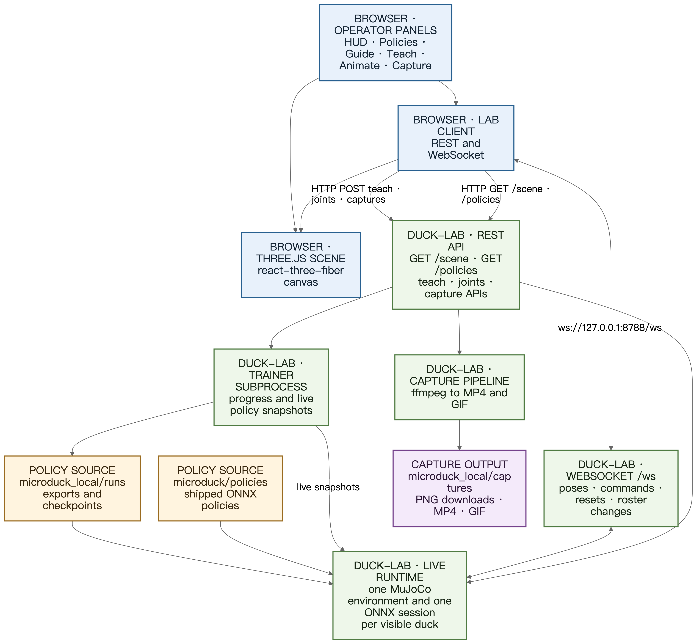

## Purpose, scope, and evidence

Duck Viewer is the browser operator surface for the local Microduck policy lab. It combines a Three.js stage, live MuJoCo poses, policy assignment, training controls, animation tools, and evidence capture. Use it to compare policies, inspect behavior, and document local results before moving a promising design to the official simulation-to-real workflow.

The Viewer is not a hardware controller. Keyboard input flies the camera or resets the stage. Policies drive the ducks. The local harness is optimized for rapid CPU-based prototyping and does not replace the upstream GPU domain-randomization stack or tests on a physical robot.

### Evidence levels

Use the narrowest evidence label supported by the test. A policy that loads successfully has not necessarily demonstrated its intended skill.

| Evidence level                       | What it establishes                                                                                                      | What it does not establish                                                                         |
| ------------------------------------ | ------------------------------------------------------------------------------------------------------------------------ | -------------------------------------------------------------------------------------------------- |
| Interface smoke test                 | The policy is discovered, loads through the shared 61-observation to 14-action ONNX interface, and renders finite output | Correct skill commands, timing, physics, sequencing, recovery, or real-world behavior              |
| Partial behavior inspection          | A relevant command slice or initial body response can be observed locally                                                | Complete robotd scheduling, phase generation, handoff, wheel traction, or end-to-end skill logic   |
| Full local Viewer validation         | The Viewer reproduces the relevant local command script and supports repeatable visual and HUD checks                    | Official sim2real readiness or physical-robot safety and performance                               |
| Real-hardware or sim2real validation | The policy passes the official GPU stack, deployment checks, and controlled physical-robot testing                       | Nothing beyond the exact tested hardware, conditions, and acceptance criteria                      |

> [!IMPORTANT]
> Of the nine shipped policies, only `alpha_walking` has full support in the current Viewer command script. Every other shipped policy is partial or smoke-test-only because its command encoding, phase driver, hardware mode, or runtime handoff is not fully reproduced.

## System overview and prerequisites

### Workspace prerequisites

Use the workspace root that contains `restart-lab.sh`, `microduck_local`, `duck-viewer`, `microduck`, and `microduck_rl`. The normal local setup requires:

* Python 3.12 and `uv` for the lab
* Node.js and npm for the Next.js Viewer
* A browser with WebGL and WebSocket support
* `ffmpeg` available to the lab for MP4 and GIF capture conversion
* The upstream Microduck repositories beside the local harness, as described by the workspace setup

The PDF build additionally requires `mmdc`, Pandoc, and XeLaTeX. The provided build script checks these commands before generating output.

### Exact startup

From the workspace root, run:

```bash
./restart-lab.sh
```

The script restarts both services and reports their URLs:

* Duck Lab backend: `http://127.0.0.1:8788`
* Live frame and command stream: `ws://127.0.0.1:8788/ws`
* Duck Viewer: `http://127.0.0.1:63317`

Open `http://127.0.0.1:63317` after the script reports that the Viewer is ready. The green `live` connection indicator means frames are arriving. A socket can remain connected after the simulation loop stalls, so treat a `stalled` indicator or a frozen episode clock as a backend problem.

Shipped policies are auto-discovered from `microduck/policies`. Do not add every ONNX file to the startup command. The restart script seeds only the initial roster, currently a local run and `alpha_walking`. The backend policy catalog independently discovers all shipped policies and available local runs or checkpoints.

The server-side roster persists in `microduck_local/lab-state.json`. A normal backend restart can therefore restore ducks that were present earlier. The restart script's fresh-start behavior seeds its requested initial roster, while later UI changes become the persisted roster for subsequent ordinary starts.


*Figure 1. Duck Viewer after startup. Confirm a live connection and a non-empty roster before assigning or evaluating policies.*

## Architecture and data flow



*Figure 2. Browser, backend, policy, training, and capture data flow.*

The browser loads scene geometry and policy metadata through REST. `GET /scene` provides the MuJoCo-derived mesh and material data used to construct the Three.js scene. `GET /policies` supplies the grouped policy catalog for shipped policies, local run exports, and checkpoints. Teach, joint-pose, and capture operations use additional REST APIs.

The persistent `/ws` WebSocket carries live poses and statistics from Duck Lab at approximately 25 Hz. It also carries operator requests such as command changes, simulation reset, policy assignment, duck spawn, and duck removal. The backend simulation itself runs at its configured control rate.

Duck Lab owns one MuJoCo environment and one ONNX Runtime session for each visible duck. Adding a helper or comparison duck adds Viewer simulation work, but it does not add a trainer worker. Each duck can therefore use a different policy while sharing the same visual stage and command script.

Policies come from two principal sources:

* `microduck/policies` contains the nine shipped Pollen ONNX policies
* `microduck_local/runs` contains local exports, active snapshots, and saved checkpoints

The Teach workflow starts a trainer subprocess. Progress and live policy snapshots flow back into Duck Lab so a trainee or helper can update during training. Finished runs appear in the policy palette without requiring a full application restart.

The browser downloads PNG shots directly from the rendered canvas. Video capture uploads browser-recorded frames to the backend. Duck Lab invokes `ffmpeg` and writes full-resolution H.264 MP4 and smaller GIF outputs under `microduck_local/captures`.

## User interface tour

### HUD and connection state

The top-left HUD is the operational roster. Its header shows the backend state as `live`, `stalled`, or `offline`. Use the collapse control to reduce it to a compact pill. The label toggle controls floating names above ducks without changing selection rings.

Each duck row identifies the active policy and reports episode and motion data. Depending on row type and current state, columns include:

* Episode time, which reveals resets and confirms progress through the 30-second runway
* Falls, which counts failed upright episodes or fall events
* Speed in metres per second, shown as achieved divided by asked when the command is meaningful
* Reward-rate average, which is a walking-oriented diagnostic and is dimmed for trick policies
* Row actions for selection, helper creation, or removal when available

The system strip summarizes CPU, memory, trainer throughput, training state, elapsed time, and progress. High CPU can starve live frames even when the WebSocket remains open.

### Stage, labels, and selection

The center canvas is the Three.js stage. Click a duck to select it. Selection is confirmed in three places: an amber floor ring, the highlighted HUD row, and selected-only controls such as video recording. A policy assignment hover can use a separate target highlight; do not confuse that transient assignment target with persistent selection.

Floating labels identify ducks and remain below panel overlays. Click empty floor or press `Esc` to clear selection. Press `Delete` or `Backspace` to remove the selected duck from the roster. Removal affects the Viewer roster, not the policy file. Deleting a local run from the policy panel is a separate, confirmed, destructive operation.

### Policies, Guide, Teach, Animate, and Capture

The Policies panel in the top-right groups local runs, checkpoints, and shipped Pollen policies. Policy chips support drag-and-drop, click-to-arm, search, spawn, assignment, Teach loading, local export download, and confirmed deletion of owned training runs.

The Guide button in the HUD opens the in-app quick guide. It provides policy-specific reminders and live actions such as spawning a shipped policy. This PDF is the standalone operator reference and contains the fuller procedures and evidence boundaries.

The Teach panel in the lower-right creates and monitors learned behaviors. The Animate panel at the bottom creates keyframed motion targets and can start a tracking-policy training flow. The top capture controls create a PNG at any time and reveal video recording after a duck is selected.


*Figure 3. The in-app Quick start tab is a live checklist, not a replacement for the full operating procedure.*


*Figure 4. The shipped-policy cards show current support classifications and policy-specific limits.*


*Figure 5. The in-app verification tab summarizes the repeatable evidence protocol.*


*Figure 6. The Controls tab keeps the most-used input reference inside the Viewer.*


*Figure 7. The policy panel is the source for assignment, spawning, comparison, and loading finished runs into Teach.*

## Camera and stage controls

Camera movement is smooth while a key is held. The stage does not expose keyboard teleoperation for the duck.

| Input                                | Result                                                                   |
| ------------------------------------ | ------------------------------------------------------------------------ |
| Pointer drag                         | Orbit the camera around its target                                       |
| Wheel or vertical two-finger motion  | Zoom in or out                                                           |
| Horizontal two-finger motion         | Slide the camera laterally                                               |
| `A` or `D`                           | Slide the camera left or right                                           |
| `W` or `S`                           | Dolly toward or away from the target                                     |
| `Up` or `Down`                       | Dolly toward or away from the target                                     |
| `Left` or `Right`                    | Orbit left or right                                                      |
| `Q` or `E`                           | Move the camera vertically up or down                                    |
| `Shift+R`                            | Reset the camera to its home view                                        |
| `R`                                  | Reset every duck simulation to episode step zero                         |
| Click a duck                         | Select the duck                                                          |
| Click empty floor                    | Deselect the current duck                                                |
| `Esc`                                | Deselect the current duck or cancel an armed policy interaction          |
| `Delete` or `Backspace`              | Remove the selected duck from the Viewer roster                          |

> [!WARNING]
> `W`, `A`, `S`, and `D` move the camera, not the duck. A walking response comes from the active ONNX policy and the backend command script. Do not interpret camera motion as policy motion.

Camera settings and panel open states persist in browser local storage. Keyboard shortcuts pause while a modal is open or while focus is in a text entry control. In an embedded browser pane, click the stage once if the Viewer reports that the page does not have keyboard focus.

## Policy assignment and roster workflows

### Assign by dragging

1. Open Policies.
2. Find the desired shipped policy, local run, or checkpoint.
3. Press and drag the policy chip.
4. Move over the destination duck and confirm its assignment highlight.
5. Release to hot-swap the duck's policy.
6. Confirm the exact policy name in the HUD row.
7. Press `R` when a synchronized start is required.

Hot-swapping can occur mid-stride. That is useful for responsiveness checks but unsuitable for clean comparisons. Reset after assignment before recording a verdict.

### Assign by arming

1. Click a policy chip once to arm it.
2. Click a destination duck.
3. Confirm the HUD policy name changed.
4. Press `Esc` before clicking the stage if you want to cancel the armed assignment.

### Spawn a new duck

Use any supported spawn gesture:

* Double-click a policy chip
* Drag a policy chip to empty floor
* Click a chip to arm it, then click empty floor
* Use `Spawn` in the in-app shipped-policy guide

A spawned duck receives a new roster entry and its own MuJoCo environment and ONNX session. Add only as many ducks as needed for the comparison because every visible duck consumes backend simulation time and browser rendering resources.

### Load a run into Teach

Drag a local run onto the Teach panel, or arm the run and activate Teach as the target. Selecting a duck backed by a finished local run can also load that run's recipe when no job is actively training. Shipped Pollen policies do not contain local Teach recipes and are skipped.

### Select, remove, and persist

Click a duck or its HUD row to select it. The amber ring and row highlight must agree. Remove the selected duck with `Delete` or `Backspace`, or use its row remove action. The server persists roster changes in `microduck_local/lab-state.json`.

Removing a duck does not delete a run. Deleting a local run through its policy-panel delete control erases the exported policy, checkpoints, and progress data after confirmation. The backend refuses deletion while that run is actively training.

## Shared reset and command override

The in-app guide header exposes two live controls:

* `Restart all ducks` sends the same reset as `R` and returns every visible duck to episode step zero
* `Zero command for 6 seconds` temporarily replaces the shared command with `[0, 0, 0]`

The zero override is global. It affects every visible duck, not only the selected one. After six seconds, the automatic command script resumes without another operator action. Record the override in test notes so a comparison is not mistaken for normal runway behavior.

Use the zero action for policies whose expected runtime command is zero, such as kicks and roulade, or for the neutral slice of `alpha_stand`. It does not add missing phase variables, wheel physics, or robotd handoff logic.

## Shipped policy operating procedures

All nine shipped ONNX files use the shared 61-value observation and 14-action interface. Shared shape compatibility allows every file to load, but policy meaning depends on command encoding and runtime scheduling.

### `alpha_walking`

Purpose: velocity-command walking and velocity-stand gait.

Runtime semantics: the current automatic runway requests forward velocity `vx = 0.9 m/s` for 27 seconds, then requests zero for 3 seconds. The 30-second cycle repeats. HUD achieved/asked speed and falls are meaningful for this locomotion policy.

Viewer support: full local Viewer validation.

Procedure:

1. Spawn `alpha_walking`, or assign it to an existing duck.
2. Spawn a known walking reference if comparing a candidate.
3. Select the candidate and confirm the amber ring, HUD row, and policy name.
4. Press `R` to align every duck at the start of the runway.
5. Observe the complete 27-second forward request and 3-second zero tail.
6. Record achieved/asked speed, falls, direction, foot contacts, posture, and stopping behavior.
7. Capture a video if timing or recovery needs review.

Expected visual evidence: the duck starts from reset, walks forward during the `0.9 m/s` request, and settles during the zero-command tail without a hidden asynchronous start.

Pass/fail checklist:

* Pass if the duck remains upright for the acceptance interval
* Pass if achieved speed responds in the requested direction and remains credible relative to `0.9 m/s`
* Pass if heading, contacts, and trunk posture remain visually controlled
* Pass if the duck transitions toward a stable zero-command posture in the final 3 seconds
* Fail if it falls, travels in the wrong direction, drifts uncontrollably, or cannot settle

Limitation: this validates the current local MuJoCo runway only. It does not validate the official GPU sim2real stack, actuator variation, surface variation, communications, or physical hardware.

### `alpha_stand`

Purpose: standing balance with trained head and body-pose control.

Runtime semantics: robotd can populate head and body-pose command fields. The Viewer zeros those fields but continues to send the shared runway twist unless the temporary zero override is active. The zero-command action therefore permits a basic neutral-balance inspection, not a commanded pose-range test.

Viewer support: partial behavior inspection.

Procedure:

1. Spawn `alpha_stand` and select it.
2. Choose a clear front or three-quarter camera angle.
3. Activate `Zero command for 6 seconds`.
4. Press `R` immediately after applying the override.
5. Inspect trunk, head, stance, feet, and recovery throughout the zero-command interval.
6. Capture a PNG for posture or a short video for stabilization evidence.

Expected visual evidence: the body should produce a controlled response toward a stable, neutral standing pose rather than limp collapse or walking-oriented motion.

Pass/fail checklist:

* Pass if the model loads and produces finite, controlled joint motion
* Pass if the duck seeks and maintains a credible neutral stance during zero command
* Fail if it collapses, oscillates without settling, or produces non-finite output
* Do not pass the commanded head/body feature because the command range was not exercised

Limitation: the Viewer does not sweep trained head or body-pose commands. Shared runway twist outside the six-second override is not a faithful stand-policy test.

### `alpha_sitstand`

Purpose: sitting and rising posture transitions.

Runtime semantics: twist `vx = 1` means sit, while `vx = 0` means rise or stand. The Viewer's current `0.9` then `0` runway roughly exercises the nonzero and zero branches, but it does not reproduce robotd transition timing exactly.

Viewer support: partial behavior inspection.

Procedure:

1. Spawn `alpha_sitstand` and select it.
2. Press `R` to begin at the start of the 30-second command cycle.
3. Observe the long nonzero segment as an approximate sit request.
4. Note the resulting body height, knee flexion, foot contact, and stability.
5. Observe the final 3-second zero segment for a rise or stand response.
6. Repeat once and capture video if the transition boundary is ambiguous.

Expected visual evidence: the nonzero and zero phases should produce visibly different postures, with a controlled move toward sitting followed by a rise or stand response.

Pass/fail checklist:

* Pass partial inspection if the two command phases produce distinct, controlled postures
* Pass partial inspection if the transition direction matches sit then rise
* Fail if both phases are indistinguishable, uncontrolled, or repeatedly fall
* Do not claim robotd timing equivalence

Limitation: `0.9` is only an approximate nonzero flag in this Viewer, and the 27-second/3-second schedule differs from the deployed scheduler.

### `alpha_ground_pick`

Purpose: phase-driven ground-pick motion.

Runtime semantics: robotd supplies twist `[cos(2*pi*p), sin(2*pi*p), 0]`, advances phase `p` over a nominal 4-second cycle, and hands control back at phase `0.7`.

Viewer support: interface smoke test only.

Procedure:

1. Spawn `alpha_ground_pick`.
2. Confirm that its exact policy ID appears in the roster.
3. Press `R` and confirm that episode time and frames continue to update.
4. Observe only whether the ONNX output remains finite and renderable.
5. Label any capture as an interface smoke test.

Expected visual evidence: the policy loads, the duck remains in the stream, and the renderer receives body output. No ground-pick sequence is required or expected.

Pass/fail checklist:

* Pass the smoke test if loading, streaming, and finite body output continue
* Fail the smoke test if the policy cannot load, disappears, or causes invalid output
* Do not pass ground-pick behavior based on incidental movement

Limitation: the Viewer does not generate the cosine/sine phase command or phase `0.7` handoff. It cannot validate the ground-pick skill.

### `ball_kick_left`

Purpose: one-shot kick with the left leg.

Runtime semantics: expected twist is zero. Robotd runs the kick network for a 0.5-second window, then hands control back to the normal scheduler.

Viewer support: partial behavior inspection.

Procedure:

1. Spawn `ball_kick_left` and select it.
2. Frame both legs clearly from a front or three-quarter angle.
3. Activate `Zero command for 6 seconds`.
4. Press `R` and watch the first 0.5 seconds closely.
5. Capture a short video for slow or frame-by-frame review.
6. Separate the initial response from later motion caused by running the raw policy continuously.

Expected visual evidence: a brief kick-like response should involve the left leg near the start of the zero-command interval.

Pass/fail checklist:

* Pass partial inspection if the initial active leg is clearly the left leg
* Pass partial inspection if the initial output is controlled and kick-like
* Fail if the right leg is the explicit kicking leg or output is invalid
* Do not grade repetition or later recovery as deployed kick behavior

Limitation: the Viewer does not perform the 0.5-second robotd handoff. Continuous raw-policy motion is not end-to-end kick validation.

### `ball_kick_right`

Purpose: one-shot kick with the right leg.

Runtime semantics: expected twist is zero. Robotd runs the kick network for a 0.5-second window, then hands control back to the normal scheduler.

Viewer support: partial behavior inspection.

Procedure:

1. Spawn `ball_kick_right` and select it.
2. Frame both legs clearly from a front or three-quarter angle.
3. Activate `Zero command for 6 seconds`.
4. Press `R` and watch the first 0.5 seconds closely.
5. Capture a short video for slow or frame-by-frame review.
6. Separate the initial response from later motion caused by running the raw policy continuously.

Expected visual evidence: a brief kick-like response should involve the right leg near the start of the zero-command interval.

Pass/fail checklist:

* Pass partial inspection if the initial active leg is clearly the right leg
* Pass partial inspection if the initial output is controlled and kick-like
* Fail if the left leg is the explicit kicking leg or output is invalid
* Do not grade repetition or later recovery as deployed kick behavior

Limitation: the Viewer does not perform the 0.5-second robotd handoff. Continuous raw-policy motion is not end-to-end kick validation.

### `roller`

Purpose: roller-mode locomotion.

Runtime semantics: robotd roller mode replaces the walking network and applies roller-specific tuning, including action scale `0.8`.

Viewer support: partial body-response inspection.

Procedure:

1. Spawn `roller` and select it.
2. Press `R` to align the initial state.
3. Observe the body and joint response through one 30-second Viewer cycle.
4. Record posture, balance, direction of body lean, and whether output remains controlled.
5. Capture evidence with a label that explicitly says `Viewer body-response inspection`.

Expected visual evidence: a coherent roller-trained body response may be visible. Wheel travel, traction, steering quality, and real roller locomotion are not expected evidence in this scene.

Pass/fail checklist:

* Pass partial inspection if the policy loads and controlled body output remains visible
* Fail interface inspection if output is invalid or the duck leaves the stream
* Do not pass wheel speed, traction, distance, or roller-mode navigation

Limitation: the current lab scene and physics are not roller hardware or traction validation. Action scale and runtime tuning equivalence are not established by appearance alone.

### `roller_crouch`

Purpose: roller ground-pick-slot crouch behavior.

Runtime semantics: robot configuration uses a nominal 5-second phase cycle and action scale `0.8` for this policy.

Viewer support: interface smoke test only.

Procedure:

1. Spawn `roller_crouch`.
2. Confirm the shared 61-to-14 interface loads and the policy remains in the roster.
3. Press `R` and inspect only for finite, renderable output.
4. Do not map the runway command to the missing five-second phase cycle.
5. Label captures as smoke-test evidence.

Expected visual evidence: only policy loading and a finite body response are expected.

Pass/fail checklist:

* Pass the smoke test if the policy loads and streaming continues
* Fail the smoke test if output is invalid or the runtime rejects the policy
* Do not pass crouch phasing, wheel behavior, or roller ground interaction

Limitation: the Viewer supplies neither the required phase drive nor wheel-validation physics. It cannot validate the crouch behavior.

### `roulade`

Purpose: one-shot forward roll.

Runtime semantics: expected command is zero. Robotd runs a 1.0-second skill window and then hands off. A held request can chain another window.

Viewer support: partial behavior inspection.

Procedure:

1. Spawn `roulade` and select it.
2. Use a clear side angle that exposes forward rotation and ground contact.
3. Activate `Zero command for 6 seconds`.
4. Press `R` and inspect the first second separately from later motion.
5. Capture video and record rotation direction, contacts, posture at one second, and later recovery.
6. Label the result as initial-window inspection rather than full sequence validation.

Expected visual evidence: a forward-roll response may appear during the initial one-second interval.

Pass/fail checklist:

* Pass partial inspection if the initial response rotates forward rather than sideways or backward
* Pass partial inspection if the one-second window shows controlled, finite motion
* Fail if the initial rotation is clearly wrong or output is invalid
* Do not pass handoff, chaining, or post-skill recovery as robotd-equivalent

Limitation: the Viewer lacks robotd's timed handoff and request-based chaining. Running the policy continuously cannot validate the deployed sequence.

## Repeatable verification protocol

### Verification matrix

Create one row per tested policy or candidate. Keep the verdict tied to an evidence level.

| Field                       | Required record                                                                                       |
| --------------------------- | ----------------------------------------------------------------------------------------------------- |
| Policy and artifact         | Exact policy ID, run, stage, checkpoint, or ONNX filename                                             |
| Reference                   | Side-by-side policy and why it is relevant                                                            |
| Reset and command           | Reset time, normal runway or global zero override, and observed interval                              |
| Visual observations         | Falls, contacts, posture, direction, recovery, and any state transition                               |
| Locomotion telemetry        | Achieved/asked speed only when the policy is a locomotion policy                                      |
| Reward interpretation       | Walking reward used only for walking; ignored for trick-policy verdicts                               |
| Evidence capture            | PNG filename for pose evidence or MP4/GIF filename for temporal evidence                              |
| Evidence level              | Interface smoke test, partial behavior inspection, full local Viewer validation, or sim2real/hardware |
| Verdict                     | Pass, fail, inconclusive, and the exact acceptance criterion                                          |
| Limitations                 | Missing command encoding, timing, phase, handoff, hardware, physics, or environmental coverage        |

### Full-cycle procedure

1. Spawn the candidate and a relevant reference side by side.
2. Use a matching camera view and verify both exact policy labels.
3. Select the candidate and confirm the amber ring and highlighted roster row.
4. Press `R` once so every duck starts at episode step zero.
5. Observe the full 30-second Viewer cycle, not a favorable instant.
6. Record falls, foot and body contacts, posture, travel direction, oscillation, and recovery.
7. Use achieved/asked speed only for locomotion policies with meaningful speed commands.
8. Ignore the walking reward-rate column for trick policies. A low walking reward does not disprove a kick, roll, pose, or phase-driven skill.
9. Capture PNG evidence for static posture and video for timing, contact, transitions, or recovery.
10. Assign the verdict and one of the four evidence levels from the opening matrix.

### Determinism and reproducibility

An exported deterministic ONNX policy returns the same action for the same observation. That fact does not make two Viewer trials identical. Differences can still arise from reset state, the observation sequence, command encoding, physics parameters, numerical evolution, asynchronous comparison starts, and missing robotd handoff or chaining logic.

Control the factors that the Viewer exposes:

* Reset all ducks together
* Record the active command mode and any zero override
* Observe the complete relevant interval
* Use the same camera angle for visual comparison
* Compare exact artifacts rather than similar display names
* Preserve the capture and a concise observation log

For a trained local behavior, follow the repository verification discipline after Viewer inspection: export the deterministic ONNX, run evaluation, render a rollout and contact sheet, compare a null control where appropriate, then port the successful environment design to the official GPU stack before hardware work.

## Teach workflow

Teach turns a natural-language behavior request into a local training recipe and live training job.

1. Open Teach.
2. Describe one observable behavior with concrete posture, contact, or motion language.
3. Review the generated reward recipe before starting. Confirm that every paid property is represented in observations and that penalty signs are sensible.
4. Start training and watch trainer state, steps per second, score history, and per-term bars.
5. Use a helper duck when another view of the same live policy aids inspection. A helper does not add trainer workers.
6. Watch live snapshots, but do not treat the stochastic training curve as final behavior evidence.
7. After completion, select or load the finished run.
8. Adjust unlocked term or stage weights only when visual evidence supports the change.
9. Choose retrain for a fresh start or fine-tune to continue from the selected learned brain.
10. Export and visually verify the deterministic ONNX before making a result claim.

Reward charts explain optimization progress. They do not prove that the duck performs the intended behavior. If no rollout ever visits the desired skill, revise the physics curriculum or spawn distribution rather than increasing reward weight blindly.

## Animate workflow

Animate creates keyframed target motion and can train a policy to track the clip.

1. Open Animate and choose joint mode or rig mode.
2. In joint mode, select and adjust individual servos.
3. In rig mode, use coupled controls such as squat, lean, leg swing, sway, stance, twist, toes, or look.
4. Use sliders or drag a body part or the rig handle in the scene. Hold `Shift` for finer dragging when supported.
5. Add key poses to the timeline.
6. Scrub and play the clip to check continuity, joint limits, foot orientation, and contact assumptions.
7. Retime keyframes before training if transitions are abrupt or physically implausible.
8. Save the clip.
9. Start tracking-policy training from the Animate action.
10. Verify the exported deterministic result as a policy, not only as a ghost-pose preview.

The translucent ghost displays target pose, not achieved policy behavior. A visually pleasing animation can still be untrackable under honest actuator limits. Keep poses within servo limits and confirm the learned rollout separately.

## Capture workflow

### PNG shot

1. Set the camera and labels for the intended evidence.
2. Select a duck if the filename should use that duck's name, or deselect for a crowd shot.
3. Activate `shot` in the top capture panel.
4. Confirm the browser downloaded a full-resolution PNG.
5. Record the reset state, command mode, policy, and evidence level beside the filename.

The selection ring is hidden during the capture render. Panels and floating DOM labels are not rendered into the WebGL image.

### MP4 and GIF recording

1. Select the target duck and confirm the amber ring.
2. Activate `record`.
3. Wait for the automatic camera framing to settle.
4. Keep the tab visible while the take is active.
5. Activate `stop` after the relevant interval, or allow the 60-second safety cap to stop the take.
6. Wait while Duck Lab converts the upload.
7. Download the MP4 and GIF links, or find the backend copies under `microduck_local/captures`.
8. Play the complete output and confirm that the intended interval was recorded.

Video records rendered canvas frames. A hidden or heavily throttled tab may produce too few frames, in which case the Viewer refuses the unusable take. The recording camera pauses normal orbit and camera-key motion so the evidence remains stable.

## Troubleshooting

| Symptom                                         | Likely cause                                                                           | Corrective action                                                                                     |
| ----------------------------------------------- | -------------------------------------------------------------------------------------- | ----------------------------------------------------------------------------------------------------- |
| Backend shows `offline`                         | Duck Lab is not running, failed startup, or the URL is wrong                           | Run `./restart-lab.sh` from the workspace root, check port `8788`, and inspect the reported lab log   |
| Connection shows `stalled`                      | WebSocket is open but no frames arrived for several seconds                            | Check CPU pressure and backend logs, reduce ducks, then restart the lab if the loop stopped           |
| Policies panel is empty                         | `/policies` failed, backend is offline, or a filter hides rows                         | Clear policy search, verify `http://127.0.0.1:8788/policies`, and confirm `microduck/policies` exists |
| Shipped policies seem to need startup arguments | The initial roster is confused with policy discovery                                   | Start normally; shipped ONNX files are auto-discovered, while restart arguments only seed ducks       |
| Camera or reset keys do nothing                 | Browser focus is elsewhere, a modal is open, or text input owns focus                  | Click the stage, close the modal, leave the text field, and retry                                     |
| Policy appears wrong after assignment           | Assignment occurred mid-stride, the wrong chip was armed, or the label was not checked | Verify the HUD policy ID, press `R`, and observe from a synchronized start                            |
| Trick policy has low reward                     | HUD reward is the walking recipe, not the trick objective                              | Ignore walking reward for trick verdicts and use policy-specific visual evidence                      |
| Recording is incomplete or refused              | The tab was hidden, rendering was throttled, or too few frames were pushed             | Keep the tab visible, reduce load, record again, and inspect the complete saved file                  |
| Viewer becomes slow with many ducks             | Each visible duck has its own MuJoCo environment and ONNX session                      | Remove unnecessary ducks and retain only the candidate and relevant references                        |
| Roster is stale after restart                   | Server-side roster persistence restored an earlier state                               | Remove unwanted ducks in the UI or use the workspace's fresh restart path before reseeding            |
| Special policy cannot be verified               | Required phase, body command, wheel mode, or robotd handoff is absent                  | Classify the result as smoke or partial, then test through the correct runtime or official stack      |
| Speed looks poor for a trick policy             | Achieved/asked velocity is not that skill's acceptance metric                          | Apply speed checks only to locomotion policies                                                        |
| Selection and row highlight disagree            | A click targeted empty floor, an overlay intercepted input, or the frame is stale      | Reselect from the HUD row, wait for a fresh frame, and confirm the amber ring                         |

## Printable quick reference

### Start and verify

1. Run `./restart-lab.sh` from the workspace root.
2. Open `http://127.0.0.1:63317`.
3. Confirm `live` and a non-empty roster.
4. Assign or spawn the policy from Policies.
5. Select the candidate and confirm its exact HUD label.
6. Press `R` to synchronize all ducks.
7. Observe a full 30-second cycle.
8. Record posture, contacts, direction, falls, and recovery.
9. Use achieved/asked speed only for locomotion.
10. Capture evidence and label its evidence level.

### Essential controls

| Control                     | Action                                        |
| --------------------------- | --------------------------------------------- |
| Drag                        | Orbit camera                                  |
| Vertical wheel/two-finger   | Zoom                                          |
| Horizontal two-finger       | Slide camera                                  |
| `A` / `D`                   | Slide left/right                              |
| `W` / `S`, `Up` / `Down`    | Dolly in/out                                  |
| `Left` / `Right`            | Orbit left/right                              |
| `Q` / `E`                   | Camera up/down                                |
| `Shift+R`                   | Reset camera                                  |
| `R`                         | Restart all duck simulations                  |
| Click duck                  | Select                                        |
| `Esc` or click empty floor  | Deselect or cancel armed policy               |
| `Delete` / `Backspace`      | Remove selected duck                          |

### Shipped policy support

| Policy                | Current Viewer classification         | Valid claim                                                       |
| --------------------- | ------------------------------------- | ----------------------------------------------------------------- |
| `alpha_walking`       | Full local Viewer validation          | Complete local 0.9 m/s then zero runway cycle                     |
| `alpha_stand`         | Partial behavior inspection           | Neutral standing response during temporary zero command           |
| `alpha_sitstand`      | Partial behavior inspection           | Approximate nonzero-to-zero posture transition                    |
| `alpha_ground_pick`   | Interface smoke test only             | Loading and finite output                                         |
| `ball_kick_left`      | Partial behavior inspection           | Initial left-leg response under zero command                      |
| `ball_kick_right`     | Partial behavior inspection           | Initial right-leg response under zero command                     |
| `roller`              | Partial body-response inspection      | Controlled body output, not traction or wheel locomotion          |
| `roller_crouch`       | Interface smoke test only             | Loading and finite output                                         |
| `roulade`             | Partial behavior inspection           | Initial forward-roll response, not handoff or chaining            |

### Evidence label

Use exactly one label in each verdict:

* Interface smoke test
* Partial behavior inspection
* Full local Viewer validation
* Real-hardware or sim2real validation
