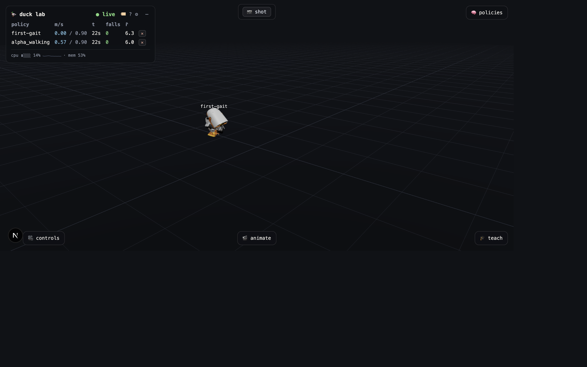
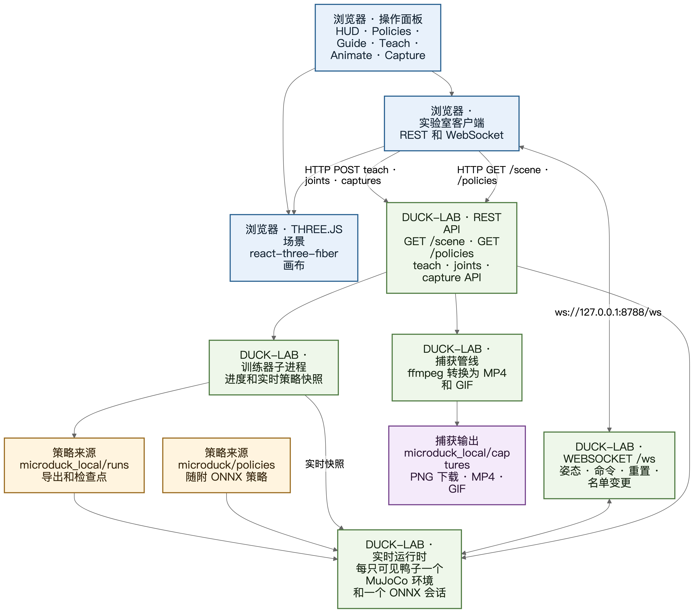
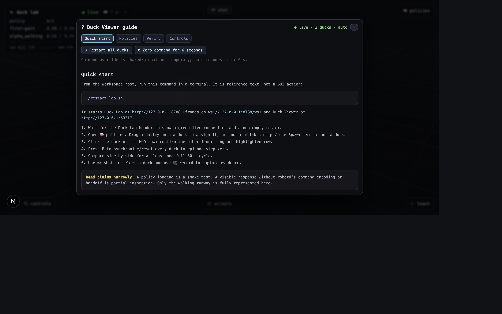
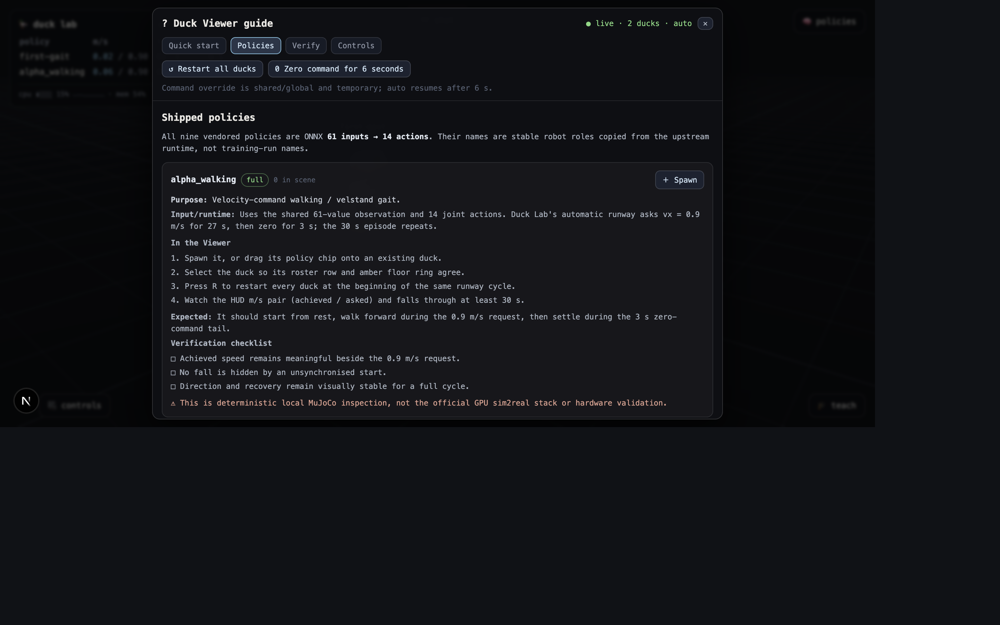
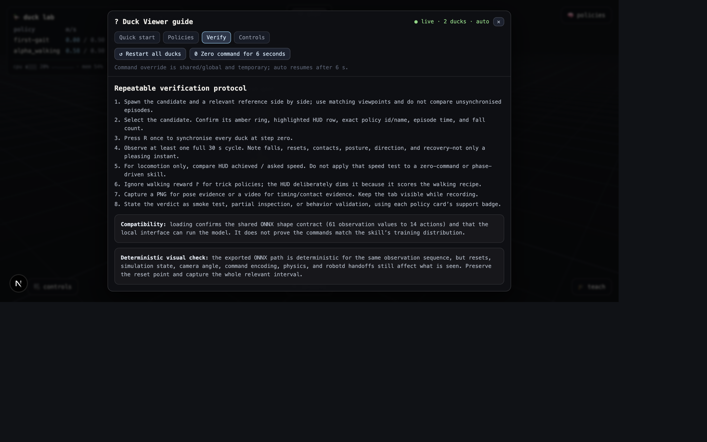
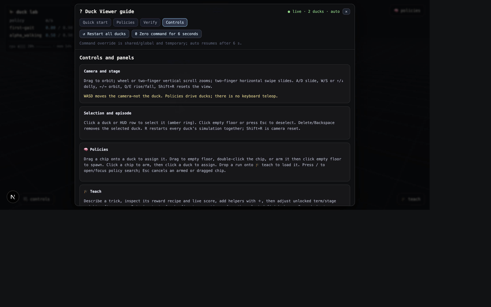
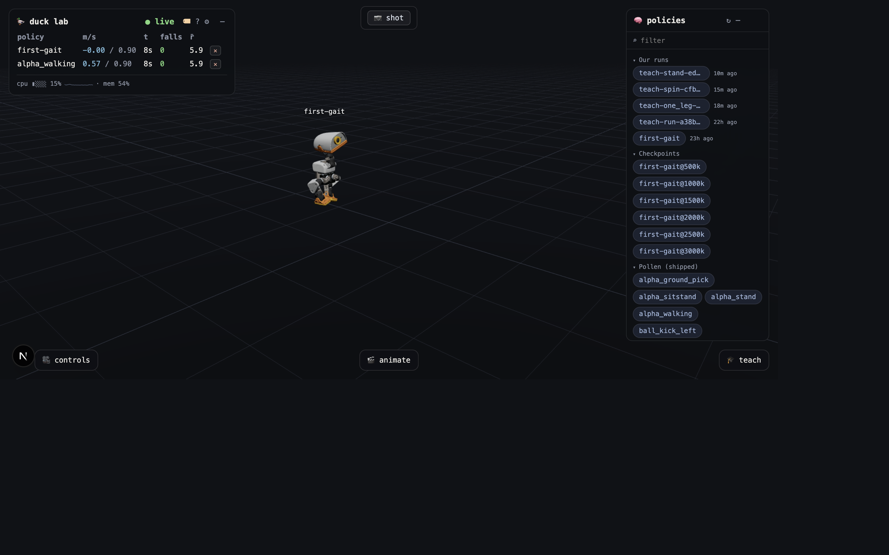

## 目的、范围与证据

Duck Viewer 是本地 Microduck 策略实验室的浏览器操作界面。它集成了 Three.js 舞台、实时 MuJoCo 姿态、策略分配、训练控件、动画工具和证据捕获。你可以使用它对比策略、检查行为，并在将有前景的设计移交到正式的仿真到现实工作流之前记录本地结果。

Viewer 不是硬件控制器。键盘输入用于移动相机或重置舞台，策略负责驱动鸭子。本地工具针对快速的 CPU 原型迭代进行了优化，不能替代上游 GPU 域随机化堆栈或实体机器人测试。

### 证据等级

应使用测试所能支持的最严格证据标签。策略成功加载并不表示它已经展示了预期技能。

| 证据等级                 | 能够证明                                                                                       | 不能证明                                                           |
| ------------------------ | ---------------------------------------------------------------------------------------------- | ------------------------------------------------------------------ |
| 接口冒烟测试             | 策略被发现，通过共享的 61 维观测到 14 维动作 ONNX 接口加载，并渲染有限数值输出                 | 正确的技能命令、时序、物理、编排、恢复或现实世界行为               |
| 部分行为检查             | 可以在本地观察相关命令片段或初始身体响应                                                       | 完整的 robotd 调度、相位生成、控制权移交、滚轮牵引或端到端技能逻辑 |
| 完整本地 Viewer 验证     | Viewer 重现相关本地命令脚本，并支持可重复的视觉检查和 HUD 检查                                 | 正式的 sim2real 就绪状态或实体机器人的安全性和性能                 |
| 实体硬件或 sim2real 验证 | 策略通过正式 GPU 堆栈、部署检查和受控的实体机器人测试                                          | 超出所测试硬件、条件和验收标准范围的任何结论                       |

> [!IMPORTANT]
> 在九个随附策略中，只有 `alpha_walking` 在当前 Viewer 命令脚本中获得完整支持。其余所有随附策略都只能进行部分检查或冒烟测试，因为其命令编码、相位驱动、硬件模式或运行时控制权移交尚未完整重现。

## 系统概览与先决条件

### 工作区先决条件

请使用包含 `restart-lab.sh`、`microduck_local`、`duck-viewer`、`microduck` 和 `microduck_rl` 的工作区根目录。正常本地设置需要：

* 用于实验室的 Python 3.12 和 `uv`
* 用于 Next.js Viewer 的 Node.js 和 npm
* 支持 WebGL 和 WebSocket 的浏览器
* 实验室可以调用的 `ffmpeg`，用于 MP4 和 GIF 捕获转换
* 按工作区设置说明放置在本地工具旁的上游 Microduck 存储库

PDF 构建还需要 `mmdc`、Pandoc 和 XeLaTeX。提供的构建脚本会在生成输出之前检查这些命令。

### 准确启动步骤

在工作区根目录运行：

```bash
./restart-lab.sh
```

脚本会重启两项服务并报告其 URL：

* Duck Lab 后端：`http://127.0.0.1:8788`
* 实时帧和命令流：`ws://127.0.0.1:8788/ws`
* Duck Viewer：`http://127.0.0.1:63317`

脚本报告 Viewer 就绪后，打开 `http://127.0.0.1:63317`。绿色 `live` 连接指示器表示正在接收帧。仿真循环停滞后套接字仍可能保持连接，因此应将 `stalled` 指示器或冻结的回合时钟视为后端问题。

随附策略会从 `microduck/policies` 自动发现。不要把每个 ONNX 文件都添加到启动命令。重启脚本只会为初始名单设定种子，目前是一个本地运行和 `alpha_walking`。后端策略目录会独立发现所有随附策略以及可用的本地运行或检查点。

服务器端名单保存在 `microduck_local/lab-state.json`。普通后端重启可能恢复先前存在的鸭子。重启脚本的全新启动行为会按请求设定初始名单，之后在 UI 中进行的更改将成为后续普通启动使用的持久名单。



*图 1。启动后的 Duck Viewer。分配或评估策略之前，请确认连接为 live 且名单不为空。*

## 架构与数据流



*图 2。浏览器、后端、策略、训练和捕获数据流。*

浏览器通过 REST 加载场景几何和策略元数据。`GET /scene` 提供从 MuJoCo 派生的网格和材质数据，用于构建 Three.js 场景。`GET /policies` 提供按随附策略、本地运行导出和检查点分组的策略目录。Teach、关节姿态和捕获操作使用其他 REST API。

持久 `/ws` WebSocket 以大约 25 Hz 的频率传输 Duck Lab 的实时姿态和统计信息。它还传输操作员请求，例如命令更改、仿真重置、策略分配、生成鸭子和移除鸭子。后端仿真本身按配置的控制频率运行。

Duck Lab 为每只可见鸭子维护一个 MuJoCo 环境和一个 ONNX Runtime 会话。添加辅助鸭或对比鸭会增加 Viewer 仿真工作量，但不会增加训练器工作进程。每只鸭子都可以在共享同一视觉舞台和命令脚本的同时使用不同策略。

策略主要来自两个来源：

* `microduck/policies` 包含九个随附的 Pollen ONNX 策略
* `microduck_local/runs` 包含本地导出、活动快照和已保存检查点

Teach 工作流会启动训练器子进程。进度和实时策略快照会流回 Duck Lab，因此受训鸭或辅助鸭可以在训练期间更新。完成的运行会出现在策略面板中，无需完整重启应用程序。

浏览器直接从渲染画布下载 PNG 截图。视频捕获会将浏览器录制的帧上传到后端。Duck Lab 调用 `ffmpeg`，并将全分辨率 H.264 MP4 和较小的 GIF 输出写入 `microduck_local/captures`。

## 用户界面导览

### HUD 与连接状态

左上角 HUD 是操作名单。其标题显示后端状态 `live`、`stalled` 或 `offline`。使用折叠控件可将其缩小为紧凑胶囊。标签开关控制鸭子上方的浮动名称，不会改变选择环。

每一行鸭子都标识活动策略并报告回合和运动数据。根据行类型和当前状态，列可能包括：

* 回合时间，用于显示重置并确认 30 秒跑道流程的进度
* 跌倒次数，用于统计未能保持直立的回合或跌倒事件
* 以米每秒为单位的速度，当命令有意义时显示为实际速度除以要求速度
* 奖励率平均值，这是一项面向行走的诊断数据，对特技策略会以暗色显示
* 可用时用于选择、创建辅助鸭或移除鸭子的行操作

系统栏汇总 CPU、内存、训练器吞吐量、训练状态、已用时间和进度。即使 WebSocket 保持打开，高 CPU 使用率也可能使实时帧得不到足够资源。

### 舞台、标签与选择

中央画布是 Three.js 舞台。单击鸭子可将其选中。三个位置会确认选择：琥珀色地面环、高亮的 HUD 行，以及仅在选中时可用的控件，例如视频录制。策略分配悬停可以使用单独的目标高亮，不要把这种临时分配目标误认为持久选择。

浮动标签用于标识鸭子，并保持在面板叠加层下方。单击空白地面或按 `Esc` 可清除选择。按 `Delete` 或 `Backspace` 可从名单移除选中的鸭子。移除操作会影响 Viewer 名单，而不会影响策略文件。通过策略面板删除本地运行是另一项需要确认的破坏性操作。

### Policies、Guide、Teach、Animate 与 Capture

右上角的 Policies 面板对本地运行、检查点和随附 Pollen 策略进行分组。策略标签支持拖放、单击待命、搜索、生成、分配、加载到 Teach、本地导出下载，以及经确认后删除自有训练运行。

HUD 中的 Guide 按钮会打开应用内快速指南。它提供特定策略的提醒，以及生成随附策略等实时操作。本 PDF 是独立操作参考，包含更完整的步骤和证据边界。

右下角的 Teach 面板用于创建和监控学习行为。底部的 Animate 面板用于创建关键帧运动目标，并可启动跟踪策略训练流程。顶部捕获控件可随时创建 PNG，选中鸭子后还会显示视频录制功能。



*图 3。应用内 Quick start 选项卡是一份实时检查清单，不能替代完整操作步骤。*



*图 4。随附策略卡片显示当前支持分类和特定策略限制。*



*图 5。应用内 verification 选项卡概述可重复的证据协议。*



*图 6。Controls 选项卡在 Viewer 中提供最常用的输入参考。*



*图 7。策略面板是分配、生成、对比以及将完成运行加载到 Teach 的入口。*

## 相机与舞台控件

按住按键时，相机会平滑移动。舞台不提供通过键盘遥控鸭子的功能。

| 输入                         | 结果                                         |
| ---------------------------- | -------------------------------------------- |
| 拖动指针                     | 围绕目标旋转相机                             |
| 滚轮或纵向双指手势           | 放大或缩小                                   |
| 横向双指手势                 | 横向平移相机                                 |
| `A` 或 `D`                   | 向左或向右平移相机                           |
| `W` 或 `S`                   | 靠近或远离目标                               |
| `Up` 或 `Down`               | 靠近或远离目标                               |
| `Left` 或 `Right`            | 向左或向右旋转                               |
| `Q` 或 `E`                   | 向上或向下移动相机                           |
| `Shift+R`                    | 将相机重置到初始视图                         |
| `R`                          | 将每只鸭子的仿真重置到回合步骤零             |
| 单击鸭子                     | 选中鸭子                                     |
| 单击空白地面                 | 取消选择当前鸭子                             |
| `Esc`                        | 取消选择当前鸭子或取消待命的策略交互         |
| `Delete` 或 `Backspace`      | 从 Viewer 名单移除选中的鸭子                 |

> [!WARNING]
> `W`、`A`、`S` 和 `D` 移动的是相机，而不是鸭子。行走响应来自活动 ONNX 策略和后端命令脚本。不要把相机运动解释为策略运动。

相机设置和面板打开状态保存在浏览器本地存储中。模态框打开时或焦点位于文本输入控件时，键盘快捷键会暂停。在嵌入式浏览器窗格中，如果 Viewer 报告页面没有键盘焦点，请先单击一次舞台。

## 策略分配与名单工作流

### 通过拖动分配

1. 打开 Policies。
2. 找到所需的随附策略、本地运行或检查点。
3. 按住并拖动策略标签。
4. 移到目标鸭子上并确认其分配高亮。
5. 松开以热交换鸭子的策略。
6. 在 HUD 行中确认准确的策略名称。
7. 需要同步开始时按 `R`。

热交换可以在步态中途发生。这适用于响应性检查，但不适合干净的对比。分配后应先重置，再记录结论。

### 通过待命方式分配

1. 单击一次策略标签，使其进入待命状态。
2. 单击目标鸭子。
3. 确认 HUD 策略名称已经更改。
4. 如果要在单击舞台前取消待命分配，请按 `Esc`。

### 生成新鸭子

可以使用任何受支持的生成手势：

* 双击策略标签
* 将策略标签拖到空白地面
* 单击标签使其待命，然后单击空白地面
* 使用应用内随附策略指南中的 `Spawn`

生成的鸭子会获得新的名单条目，以及自己的 MuJoCo 环境和 ONNX 会话。每只可见鸭子都会消耗后端仿真时间和浏览器渲染资源，因此只添加对比所需数量的鸭子。

### 将运行加载到 Teach

将本地运行拖到 Teach 面板，或让运行进入待命状态并激活 Teach 作为目标。没有作业正在训练时，选择由已完成本地运行支持的鸭子也可以加载该运行的配方。随附 Pollen 策略不包含本地 Teach 配方，因此会被跳过。

### 选择、移除与持久化

单击鸭子或其 HUD 行可将其选中。琥珀色环和行高亮必须一致。使用 `Delete` 或 `Backspace` 移除选中的鸭子，也可以使用其行移除操作。服务器会将名单更改保存在 `microduck_local/lab-state.json`。

移除鸭子不会删除运行。通过策略面板的删除控件删除本地运行，会在确认后清除导出的策略、检查点和进度数据。该运行正在训练时，后端会拒绝删除。

## 共享重置与命令覆盖

应用内指南标题提供两个实时控件：

* `Restart all ducks` 发送与 `R` 相同的重置，使每只可见鸭子回到回合步骤零
* `Zero command for 6 seconds` 暂时将共享命令替换为 `[0, 0, 0]`

零命令覆盖是全局的。它会影响每只可见鸭子，而不只是选中的鸭子。六秒后，自动命令脚本会恢复，无需操作员再次操作。应在测试记录中注明该覆盖，以免把对比结果误认为正常跑道行为。

对于预期运行时命令为零的策略，例如踢球和 `roulade`，或 `alpha_stand` 的中性片段，可以使用零命令操作。它不会补充缺失的相位变量、滚轮物理或 robotd 控制权移交逻辑。

## 随附策略操作步骤

所有九个随附 ONNX 文件都使用共享的 61 维观测和 14 维动作接口。共享形状兼容性允许每个文件加载，但策略含义取决于命令编码和运行时调度。

### `alpha_walking`

用途：速度命令行走和速度为零时的站立步态。

运行时语义：当前自动跑道会请求前进速度 `vx = 0.9 m/s` 27 秒，然后请求零速度 3 秒。这个 30 秒周期会重复。对于此运动策略，HUD 的实际速度/要求速度和跌倒次数具有意义。

Viewer 支持：完整本地 Viewer 验证。

步骤：

1. 生成 `alpha_walking`，或将其分配给现有鸭子。
2. 对比候选策略时，生成一个已知的行走参考策略。
3. 选中候选鸭子，并确认琥珀色环、HUD 行和策略名称。
4. 按 `R`，使每只鸭子都在跑道起点对齐。
5. 观察完整的 27 秒前进请求和 3 秒零速度尾段。
6. 记录实际速度/要求速度、跌倒次数、方向、足部接触、姿态和停止行为。
7. 如果需要复查时序或恢复，请捕获视频。

预期视觉证据：鸭子从重置状态开始，在 `0.9 m/s` 请求期间向前行走，并在零命令尾段稳定下来，不应存在隐藏的异步启动。

通过/失败检查清单：

* 如果鸭子在验收时间段内保持直立，则通过
* 如果实际速度按请求方向响应，且相对于 `0.9 m/s` 保持可信，则通过
* 如果朝向、接触和躯干姿态在视觉上保持受控，则通过
* 如果鸭子在最后 3 秒向稳定的零命令姿态过渡，则通过
* 如果跌倒、向错误方向移动、不可控地漂移或无法稳定，则失败

限制：这只验证当前本地 MuJoCo 跑道。它不验证正式 GPU sim2real 堆栈、执行器变化、表面变化、通信或实体硬件。

### `alpha_stand`

用途：具有已训练头部和身体姿态控制的站立平衡。

运行时语义：robotd 可以填充头部和身体姿态命令字段。Viewer 会将这些字段置零，但除非临时零命令覆盖处于活动状态，否则仍会继续发送共享跑道 twist。因此，零命令操作只允许进行基本的中性平衡检查，而不是命令姿态范围测试。

Viewer 支持：部分行为检查。

步骤：

1. 生成 `alpha_stand` 并将其选中。
2. 选择清晰的正面或前侧 45 度相机角度。
3. 激活 `Zero command for 6 seconds`。
4. 应用覆盖后立即按 `R`。
5. 在整个零命令时间段内检查躯干、头部、站姿、足部和恢复。
6. 捕获 PNG 作为姿态证据，或捕获短视频作为稳定过程证据。

预期视觉证据：身体应以受控方式响应，并趋向稳定的中性站立姿态，而不是无力倒下或产生面向行走的运动。

通过/失败检查清单：

* 如果模型加载并产生有限、受控的关节运动，则通过
* 如果鸭子在零命令期间寻找并保持可信的中性站姿，则通过
* 如果鸭子倒下、持续振荡而无法稳定，或产生非有限输出，则失败
* 不得判定命令式头部/身体功能通过，因为尚未测试命令范围

限制：Viewer 不会扫描已训练的头部或身体姿态命令。六秒覆盖之外的共享跑道 twist 不能忠实测试站立策略。

### `alpha_sitstand`

用途：坐下和起身姿态过渡。

运行时语义：twist `vx = 1` 表示坐下，`vx = 0` 表示起身或站立。Viewer 当前先 `0.9` 后 `0` 的跑道大致覆盖非零和零两个分支，但不会精确重现 robotd 过渡时序。

Viewer 支持：部分行为检查。

步骤：

1. 生成 `alpha_sitstand` 并将其选中。
2. 按 `R`，从 30 秒命令周期的起点开始。
3. 将较长的非零区段作为近似坐下请求进行观察。
4. 记录由此产生的身体高度、膝关节弯曲、足部接触和稳定性。
5. 观察最后 3 秒零命令区段中的起身或站立响应。
6. 再重复一次，如果过渡边界不明确则捕获视频。

预期视觉证据：非零阶段和零阶段应产生明显不同的姿态，先以受控方式趋向坐下，然后响应起身或站立。

通过/失败检查清单：

* 如果两个命令阶段产生不同且受控的姿态，则通过部分检查
* 如果过渡方向与先坐下后起身一致，则通过部分检查
* 如果两个阶段无法区分、不受控或反复跌倒，则失败
* 不得宣称与 robotd 时序等效

限制：在此 Viewer 中，`0.9` 只是非零标志的近似值，27 秒/3 秒调度与部署调度器不同。

### `alpha_ground_pick`

用途：相位驱动的地面拾取动作。

运行时语义：robotd 提供 twist `[cos(2*pi*p), sin(2*pi*p), 0]`，在标称 4 秒周期内推进相位 `p`，并在相位 `0.7` 时移交控制权。

Viewer 支持：仅接口冒烟测试。

步骤：

1. 生成 `alpha_ground_pick`。
2. 确认名单中显示其准确策略 ID。
3. 按 `R`，确认回合时间和帧持续更新。
4. 只观察 ONNX 输出是否保持有限且可渲染。
5. 将任何捕获标记为接口冒烟测试。

预期视觉证据：策略能够加载，鸭子保持在数据流中，渲染器收到身体输出。不要求也不预期出现地面拾取序列。

通过/失败检查清单：

* 如果加载、流传输和有限身体输出保持正常，则冒烟测试通过
* 如果策略无法加载、消失或导致无效输出，则冒烟测试失败
* 不得根据偶然运动判定地面拾取行为通过

限制：Viewer 不生成余弦/正弦相位命令，也不执行相位 `0.7` 控制权移交。它无法验证地面拾取技能。

### `ball_kick_left`

用途：左腿单次踢球。

运行时语义：预期 twist 为零。robotd 运行踢球网络 0.5 秒，然后将控制权交还给正常调度器。

Viewer 支持：部分行为检查。

步骤：

1. 生成 `ball_kick_left` 并将其选中。
2. 从正面或前侧 45 度角度清楚拍到双腿。
3. 激活 `Zero command for 6 seconds`。
4. 按 `R`，密切观察最初 0.5 秒。
5. 捕获短视频，以便慢速或逐帧复查。
6. 将初始响应与之后因连续运行原始策略而产生的运动分开判断。

预期视觉证据：在零命令时间段开始附近，应出现涉及左腿的短暂踢球式响应。

通过/失败检查清单：

* 如果初始活动腿明确为左腿，则通过部分检查
* 如果初始输出受控且具有踢球特征，则通过部分检查
* 如果明确由右腿踢球或输出无效，则失败
* 不得把重复动作或后续恢复作为已部署踢球行为评分依据

限制：Viewer 不执行 robotd 的 0.5 秒控制权移交。连续的原始策略运动不是端到端踢球验证。

### `ball_kick_right`

用途：右腿单次踢球。

运行时语义：预期 twist 为零。robotd 运行踢球网络 0.5 秒，然后将控制权交还给正常调度器。

Viewer 支持：部分行为检查。

步骤：

1. 生成 `ball_kick_right` 并将其选中。
2. 从正面或前侧 45 度角度清楚拍到双腿。
3. 激活 `Zero command for 6 seconds`。
4. 按 `R`，密切观察最初 0.5 秒。
5. 捕获短视频，以便慢速或逐帧复查。
6. 将初始响应与之后因连续运行原始策略而产生的运动分开判断。

预期视觉证据：在零命令时间段开始附近，应出现涉及右腿的短暂踢球式响应。

通过/失败检查清单：

* 如果初始活动腿明确为右腿，则通过部分检查
* 如果初始输出受控且具有踢球特征，则通过部分检查
* 如果明确由左腿踢球或输出无效，则失败
* 不得把重复动作或后续恢复作为已部署踢球行为评分依据

限制：Viewer 不执行 robotd 的 0.5 秒控制权移交。连续的原始策略运动不是端到端踢球验证。

### `roller`

用途：滚轮模式运动。

运行时语义：robotd 滚轮模式会替换行走网络，并应用滚轮专用调优，包括动作缩放 `0.8`。

Viewer 支持：部分身体响应检查。

步骤：

1. 生成 `roller` 并将其选中。
2. 按 `R` 对齐初始状态。
3. 在一个完整的 30 秒 Viewer 周期中观察身体和关节响应。
4. 记录姿态、平衡、身体倾斜方向，以及输出是否保持受控。
5. 捕获证据，并明确标记为 `Viewer body-response inspection`。

预期视觉证据：可能看到连贯的滚轮训练身体响应。本场景不要求提供滚轮行进、牵引、转向质量或真实滚轮运动证据。

通过/失败检查清单：

* 如果策略加载并持续显示受控身体输出，则通过部分检查
* 如果输出无效或鸭子离开数据流，则接口检查失败
* 不得判定轮速、牵引、距离或滚轮模式导航通过

限制：当前实验室场景和物理模型不能验证滚轮硬件或牵引力。不能仅凭外观确定动作缩放和运行时调优等效。

### `roller_crouch`

用途：滚轮地面拾取槽位的下蹲行为。

运行时语义：机器人配置为此策略使用标称 5 秒相位周期和动作缩放 `0.8`。

Viewer 支持：仅接口冒烟测试。

步骤：

1. 生成 `roller_crouch`。
2. 确认共享 61 到 14 接口加载成功，并且策略保留在名单中。
3. 按 `R`，只检查输出是否有限且可渲染。
4. 不要把跑道命令映射到缺失的五秒相位周期。
5. 将捕获标记为冒烟测试证据。

预期视觉证据：只预期策略加载和有限的身体响应。

通过/失败检查清单：

* 如果策略加载且流传输继续，则冒烟测试通过
* 如果输出无效或运行时拒绝该策略，则冒烟测试失败
* 不得判定下蹲相位、滚轮行为或滚轮地面交互通过

限制：Viewer 既不提供所需相位驱动，也不提供滚轮验证物理模型。它无法验证下蹲行为。

### `roulade`

用途：单次前滚翻。

运行时语义：预期命令为零。robotd 运行 1.0 秒技能窗口，然后移交控制权。持续保持请求可以接续另一个窗口。

Viewer 支持：部分行为检查。

步骤：

1. 生成 `roulade` 并将其选中。
2. 使用能清楚显示向前旋转和地面接触的侧面角度。
3. 激活 `Zero command for 6 seconds`。
4. 按 `R`，将第一秒与后续运动分开检查。
5. 捕获视频，并记录旋转方向、接触、一秒时的姿态和后续恢复。
6. 将结果标记为初始窗口检查，而不是完整序列验证。

预期视觉证据：初始一秒区间内可能出现前滚响应。

通过/失败检查清单：

* 如果初始响应向前旋转，而不是侧向或向后旋转，则通过部分检查
* 如果一秒窗口显示受控、有限的运动，则通过部分检查
* 如果初始旋转明显错误或输出无效，则失败
* 不得将控制权移交、接续或技能后恢复判定为与 robotd 等效

限制：Viewer 缺少 robotd 的定时控制权移交和基于请求的接续。连续运行策略无法验证已部署序列。

## 可重复验证协议

### 验证矩阵

为每个被测策略或候选项创建一行。结论必须与证据等级对应。

| 字段           | 必需记录                                                                                 |
| -------------- | ---------------------------------------------------------------------------------------- |
| 策略与工件     | 准确的策略 ID、运行、阶段、检查点或 ONNX 文件名                                         |
| 参考项         | 并排对比的策略及其相关原因                                                               |
| 重置与命令     | 重置时间、正常跑道或全局零命令覆盖，以及观察区间                                         |
| 视觉观察       | 跌倒、接触、姿态、方向、恢复和任何状态过渡                                               |
| 运动遥测       | 仅在策略为运动策略时记录实际速度/要求速度                                                |
| 奖励解释       | 行走奖励只用于行走，不用于特技策略结论                                                   |
| 证据捕获       | 姿态证据的 PNG 文件名，或时间过程证据的 MP4/GIF 文件名                                   |
| 证据等级       | 接口冒烟测试、部分行为检查、完整本地 Viewer 验证或 sim2real/硬件验证                     |
| 结论           | 通过、失败或不确定，以及准确的验收标准                                                   |
| 限制           | 缺失的命令编码、时序、相位、控制权移交、硬件、物理或环境覆盖                             |

### 完整周期步骤

1. 并排生成候选策略和相关参考策略。
2. 使用匹配的相机视图，并核对双方的准确策略标签。
3. 选中候选鸭子，确认琥珀色环和高亮的名单行。
4. 按一次 `R`，使每只鸭子都从回合步骤零开始。
5. 观察完整的 30 秒 Viewer 周期，而不是只观察有利瞬间。
6. 记录跌倒、足部和身体接触、姿态、行进方向、振荡和恢复。
7. 仅对具有有意义速度命令的运动策略使用实际速度/要求速度。
8. 对特技策略忽略行走奖励率列。较低的行走奖励不能否定踢球、滚翻、姿态或相位驱动技能。
9. 使用 PNG 捕获静态姿态证据，使用视频捕获时序、接触、过渡或恢复证据。
10. 给出结论，并从开篇矩阵中选择四种证据等级之一。

### 确定性与可复现性

导出的确定性 ONNX 策略会对相同观测返回相同动作。这一事实并不会使两次 Viewer 试验完全相同。差异仍可能来自重置状态、观测序列、命令编码、物理参数、数值演化、异步对比启动，以及缺失的 robotd 控制权移交或接续逻辑。

应控制 Viewer 暴露的因素：

* 同时重置所有鸭子
* 记录活动命令模式和任何零命令覆盖
* 观察完整的相关时间段
* 使用相同相机角度进行视觉对比
* 对比准确工件，而不是相似显示名称
* 保留捕获和简明观察日志

对于已训练的本地行为，在 Viewer 检查之后应遵循存储库验证规范：导出确定性 ONNX、运行评估、渲染 rollout 和接触图，在适用时对比空白对照，然后在硬件工作之前将成功的环境设计移植到正式 GPU 堆栈。

## Teach 工作流

Teach 将自然语言行为请求转换为本地训练配方和实时训练作业。

1. 打开 Teach。
2. 使用具体的姿态、接触或运动语言描述一个可观察行为。
3. 开始之前检查生成的奖励配方。确认每个获得奖励的属性都包含在观测中，并且惩罚项符号合理。
4. 开始训练，观察训练器状态、每秒步数、得分历史和各项柱状图。
5. 如果需要从另一个视角检查同一实时策略，可以使用辅助鸭。辅助鸭不会增加训练器工作进程。
6. 观察实时快照，但不要把随机训练曲线当作最终行为证据。
7. 完成后，选择或加载已完成的运行。
8. 只有视觉证据支持更改时，才调整未锁定的项权重或阶段权重。
9. 选择 retrain 从头开始，或选择 fine-tune 从所选的已学习大脑继续。
10. 宣称结果之前，导出并以视觉方式验证确定性 ONNX。

奖励图表解释优化进度，但不能证明鸭子执行了预期行为。如果 rollout 从未访问期望技能，应修改物理课程或生成分布，而不是盲目提高奖励权重。

## Animate 工作流

Animate 创建关键帧目标运动，并可以训练策略跟踪片段。

1. 打开 Animate，选择 joint 模式或 rig 模式。
2. 在 joint 模式下，选择并调整各个舵机。
3. 在 rig 模式下，使用 squat、lean、leg swing、sway、stance、twist、toes 或 look 等耦合控件。
4. 使用滑块，或在场景中拖动身体部位或 rig 手柄。支持时按住 `Shift` 可进行更精细的拖动。
5. 将关键姿态添加到时间线。
6. 拖动时间游标并播放片段，检查连续性、关节限制、足部朝向和接触假设。
7. 如果过渡突兀或物理上不合理，应在训练前重新调整关键帧时序。
8. 保存片段。
9. 从 Animate 操作启动跟踪策略训练。
10. 将导出的确定性结果作为策略进行验证，而不只是查看幽灵姿态预览。

半透明幽灵显示目标姿态，而不是策略实际实现的行为。视觉效果良好的动画在真实执行器限制下仍可能无法跟踪。姿态应保持在舵机限制内，并单独确认学习后的 rollout。

## 捕获工作流

### PNG 截图

1. 为预期证据设置相机和标签。
2. 如果文件名应使用某只鸭子的名称，请将其选中；如果要拍摄群体画面，请取消选择。
3. 激活顶部捕获面板中的 `shot`。
4. 确认浏览器已下载全分辨率 PNG。
5. 在文件名旁记录重置状态、命令模式、策略和证据等级。

捕获渲染期间会隐藏选择环。面板和浮动 DOM 标签不会渲染到 WebGL 图像中。

### MP4 与 GIF 录制

1. 选中目标鸭子并确认琥珀色环。
2. 激活 `record`。
3. 等待自动相机构图稳定。
4. 录制期间保持选项卡可见。
5. 在相关时间段结束后激活 `stop`，或允许 60 秒安全上限停止录制。
6. 等待 Duck Lab 转换上传内容。
7. 下载 MP4 和 GIF 链接，或在 `microduck_local/captures` 中查找后端副本。
8. 播放完整输出，确认已录制预期时间段。

视频记录渲染画布帧。隐藏或受到严重节流的选项卡可能产生过少帧，此时 Viewer 会拒绝不可用的录制。录制相机会暂停正常旋转和相机按键运动，使证据保持稳定。

## 故障排除

| 症状                         | 可能原因                                                       | 纠正措施                                                                                   |
| ---------------------------- | -------------------------------------------------------------- | ------------------------------------------------------------------------------------------ |
| 后端显示 `offline`           | Duck Lab 未运行、启动失败或 URL 错误                           | 从工作区根目录运行 `./restart-lab.sh`，检查端口 `8788`，并查看报告的实验室日志             |
| 连接显示 `stalled`           | WebSocket 已打开，但数秒内没有收到帧                           | 检查 CPU 压力和后端日志，减少鸭子数量；如果循环已经停止，则重启实验室                     |
| Policies 面板为空            | `/policies` 失败、后端离线或筛选器隐藏了行                    | 清除策略搜索，验证 `http://127.0.0.1:8788/policies`，并确认 `microduck/policies` 存在       |
| 随附策略似乎需要启动参数     | 将初始名单与策略发现混淆                                       | 正常启动即可；随附 ONNX 文件会自动发现，重启参数只用于设定鸭子种子                         |
| 相机或重置键没有反应         | 浏览器焦点在其他位置、模态框打开或文本输入占有焦点             | 单击舞台、关闭模态框、离开文本字段，然后重试                                               |
| 分配后策略看起来不正确       | 在步态中途分配、错误标签进入待命状态或未核对标签               | 核对 HUD 策略 ID，按 `R`，并从同步起点开始观察                                             |
| 特技策略奖励较低             | HUD 奖励使用行走配方，而不是特技目标                           | 对特技结论忽略行走奖励，使用特定策略的视觉证据                                             |
| 录制不完整或被拒绝           | 选项卡被隐藏、渲染受节流或推送帧过少                           | 保持选项卡可见、降低负载、重新录制，并检查完整保存文件                                     |
| 鸭子较多时 Viewer 变慢       | 每只可见鸭子都有自己的 MuJoCo 环境和 ONNX 会话                 | 移除不必要的鸭子，只保留候选项和相关参考项                                                 |
| 重启后名单陈旧               | 服务器端名单持久化恢复了早期状态                               | 在 UI 中移除不需要的鸭子，或使用工作区全新重启路径后重新设定种子                           |
| 无法验证特殊策略             | 缺少所需相位、身体命令、滚轮模式或 robotd 控制权移交          | 将结果分类为冒烟或部分检查，然后通过正确运行时或正式堆栈进行测试                           |
| 特技策略的速度看起来较差     | 实际速度/要求速度不是该技能的验收指标                          | 仅对运动策略应用速度检查                                                                   |
| 选择状态与行高亮不一致       | 单击了空白地面、叠加层拦截输入或帧已过时                       | 从 HUD 行重新选择，等待新帧，并确认琥珀色环                                                |

## 可打印快速参考

### 启动与验证

1. 从工作区根目录运行 `./restart-lab.sh`。
2. 打开 `http://127.0.0.1:63317`。
3. 确认状态为 `live` 且名单不为空。
4. 从 Policies 分配或生成策略。
5. 选中候选项并确认其准确 HUD 标签。
6. 按 `R` 同步所有鸭子。
7. 观察完整的 30 秒周期。
8. 记录姿态、接触、方向、跌倒和恢复。
9. 仅对运动策略使用实际速度/要求速度。
10. 捕获证据并标记其证据等级。

### 基本控件

| 控件                         | 操作                             |
| ---------------------------- | -------------------------------- |
| 拖动                         | 旋转相机                         |
| 纵向滚轮/双指手势            | 缩放                             |
| 横向双指手势                 | 平移相机                         |
| `A` / `D`                    | 向左/向右平移                    |
| `W` / `S`、`Up` / `Down`     | 推近/拉远                        |
| `Left` / `Right`             | 向左/向右旋转                    |
| `Q` / `E`                    | 相机向上/向下                    |
| `Shift+R`                    | 重置相机                         |
| `R`                          | 重启所有鸭子仿真                 |
| 单击鸭子                     | 选择                             |
| `Esc` 或单击空白地面         | 取消选择或取消待命策略           |
| `Delete` / `Backspace`       | 移除选中的鸭子                   |

### 随附策略支持

| 策略                  | 当前 Viewer 分类             | 有效结论                                             |
| --------------------- | ---------------------------- | ---------------------------------------------------- |
| `alpha_walking`       | 完整本地 Viewer 验证         | 完成本地先 0.9 m/s 后零速度的跑道周期                |
| `alpha_stand`         | 部分行为检查                 | 临时零命令期间的中性站立响应                         |
| `alpha_sitstand`      | 部分行为检查                 | 从近似非零到零的姿态过渡                             |
| `alpha_ground_pick`   | 仅接口冒烟测试               | 加载和有限输出                                       |
| `ball_kick_left`      | 部分行为检查                 | 零命令下的初始左腿响应                               |
| `ball_kick_right`     | 部分行为检查                 | 零命令下的初始右腿响应                               |
| `roller`              | 部分身体响应检查             | 受控身体输出，不包括牵引或滚轮运动                   |
| `roller_crouch`       | 仅接口冒烟测试               | 加载和有限输出                                       |
| `roulade`             | 部分行为检查                 | 初始前滚响应，不包括控制权移交或接续                 |

### 证据标签

每个结论只能使用以下一个标签：

* 接口冒烟测试
* 部分行为检查
* 完整本地 Viewer 验证
* 实体硬件或 sim2real 验证
