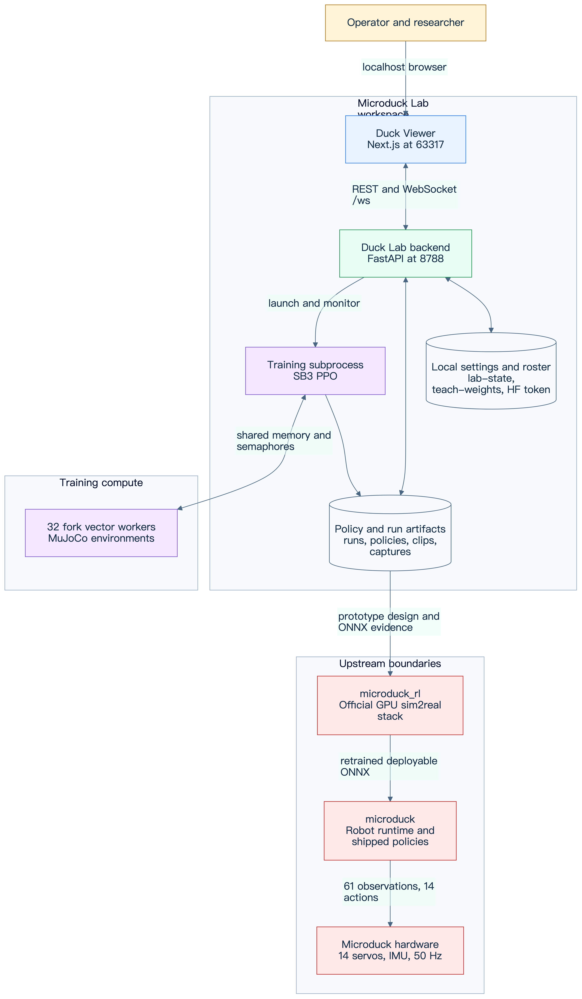
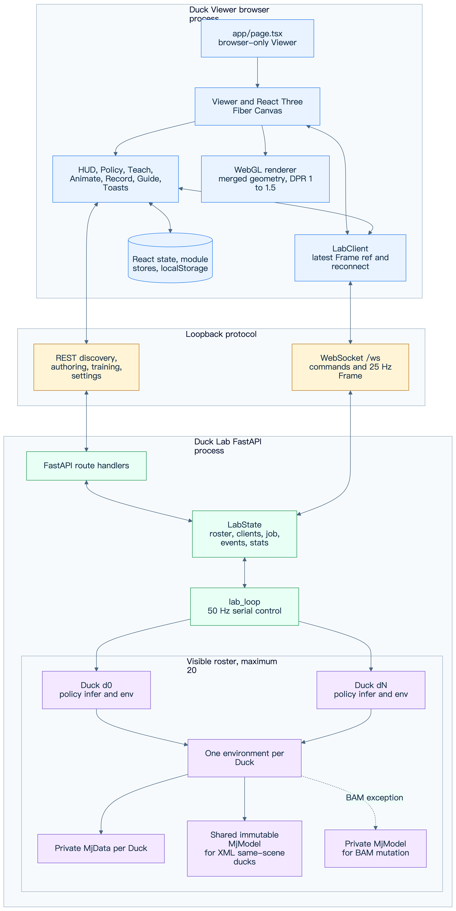
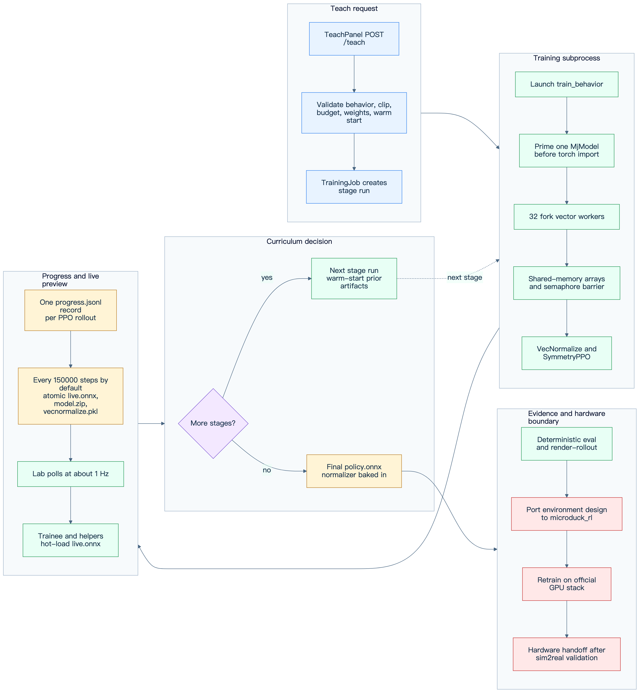
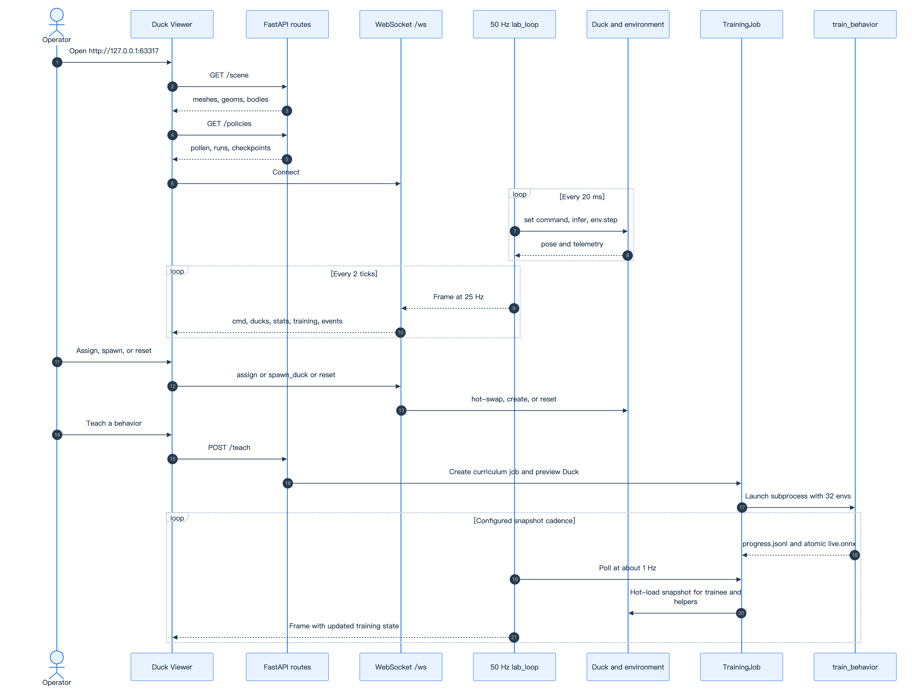

## Executive overview

Microduck Lab is a local, CPU-first policy prototyping system for the Microduck
biped. It joins three operational planes in one workspace:

* Duck Viewer provides a browser-only Next.js and React Three Fiber stage on
  `127.0.0.1:63317`.
* Duck Lab provides a FastAPI control plane and a serial real-time simulation
  loop on `127.0.0.1:8788`.
* `train_behavior` provides Stable Baselines3 PPO training in a subprocess with
  32 forked MuJoCo vector environments by default.

The system is optimized for fast local experiments, visible training progress,
and deterministic ONNX evidence. It is not the final sim2real training stack.
A behavior that succeeds locally must be ported to the upstream
`microduck_rl` environment design and retrained on its official GPU stack
before hardware deployment.



* Editable source: [system-context.mmd](diagrams/system-context.mmd)

### Goals

* Preserve the shared deployment contract of 61 observations, 14 actions, and
  50 Hz control across walking, tricks, viewer hot-swaps, and export.
* Let an operator compare multiple live policy instances and observe a training
  snapshot without coupling the browser render loop to MuJoCo.
* Keep the FastAPI event loop responsive while inference, policy loading,
  capture conversion, and training are isolated appropriately.
* Reduce local training memory by sharing a compiled model through fork
  copy-on-write while retaining private state for every environment.
* Make runs recoverable and inspectable through atomic artifacts, progress
  logs, persistent roster metadata, and reproducible deterministic rendering.

### Non-goals

* Replacing `microduck_rl` as the production sim2real and GPU training recipe
* Claiming a locally trained policy is safe for a physical robot
* Providing a multi-user, internet-facing service or remote authorization layer
* Running MuJoCo or ONNX inference in the browser
* Changing the fixed policy observation or action layout for individual tricks

## System context and workspace boundaries

The workspace intentionally keeps four responsibilities side by side:

| Boundary | Responsibility | Ownership |
|---|---|---|
| `microduck_local/` | CPU MuJoCo environments, PPO prototyping, ONNX export, FastAPI lab | This repository |
| `duck-viewer/` | Next.js user interface, Three.js rendering, REST and WebSocket client | This repository |
| `microduck/` | Upstream robot runtime and shipped reference policies | Upstream Pollen checkout |
| `microduck_rl/` | Official MuJoCo Warp, mjlab, PPO, BAM, and sim2real training | Upstream Pollen checkout |

The browser and FastAPI service communicate only over loopback by default. The
backend reads visual geometry from the compiled walk scene, runs every visible
simulation, owns training subprocesses, and persists local artifacts. The
frontend owns presentation and interaction state but never owns authoritative
simulation or training state.

The `microduck/` and `microduck_rl/` directories are integration boundaries,
not vendored implementation. The local harness consumes their MJCF and shipped
policies. The final handoff flows in the opposite direction: a proven local
environment and reward design is reimplemented and retrained in
`microduck_rl`, then exported for the robot runtime.

## Frontend architecture

### Browser-only entry and lifecycle

[duck-viewer/app/page.tsx](../../duck-viewer/app/page.tsx) dynamically imports
`Viewer` with `ssr: false`. This avoids server-side construction of WebGL,
`window`, `localStorage`, and WebSocket objects. `Viewer` creates one
`LabClient`, starts a retrying `GET /scene`, installs keyboard and trackpad
handlers, and closes the client on unmount.

`LabClient` derives its endpoint from the optional `?lab=host:port` query or
uses `127.0.0.1:8788`. It keeps one current WebSocket, reconnects 1.5 seconds
after closure, rejects callbacks from superseded sockets, and stores the newest
`Frame` in a mutable reference. `lastFrameAt` distinguishes a connected socket
from a healthy stream. One-shot events are accumulated because React pollers
could otherwise miss the single 25 Hz frame that contains them.

### Rendering pipeline

`Viewer` fetches static scene geometry once from `GET /scene`. The response
contains body names, deduplicated mesh vertices and faces, and geom transforms
and materials. [duck-viewer/components/Duck.tsx](../../duck-viewer/components/Duck.tsx)
builds reusable Three.js geometry. The dynamic WebSocket frame supplies only
per-body transforms and telemetry.

React Three Fiber's `useFrame` fans the latest frame into per-duck mutable refs,
so 25 Hz pose updates do not trigger a React tree render. React state changes
only when the roster signature changes. MuJoCo's Z-up scene is rotated once
into Three.js Y-up coordinates. Ducks then receive stable grid offsets for
side-by-side comparison.

Performance decisions are explicit:

* One Canvas and one scene serve the complete roster.
* Mesh data is deduplicated and body geometry is reused.
* Device pixel ratio is capped at 1.5.
* Shadow maps are omitted; hemisphere and directional lights provide depth.
* `powerPreference` requests the high-performance WebGL path.
* Pose data bypasses React state during frame-by-frame animation.
* Orbit controls pause during video capture to keep the shot stable.

### Component and panel map

| Component | Primary responsibility | Backend interaction |
|---|---|---|
| `Viewer` | Canvas, scene lifecycle, camera, keyboard, selection, layout | `GET /scene`, `LabClient` |
| `Duck` | Reused mesh hierarchy, body interpolation, labels and selection ring | Reads a `DuckFrame` ref |
| `Hud` | Connection health, roster telemetry, process statistics, command pad, settings | WebSocket commands, HF settings |
| `PolicyPanel` | Policy palette, assignment, spawn, download, and run deletion | `GET /policies`, WebSocket, run routes |
| `TeachPanel` | Behavior chat, budgets, weight sliders, curriculum status, helpers | Teach routes and WebSocket |
| `AnimPanel` | Joint pose editor, clip timeline, preview, imitation launch | Joint, pose, clip, and teach routes |
| `PoseDuck` | Server-computed forward-kinematics ghost | Latest `POST /pose` result |
| `RecordPanel` | PNG snapshot and browser video recording | `POST /captures`, capture download |
| `GuidePanel` | Embedded operational guidance | No authoritative state |
| `Toasts` | Local and backend event feedback | Drains `LabClient` events |

### State ownership and persistence

Authoritative state is split by lifetime:

* `LabClient.frame` is the newest server snapshot and remains outside React
  state for render-loop efficiency.
* React state owns panel forms, fetched catalogs, error states, and roster
  structure.
* Module stores in `select.ts`, `assign.ts`, `ui.ts`, `anim.ts`, and `record.ts`
  coordinate high-frequency or cross-panel interactions without global state
  framework overhead.
* `localStorage` uses the `ducklab.` prefix. It preserves camera pose, panel
  open states, folded policy groups, HUD and command-bar state, duck labels,
  Teach width and chat history, and animation mode and clip work.
* The backend remains authoritative for the duck roster, policies, training
  job, clips, and persisted settings.

### Capture and animation authoring

A PNG capture is synchronous inside the user gesture. The renderer hides
selection-only objects, renders once, calls `toDataURL`, and triggers a browser
download. Video uses `MediaRecorder` on the Canvas. The browser uploads the
video blob to `POST /captures`; the backend converts it to H.264 MP4 and a
480-pixel-wide GIF.

Animation authoring does not mutate a live duck. `POST /pose` uses a dedicated
`PoseScratch` model and data pair for forward kinematics. Saved v1 clips contain
validated, clamped 14-joint keyframes and `rootPitch`; the training request can
select a clip through `MICRODUCK_CLIP`.

## Backend server architecture

### FastAPI process and timing domains

[common server construction](../../microduck_local/src/microduck_local/viz_server.py)
creates static scene data, `LabState`, `StatsSampler`, middleware, route
handlers, and the `/ws` endpoint. The application lifespan starts one
`lab_loop` task. Uvicorn binds to `127.0.0.1:8788` by default.

The backend has three timing domains:

* `lab_loop` advances at `TICK_HZ = 50`, one control step every 20 ms.
* A `Frame` is broadcast every `SEND_EVERY = 2` ticks, producing 25 Hz browser
  updates.
* Training progress and process statistics are polled every 50 ticks, about
  1 Hz.

The lab loop serially steps visible ducks. During active training, helper ducks
step every other lab tick, which matches the 25 Hz broadcast and yields CPU
time to training workers. Helpers remain viewer simulations. They do not
increase the trainer's environment count because `ENVS_PER_HELPER = 0`.

### `LabState` and roster ownership

`LabState` owns the live duck list, WebSocket client set, temporary command
override, automatic script clock, optional `TrainingJob`, bounded event deque,
scaling guard, and sampled statistics. `MAX_DUCKS = 20` is the actual roster
ceiling. `MAX_HELPERS` defaults to 6 and can be changed with
`DUCK_MAX_HELPERS`.

Roster mutations and assignments are backend operations. WebSocket handlers
schedule policy loading, assignment, helper creation, removal, and new duck
creation without blocking message reception. The lab saves roster metadata
after relevant mutations. At startup it restores valid brains from
`lab-state.json`; missing artifacts are skipped.



* Editable source: [runtime-components.mmd](diagrams/runtime-components.mmd)

### `Duck`, environment, model, and data ownership

Every visible `Duck` owns:

* A stable ID, mutable label, policy provenance, inference callable, and seed
* One `MicroduckWalkEnv` or behavior-specific `BehaviorEnv`
* One private MuJoCo `MjData` through that environment
* Current observation, commands, fall count, reward moving average, speed
  window, and handoff state

XML-actuated ducks using the same scene can share a read-only compiled
`MjModel`. This is safe because lab environments disable domain randomization,
the loop steps serially, and no environment writes model parameters. Each duck
still has private `MjData`, so position, velocity, sensors, contacts, and
integration state do not mix.

BAM is the exception. Its actuator rewrites `dof_frictionloss` during physics
substeps, so a BAM environment receives a private model. Scene or actuator
changes rebuild the environment before committing the new configuration.
Behavior policies use their own environment class and training-compatible
physics, not a generic walk environment.

### Policy load, hot-swap, and handoff

Policy discovery covers three groups:

* Upstream `microduck/policies/*.onnx`
* Finished run `policy.onnx` files
* Checkpoint pairs under `checkpoints/`

ONNX Runtime sessions and SB3 checkpoint wrappers are cached by policy ID.
`Duck.swap_policy()` resets brain-dependent telemetry and handoff state but
retains stable duck identity. Assignment can also rebuild the environment from
the run's `behavior.json`. A curriculum showcase uses final-stage spawn knobs.
Applicable flip policies can hand off to `alpha_stand` after landing, preserving
the robot runtime's policy-switching pattern.

### Persistence and artifact stores

| Store | Content and semantics |
|---|---|
| `runs/` | Training directories, logs, checkpoints, live and final policies |
| `lab-state.json` | Versioned duck roster and brain provenance |
| `teach-weights.json` | Sticky behavior weights, stage overrides, and budgets |
| `clips/` | Validated animation clip JSON |
| `captures/` | Converted MP4 and GIF evidence |
| `hf-token.json` | Validated BYOK token and username, created with mode `0600` |

JSON persistence uses a unique PID and UUID temporary file followed by atomic
replacement. The HF token is never returned after submission. API reads expose
only configuration status, username, and a mask. Run deletion validates a
restrictive name, refuses active training chains, and performs guard checks
before deletion.

## Training architecture

### Teach request and subprocess boundary

`POST /teach` matches free text to a behavior, validates an optional clip and
warm-start run, resolves total and per-stage budgets, layers sticky and explicit
weights, and creates a `TrainingJob`. The server also creates or resets a
`trainee` duck and aligns helper ducks with the active stage environment.

`TrainingJob` launches `python -m microduck_local.train_behavior` as a separate
process. The boundary protects the FastAPI loop from PPO and Torch work, gives
training a clean import sequence, and makes curriculum stage transitions
explicit. Standard output and errors append to the stage's `train.log`.

### Curriculum and warm-start semantics

A behavior with a curriculum becomes a sequence of run directories named
`teach-<behavior>-<hash>-sN`. Every stage retains the same behavior reward
recipe while stage environment variables may change physics, spawn mix, or
strictness. Stage-specific user weight overrides are an explicit interactive
experiment layer.

A completed stage exits before the next starts. The next stage uses the prior
stage directory as `--init-from`, carrying `model.zip` and
`vecnormalize.pkl` into a fresh stage budget. An explicit fine-tune of an
existing run is a single run under the final-stage environment. A same-directory
restart continues toward an absolute step target rather than adding the target
again.

### Fork vector environment and IPC

The trainer default is `BASE_ENVS = 32`, matching the `train_behavior --envs`
default. Helpers have no effect on this count. Before importing Torch, the
trainer builds one probe environment so the parent process owns a compiled
`MjModel`. It then forks workers. Children inherit model pages copy-on-write,
while every environment builds private `MjData` and independent random state.
Domain-randomization writes copy only touched pages in each process.

Per-step transport uses shared arrays for observations, actions, rewards, and
done flags. A per-worker semaphore starts work; a shared pending counter and
one completion semaphore form a barrier. Pipes are reserved for control
commands and uncommon episode-end dictionaries. This removes per-environment
pickle and pipe traffic from the hot path.

### PPO, normalization, and artifacts

The fork environment is adapted to the SB3 `VecEnv` interface, then wrapped by
`VecMonitor` and `VecNormalize`. `SymmetryPPO` uses the repository's actor and
critic architecture, linear learning-rate schedule, optional bilateral mirror
loss, action standard-deviation cap, and optional MPS update path for large
batches. Rollout inference remains on CPU.

Artifacts in each active run have distinct purposes:

| Artifact | Production and use |
|---|---|
| `progress.jsonl` | One append-only record after each PPO rollout, plus final `done` record |
| `live.onnx` | Deterministic policy with observation normalization, atomically refreshed at snapshot boundaries |
| `model.zip` | Atomically refreshed SB3 model for resume, stage handoff, and fine-tune |
| `vecnormalize.pkl` | Atomically refreshed normalization state paired with `model.zip` |
| `behavior.json` | Behavior ID, requested steps, actual overrides, symmetry, and KL metadata |
| `policy.onnx` | Final exported policy with observation normalization baked in |
| `train.log` | Subprocess standard output and errors |

The configured default snapshot interval is `SNAP_STEPS = 150_000` training
steps, described in source as roughly 15 seconds on the measured machine.
Tests may override it through `TEACH_SNAP_OVERRIDE`. The server checks artifact
mtime during its approximately 1 Hz poll and hot-loads a complete `live.onnx`
onto the trainee and helpers. Atomic replacement prevents readers from seeing
a partial file.



* Editable source: [training-flow.mmd](diagrams/training-flow.mmd)

### Completion, evaluation, and hardware handoff

At completion, the trainer writes a final snapshot, exports `policy.onnx`, and
appends a `done` progress record. The lab marks the run complete and returns the
preview environment to standing spawns.

Acceptance must use the deterministic exported ONNX. The expected local flow
is export, `eval-walk` or behavior evaluation, `render-rollout`, and visual
inspection of the video and contact sheet. A null policy is the control for
spawn-assisted or gravity-assisted motion. Reward curves alone are not
acceptance evidence.

The final deployment flow is architectural rather than automatic: port the
validated environment, curriculum, and reward design to `microduck_rl`; retrain
with the official GPU domain-randomization and BAM recipe; evaluate again; then
export for `microduck`. A local ONNX proves the interface and concept, not
hardware readiness.

## API and protocol contracts

### REST routes

The backend decorators currently expose the following routes. There are no
fabricated assignment or spawn REST endpoints; those operations use `/ws`.

| Method | Route | Contract |
|---|---|---|
| GET | `/scene` | Static body, mesh, geom, material, and transform data |
| GET | `/policies` | Assignable upstream, run, and checkpoint policies |
| DELETE | `/runs/{name}` | Delete one run or a guarded chain with `?chain=true` |
| GET | `/runs/{name}/policy.onnx` | Download final ONNX or current live snapshot |
| GET | `/settings/hf` | Return masked Hugging Face configuration state |
| POST | `/settings/hf` | Validate and save a BYOK token |
| DELETE | `/settings/hf` | Delete token and temporary remnants |
| GET | `/behaviors` | Reward recipes, terms, and curriculum cards |
| GET | `/joints` | Joint metadata and MJCF limits for animation authoring |
| POST | `/pose` | Clamp joints and return forward-kinematics body poses |
| GET | `/clips` | List saved clips |
| GET | `/clips/{name}` | Read one clip |
| PUT | `/clips/{name}` | Validate and atomically save one clip |
| DELETE | `/clips/{name}` | Delete one clip |
| POST | `/captures` | Accept a browser video blob and create MP4 and GIF |
| GET | `/captures/{fname}` | Download a validated MP4 or GIF filename |
| POST | `/teach` | Match and launch a behavior training job |
| POST | `/teach/stop` | Stop the active subprocess and worker tree |
| POST | `/teach/clear` | Clear a completed card and owned preview ducks |
| POST | `/teach/load` | Adopt a finished run in the panel without training |
| POST | `/teach/weights` | Replace stage overrides and warm-restart if required |

### WebSocket inbound messages

| Message shape | Effect |
|---|---|
| `{"cmd":[vx,vy,wz]}` | Clamp a temporary manual twist override for six seconds |
| `{"reset":true}` | Reset every duck and clear fall counts |
| `{"assign":{"duck":"d0","policy":"run:x","showcase":true}}` | Load and hot-swap a policy, optionally with showcase physics |
| `{"spawn_duck":{"policy":"pollen:alpha_stand","showcase":false}}` | Create a visible duck if the 20-duck guard permits |
| `{"remove_duck":{"duck":"d0"}}` | Remove a guarded roster entry and persist state |
| `{"spawn_helper":true}` | Add a visual snapshot follower if training permits |

### Outbound `Frame`

At 25 Hz, the server sends one JSON object with this logical shape:

```typescript
interface Frame {
  cmd: [number, number, number];
  mode: "auto" | "manual";
  ducks: Array<{
    id: string;
    name: string;
    policy?: string | null;
    falls: number;
    step: number;
    rew: number;
    speed?: number | null;
    cmdSpeed?: number | null;
    steerable?: boolean;
    spawn?: string | null;
    assist?: boolean;
    handed?: boolean;
    handoff?: string | null;
    bodies: number[][];
  }>;
  events?: string[];
  stats?: SystemStats;
  training?: TrainingPayload | null;
}
```

Each body row is `[x, y, z, qw, qx, qy, qz]` in MuJoCo coordinates. Events are
one-shot lines, capped to the newest five in a frame and cleared after
broadcast. Process statistics are sampled about once per second but repeated in
frames until refreshed.

### Fixed policy contract

The deployment interface is invariant:

```text
Observation 61D = angular velocity 3 + projected gravity 3
                + relative joint position 14 + joint velocity 14
                + last action 14 + twist command 3
                + head pose command 4 + body pose command 6
Action 14D      = one target offset for each servo joint
Control rate    = 0.005 s physics step x decimation 4 = 50 Hz
```

Unused command fields remain zero-padded rather than removed. ONNX export wraps
the policy with the `VecNormalize` observation statistics. Raw `model.zip` is
not a deployable artifact.

## Deployment and process topology

The supported local startup entry is:

```bash
./restart-lab.sh
```

The script delegates backend restart to the repository's targeted restart
helper, starts Duck Lab with a fresh roster containing `first-gait` and
`alpha_walking`, runs `npm install` for the viewer, and launches `npm run dev`
in the background. It checks `http://127.0.0.1:63317` for readiness. The
resulting topology is:

* One Uvicorn and FastAPI process on `127.0.0.1:8788`
* One Next.js development process on `127.0.0.1:63317`
* Zero or one `train_behavior` subprocess owned by `TrainingJob`
* 32 fork workers by default while training, subject to explicit trainer
  configuration
* One browser process with one WebGL Canvas and one active lab WebSocket

The startup script is a local development convenience, not a production service
manager. It installs no global dependencies and binds neither application to a
public interface.

## End-to-end runtime flows



* Editable source: [runtime-sequence.mmd](diagrams/runtime-sequence.mmd)

### Frame rendering flow

1. The browser fetches `/scene` and builds reusable body geometry.
2. `lab_loop` computes the automatic or temporary manual command.
3. For each duck, the backend selects the correct command, runs policy
   inference, advances its private `MjData`, and collects telemetry.
4. Every second tick, the server serializes all body transforms and current
   training state into one `Frame`.
5. `LabClient` replaces its mutable latest-frame reference.
6. React Three Fiber reads that reference in `useFrame`, updates each duck's
   body transforms, and renders without a React update per network frame.

### Policy assignment flow

1. `PolicyPanel` fetches `/policies` and presents upstream, run, and checkpoint
   entries.
2. The operator drops or activates a policy for a target duck.
3. `LabClient.sendAssign()` sends an `assign` message over `/ws`.
4. The backend resolves and caches the inference callable in a worker thread.
5. Run metadata determines the behavior environment and optional showcase
   spawn configuration.
6. The duck environment is rebuilt if necessary, then `swap_policy()` resets
   policy-dependent state.
7. The roster is persisted and a one-shot event confirms the assignment.

### Teach training flow

1. `TeachPanel` posts behavior text, optional clip, budget, weights, stage
   overrides, and optional warm-start name to `/teach`.
2. The backend hot-reloads motion and behavior definitions all-or-nothing,
   validates inputs, and constructs `TrainingJob`.
3. A stage subprocess creates the 32-environment fork vector fleet before
   importing Torch.
4. PPO appends rollout progress and atomically saves snapshots every configured
   `snap_steps` boundary.
5. The lab's 1 Hz poll detects progress and `live.onnx` mtime changes.
6. The trainee and helpers receive a new ONNX Runtime inference callable.
7. A clean stage exit launches the next curriculum stage from the previous
   model and normalizer; final exit produces `policy.onnx`.
8. The operator evaluates and renders the deterministic result before deciding
   whether to revise the recipe or port it to the official GPU stack.

## Reliability, security, and performance

### Reliability

* Unique temporary files plus atomic replacement protect roster, settings,
  clips, and training snapshots from partial reads.
* The lab-loop task reports fatal exceptions because HTTP and WebSocket
  handshakes can remain available after the simulation loop dies.
* The browser uses `lastFrameAt` to report a stalled stream rather than relying
  only on WebSocket open state.
* `TrainingJob` remembers worker process handles while the trainer is alive and
  terminates the worker tree on stop, crash, restart, or stage handoff.
* Roster and sticky settings survive server restarts; invalid policy artifacts
  fail closed and are skipped.
* Curriculum advancement waits for clean subprocess exit, not only a progress
  marker, so final model and normalizer writes are complete.

### Security

* Uvicorn binds to loopback and browser origins are restricted to localhost,
  `127.0.0.1`, or `[::1]` with any port.
* WebSocket origin is checked explicitly because CORS middleware does not
  protect WebSocket handshakes.
* Capture upload rejects nonlocal origins, CORS-simple content types, empty
  bodies, and payloads above 300 MiB.
* Run, clip, and capture names use restrictive validation before file access.
* Active training runs cannot be deleted.
* The HF token is validated before storage, created at mode `0600`, masked on
  reads, and cleaned with interrupted-save remnants on delete.
* The architecture does not provide authentication for a non-loopback
  deployment. Changing the bind address requires a separate threat model.

### Performance

* The visible lab is bounded at 20 live environments.
* The 50 Hz loop is serial by design, which makes read-only model sharing safe
  and keeps simulation ordering deterministic.
* Frames are reduced to 25 Hz because the browser does not need every control
  step.
* Helpers step at 25 Hz during training and never allocate trainer workers.
* The fork trainer shares compiled-model pages and uses shared-memory hot-path
  transport with semaphore synchronization.
* Model loading and capture conversion use `asyncio.to_thread` around blocking
  work.
* The browser caps DPR, avoids shadows, reuses geometry, and updates transforms
  through refs.

## Verification strategy

### Contract and unit tests

Run the local harness suite before and after behavior, environment, protocol, or
export changes:

```bash
cd microduck_local
uv run --with pytest pytest tests/
```

The suite includes locks for the observation and action contract, environment
randomization reset, behavior signs and curricula, vector-environment IPC and
model sharing, resume semantics, ONNX export, lab routes and WebSocket behavior,
clips, captures, rendering, BAM parity, and performance-sensitive stepping.
Frontend changes should also run the scripts defined by the viewer package:

```bash
npm --prefix duck-viewer run lint
npm --prefix duck-viewer run build
```

### Runtime evidence

Verification proceeds from interface to behavior:

1. Confirm `/scene`, `/policies`, and `/ws` connect on loopback.
2. Confirm frames arrive near 25 Hz while simulation steps advance at 50 Hz.
3. Assign and spawn policies, then verify stable IDs, persistence, and expected
   behavior-specific environments.
4. Launch a short test Teach job with explicit test overrides and verify
   progress, atomic snapshot load, stop cleanup, and completion artifacts.
5. Evaluate the final deterministic ONNX.
6. Render the rollout and inspect its video and contact sheet.
7. Compare against a limp or zero-action control where spawn or gravity could
   explain the motion.
8. Port and repeat evaluation in `microduck_rl` before any hardware trial.

## Extension points and constraints

### Supported extension points

* Add a behavior module and register its reward terms and optional curriculum
  under `microduck_local/src/microduck_local/behaviors/`.
* Add reusable signed terms to the behavior catalog rather than creating
  duplicated private reward logic.
* Add a REST resource when data is request-response or durable authoring state.
* Add a WebSocket message when the operation is a low-latency live lab command.
* Add viewer panels while keeping authoritative simulation and training state
  in the backend.
* Add vec-env backends behind `make_vec_env`; retain `fork` as the measured
  default unless matched-step quality and throughput evidence supports change.
* Add hardware handoff automation only after it preserves the official upstream
  retraining and evaluation boundary.

### Constraints

* Never reorder or resize the 61D observation or 14D action contract per task.
* Never distribute raw checkpoints as deployed policies; export normalization
  into ONNX.
* Never share an `MjModel` where BAM or another subsystem mutates it
  concurrently.
* Never infer trainer worker count from helper count; helpers are visual clones.
* Never accept reward curves as proof of deterministic behavior.
* Never describe the local CPU harness as the final hardware training recipe.
* Never expose the current destructive and secret-bearing API beyond loopback
  without authentication, authorization, CSRF analysis, TLS, and storage
  hardening.

## Source map

| Architecture concern | Source |
|---|---|
| Workspace contract and sim2real boundary | [AGENTS.md](../../AGENTS.md) and [microduck_local/AGENTS.md](../../microduck_local/AGENTS.md) |
| Backend routes, `LabState`, `Duck`, `TrainingJob`, and lab loop | [viz_server.py](../../microduck_local/src/microduck_local/viz_server.py) |
| 61D observation, 14D action, joint order, and timing | [contract.py](../../microduck_local/src/microduck_local/contract.py) |
| MuJoCo environment and shared-model scope | [walk_env.py](../../microduck_local/src/microduck_local/walk_env.py) |
| Fork workers, shared arrays, semaphores, and SB3 adapter | [vec_env.py](../../microduck_local/src/microduck_local/vec_env.py) |
| PPO launch, snapshots, resume, normalization, and final export | [train_behavior.py](../../microduck_local/src/microduck_local/train_behavior.py) |
| ONNX normalization wrapper and export | [export_onnx.py](../../microduck_local/src/microduck_local/export_onnx.py) |
| Browser protocol types and `LabClient` | [lab.ts](../../duck-viewer/lib/lab.ts) |
| Browser-only entry | [page.tsx](../../duck-viewer/app/page.tsx) |
| Canvas, camera, state fan-out, capture, and panel composition | [Viewer.tsx](../../duck-viewer/components/Viewer.tsx) |
| Animation REST client and shared authoring store | [anim.ts](../../duck-viewer/lib/anim.ts) |
| Browser persistence helper | [persist.ts](../../duck-viewer/lib/persist.ts) |
| Local process startup | [restart-lab.sh](../../restart-lab.sh) |
| Backend verification | [microduck_local/tests](../../microduck_local/tests) |
| Frontend scripts and dependencies | [duck-viewer/package.json](../../duck-viewer/package.json) |
