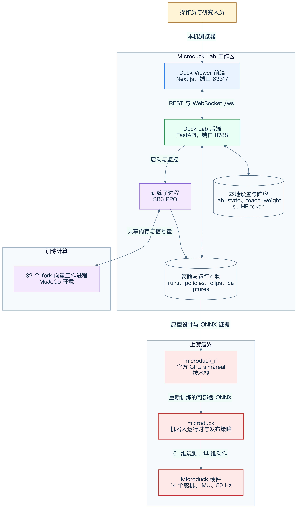
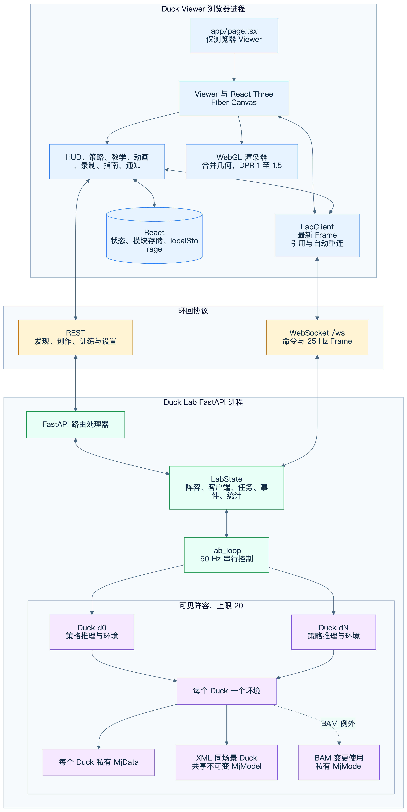
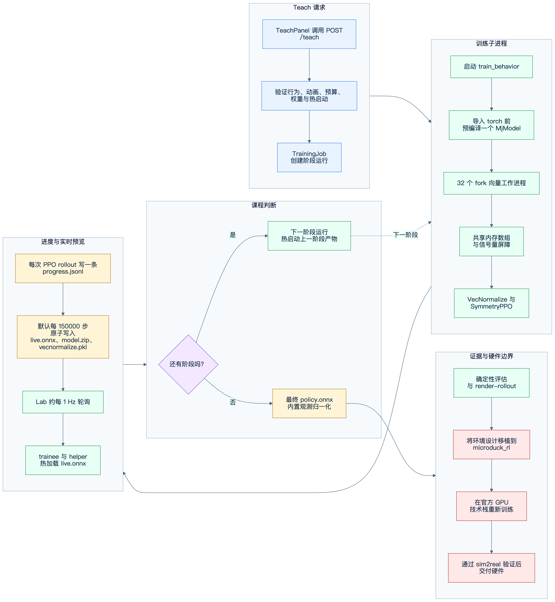
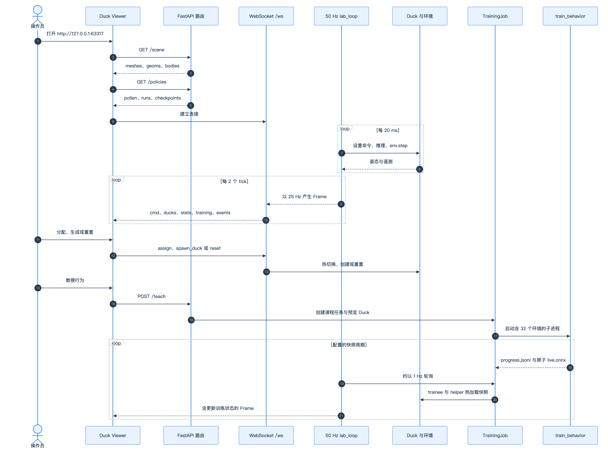

## 执行概述

Microduck Lab 是面向 Microduck 双足机器人的本地 CPU 优先策略原型系统。它在同一工作区内连接三个运行平面：

* Duck Viewer 在 `127.0.0.1:63317` 提供仅浏览器运行的 Next.js 与 React Three Fiber 场景。
* Duck Lab 在 `127.0.0.1:8788` 提供 FastAPI 控制平面与串行实时仿真循环。
* `train_behavior` 在独立子进程中提供 Stable Baselines3 PPO 训练，默认使用 32 个 fork MuJoCo 向量环境。

系统针对快速本地实验、可见的训练进度与确定性 ONNX 证据进行优化。它不是最终的 sim2real 训练技术栈。本地成功的行为必须移植到上游 `microduck_rl` 环境设计，并在官方 GPU 技术栈中重新训练，之后才可考虑硬件部署。



* 可编辑源文件：[system-context.zh-CN.mmd](diagrams/system-context.zh-CN.mmd)

### 目标

* 在行走、特技、Viewer 热切换与导出流程中保持 61 维观测、14 维动作和 50 Hz 控制的统一部署契约。
* 允许操作员比较多个实时策略实例并观察训练快照，同时不将浏览器渲染循环与 MuJoCo 耦合。
* 在合理隔离推理、策略加载、录制转换与训练的同时，保持 FastAPI 事件循环响应能力。
* 通过 fork 写时复制共享已编译模型来降低本地训练内存，同时为每个环境保留私有状态。
* 通过原子产物、进度日志、持久阵容元数据与可复现的确定性渲染，使运行可恢复且可审查。

### 非目标

* 替代 `microduck_rl` 作为生产级 sim2real 与 GPU 训练方案
* 宣称本地训练策略可安全用于实体机器人
* 提供多用户、面向互联网的服务或远程授权层
* 在浏览器中运行 MuJoCo 或 ONNX 推理
* 针对单个特技改变固定的策略观测或动作布局

## 系统上下文与工作区边界

工作区有意并列维护四项职责：

| 边界 | 职责 | 所有权 |
|---|---|---|
| `microduck_local/` | CPU MuJoCo 环境、PPO 原型、ONNX 导出与 FastAPI Lab | 本仓库 |
| `duck-viewer/` | Next.js 用户界面、Three.js 渲染与 REST、WebSocket 客户端 | 本仓库 |
| `microduck/` | 上游机器人运行时与已发布参考策略 | Pollen 上游检出 |
| `microduck_rl/` | 官方 MuJoCo Warp、mjlab、PPO、BAM 与 sim2real 训练 | Pollen 上游检出 |

浏览器与 FastAPI 服务默认仅通过本机环回通信。后端从已编译的行走场景读取可视几何，运行每个可见仿真，拥有训练子进程并持久化本地产物。前端拥有展示与交互状态，但不拥有权威仿真或训练状态。

`microduck/` 和 `microduck_rl/` 是集成边界，而非供应到本仓库的实现。本地工具使用其中的 MJCF 与已发布策略。最终交付方向相反：在本地验证的环境和奖励设计需要在 `microduck_rl` 中重新实现和训练，再导出给机器人运行时。

## 前端架构

### 仅浏览器入口与生命周期

[duck-viewer/app/page.tsx](../../duck-viewer/app/page.tsx) 使用 `ssr: false` 动态导入 `Viewer`，从而避免在服务端构造 WebGL、`window`、`localStorage` 和 WebSocket 对象。`Viewer` 创建一个 `LabClient`，启动可重试的 `GET /scene`，安装键盘和触控板处理器，并在卸载时关闭客户端。

`LabClient` 从可选的 `?lab=host:port` 查询参数导出端点，否则使用 `127.0.0.1:8788`。它只维护一个当前 WebSocket，在连接关闭 1.5 秒后重连，忽略已被替代套接字的回调，并将最新 `Frame` 保存到可变引用。`lastFrameAt` 区分已连接套接字和健康数据流。一次性事件会被累积，因为 React 轮询器可能错过唯一包含该事件的 25 Hz 帧。

### 渲染流水线

`Viewer` 从 `GET /scene` 获取一次静态场景几何。响应包含 body 名称、去重后的网格顶点与面，以及 geom 变换和材质。[duck-viewer/components/Duck.tsx](../../duck-viewer/components/Duck.tsx) 构建可复用的 Three.js 几何。动态 WebSocket 帧仅提供每个 body 的变换与遥测。

React Three Fiber 的 `useFrame` 将最新帧分发到每个 duck 的可变引用，因此 25 Hz 姿态更新不会触发 React 树重新渲染。仅当阵容签名变化时才更新 React 状态。MuJoCo 的 Z 轴向上场景统一旋转到 Three.js 的 Y 轴向上坐标。各 duck 再获得稳定网格偏移，以便并排比较。

性能决策明确如下：

* 完整阵容共享一个 Canvas 和一个场景。
* 网格数据去重，body 几何复用。
* 设备像素比上限为 1.5。
* 不使用阴影贴图，以半球光和方向光提供深度感。
* `powerPreference` 请求高性能 WebGL 路径。
* 逐帧动画的姿态数据绕过 React 状态。
* 视频录制期间暂停 Orbit controls 以保持镜头稳定。

### 组件与面板映射

| 组件 | 主要职责 | 后端交互 |
|---|---|---|
| `Viewer` | Canvas、场景生命周期、相机、键盘、选择与布局 | `GET /scene`、`LabClient` |
| `Duck` | 复用网格层次、body 插值、标签与选择环 | 读取 `DuckFrame` 引用 |
| `Hud` | 连接健康、阵容遥测、进程统计、命令板与设置 | WebSocket 命令、HF 设置 |
| `PolicyPanel` | 策略面板、分配、生成、下载与运行删除 | `GET /policies`、WebSocket、运行路由 |
| `TeachPanel` | 行为对话、预算、权重滑块、课程状态与 helper | Teach 路由与 WebSocket |
| `AnimPanel` | 关节姿态编辑、动画时间线、预览与模仿训练启动 | Joint、pose、clip 与 teach 路由 |
| `PoseDuck` | 服务端前向运动学计算的幽灵 duck | 最新 `POST /pose` 结果 |
| `RecordPanel` | PNG 截图与浏览器视频录制 | `POST /captures`、录制下载 |
| `GuidePanel` | 内嵌操作指南 | 无权威状态 |
| `Toasts` | 本地与后端事件反馈 | 消费 `LabClient` 事件 |

### 状态所有权与持久化

权威状态按生命周期分层：

* `LabClient.frame` 是最新服务端快照。为提高渲染循环效率，它不进入 React 状态。
* React 状态拥有面板表单、获取的目录、错误状态与阵容结构。
* `select.ts`、`assign.ts`、`ui.ts`、`anim.ts` 和 `record.ts` 中的模块存储协调高频或跨面板交互，避免引入全局状态框架开销。
* `localStorage` 使用 `ducklab.` 前缀，保存相机姿态、面板开合、折叠的策略分组、HUD 与命令栏状态、duck 标签、Teach 宽度与聊天记录、动画模式与 clip 工作内容。
* 后端仍是 duck 阵容、策略、训练任务、clip 和持久设置的权威来源。

### 录制与动画创作

PNG 截图在用户手势中同步完成。渲染器隐藏仅供选择使用的对象，渲染一次，调用 `toDataURL` 并触发浏览器下载。视频使用 Canvas 上的 `MediaRecorder`。浏览器把视频 blob 上传到 `POST /captures`，后端将其转换为 H.264 MP4 和宽度 480 像素的 GIF。

动画创作不会修改实时 duck。`POST /pose` 使用专用 `PoseScratch` 模型和 data 对执行前向运动学。保存的 v1 clip 包含经过验证和限位的 14 关节关键帧与 `rootPitch`；训练请求可通过 `MICRODUCK_CLIP` 选择 clip。

## 后端服务器架构

### FastAPI 进程与时序域

[通用服务器构造](../../microduck_local/src/microduck_local/viz_server.py) 创建静态场景数据、`LabState`、`StatsSampler`、middleware、路由处理器与 `/ws` 端点。应用 lifespan 启动一个 `lab_loop` 任务。Uvicorn 默认绑定 `127.0.0.1:8788`。

后端包含三个时序域：

* `lab_loop` 以 `TICK_HZ = 50` 推进，每 20 ms 一个控制步。
* 每 `SEND_EVERY = 2` 个 tick 广播一个 `Frame`，产生 25 Hz 浏览器更新。
* 每 50 个 tick 轮询训练进度与进程统计，约为 1 Hz。

Lab 循环串行推进可见 duck。训练活跃时，helper duck 每两个 Lab tick 推进一步，与 25 Hz 广播匹配，并把 CPU 时间让给训练 worker。Helper 仍是 Viewer 仿真，不增加训练环境数量，因为 `ENVS_PER_HELPER = 0`。

### `LabState` 与阵容所有权

`LabState` 拥有实时 duck 列表、WebSocket 客户端集合、临时命令覆盖、自动脚本时钟、可选 `TrainingJob`、有界事件队列、扩缩保护和采样统计。实际阵容上限是 `MAX_DUCKS = 20`。`MAX_HELPERS` 默认为 6，可通过 `DUCK_MAX_HELPERS` 修改。

阵容变更与策略分配属于后端操作。WebSocket 处理器调度策略加载、分配、helper 创建、删除和新 duck 创建，而不阻塞消息接收。Lab 在相关变更后保存阵容元数据。启动时从 `lab-state.json` 恢复可用策略，缺失产物会被跳过。



* 可编辑源文件：[runtime-components.zh-CN.mmd](diagrams/runtime-components.zh-CN.mmd)

### `Duck`、环境、模型与 data 所有权

每个可见 `Duck` 拥有：

* 稳定 ID、可变标签、策略来源、推理 callable 与 seed
* 一个 `MicroduckWalkEnv` 或行为专用 `BehaviorEnv`
* 通过该环境持有的一个私有 MuJoCo `MjData`
* 当前观测、命令、跌倒计数、奖励移动平均、速度窗口和交接状态

使用同一场景的 XML 执行器 duck 可以共享只读已编译 `MjModel`。这是安全的，因为 Lab 环境关闭 domain randomization，循环串行推进，并且没有环境写入模型参数。每个 duck 仍拥有私有 `MjData`，所以位置、速度、传感器、接触和积分状态不会混合。

BAM 是例外。其执行器在物理子步中重写 `dof_frictionloss`，因此 BAM 环境使用私有模型。场景或执行器变化时，系统先成功重建环境，再提交新配置。行为策略使用自己的环境类和训练兼容物理，而不是通用行走环境。

### 策略加载、热切换与交接

策略发现覆盖三组：

* 上游 `microduck/policies/*.onnx`
* 已完成运行的 `policy.onnx`
* `checkpoints/` 下的 checkpoint 配对

ONNX Runtime session 与 SB3 checkpoint wrapper 按策略 ID 缓存。`Duck.swap_policy()` 重置与策略相关的遥测和交接状态，但保留稳定 duck 身份。分配时还可根据运行的 `behavior.json` 重建环境。课程 showcase 使用最终阶段 spawn 参数。适用的 flip 策略落地后可交接给 `alpha_stand`，保留机器人运行时的策略切换模式。

### 持久化与产物存储

| 存储 | 内容与语义 |
|---|---|
| `runs/` | 训练目录、日志、checkpoint、实时与最终策略 |
| `lab-state.json` | 带版本的 duck 阵容与策略来源 |
| `teach-weights.json` | 持久行为权重、阶段覆盖与预算 |
| `clips/` | 经过验证的动画 clip JSON |
| `captures/` | 转换后的 MP4 与 GIF 证据 |
| `hf-token.json` | 经验证的 BYOK token 和用户名，以 `0600` 模式创建 |

JSON 持久化使用包含 PID 和 UUID 的唯一临时文件，再执行原子替换。HF token 提交后永不返回。API 读取仅暴露配置状态、用户名和掩码。运行删除使用严格名称验证，拒绝活跃训练链，并在删除前完成全部保护检查。

## 训练架构

### Teach 请求与子进程边界

`POST /teach` 将自由文本匹配到行为，验证可选 clip 和热启动运行，解析总预算与分阶段预算，叠加持久和显式权重，并创建 `TrainingJob`。服务器还会创建或重置 `trainee` duck，并使 helper duck 与当前阶段环境一致。

`TrainingJob` 将 `python -m microduck_local.train_behavior` 启动为独立进程。该边界保护 FastAPI 循环免受 PPO 与 Torch 工作影响，给训练提供干净的导入顺序，并使课程阶段转换显式化。标准输出和错误追加到该阶段的 `train.log`。

### 课程与热启动语义

含课程的行为会形成名为 `teach-<behavior>-<hash>-sN` 的运行目录序列。每个阶段保持相同的行为奖励配方，而阶段环境变量可改变物理、spawn 混合或严格程度。用户设置的阶段权重覆盖是显式交互实验层。

一个阶段完成并退出后才启动下一阶段。下一阶段以之前阶段目录作为 `--init-from`，将 `model.zip` 与 `vecnormalize.pkl` 带入新的阶段预算。对现有运行执行显式 fine-tune 时，只在最终阶段环境中创建单次运行。同目录重启继续朝绝对步数目标推进，而不是再次追加整个目标。

### Fork 向量环境与 IPC

训练器默认值为 `BASE_ENVS = 32`，与 `train_behavior --envs` 默认值一致。Helper 不影响此数量。导入 Torch 之前，训练器构建一个探测环境，使父进程拥有已编译 `MjModel`，然后 fork worker。子进程通过写时复制继承模型页面，而每个环境构建私有 `MjData` 和独立随机状态。Domain randomization 写操作仅复制各进程实际修改的页面。

逐步传输使用共享数组保存观测、动作、奖励与 done 标志。每个 worker 通过信号量启动；共享 pending 计数器与一个完成信号量构成屏障。Pipe 仅用于控制命令和少见的 episode-end 字典。这样可从热路径中移除每个环境的 pickle 与 pipe 通信。

### PPO、归一化与产物

Fork 环境适配到 SB3 `VecEnv` 接口，再由 `VecMonitor` 和 `VecNormalize` 包装。`SymmetryPPO` 使用仓库中的 actor 与 critic 网络结构、线性学习率计划、可选双侧镜像损失、动作标准差上限，以及面向大 batch 的可选 MPS 更新路径。Rollout 推理仍在 CPU 上运行。

每个活跃运行中的产物用途不同：

| 产物 | 生成与用途 |
|---|---|
| `progress.jsonl` | 每个 PPO rollout 后追加一条记录，最后追加 `done` 记录 |
| `live.onnx` | 含观测归一化的确定性策略，在快照边界原子刷新 |
| `model.zip` | 原子刷新的 SB3 模型，用于恢复、阶段交接与 fine-tune |
| `vecnormalize.pkl` | 与 `model.zip` 配对的原子刷新归一化状态 |
| `behavior.json` | 行为 ID、请求步数、实际覆盖、symmetry 与 KL 元数据 |
| `policy.onnx` | 内置观测归一化的最终导出策略 |
| `train.log` | 子进程标准输出与错误 |

配置的默认快照间隔为 `SNAP_STEPS = 150_000` 个训练步。源码将其描述为在测量机器上约 15 秒。测试可通过 `TEACH_SNAP_OVERRIDE` 覆盖。服务器在约 1 Hz 轮询中检查产物 mtime，并把完整 `live.onnx` 热加载到 trainee 与 helper。原子替换可防止读取到不完整文件。



* 可编辑源文件：[training-flow.zh-CN.mmd](diagrams/training-flow.zh-CN.mmd)

### 完成、评估与硬件交付

训练结束时，训练器写入最终快照，导出 `policy.onnx`，并追加 `done` 进度记录。Lab 将运行标记为完成，并使预览环境恢复 standing spawn。

验收必须使用确定性导出的 ONNX。本地预期流程是导出、`eval-walk` 或行为评估、`render-rollout`，再检查视频与帧接触表。对于可能由 spawn 或重力辅助的动作，使用 null 策略作为对照。仅奖励曲线不能作为验收证据。

最终部署流程是架构边界而非自动动作：将验证后的环境、课程与奖励设计移植到 `microduck_rl`；使用官方 GPU domain randomization 与 BAM 方案重新训练；再次评估；然后导出给 `microduck`。本地 ONNX 证明接口与概念，不证明硬件就绪。

## API 与协议契约

### REST 路由

当前后端 decorator 暴露以下路由。系统没有虚构的 assignment 或 spawn REST 端点，这些操作使用 `/ws`。

| 方法 | 路由 | 契约 |
|---|---|---|
| GET | `/scene` | 静态 body、mesh、geom、material 与 transform 数据 |
| GET | `/policies` | 可分配的上游、运行与 checkpoint 策略 |
| DELETE | `/runs/{name}` | 删除一个运行，或以 `?chain=true` 删除受保护的链 |
| GET | `/runs/{name}/policy.onnx` | 下载最终 ONNX 或当前实时快照 |
| GET | `/settings/hf` | 返回掩码化 Hugging Face 配置状态 |
| POST | `/settings/hf` | 验证并保存 BYOK token |
| DELETE | `/settings/hf` | 删除 token 与临时残留 |
| GET | `/behaviors` | 奖励配方、term 与课程卡片 |
| GET | `/joints` | 动画创作所需关节元数据与 MJCF 限位 |
| POST | `/pose` | 对关节限位并返回前向运动学 body 姿态 |
| GET | `/clips` | 列出保存的 clip |
| GET | `/clips/{name}` | 读取一个 clip |
| PUT | `/clips/{name}` | 验证并原子保存一个 clip |
| DELETE | `/clips/{name}` | 删除一个 clip |
| POST | `/captures` | 接收浏览器视频 blob 并生成 MP4 与 GIF |
| GET | `/captures/{fname}` | 下载经过文件名验证的 MP4 或 GIF |
| POST | `/teach` | 匹配并启动行为训练任务 |
| POST | `/teach/stop` | 停止活跃子进程与 worker 树 |
| POST | `/teach/clear` | 清除已完成卡片及其拥有的预览 duck |
| POST | `/teach/load` | 在不训练的情况下将已完成运行载入面板 |
| POST | `/teach/weights` | 替换阶段覆盖，并在需要时热重启 |

### WebSocket 入站消息

| 消息结构 | 效果 |
|---|---|
| `{"cmd":[vx,vy,wz]}` | 将临时手动 twist 覆盖限位并保持六秒 |
| `{"reset":true}` | 重置每个 duck 并清除跌倒计数 |
| `{"assign":{"duck":"d0","policy":"run:x","showcase":true}}` | 加载并热切换策略，可选 showcase 物理 |
| `{"spawn_duck":{"policy":"pollen:alpha_stand","showcase":false}}` | 在 20 duck 限制允许时创建可见 duck |
| `{"remove_duck":{"duck":"d0"}}` | 删除受保护的阵容项并持久化状态 |
| `{"spawn_helper":true}` | 在训练允许时添加可视快照跟随者 |

### 出站 `Frame`

服务器以 25 Hz 发送具有以下逻辑结构的 JSON 对象：

```typescript
interface Frame {
  cmd: [number, number, number];
  mode: "auto" | "manual";
  ducks: Array<{
    id: string;
    name: string;
    policy?: string | null;
    falls: number;
    step: number;
    rew: number;
    speed?: number | null;
    cmdSpeed?: number | null;
    steerable?: boolean;
    spawn?: string | null;
    assist?: boolean;
    handed?: boolean;
    handoff?: string | null;
    bodies: number[][];
  }>;
  events?: string[];
  stats?: SystemStats;
  training?: TrainingPayload | null;
}
```

每行 body 数据为 MuJoCo 坐标中的 `[x, y, z, qw, qx, qy, qz]`。事件是一次性文本，每帧最多保留最新五条，广播后清除。进程统计约每秒采样一次，但在刷新前会随每帧重复发送。

### 固定策略契约

部署接口保持不变：

```text
61D 观测 = 角速度 3 + 投影重力 3
          + 相对关节位置 14 + 关节速度 14
          + 上一次动作 14 + twist 命令 3
          + 头部姿态命令 4 + 身体姿态命令 6
14D 动作 = 14 个舵机关节各一个目标偏移
控制频率 = 0.005 秒物理步长 x 4 倍 decimation = 50 Hz
```

未使用的命令字段保持零填充，而不是删除。ONNX 导出使用 `VecNormalize` 观测统计包装策略。原始 `model.zip` 不是可部署产物。

## 部署与进程拓扑

支持的本地启动入口是：

```bash
./restart-lab.sh
```

该脚本将后端重启委托给仓库中的定向 restart helper，以包含 `first-gait` 和 `alpha_walking` 的新阵容启动 Duck Lab，为 Viewer 执行 `npm install`，并在后台启动 `npm run dev`。脚本检查 `http://127.0.0.1:63317` 的就绪状态。最终拓扑如下：

* 一个监听 `127.0.0.1:8788` 的 Uvicorn 与 FastAPI 进程
* 一个监听 `127.0.0.1:63317` 的 Next.js 开发进程
* 由 `TrainingJob` 拥有的零个或一个 `train_behavior` 子进程
* 训练期间默认 32 个 fork worker，可由显式训练配置调整
* 一个浏览器进程，其中包含一个 WebGL Canvas 和一个活跃 Lab WebSocket

启动脚本是本地开发便利工具，不是生产服务管理器。它不安装全局依赖，也不会将任一应用绑定到公共网络接口。

## 端到端运行流程



* 可编辑源文件：[runtime-sequence.zh-CN.mmd](diagrams/runtime-sequence.zh-CN.mmd)

### 帧渲染流程

1. 浏览器获取 `/scene` 并构建可复用 body 几何。
2. `lab_loop` 计算自动命令或临时手动命令。
3. 后端为每个 duck 选择正确命令，执行策略推理，推进其私有 `MjData` 并收集遥测。
4. 每两个 tick，服务器将所有 body 变换与当前训练状态序列化为一个 `Frame`。
5. `LabClient` 替换其可变最新帧引用。
6. React Three Fiber 在 `useFrame` 中读取引用，更新各 duck 的 body 变换，无需每个网络帧触发 React 更新。

### 策略分配流程

1. `PolicyPanel` 获取 `/policies` 并展示上游、运行与 checkpoint 项。
2. 操作员为目标 duck 拖放或激活策略。
3. `LabClient.sendAssign()` 通过 `/ws` 发送 `assign` 消息。
4. 后端在线程中解析并缓存推理 callable。
5. 运行元数据决定行为环境与可选 showcase spawn 配置。
6. 必要时重建 duck 环境，然后由 `swap_policy()` 重置策略相关状态。
7. 阵容被持久化，一次性事件确认分配。

### Teach 训练流程

1. `TeachPanel` 向 `/teach` 提交行为文本、可选 clip、预算、权重、阶段覆盖与可选热启动名称。
2. 后端以全有或全无方式热加载 motion 和 behavior 定义，验证输入并构造 `TrainingJob`。
3. 阶段子进程在导入 Torch 之前创建 32 环境 fork 向量 fleet。
4. PPO 追加 rollout 进度，并在每个配置的 `snap_steps` 边界原子保存快照。
5. Lab 的 1 Hz 轮询检测进度和 `live.onnx` mtime 变化。
6. Trainee 与 helper 获得新的 ONNX Runtime 推理 callable。
7. 阶段正常退出后，下一课程阶段从之前模型和归一化器启动；最终退出生成 `policy.onnx`。
8. 操作员评估并渲染确定性结果，再决定修改配方或移植到官方 GPU 技术栈。

## 可靠性、安全性与性能

### 可靠性

* 唯一临时文件加原子替换可防止阵容、设置、clip 与训练快照被部分读取。
* Lab 循环任务会报告致命异常，因为仿真循环死亡后 HTTP 与 WebSocket handshake 仍可能可用。
* 浏览器使用 `lastFrameAt` 报告停滞数据流，而不只依赖 WebSocket open 状态。
* `TrainingJob` 在训练器存活时记录 worker 进程句柄，并在停止、崩溃、重启或阶段交接时终止 worker 树。
* 阵容与持久设置跨服务器重启保留；无效策略产物失败关闭并被跳过。
* 课程推进等待子进程正常退出，而非只依赖进度标记，从而保证最终模型与归一化器写入完成。

### 安全性

* Uvicorn 绑定环回地址，浏览器 origin 仅允许任意端口的 localhost、`127.0.0.1` 或 `[::1]`。
* WebSocket 显式检查 origin，因为 CORS middleware 不保护 WebSocket handshake。
* 录制上传拒绝非本机 origin、CORS simple content type、空 body 和超过 300 MiB 的 payload。
* 运行、clip 与 capture 名称在文件访问前执行严格验证。
* 活跃训练运行不可删除。
* HF token 保存前先验证，以 `0600` 模式创建，读取时掩码化，删除时清理中断保存残留。
* 此架构未为非环回部署提供身份验证。修改绑定地址需要独立威胁模型。

### 性能

* 可见 Lab 最多包含 20 个实时环境。
* 50 Hz 循环有意串行执行，使只读模型共享安全并保持确定性仿真顺序。
* Frame 降至 25 Hz，因为浏览器不需要每个控制步。
* Helper 在训练时以 25 Hz 推进，且永不分配训练 worker。
* Fork 训练器共享已编译模型页面，并使用共享内存热路径传输与信号量同步。
* 模型加载与录制转换通过 `asyncio.to_thread` 包装阻塞工作。
* 浏览器限制 DPR、不使用阴影、复用几何并通过引用更新 transform。

## 验证策略

### 契约与单元测试

在行为、环境、协议或导出变更前后运行本地工具测试套件：

```bash
cd microduck_local
uv run --with pytest pytest tests/
```

测试包含观测与动作契约、环境随机化复位、行为符号与课程、向量环境 IPC 与模型共享、恢复语义、ONNX 导出、Lab 路由与 WebSocket 行为、clip、capture、渲染、BAM 一致性和性能敏感步进。前端变更还应运行 Viewer package 定义的脚本：

```bash
npm --prefix duck-viewer run lint
npm --prefix duck-viewer run build
```

### 运行时证据

验证按接口到行为的顺序进行：

1. 确认 `/scene`、`/policies` 和 `/ws` 可在环回地址连接。
2. 确认帧以接近 25 Hz 到达，而仿真步以 50 Hz 推进。
3. 分配和生成策略，再验证稳定 ID、持久化与预期行为专用环境。
4. 使用显式测试覆盖启动短 Teach 任务，验证进度、原子快照加载、停止清理与完成产物。
5. 评估最终确定性 ONNX。
6. 渲染 rollout 并检查视频与帧接触表。
7. 对可能由 spawn 或重力解释的动作，与 limp 或零动作对照比较。
8. 在任何硬件试验前移植到 `microduck_rl` 并重复评估。

## 扩展点与约束

### 支持的扩展点

* 在 `microduck_local/src/microduck_local/behaviors/` 下添加行为模块，并注册奖励 term 与可选课程。
* 向行为 catalog 添加可复用且符号正确的 term，避免重复的私有奖励逻辑。
* 当数据属于 request-response 或持久创作状态时添加 REST resource。
* 当操作属于低延迟实时 Lab 命令时添加 WebSocket 消息。
* 添加 Viewer 面板，但继续由后端持有权威仿真与训练状态。
* 在 `make_vec_env` 后添加向量环境 backend；除非同等步数的质量与吞吐证据支持修改，否则保留 `fork` 作为测量默认值。
* 仅在保留官方上游重新训练与评估边界后添加硬件交付自动化。

### 约束

* 不得按任务重排或改变 61D 观测与 14D 动作契约的尺寸。
* 不得把原始 checkpoint 作为部署策略分发；必须把归一化导出到 ONNX。
* 当 BAM 或其他子系统并发修改 `MjModel` 时不得共享模型。
* 不得从 helper 数量推断训练 worker 数量；helper 是可视克隆。
* 不得将奖励曲线作为确定性行为证明。
* 不得将本地 CPU 工具描述为最终硬件训练方案。
* 在缺少身份验证、授权、CSRF 分析、TLS 与存储加固时，不得把当前含破坏性操作与 secret 的 API 暴露到环回以外。

## 源码映射

| 架构关注点 | 源码 |
|---|---|
| 工作区契约与 sim2real 边界 | [AGENTS.md](../../AGENTS.md) 与 [microduck_local/AGENTS.md](../../microduck_local/AGENTS.md) |
| 后端路由、`LabState`、`Duck`、`TrainingJob` 与 Lab 循环 | [viz_server.py](../../microduck_local/src/microduck_local/viz_server.py) |
| 61D 观测、14D 动作、关节顺序与时序 | [contract.py](../../microduck_local/src/microduck_local/contract.py) |
| MuJoCo 环境与共享模型 scope | [walk_env.py](../../microduck_local/src/microduck_local/walk_env.py) |
| Fork worker、共享数组、信号量与 SB3 adapter | [vec_env.py](../../microduck_local/src/microduck_local/vec_env.py) |
| PPO 启动、快照、恢复、归一化与最终导出 | [train_behavior.py](../../microduck_local/src/microduck_local/train_behavior.py) |
| ONNX 归一化 wrapper 与导出 | [export_onnx.py](../../microduck_local/src/microduck_local/export_onnx.py) |
| 浏览器协议类型与 `LabClient` | [lab.ts](../../duck-viewer/lib/lab.ts) |
| 仅浏览器入口 | [page.tsx](../../duck-viewer/app/page.tsx) |
| Canvas、相机、状态分发、录制与面板组合 | [Viewer.tsx](../../duck-viewer/components/Viewer.tsx) |
| Animation REST 客户端与共享创作 store | [anim.ts](../../duck-viewer/lib/anim.ts) |
| 浏览器持久化 helper | [persist.ts](../../duck-viewer/lib/persist.ts) |
| 本地进程启动 | [restart-lab.sh](../../restart-lab.sh) |
| 后端验证 | [microduck_local/tests](../../microduck_local/tests) |
| 前端脚本与依赖 | [duck-viewer/package.json](../../duck-viewer/package.json) |
