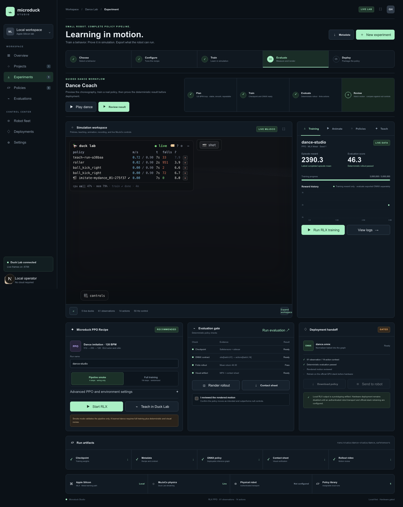
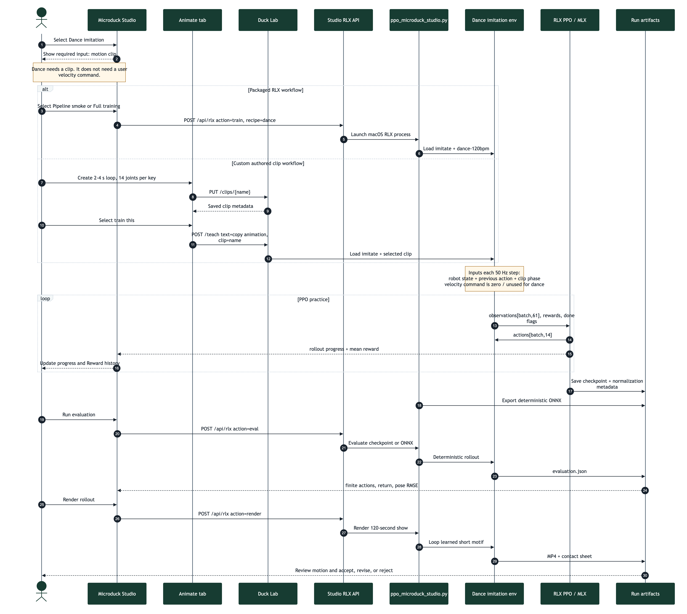
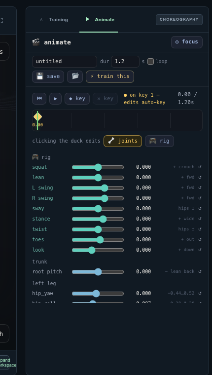
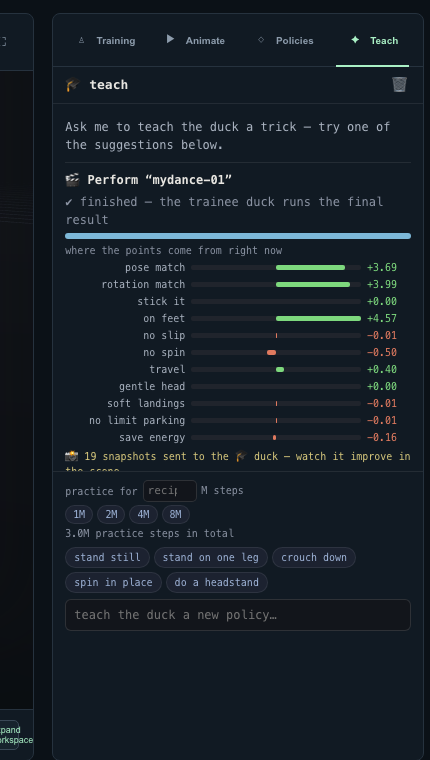
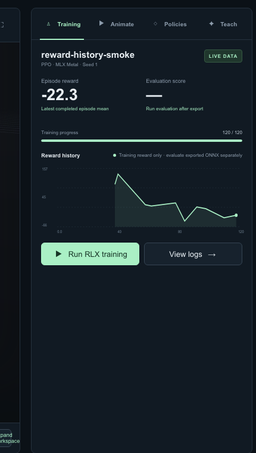
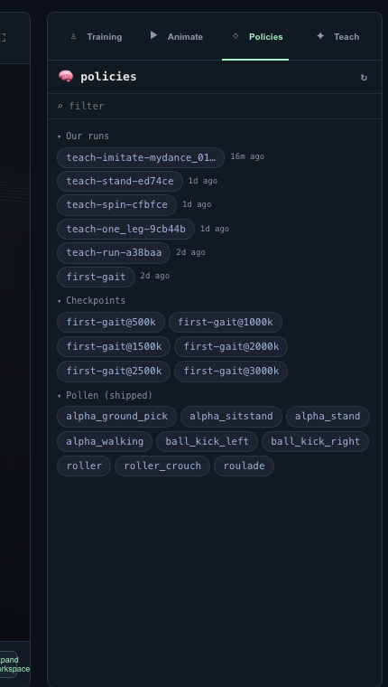

# Start here

Microduck Studio is one browser application for designing motion, training a
policy, watching progress, evaluating the result, and downloading artifacts.
It is intended for local simulation and rapid experimentation.

Open the Studio at:

```text
http://127.0.0.1:63317
```

The normal workspace launcher starts both parts of the application:

```bash
cd /Volumes/ExternalSSD/geoagent/microduck-lab
./restart-lab.sh
```

The services are:

| Service | Address | Purpose |
|---|---|---|
| Microduck Studio | `http://127.0.0.1:63317` | Browser UI, RLX jobs, evaluation, rendering, and downloads |
| Duck Lab | `http://127.0.0.1:8788` | MuJoCo simulation, live poses, clips, policies, and Teach jobs |
| Live stream | `ws://127.0.0.1:8788/ws` | Duck poses, statistics, and training progress |

Wait for the Studio to report a live Duck Lab connection before using
**Animate**, **Policies**, or **Teach**.

> **Safety boundary:** a locally trained policy is simulation evidence. Do not
> treat it as ready for a physical robot without separate compatibility,
> controlled-testing, and safety work. This guide's complete training,
> evaluation, export, and rendering workflow runs through RLX on macOS and does
> not require CUDA.

# The answer first: clip or commands?

For **Dance imitation**, PPO needs a **motion clip**. You do **not** provide a
walking-speed or turning command.

```text
Dance PPO input = robot state + previous action + clip phase
Dance PPO target = poses and timing from the motion clip
Velocity command = unused / zero for this dance recipe
```

The distinction is:

| Guidance type | What it says | Used by Dance? |
|---|---|---|
| Motion clip | “Put these 14 joints near these poses at these times.” | **Yes, required** |
| Velocity command | “Move forward, sideways, or turn at this rate.” | **No** |
| Reward definition | “Match the clip while balancing and avoiding bad contacts.” | **Yes, built into the recipe** |
| PPO settings | “How much and how aggressively to practice.” | **Yes** |

Other recipes differ:

| Recipe | Clip | Velocity command |
|---|---|---|
| Dance | Required | Not required |
| Running | Not required | Required and sampled by the environment |
| Stilt walking | Not required | Required and sampled by the environment |
| Swing | Not required | Not required; mechanism rewards define the goal |

The policy interface still contains command slots because every Microduck
policy preserves the same 61-observation contract. For Dance, clip phase is
placed in reserved body-command slots and irrelevant command values remain
zero. Do not invent forward-speed commands for a dance imitation run.

# Choose the correct dance path

There are two valid paths in the current application:

| Goal | UI path | Clip used | Trainer | Outputs |
|---|---|---|---|---|
| Verify or train the packaged RLX example | **Dance → Training → Start RLX** | Fixed `dance-120bpm` | RLX PPO with MLX | Safetensors, metadata, ONNX, evaluation JSON, MP4, contact sheet |
| Train a clip you authored | **Animate → Save → train this → Teach** | Your saved clip | Duck Lab imitation trainer | Local behavior run and policy artifacts |

The important limitation is that the current **Start RLX** button uses the
packaged `dance-120bpm` clip. Saving a new clip in **Animate** does not silently
replace the RLX recipe's clip. Use **train this** for a custom clip.

# The complete workflow

Use this order:

1. **Play** the reference motion and understand the target.
2. **Animate** a short, clean motion motif.
3. Choose **Start RLX** for the packaged clip or **train this** for a custom
   clip.
4. **Train** with an appropriate PPO practice budget.
5. **Evaluate** the deterministic exported policy.
6. **Render** a video and inspect the actual movement.
7. **Compare** the trained policy with baseline or null behavior.
8. **Iterate** on the motion, reward weights, or curriculum.
9. **Handoff** only the validated ONNX artifact for further official-stack work.

The four tabs beside **Training session** are different views of this same
workflow:

| Tab | Use it for | Main result |
|---|---|---|
| **Training** | Start and monitor the packaged RLX 120 BPM example | Checkpoint, ONNX export, reward history |
| **Animate** | Pose the duck and create a keyframed motion clip | Saved clip in `microduck_local/clips/` |
| **Policies** | Find, assign, compare, and reload policies | A selected policy running on a visible duck |
| **Teach** | Start or monitor behavior training and adjust practice settings | A local behavior run derived from a clip or recipe |



*Figure 1. The full Studio workspace. Training, simulation, evaluation, and
artifacts remain in one application.*

# End-to-end data flow



*Figure 2. End-to-end sequence. The packaged RLX branch loads
`dance-120bpm`; the custom branch saves a clip through Animate and starts
imitation through Teach. Both train from clip timing rather than a velocity
command.*

## Required input data

Before starting a serious run, record:

| Input | Required value or rule | Example |
|---|---|---|
| Recipe | `dance` / imitation | `dance` |
| Clip | Existing saved clip with valid keyframes | `dance-120bpm` |
| Clip keys | Strictly increasing time and exactly 14 joint values per key | Five keys |
| Clip mode | Loop for a repeating dance motif | `loop: true` |
| Run name | Unique, lowercase-safe identifier | `groove-a-seed1` |
| Seed | Integer used for repeatability | `1` |
| PPO timesteps | Practice budget, not video duration | `1,000,000` |
| Parallel environments | Number of simultaneous simulated ducks | `16` |
| Learning rate | PPO optimizer step size | `0.0003` |
| Gamma | Future-reward discount | `0.99` |
| Randomization | Domain, observation, delay, and yaw toggles | On for full training |
| Episode duration | One imitation attempt | `4 seconds` |
| Render duration | Requested final show duration | `120 seconds` |

You do not enter a forward, lateral, or yaw command for Dance.

## Data consumed at each control step

At 50 Hz, the environment constructs one 61-value observation for each
simulated duck. It includes robot state, the previous action, fixed command
slots, and the sine/cosine phase of the clip. PPO returns 14 joint actions.

```text
saved clip
    -> target 14-joint pose for current phase
robot simulation
    -> joint state, velocities, orientation, contacts, previous action
fixed policy contract
    -> observations[batch, 61]
RLX actor
    -> actions[batch, 14]
MuJoCo
    -> next state and reward
```

The reward measures clip-pose agreement and physical execution. It can include
pose matching, rotation timing, upright support, slip, unwanted spin, impacts,
joint-limit use, and motor effort.

## Output data

| Output | Meaning | Typical Studio location |
|---|---|---|
| `dance.safetensors` | RLX actor-critic checkpoint | `rlx/runs/studio/dance/<run>/` |
| `dance.safetensors.json` | Seed, PPO settings, randomization, and recipe metadata | Same run directory |
| `dance.onnx` | Deterministic actor with observation normalization | Same run directory |
| `evaluation.json` | Deterministic returns, finite checks, and pose RMSE | Same run directory |
| `render/ep0.mp4` | Visual rollout, up to the requested 120-second show | Run render directory |
| `render/ep0_sheet.png` | Diagnostic frames and captions | Run render directory |
| Reward history | Mean reward emitted after each PPO rollout | Live Studio process |

# Four ideas to understand first

## Animation is the demonstration

An animation clip says where the joints should be at particular times. It is a
reference, not intelligence. The browser interpolates between keyframes, and
the training environment resamples the saved motion at 50 Hz.

Each clip contains:

```json
{
  "version": 1,
  "name": "my-dance",
  "duration": 4.0,
  "loop": true,
  "keys": [
    {
      "t": 0.0,
      "joints": [0, 0, 0, 0, 0, 0, 0, 0, 0, 0, 0, 0, 0, 0],
      "rootPitch": 0.0
    }
  ]
}
```

A valid clip has 14 joint values per key, begins with a key at `t = 0`, has
strictly increasing key times, and has a duration no longer than 120 seconds.
Joint values are clamped to the robot model's limits when saved.

## A policy is the learned controller

The policy receives 61 observations and produces 14 joint actions on every
control step:

```text
robot state + previous action + clip phase
                 |
                 v
        neural-network policy
                 |
                 v
          14 joint actions
```

The observation layout stays fixed across behaviors. Clip phase uses existing
body-command slots; velocity-command values are unused for Dance. Do not
change the 61-observation or 14-action contract for one dance.

## PPO is practice, not playback

Proximal Policy Optimization, or PPO, repeatedly:

1. lets simulated ducks attempt the movement;
2. scores each attempt with reward terms;
3. adjusts the policy to make useful actions more likely;
4. repeats across many parallel environments.

PPO does not simply memorize the timeline. It must learn to produce movement
while balancing, respecting joint limits, handling delay and noise, and
recovering from imperfect states.

## Duration has four different meanings

| Term | Meaning | Typical value |
|---|---|---|
| Clip duration | Length of the authored motion before it loops or ends | 1 to 4 seconds per motif |
| Episode duration | Length of one simulated training attempt | 4 seconds for imitation |
| Practice budget | Total environment transitions used by PPO | 1M to 3M or more |
| Performance duration | How long the audience watches the dance | 120 seconds in this guide |

These values are not interchangeable. Setting a clip to 120 seconds does not
give PPO a useful two-minute memory.

# First exercise: play the packaged dance

The included `dance-120bpm` clip is a one-second looping motif with five
keyframes.

1. Open the Studio.
2. Select **Play dance** near the top of the page.
3. Confirm that the Studio opens the **Animate** tab.
4. Confirm that the clip name is `dance-120bpm`.
5. Confirm that the duration is `1.00 s` and **loop** is enabled.
6. Watch several cycles.
7. Pause and drag the timeline playhead.
8. Notice how the pose changes between keyframes.

This exercise checks choreography playback only. It does not use a trained
policy and does not prove that the duck can physically reproduce the motion.

# Animate a dance motif

For a first useful dance, create a short loop between two and four seconds.
Short motifs are easier to debug, train, and evaluate than a long sequence.



*Figure 3. The Animate tab. Name the clip, set its duration, place keyframes,
preview the loop, save it, and then select **train this**.*

## Create the clip

1. Select the **Animate** tab.
2. Select **new clip**.
3. Enter a clear clip name such as `groove-a-4s`.
4. Set **dur** to `4.0`.
5. Enable **loop**.
6. Leave the first key at `0.00`. It anchors the clip and cannot be deleted.
7. Move the playhead to `1.00`.
8. Pose the duck with the **rig** controls for coordinated movement, or use
   **joints** for a precise single-servo adjustment.
9. Select **key** to store the pose.
10. Repeat at `2.00`, `3.00`, and `4.00`.
11. At `4.00`, return close to the starting pose so the loop has no visible
    jump.
12. Select **Play** and inspect several loops.
13. Select **Save**.

Use **Shift** while dragging for fine adjustment. Keep both feet near plausible
support positions and avoid abrupt full-range joint changes between neighboring
keys.

## Starter four-second motif

Use this movement plan rather than copying exact angles blindly:

| Time | Pose intention | What to adjust |
|---:|---|---|
| 0.00 s | Neutral standing anchor | Balanced hips, modest knee bend |
| 1.00 s | Sway left | Small trunk lean, left knee compression, right-side extension |
| 2.00 s | Center and dip | Symmetric squat, head level, feet planted |
| 3.00 s | Sway right | Mirror the one-second pose |
| 4.00 s | Return to anchor | Match the first pose closely |

Prefer broad, readable movement over extreme angles. The first objective is a
stable rhythm that the simulated robot can physically reach.

## Animation checklist

Before training, verify:

- The first key is at `0.00`.
- Key times increase from left to right.
- The final pose blends into the first pose when looping.
- The duck does not begin inside the floor.
- No limb snaps violently between adjacent keys.
- The motion is visible in the simulation, not only in the sliders.
- The clip is saved and appears in the saved-clips browser.

# Teach the saved animation

The most direct path from a custom animation to training is the
**train this** button in **Animate**.



*Figure 4. The Teach tab explains the current behavior, displays reward-term
contributions, and controls the next practice budget.*

1. Save the clip.
2. Select **train this**.
3. The Studio sends the clip name to Duck Lab with the instruction
   `copy the animation`.
4. Open the **Teach** tab.
5. Confirm that the Teach view identifies the imitation behavior and the
   expected practice budget.
6. Start with the recipe's default reward weights.
7. Choose the practice budget.
8. Start the Teach job and leave the Studio open to observe progress.

The request sent to Duck Lab is conceptually:

```json
{
  "text": "copy the animation",
  "clip": "groove-a-4s",
  "steps": 3000000
}
```

The `steps` field is the total PPO practice budget. It is not dance duration.
If you omit it, Duck Lab uses the last saved choice for that behavior or the
recipe default.

## Practice budget

Use these values as decision points, not guarantees:

| Budget | Purpose |
|---:|---|
| 100,000 steps | Fast integration check; usually not a finished dance |
| 1,000,000 steps | First serious comparison run |
| 3,000,000 steps | Current imitation recipe default and a stronger candidate |
| More than 3,000,000 | Use only after evaluation shows continued improvement |

Change one thing at a time. If a three-million-step run fails badly, increasing
the budget without inspecting the motion and rewards may only make the same
failure more expensive.

## Reward controls

The imitation behavior combines terms for:

- matching the target pose;
- matching rotation timing;
- remaining on both feet for looping clips;
- completing and landing non-looping motions;
- avoiding foot slip;
- avoiding unwanted spin;
- avoiding head impacts and hard landings;
- avoiding joint-limit parking;
- reducing unnecessary motor effort.

Begin with the default weights. Change a weight only when the rendered behavior
shows a specific failure that the corresponding term measures.

Examples:

| Observed failure | First investigation |
|---|---|
| Pose resembles the dance but the duck falls | Increase attention to `on_feet`, inspect whether the authored pose is physically reachable |
| Feet skate while the upper body looks correct | Inspect and cautiously raise `no_slip` |
| Duck spins instead of swaying | Inspect and cautiously raise `no_spin` |
| Duck stays upright but barely moves | Check whether pose matching is strong enough and whether the clip contains visible differences |
| Joints remain at their extremes | Inspect `no_limit_parking` and reduce extreme authored poses |
| Reward rises but motion looks wrong | Do not tune from the curve alone; render and inspect term-level behavior |

# Use the Training tab

The **Training** tab is the status surface. It can show:

- current run name;
- PPO, MLX, and seed;
- latest rollout or completed-episode reward;
- deterministic evaluation score;
- training progress;
- reward history;
- live logs;
- start or stop controls.

## Reward history

The Reward history chart updates from the active RLX job or the active Duck Lab
Teach job. RLX emits a mean reward after every PPO rollout, so the chart can
advance before a four-second episode completes. A short delay before the first
rollout is normal.



*Figure 5. Reward history is live training telemetry. It is useful for
diagnosis, but it is not a visual-quality or deployment verdict.*

Read it as a diagnostic:

- A rising trend suggests that PPO is improving the reward definition.
- A flat trend can indicate insufficient exploration, an impossible target, or
  a poor reward signal.
- A sudden collapse can indicate unstable updates or a changed training stage.
- A high value does not prove that the motion looks good.

When the run name changes, the Studio starts a separate history for the new
run. Always pair the chart with deterministic evaluation and rendered motion.

## The two training buttons

The Studio exposes two related paths:

| Control | What it trains |
|---|---|
| **Run RLX training** or **Start RLX** | The packaged `dance-120bpm` example through the Studio `/api/rlx` service |
| **Teach in Duck Lab** or **train this** | A Duck Lab behavior, including a custom saved clip |

Use **Run RLX training** when learning the supplied example or verifying the
end-to-end RLX pipeline. Use **train this** for the animation you authored.

## Smoke versus full training

**Pipeline smoke** uses two environments, four total timesteps, and disables
randomization. It checks that the process can start, save a checkpoint, export
ONNX, and pass data through the interfaces. It cannot learn a dance.

**Full training** starts with:

| Setting | Studio default |
|---|---:|
| Total timesteps | 1,000,000 |
| Parallel environments | 16 |
| Learning rate | 0.0003 |
| Gamma | 0.99 |
| Rollout steps | 24 |
| Minibatches | 4 |
| Update epochs | 5 |
| Episode duration | 4 seconds |
| Domain randomization | On |
| Observation noise | On |
| Action delay | On |
| Random yaw | On |

The notebook contains an earlier full-run example using learning rate `0.001`.
The current Studio and command default are `0.0003`. For reproducible Studio
runs, record the value shown in the UI and do not assume the notebook value.

# Use the Policies tab

The **Policies** tab is the library of:

- local completed runs;
- checkpoints and exported policies;
- shipped Pollen policies.



*Figure 6. Use Policies to locate local runs, checkpoints, and shipped
baselines before assigning or comparing them.*

Use it to:

1. find the run by name;
2. assign it to the visible duck;
3. spawn a comparison duck with another policy;
4. load a local run back into Teach for fine-tuning;
5. download an owned local export;
6. delete a local run only when its artifacts are no longer needed.

For a fair visual comparison:

1. Put the candidate policy and baseline on separate ducks.
2. Reset the simulations together.
3. Use the same clip, command, seed, and observation period.
4. Watch several complete cycles.
5. Record falls, drift, unwanted spin, foot slip, and timing.

# Evaluate and render

Evaluation must answer two different questions:

1. **Does the policy execute correctly?**
2. **Does the motion look like the intended dance?**

The first is numerical. The second requires visual review.

## Deterministic evaluation

After a checkpoint exists:

1. Select **Run evaluation**.
2. Confirm that the checkpoint is present.
3. Confirm that the exported ONNX contract is
   `obs[batch,61] -> actions[batch,14]`.
4. Check that actions and returns are finite.
5. Record the mean return, seed, clip, and settings.

A passing finite rollout proves that the policy can be executed under the
tested conditions. It does not prove dance quality.

## Rendered review

1. Select **Render rollout**.
2. Download or open the contact sheet.
3. Review the MP4 from beginning to end.
4. Compare the motion with the authored clip.
5. Confirm that the duck remains upright when the choreography requires it.
6. Check feet, head clearance, joint extremes, spin, and drift.
7. Check **I reviewed the rendered motion** only after this inspection.

Reject the run if it earns reward while standing still, falling into a
rewarding pose, sliding, spinning, or exploiting contact behavior.

## Minimum acceptance record

Record this for every candidate:

| Field | Example |
|---|---|
| Run | `groove-a-v3` |
| Clip | `groove-a-4s` |
| Seed | `1` |
| Timesteps | `3,000,000` |
| Reward weights changed | None |
| Evaluation mean return | Measured value |
| Falls or terminations | Measured value |
| Visual verdict | Pass, revise, or reject |
| Main defect | For example, right foot slides after 2.5 s |
| Artifact paths | Checkpoint, ONNX, MP4, contact sheet |

# Make a two-minute dance

## What works today

The current clip API accepts a duration up to 120 seconds, but the present
imitation setup is not a reliable way to learn one unique 120-second sequence:

- gamma `0.99` gives PPO an effective credit horizon of roughly two seconds;
- the default imitation episode is four seconds;
- the current flow does not prove random starts across every phase of a
  two-minute clip;
- later sections may receive little or no useful on-policy practice.

Therefore, do not create a 120-second clip, train one million steps, and assume
the full choreography was learned.

The reliable current option is a short learned motif that loops for two
minutes. A four-second motif repeated 30 times gives a 120-second performance.
The native viewer can keep running and resetting until you stop it.

## Recommended two-minute production plan

For a more varied show, design and validate short sections separately:

| Section | Show time | Motif length | Repetitions |
|---|---:|---:|---:|
| Intro bounce | 8 s | 2 s | 4 |
| Groove A | 24 s | 4 s | 6 |
| Groove B | 24 s | 4 s | 6 |
| Turn and crouch | 16 s | 4 s | 4 |
| Groove A return | 24 s | 4 s | 6 |
| Finale | 24 s | 4 s | 6 |
| **Total** | **120 s** |  |  |

Use this as a design and training plan:

1. Create six named clips: `intro`, `groove-a`, `groove-b`,
   `turn-crouch`, `groove-a-return`, and `finale`.
2. Keep each training target between two and four seconds.
3. Train and evaluate each motif as its own policy candidate.
4. Reject or revise weak motifs before building the show.
5. Keep the same 61-observation and 14-action contract for every policy.
6. Record the selected run name for each section.
7. Use repeated playback for a two-minute single-motif demonstration today.
8. Treat automatic multi-policy sequencing as a deployment/orchestration
   feature that is not yet implemented in the current Studio.

This distinction matters: the table defines a two-minute choreography plan,
but the current Studio does not yet provide a playlist that automatically
switches among six learned policies on exact musical boundaries.

## Suggested training schedule

| Pass | Goal | Suggested action |
|---|---|---|
| 1 | Verify plumbing | Run smoke training for the packaged sample |
| 2 | Prove one motif can be learned | Train `groove-a` for 1M steps |
| 3 | Improve the motif | Inspect render, change one cause, train 1M to 3M steps |
| 4 | Build a motif library | Repeat for the other short sections |
| 5 | Robustness | Enable randomization and compare fixed seeds |
| 6 | Show assembly | Loop one approved motif or add a future sequencer |
| 7 | Hardware candidate review | Preserve the winning recipe and complete separate compatibility and safety validation |

# Improve a weak dance

Use an evidence-driven loop:

```text
observe defect
    -> identify whether the clip, reward, physics, or training is responsible
    -> change one variable
    -> train a new named run
    -> evaluate deterministically
    -> render and compare
    -> keep or reject
```

## Diagnose by symptom

| Symptom | Likely area | Next action |
|---|---|---|
| Duck cannot reach the authored pose | Animation | Reduce joint extremes and increase transition time |
| Duck never reaches a late movement | Curriculum or episode coverage | Shorten the motif or add phase-aware reset/curriculum support in code |
| Reward increases while duck barely dances | Reward design | Inspect individual terms and strengthen behavior-specific evidence |
| Duck dances only without noise | Robustness | Re-enable randomization one source at a time |
| Good first cycle, poor loop boundary | Animation | Make the last key closely match the first |
| Stable but off beat | Clip timing | Retune key times and rotation timing |
| Falls after a specific pose | Physics and support | Review center of mass, feet, knee bend, and landing speed |
| Training chart is empty | Telemetry timing | Wait for the first PPO rollout, then confirm active run and logs |
| Training chart belongs to another run | Run selection | Check the run name; each run owns separate history |

If rollouts never visit the movement you are rewarding, increasing its reward
weight is usually insufficient. Change the starting-state distribution,
curriculum, or clip segmentation so PPO actually practices the state.

# How the UI maps to the services

## Studio RLX service

The browser route `POST /api/rlx` accepts:

```json
{
  "action": "train",
  "recipe": {
    "runName": "dance-studio",
    "profile": "full",
    "totalTimesteps": 1000000,
    "numEnvs": 16,
    "seed": 1,
    "learningRate": 0.0003,
    "gamma": 0.99,
    "domainRand": true,
    "obsNoise": true,
    "actionDelay": true,
    "randomYaw": true
  }
}
```

Supported actions are `train`, `eval`, `render`, and `cancel`.

The route starts:

```text
rlx/examples/ppo_microduck_studio.py train --recipe dance
```

That example is intentionally fixed to the packaged `dance-120bpm` clip and
the `imitate` behavior. Training creates a safetensors checkpoint, metadata,
and normally an ONNX export. Evaluation and rendering use the ONNX file when
it exists.

Read status:

```http
GET /api/rlx?experiment=dance&run=dance-studio
```

Download known artifacts:

```http
GET /api/rlx/artifact?experiment=dance&run=dance-studio&kind=onnx
GET /api/rlx/artifact?experiment=dance&run=dance-studio&kind=video
GET /api/rlx/artifact?experiment=dance&run=dance-studio&kind=sheet
```

The Studio API restricts run names and artifact kinds. It does not accept an
arbitrary shell command.

## Duck Lab clip and Teach service

Use Duck Lab for custom authored clips:

```http
GET    http://127.0.0.1:8788/clips
GET    http://127.0.0.1:8788/clips/{name}
PUT    http://127.0.0.1:8788/clips/{name}
DELETE http://127.0.0.1:8788/clips/{name}
POST   http://127.0.0.1:8788/pose
POST   http://127.0.0.1:8788/teach
POST   http://127.0.0.1:8788/teach/load
POST   http://127.0.0.1:8788/teach/weights
POST   http://127.0.0.1:8788/teach/stop
POST   http://127.0.0.1:8788/teach/clear
```

A custom imitation request can include:

```json
{
  "text": "copy the animation",
  "clip": "groove-a-4s",
  "steps": 3000000,
  "weights": {
    "pose_match": 4.0,
    "on_feet": 5.0
  },
  "initFrom": "groove-a-v2"
}
```

Use `initFrom` only when intentionally fine-tuning a compatible local run.
Per-stage `stageWeights`, `stageSteps`, and `startStage` apply to staged
behavior recipes; they are not required for a normal single-clip imitation.

# Command-line equivalent

The UI is the preferred beginner path. For diagnosis or automation, the fixed
RLX example supports:

```text
train -> eval -> export -> view -> render
```

From `rlx/`, define the verified Python 3.12 overlay:

```bash
dance_uv() {
  env -u VIRTUAL_ENV UV_PYTHON_PREFERENCE=only-system \
    uv run --isolated --no-project \
    --python /usr/local/bin/python3.12 \
    --with-editable . \
    --with-editable ../microduck_local "$@"
}
```

Train the packaged sample:

```bash
dance_uv examples/ppo_microduck_studio.py train \
  --recipe dance \
  --checkpoint runs/studio/dance/dance-studio/dance.safetensors \
  --onnx-output runs/studio/dance/dance-studio/dance.onnx \
  --total-timesteps 1000000 \
  --num-envs 16 \
  --num-steps 24 \
  --num-minibatches 4 \
  --update-epochs 5 \
  --gamma 0.99 \
  --learning-rate 0.0003 \
  --seed 1
```

Evaluate:

```bash
dance_uv examples/ppo_microduck_studio.py eval \
  --recipe dance \
  --policy runs/studio/dance/dance-studio/dance.onnx \
  --num-envs 16 \
  --eval-steps 500 \
  --max-episode-s 4
```

Render:

```bash
dance_uv examples/ppo_microduck_studio.py render \
  --recipe dance \
  --policy runs/studio/dance/dance-studio/dance.onnx \
  --output runs/studio/dance/dance-studio/render \
  --episodes 1 \
  --max-episode-s 4 \
  --render-seconds 120 \
  --camera three-quarter
```

# Deployment handoff

The Studio unlocks the artifact handoff only after:

- a checkpoint exists;
- ONNX export exists;
- deterministic evaluation passes;
- a render exists;
- a person confirms visual review.

The ONNX export includes observation normalization and preserves the
61-observation to 14-action interface. This makes it suitable as a local
handoff artifact, not as automatic permission to operate hardware.

For physical deployment:

1. preserve the observation ordering, action ordering, units, and control rate;
2. preserve the clip, reward settings, model metadata, and evaluation evidence;
3. repeat deterministic and rendered evaluation under the intended actuator
   and randomization settings;
4. run compatibility and safety checks;
5. test on hardware only in a controlled environment.

# Beginner run sheet

Use this checklist for your first serious dance:

- [ ] Studio and Duck Lab show connected.
- [ ] Packaged dance plays in Animate.
- [ ] New clip is two to four seconds long.
- [ ] First and last poses form a clean loop.
- [ ] Clip is saved.
- [ ] **train this** starts a Teach imitation job.
- [ ] Run has a unique name.
- [ ] Practice budget is at least one million steps for the first serious run.
- [ ] Reward history receives rollout points while training is active.
- [ ] Logs contain no worker or environment errors.
- [ ] Deterministic evaluation completes with finite output.
- [ ] ONNX shape is 61 observations to 14 actions.
- [ ] MP4 and contact sheet exist.
- [ ] Motion was visually reviewed from beginning to end.
- [ ] Candidate was compared with a baseline or null control.
- [ ] Failures and settings were recorded.
- [ ] Two-minute presentation is produced by a validated loop, not an
      unverified 120-second policy target.
- [ ] Hardware deployment remains blocked until official-stack retraining and
      safety validation.

# Troubleshooting

## Studio says Duck Lab is offline

Run `./restart-lab.sh`, confirm port `8788` is available, then reload the
Studio. Animate, Policies, and Teach depend on Duck Lab.

## Play dance opens Animate but nothing moves

Confirm the clip name is `dance-120bpm`, the play button shows pause, the
timeline advances, and the live simulation is connected. Reset the simulation
if the policy or pose state is stale.

## Train this says the clip does not exist

Save the clip first. Training receives a clip name and the backend loads the
corresponding file from the clips directory.

## Reward history stays empty

Check that training is active, the selected run name is correct, and the log is
still advancing. The RLX chart waits for the first completed PPO rollout;
custom Teach telemetry may also include completed-episode points.

## Reward is high but the dance is poor

This is a failed policy candidate. Render it, identify the exploit or missing
motion, revise one cause, and train a new named run.

## A two-minute clip learns only its beginning

Shorten it to two-to-four-second motifs. The current four-second episode and
PPO credit horizon do not provide reliable coverage of a unique 120-second
sequence.

## Render fails on macOS

Use the framework-linked Python 3.12 configured by
`MICRODUCK_STUDIO_PYTHON`. For native viewing, use `mjpython`. Offscreen
rendering also requires a working MuJoCo graphics backend and FFmpeg support.

# Source of truth

This guide is based on the current repository implementation:

- `DESIGN.md`
- `duck-viewer/STUDIO.md`
- `duck-viewer/components/Studio.tsx`
- `duck-viewer/components/AnimPanel.tsx`
- `duck-viewer/components/PolicyPanel.tsx`
- `duck-viewer/components/TeachPanel.tsx`
- `duck-viewer/app/api/rlx/route.ts`
- `duck-viewer/lib/rlx-job.ts`
- `microduck_local/AGENTS.md`
- `microduck_local/src/microduck_local/motion.py`
- `microduck_local/src/microduck_local/viz_server.py`
- `microduck_local/src/microduck_local/behaviors/core.py`
- `microduck_local/src/microduck_local/behaviors/imitate.py`
- `rlx/assets/clips/dance-120bpm.json`
- `rlx/examples/ppo_microduck_studio.py`
- `rlx/docs/ppo-microduck-dance-guide.md`
- `rlx/docs/ppo_microduck_dance_notebook.ipynb`
- `rlx/mylab.md`
