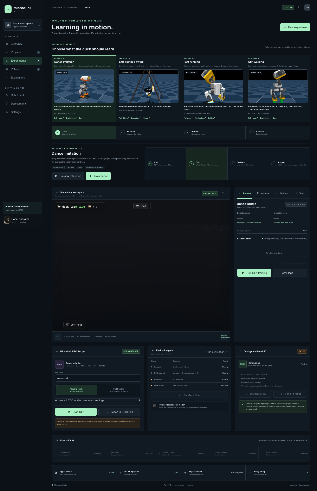
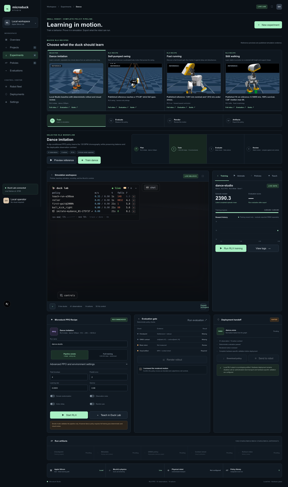
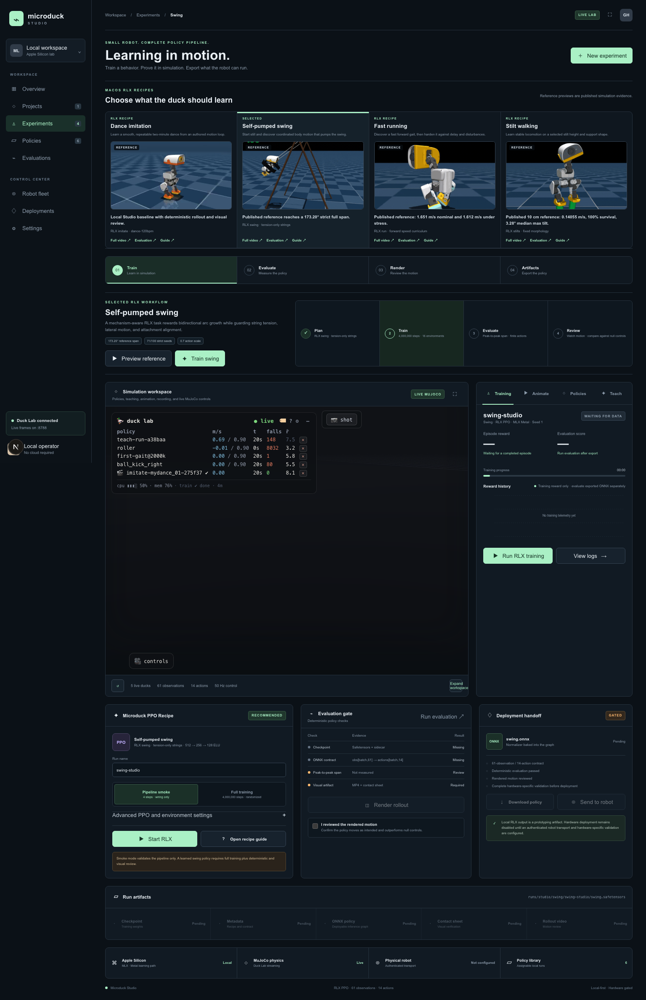
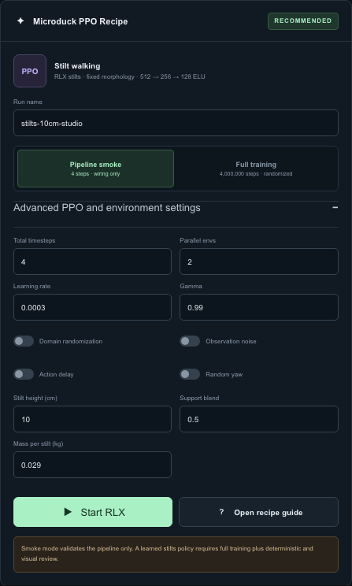

# Start here

Microduck Studio provides one local workflow for four reinforcement-learning
experiments:

1. **Dance imitation**
2. **Self-pumped swing**
3. **Fast running**
4. **Stilt walking**

All four Studio recipes run locally on macOS through RLX PPO. MuJoCo performs
the simulation on the CPU, and RLX performs PPO updates with MLX on Apple
Silicon. **This Studio path does not require CUDA.**

Open the Studio at:

```text
http://127.0.0.1:63317
```

Start the workspace from the repository root:

```bash
cd /Volumes/ExternalSSD/geoagent/microduck-lab
./restart-lab.sh
```

The launcher starts:

| Service | Address | Purpose |
|---|---|---|
| Microduck Studio | `http://127.0.0.1:63317` | Experiment selection, RLX jobs, evaluation, rendering, and artifacts |
| Duck Lab | `http://127.0.0.1:8788` | Live MuJoCo scene, policy playback, animation, and Teach workflows |
| Live stream | `ws://127.0.0.1:8788/ws` | Poses, simulation statistics, and Duck Lab training progress |

Wait for the Studio connection indicator before relying on the embedded
simulation, **Animate**, **Policies**, or **Teach**. The four RLX recipe jobs
run through the Studio's local `/api/rlx` service.

> **Simulation boundary:** Studio output is local prototyping evidence. It is
> not proof that a policy is safe for a physical robot. Hardware work requires
> a separate compatibility, controlled-testing, and safety process. All four
> workflows in this guide use RLX on macOS.

# Reference evidence and your run are different

The experiment catalog contains published preview media and published
evaluation records. Those assets are labeled **REFERENCE** in the Studio.
They do not update when you train a new policy.

Your own run produces a separate checkpoint, metadata sidecar, ONNX policy,
evaluation record, MP4, and contact sheet under `rlx/runs/studio/`. Treat these
as **LATEST RUN** evidence.

| Label | What it means | What it does not mean |
|---|---|---|
| **REFERENCE** | Bundled media or JSON produced by a previously published experiment | Your current settings reproduced the result |
| **LATEST RUN** | Artifacts and measurements from the run name currently selected in Studio | The result matches the reference or is hardware-ready |
| **Pipeline smoke** | The command path, environment, checkpoint, export, and evaluator can execute | PPO learned the requested behavior |
| **Full training** | The recipe used its normal Studio budget and randomized settings | The resulting motion is good without evaluation and visual review |

Never copy a reference number into the record for a newly trained run. Record
only values found in that run's own `evaluation.json` and rendered output.



*Figure 1. Select one recipe at a time. Preview and evaluation links in the
catalog show published reference evidence, not the latest local run.*

# What all four recipes share

Every Studio recipe preserves the same policy interface:

```text
observations[batch, 61] -> deterministic actor -> actions[batch, 14]
```

The control loop runs at 50 Hz. The actor and critic each use a
`512 -> 256 -> 128` ELU multilayer perceptron. Training saves an MLX
actor-critic checkpoint plus observation-normalization statistics. ONNX export
bakes that normalizer into the deterministic actor graph.

The shared workflow is:

```text
choose recipe
    -> configure a named run
    -> run pipeline smoke
    -> run full training
    -> inspect reward history
    -> evaluate deterministically
    -> render MP4 and contact sheet
    -> review motion
    -> download artifacts
    -> change one cause and repeat
```

The Studio exposes the same four lifecycle stages for each experiment:

| Stage | Required result |
|---|---|
| **Train** | Safetensors checkpoint, metadata sidecar, and normally an ONNX export |
| **Evaluate** | Deterministic rollout JSON with finite observations, rewards, and actions |
| **Render** | One MP4 and one diagnostic contact sheet |
| **Artifacts** | Downloadable files tied to the selected experiment and run name |

# Set up the macOS RLX environment

## Prerequisites

The documented Studio path expects:

- macOS on Apple Silicon;
- `uv`;
- a framework-linked Python 3.12 at `/usr/local/bin/python3.12`, unless
  `MICRODUCK_STUDIO_PYTHON` points to another compatible interpreter;
- the local `rlx/` and `microduck_local/` checkouts in this workspace;
- access to the Microduck MJCF model referenced by `microduck_local`;
- Node.js and npm for the Studio;
- ImageIO's FFmpeg support for MP4 rendering.

No CUDA installation, CUDA device, or remote training service is used by this
workflow.

## Install the workspace

From the workspace root:

```bash
cd /Volumes/ExternalSSD/geoagent/microduck-lab
cd microduck_local && uv sync
cd ../duck-viewer && npm install
cd ..
```

If the Microduck model checkout is not at its default location, set:

```bash
export MICRODUCK_RL_DIR=/absolute/path/to/microduck_rl
```

The normal launcher handles the Duck Lab and Studio processes:

```bash
./restart-lab.sh
```

## Verify the RLX command surface

The Studio invokes `rlx/examples/ppo_microduck_studio.py` in an isolated
Python 3.12 overlay. For command-line diagnosis, define the same type of
helper from the `rlx/` directory:

```bash
cd /Volumes/ExternalSSD/geoagent/microduck-lab/rlx

studio_uv() {
  env -u VIRTUAL_ENV UV_PYTHON_PREFERENCE=only-system \
    uv run --isolated --no-project \
    --python /usr/local/bin/python3.12 \
    --with-editable . \
    --with-editable ../microduck_local "$@"
}
```

Confirm the four commands and four recipes:

```bash
studio_uv examples/ppo_microduck_studio.py --help
studio_uv examples/ppo_microduck_studio.py train --help
```

The command groups are `train`, `eval`, `render`, and `export`. The accepted
recipes are `dance`, `running`, `stilts`, and `swing`.

# Choose and configure an experiment

1. Open **Experiments**.
2. Select the desired row in the four-recipe catalog.
3. Select **Preview reference** to inspect the published motion.
4. Scroll to **Microduck PPO Recipe**.
5. Give the run a unique name.
6. Run **Pipeline smoke** first.
7. Switch to **Full training** only after the smoke path succeeds.

Selecting another experiment resets the recipe form to that experiment's
defaults and clears the local visual-review checkbox.

## Shared Studio controls

| Control | Smoke default | Full default | Accepted range or behavior |
|---|---:|---:|---|
| Run name | Recipe default | Recipe default | Letters, numbers, `_`, and `-`; sanitized to lowercase; maximum 48 characters |
| Total timesteps | 4 | Recipe-specific | 4 to 40,000,000 in the UI; server rounds up to a full rollout batch |
| Parallel envs | 2 | 16 | 1 to 64 |
| Seed | 1 | 1 | Positive integer, maximum 2,147,483,647 |
| Learning rate | 0.0003 | 0.0003 | 0.000001 to 0.1 |
| Gamma | 0.99 | 0.99 | 0.8 to 1.0 |
| Domain randomization | Off | On | Disabled automatically in smoke mode |
| Observation noise | Off | On | Disabled automatically in smoke mode |
| Action delay | Off | On | Disabled automatically in smoke mode |
| Random yaw | Off | On | Disabled automatically in smoke mode; the swing environment forces it off |

The Studio fixes additional PPO values:

| PPO setting | Pipeline smoke | Full training |
|---|---:|---:|
| Rollout steps per environment | 2 | 24 |
| Minibatches | 1 | 4 |
| Update epochs | 1 | 5 |
| GAE lambda | 0.95 | 0.95 |
| PPO clip coefficient | 0.2 | 0.2 |
| Entropy coefficient | 0.01 | 0.01 |
| Value coefficient | 1.0 | 1.0 |
| Maximum gradient norm | 0.5 | 0.5 |
| Advantage normalization | On | On |
| Clipped value loss | On | On |

The server rounds `totalTimesteps` to a multiple of:

```text
parallel environments * rollout steps
```

For example, full training with 16 environments and 24 rollout steps advances
in batches of 384 transitions.

## Recipe defaults

| Recipe | Default run name | Studio full budget | Environments | Catalog evaluation metric |
|---|---|---:|---:|---|
| Dance imitation | `dance-studio` | 1,000,000 | 16 | Mean return |
| Self-pumped swing | `swing-studio` | 4,000,000 | 16 | Peak-to-peak span |
| Fast running | `running-studio` | 4,000,000 | 16 | Forward speed |
| Stilt walking | `stilts-10cm-studio` | 4,000,000 | 16 | Forward speed |

## Episode and show duration

The recipe registry uses natural full-training horizons of 4 seconds for
dance, 24 seconds for swing, 12 seconds for running, and 10 seconds for
stilts. Smoke mode uses one-second episodes only to verify wiring.

Dance rendering is separate from its training horizon: the Studio asks the
renderer for a 120-second show and loops the learned four-second motif. Swing,
running, and stilts render their natural recipe horizon by default.

This distinction matters most for swing, whose published reference evaluation
used 36-second rollouts, and for running and stilts, whose published evaluations
used 10-second rollouts. Match evaluation duration and morphology before
comparing directly with those published values.

# Pipeline smoke versus full training

## Pipeline smoke

Use smoke mode to prove:

- the selected environment can be created;
- the 61-observation and 14-action shapes are valid;
- PPO can collect one tiny rollout and update once;
- checkpoint serialization works;
- ONNX export works;
- deterministic evaluation and rendering can load the artifact.

Smoke mode uses two environments, two rollout steps, one minibatch, one update
epoch, and four total transitions. It disables all four randomization toggles.

> A four-transition policy has not learned to dance, pump a swing, run, or
> walk on stilts. Label its output **SMOKE**, not **TRAINED**.

## Full training

Full training uses 16 environments, 24 rollout steps, four minibatches, five
update epochs, and the recipe budget shown in the catalog. Randomization,
observation noise, action delay, and random yaw are enabled by default.

Select **Full training** and then **Start RLX** or **Run RLX training**. The
experiment coach's **Train dance**, **Train swing**, **Train running**, or
**Train stilts** button also switches to the full recommended settings before
starting.

Training completion proves that PPO finished and artifacts were written. It
does not prove that the behavior is useful.



*Figure 2. Reward history describes training. Deterministic evaluation and
render review provide separate evidence after the checkpoint exists.*

# Read reward history correctly

The chart plots mean completed-episode reward reported by the active RLX job.
It can remain empty until at least one episode finishes. With a four-second
episode at 50 Hz, an environment needs roughly 200 control steps to complete
an episode unless it terminates early.

Use reward history to answer:

- Is the policy improving against this recipe's reward?
- Did learning plateau?
- Did a later update collapse?
- Did a settings change alter the learning curve?

Do not use reward history to answer:

- Does the motion look correct?
- Is the duck moving rather than exploiting the reward?
- Does a swing pass the strict geometry gates?
- Is running speed comparable with the published reference under the same
  duration and stress settings?
- Is the policy ready for hardware?

The chart updates after every PPO rollout, so long dance, swing, running, and
stilt episodes do not have to finish before reward history appears. Completed
episodes can add additional points. The chart stores at most 240 points in the
current Studio process. Starting a
new training operation clears the active RLX chart for that run. Keep the
metadata, evaluation JSON, and rendered files as the durable evidence.

# Dance imitation

## What the recipe learns

The dance recipe always selects the `imitate` behavior and the packaged
`dance-120bpm` clip. The clip is a one-second, five-keyframe loop at 120 BPM.
PPO must match the authored joint pose and body rotation while preserving
balance, usable contact, and motion.

The recipe's numerical task metric is:

```text
pose_rmse_rad
```

Lower pose root-mean-square error is better, but the current Studio evaluation
card uses mean return as its top-level dance score. Visual review remains
required.

## Exact dance reward recipe

| Term | Weight | Purpose |
|---|---:|---|
| `pose_match` | 4.0 | Match the reference joint pose at the current phase |
| `rotation_match` | 4.0 | Match reference body-rotation timing |
| `stick_it` | 5.0 | End a one-shot clip standing on both feet |
| `on_feet` | 5.0 | Stay upright at standing height with foot contact for looping clips |
| `no_slip` | 0.5 penalty | Prevent planted feet from skating |
| `no_spin` | 0.3 penalty | Prevent unwanted yaw |
| `travel` | 3.0 | Reward forward movement for looping gait-like clips |
| `gentle_head` | 1.0 penalty | Penalize head-floor impacts |
| `soft_landings` | 0.75 penalty | Penalize hard landings |
| `no_limit_parking` | 1.0 penalty | Penalize joints parked at limits |
| `save_energy` | 0.5 penalty | Penalize unnecessary motor effort |

The Studio's RLX recipe form does not expose reward-weight sliders. The CLI
supports `--weight-overrides` for controlled experiments, but beginners should
first establish a valid baseline with the defaults.

## Dance controls and first run

Use:

| Control | Recommended first full value |
|---|---:|
| Run name | A unique name such as `dance-baseline-01` |
| Total timesteps | 1,000,000 |
| Parallel envs | 16 |
| Seed | 1 |
| Learning rate | 0.0003 |
| Gamma | 0.99 |
| All four randomization toggles | On |

Select **Preview reference** to open **Animate** and play the packaged clip.
This is choreography playback, not a trained policy.

To train a custom authored clip, use **Animate** -> **train this** and the Duck
Lab Teach path. The four-recipe RLX Studio command remains fixed to
`dance-120bpm`.

## Published dance reference

The bundled catalog includes a reference preview, but its bundled
`evaluation.json` is a pipeline-smoke record:

| Published field | Bundled value |
|---|---:|
| Evaluation environments | 2 |
| Evaluation steps | 4 |
| Total transitions | 8 |
| Completed episodes | 0 |
| Mean rollout return | 46.30493378639221 |
| Finite | `true` |
| Passed | `true` |

This record proves finite smoke execution only. It is not a published
full-training dance-quality benchmark and must not be used as the expected
score for a new dance run.

## Two-minute dance strategy

Do not train one unique 120-second target and assume PPO learned the whole
performance. The practical strategy is to train a short, clean motif and
repeat it.

A four-second loop repeated 30 times produces a two-minute performance:

```text
4 seconds * 30 repetitions = 120 seconds
```

For more variety, design several two-to-four-second motifs:

| Section | Performance time | Motif | Repetitions |
|---|---:|---:|---:|
| Intro | 8 s | 2 s | 4 |
| Groove A | 24 s | 4 s | 6 |
| Groove B | 24 s | 4 s | 6 |
| Turn or crouch | 16 s | 4 s | 4 |
| Groove A return | 24 s | 4 s | 6 |
| Finale | 24 s | 4 s | 6 |
| **Total** | **120 s** |  |  |

Train and approve each motif separately. The current Studio does not provide a
playlist that switches learned policies automatically on musical boundaries.
A single approved loop can be shown for two minutes today; a multi-policy show
requires separate orchestration.

## Iterate on dance

| Rendered symptom | First change to investigate |
|---|---|
| Pose matches while the duck lies down | Increase physical plausibility of the clip; inspect `on_feet` behavior |
| Feet slide through the cycle | Reduce abrupt keyframe travel; test a cautious `no_slip` increase |
| Duck turns instead of dancing in place | Inspect `no_spin` and asymmetric authored poses |
| Duck barely moves | Confirm visible pose differences and pose-phase coverage |
| Loop jumps at its boundary | Make the final pose closely match the first pose |
| Late choreography never appears | Shorten or segment the clip; current episodes do not cover a unique two-minute sequence |

# Self-pumped swing

## What the recipe learns

The swing recipe starts the robot seated and motionless in a retained swing.
The policy must discover coordinated body movement that increases the swing
arc in both directions without violating the mechanism geometry.

The environment uses:

- two tension-only strings;
- a nominal string length of 0.38 m;
- a tendon limit of 0.395 m;
- fixed zero locomotion, head, and body commands;
- no fall or height termination;
- a fixed seated-pose action transform;
- **0.7 action scale** around the seated pose;
- random yaw forced off inside the environment.



*Figure 3. Swing quality depends on arc growth and mechanism validity. Review
the geometry metrics and the full motion, not reward alone.*

## Exact swing reward focus

The largest positive term rewards new positive and negative peak progress.
Additional terms reward height, late-episode height, and swing energy.
Penalties cover:

- lateral offset and lateral velocity;
- out-of-plane angular velocity;
- attachment misalignment;
- string slack and left/right imbalance;
- string overextension;
- persistent invalid geometry;
- action rate;
- joint torque;
- joint-limit contact.

The strict published gates are:

| Gate | Failure condition |
|---|---:|
| Deep slack | String length below 0.370 m |
| Overextension | String length above 0.394 m |
| Lateral motion | Absolute lateral offset above 0.020 m |
| Attachment alignment | Alignment penalty above 0.050 |

The local recipe marks geometry invalid after two consecutive invalid steps.
Once invalid, peak, height, and energy rewards are suppressed for that episode.

## Swing controls and first run

Use:

| Control | Recommended first full value |
|---|---:|
| Run name | `swing-baseline-01` |
| Total timesteps | 4,000,000 |
| Parallel envs | 16 |
| Seed | 1 |
| Learning rate | 0.0003 |
| Gamma | 0.99 |
| Domain randomization | On |
| Observation noise | On |
| Action delay | On |
| Random yaw | On in the form, but forced off by the swing environment |

The Studio uses the recipe's 24-second training horizon. To compare with the
published strict result, run a separate 36-second deterministic evaluation
with matching geometry gates.

## Published swing reference

The bundled swing media and JSON report:

| Published metric | Reference value |
|---|---:|
| Evaluation seeds | 100 |
| Duration per seed | 36.0 s |
| Strict full-horizon passes | 71 |
| Geometry-debt-free passes | 73 |
| Median peak-to-peak span | 163.0279718838097 degrees |
| Median final-six-half-cycle span | 161.08761759344662 degrees |
| Best strict seed | 27 |
| Best strict peak-to-peak span | 173.19988233166998 degrees |
| Best strict final-six-half-cycle span | 171.67248924707994 degrees |
| Best strict maximum lateral offset | 0.010354727506637573 m |
| Cord-overextension seeds | 3 |
| Deep-slack seeds | 15 |

These are published reference results for the bundled media. They are not
metrics from a newly started `swing-studio` run.

## Evaluate and iterate on swing

The local evaluator records instantaneous recipe metrics under:

```text
recipe_metrics.swing_angle_deg
recipe_metrics.swing_abs_angle_deg
recipe_metrics.swing_rate_rad_s
recipe_metrics.lateral_offset_m
recipe_metrics.string_slack_m
recipe_metrics.string_imbalance_m
recipe_metrics.alignment_penalty
recipe_metrics.valid_geometry
```

The Studio computes the headline peak-to-peak span from the minimum and maximum
of `recipe_metrics.swing_angle_deg`. Inspect the saved evaluation JSON for the
underlying range and the other geometry checks.

Change one cause at a time:

| Symptom | First investigation |
|---|---|
| Arc grows in only one direction | Check bidirectional peak progress and asymmetry in the motion |
| Large sideways motion | Lateral penalties and swing alignment |
| Reward rises, strings go slack | Slack, imbalance, and invalid-geometry metrics |
| Good early pump, weak later motion | Four-second Studio horizon; reproduce with a longer CLI horizon |
| Violent joint movement | Action-rate, torque, and limit penalties |

# Fast running

## What the recipe learns

The running recipe uses the local `run` behavior. It is a CPU-MuJoCo port of
the running task rather than a retuned walking reward. The curriculum raises
the commanded speed over training and includes some walking and standing
commands so the policy also sees lower-speed and idle states.

The evaluator reports:

```text
recipe_metrics.forward_speed_m_s
recipe_metrics.upright
```

The reward emphasizes:

| Term | Weight or schedule | Purpose |
|---|---:|---|
| `keep_pace` | 4.0 | Match commanded body-frame speed |
| `track_turn` | 2.0 | Match commanded yaw rate |
| `air_time` | 3.0 | Maintain running-length foot flight |
| `stay_upright` | 2.0 | Remain upright while allowing useful lean |
| `pose` | 1.0 | Use a speed-appropriate leg posture |
| `head_up` | 3.5 | Track the head command and avoid head-first acceleration |
| `foot_clearance` | 2.0 penalty | Keep a moving foot near the 3 cm clearance target |
| `plant_the_foot` | 0.1 penalty | Reduce planted-foot slip |
| `smooth_moves` | Ramps from 0.1 to 0.5 internally | Reduce action-rate jerk after the gait starts forming |
| `no_limit_parking` | 1.0 penalty | Avoid joint-limit parking |
| `calm_roll` | 0.025 penalty | Reduce excessive trunk roll and pitch rate |

The local behavior's own default budget is 20,000,000 steps. The Studio's
recommended full profile currently starts at 4,000,000 steps. Treat that as an
initial candidate budget, not a promise that the published fast gait will be
reproduced.

## Running controls and first run

Use:

| Control | Recommended first full value |
|---|---:|
| Run name | `running-baseline-01` |
| Total timesteps | 4,000,000 |
| Parallel envs | 16 |
| Seed | 1 |
| Learning rate | 0.0003 |
| Gamma | 0.99 |
| All four randomization toggles | On |

The Studio uses the recipe's natural 12-second training horizon. Use multiple
evaluation episodes and seeds before comparing sustained speed or survival
with the published 10-second evidence.

## Published running reference

The bundled running reference is comparison media from the published
experiment, not a measured outcome of the macOS RLX Studio recipe. Reproducing
it in Studio means training a new RLX run and comparing that run's own evidence.

| Published case | Environments | Survival | Mean body-forward speed | Mean absolute heading error |
|---|---:|---:|---:|---:|
| Nominal | 512 | 99.21875% | 1.6510932445526123 m/s | 31.326498703723402 degrees |
| Push/COM/tilt stress | 512 | 98.828125% | 1.6349653005599976 m/s | 43.2924983559655 degrees |
| Backlash nominal | 256 | 98.828125% | 1.6362495422363281 m/s | 32.83215926473935 degrees |
| Backlash + stress | 256 | 98.4375% | 1.6121970415115356 m/s | 43.80756975146533 degrees |
| High-grip + stress | 512 | 96.6796875% | 1.6424154043197632 m/s | 42.492167524874674 degrees |

The published record explicitly notes substantial heading and lateral drift
and says the policy has not been validated on hardware.

## Evaluate and iterate on running

The Studio headline reads the mean from
`recipe_metrics.forward_speed_m_s`. Open `evaluation.json` for its full
`mean`, `min`, and `max` summary.

| Symptom | First investigation |
|---|---|
| Stable but slow | Command curriculum coverage and `keep_pace` progress |
| Hops without advancing | Body-frame speed, planted-foot slip, and render displacement |
| Head dives toward the floor | `head_up`, torso posture, and early termination |
| Fast but drifts badly | Commanded yaw tracking; do not invent an unobservable absolute-yaw reward |
| Smoothness penalty kills exploration | Compare early and late learning; avoid raising it before a gait exists |
| Four-second run looks fast but unstable | Evaluate over a longer horizon and multiple seeds |

# Stilt walking

## What the recipe learns

The stilt recipe replaces the original sole contacts with generated stilt
meshes, raises the standing keyframe by the selected height, and trains
locomotion on that fixed morphology. A policy is tied to the stilt geometry
recorded in its metadata.



*Figure 4. Stilt height, support blend, and mass define the morphology. Record
all three values with every checkpoint and ONNX export.*

## Exact stilt controls

| Control | Studio default | Accepted range | Meaning |
|---|---:|---:|---|
| Stilt height | 10 cm | 0.8 to 300 cm | Vertical extension below each ankle |
| Support blend | 0.50 | 0.00 to 1.00 | Interpolates support shape from platform-like to peg-like |
| Mass per stilt | 0.029 kg | 0.001 to 2 kg | Mass assigned to each generated stilt collision body |

The default mass formula used when the CLI receives no explicit mass is:

```text
mass_kg = 0.012 + 0.001 * height_cm
```

For 10 cm, that formula gives 0.022 kg. The Studio intentionally defaults to
0.029 kg, which matches the bundled 10 cm evaluation environment rather than
the training nominal mass recorded in that reference.

The stilt environment modifies the walking reward:

- upright contribution multiplied by 1.5;
- linear-velocity tracking multiplied by 1.25;
- angular-velocity tracking multiplied by 0.5;
- feet-air-time contribution multiplied by two-thirds;
- head-pose contribution multiplied by 0.125;
- standing pose contribution disabled;
- action-rate penalty multiplied by 0.2.

Command sampling includes standing and movement:

- 25% zero-command probability;
- forward command range from -0.12 to 0.25 m/s;
- lateral command range from -0.06 to 0.06 m/s;
- yaw-rate command range from -0.35 to 0.35 rad/s.

## Stilt controls and first run

Use:

| Control | Recommended first full value |
|---|---:|
| Run name | `stilts-10cm-baseline-01` |
| Total timesteps | 4,000,000 |
| Parallel envs | 16 |
| Seed | 1 |
| Learning rate | 0.0003 |
| Gamma | 0.99 |
| Stilt height | 10 cm |
| Support blend | 0.50 |
| Mass per stilt | 0.029 kg |
| All four randomization toggles | On |

The Studio uses the recipe's natural 10-second training horizon. Keep
morphology fixed when comparing runs. Changing height, blend, or mass creates
a different physical task.

## Published stilt reference

The bundled 10 cm reference reports:

| Published metric | Reference value |
|---|---:|
| Height | 10.0 cm |
| Support blend | 0.5 |
| Evaluation mass per stilt | 0.029 kg |
| Training nominal mass per stilt | 0.022 kg |
| Evaluation environments | 64 |
| Seed | 123 |
| Command speed | 0.15 m/s |
| Duration | 10.0 s |
| Mean forward speed | 0.14054720103740692 m/s |
| Median forward speed | 0.11753581464290619 m/s |
| 10th percentile forward speed | 0.07581190019845963 m/s |
| 90th percentile forward speed | 0.25480103492736816 m/s |
| Survival | 100% |
| Median maximum tilt | 3.2776942307941677 degrees |

The published release evidence contains full-horizon rollout records for eight
heights:

```text
10, 15, 20, 25, 50, 100, 140, and 200 cm
```

Those released checkpoints are separate policies. Do not assume one 10 cm
policy generalizes to another height or support shape.

## Evaluate and iterate on stilts

The local evaluator records:

```text
recipe_metrics.forward_speed_m_s
recipe_metrics.upright
recipe_metrics.stilt_height_cm
recipe_metrics.stilt_blend
recipe_metrics.stilt_mass_kg
```

As with running, inspect the nested `forward_speed_m_s.mean` in
`evaluation.json`. The Studio displays that same value as the headline metric.

| Symptom | First investigation |
|---|---|
| Immediate fall | Height, support blend, mass, spawn pose, and contact geometry |
| Stable but stationary | Velocity command coverage and linear tracking |
| Feet catch or chatter | Support shape, action rate, and rendered contacts |
| Works at 10 cm but fails at 15 cm | Train a morphology-specific policy; do not reuse the 10 cm artifact |
| Evaluation metadata differs from training | Reject the comparison and rerun with identical height, blend, and mass |

# Deterministic evaluation

After a checkpoint exists:

1. Select **Run evaluation**.
2. Wait for the job to succeed.
3. Confirm `finite` is `true`.
4. Confirm `passed` is `true`.
5. Inspect `failures`, terminations, truncations, action magnitude, and
   `recipe_metrics`.
6. Record the exact seed, settings, source artifact, and horizon.

Evaluation uses the ONNX policy when it exists; otherwise it loads the
checkpoint and applies the same saved observation normalizer. The policy uses
the deterministic actor mean rather than sampling from the training
distribution.

The evaluator returns:

```text
mean_return
episode_return
rollout_return
recipe_metrics
termination_rate
action_abs_mean
action_abs_max
finite
passed
failures
```

By default, the Studio runs 500 evaluation steps for a full profile and four
steps for a smoke profile. It uses the selected number of environments and
the same randomization toggles shown in the form.

## Read nested recipe metrics

The evaluator summarizes each recipe metric as:

```json
{
  "recipe_metrics": {
    "metric_name": {
      "mean": 0.0,
      "min": 0.0,
      "max": 0.0
    }
  }
}
```

Use the JSON record as the source of truth. The Studio reads nested recipe
metrics directly: the mean forward speed for running and stilts, and the
evaluated swing-angle range for swing.

## A fair comparison

Compare two policies only when these match:

- recipe;
- run horizon;
- seed set;
- randomization toggles;
- actuator model;
- command distribution;
- stilt morphology, when applicable;
- source type and observation normalizer;
- evaluation step count.

Published reference values often use different simulators, environment counts,
durations, or stress protocols. Treat them as goals and context, not
like-for-like acceptance thresholds for a differently configured Studio run.

# Render and show the result

Numerical evaluation answers whether the policy executes and produces finite
values. Rendering answers whether it actually performs the intended behavior.

1. Select **Render rollout**.
2. Wait for `render/ep0.mp4` and `render/ep0_sheet.png`.
3. Download or open both files.
4. Watch the complete MP4.
5. Inspect the contact sheet for posture, contacts, drift, falls, and
   mechanism geometry.
6. Compare against a null or baseline policy under the same conditions.
7. Check **I reviewed the rendered motion** only after the review.

The Studio render is deterministic and disables domain randomization,
observation noise, action delay, and random yaw. It renders one episode at
640 x 360 from the three-quarter camera. The default output frame rate is
25 fps, sampled from the 50 Hz control loop.

Use **Preview reference** or **Full video** to show published media. Use the
downloaded latest-run MP4 to show what your newly trained policy did. Keep the
labels visible in notes or presentations:

```text
REFERENCE: bundled published media
LATEST RUN: <recipe>/<run-name>/render/ep0.mp4
```

Reject a run that:

- obtains reward while standing still when movement is required;
- falls into a rewarding pose;
- slides instead of stepping;
- spins or drifts to exploit a local reward;
- violates swing geometry;
- uses the wrong stilt morphology;
- behaves well only in a cropped or partial clip.

# ONNX export and run artifacts

Training normally exports ONNX automatically. If a checkpoint exists but ONNX
does not, select **Export ONNX**.

For a run named `running-baseline-01`, artifacts appear under:

```text
rlx/runs/studio/running/running-baseline-01/
```

The artifact names are recipe-specific:

| Recipe | Checkpoint | Metadata | ONNX |
|---|---|---|---|
| Dance | `dance.safetensors` | `dance.safetensors.json` | `dance.onnx` |
| Swing | `swing.safetensors` | `swing.safetensors.json` | `swing.onnx` |
| Running | `running.safetensors` | `running.safetensors.json` | `running.onnx` |
| Stilts | `stilts.safetensors` | `stilts.safetensors.json` | `stilts.onnx` |

Every rendered run can also contain:

```text
evaluation.json
render/ep0.mp4
render/ep0_sheet.png
```

The metadata sidecar records:

- recipe name;
- completed steps;
- seed and environment count;
- maximum episode duration;
- backend and actuator model;
- reward overrides;
- stilt options;
- randomization settings;
- PPO hyperparameters.

The ONNX graph:

- accepts a dynamic batch of 61-element observations;
- applies the saved observation mean and variance;
- clips normalized observations to the saved range;
- runs the deterministic actor;
- emits a dynamic batch of 14 actions.

The Studio's **Download policy** gate requires:

- ONNX present;
- deterministic evaluation passed;
- render contact sheet present;
- visual-review checkbox selected.

This gate packages evidence. It does not authorize physical deployment.

# Iterate without losing evidence

Use one named run for one controlled experiment:

```text
baseline
    -> observe one defect
    -> choose one likely cause
    -> change one setting
    -> use a new run name
    -> train
    -> evaluate
    -> render
    -> compare
    -> keep or reject
```

Good run names encode the recipe and one change:

```text
dance-loop-cleanup-01
swing-long-horizon-01
running-lr-1e4-01
stilts-15cm-b050-01
```

Record:

| Field | Value |
|---|---|
| Experiment | Dance, swing, running, or stilts |
| Run name | Exact Studio name |
| Profile | Smoke or full |
| Timesteps and environments | Exact values |
| Seed | Exact value |
| Learning rate and gamma | Exact values |
| Randomization toggles | On or off for each |
| Episode horizon | Exact value used by the launcher |
| Stilt morphology | Height, blend, and mass, when applicable |
| Evaluation source | Checkpoint or ONNX path |
| Mean return | Measured latest-run value |
| Recipe metrics | Measured nested values |
| Terminations and truncations | Measured counts |
| Visual verdict | Pass, revise, or reject |
| Main defect | One concrete observed behavior |
| Artifact paths | Checkpoint, metadata, ONNX, evaluation, MP4, sheet |

Do not fill a blank latest-run metric with a catalog reference value.

# Command-line equivalents

The Studio is the beginner path. The CLI is useful for reproducible diagnosis,
longer episode horizons, and direct inspection of JSON output.

Run commands from `rlx/` after defining `studio_uv`.

## Generic smoke

Replace `<recipe>` and `<stem>` with one of:

```text
dance / dance
swing / swing
running / running
stilts / stilts
```

```bash
studio_uv examples/ppo_microduck_studio.py train \
  --recipe <recipe> \
  --checkpoint runs/studio/<recipe>/<run>/<stem>.safetensors \
  --onnx-output runs/studio/<recipe>/<run>/<stem>.onnx \
  --num-envs 2 \
  --num-steps 2 \
  --num-minibatches 1 \
  --update-epochs 1 \
  --total-timesteps 4 \
  --max-episode-s 1 \
  --no-domain-rand \
  --no-obs-noise \
  --no-action-delay \
  --no-random-yaw
```

## Full dance example

```bash
studio_uv examples/ppo_microduck_studio.py train \
  --recipe dance \
  --checkpoint runs/studio/dance/dance-baseline-01/dance.safetensors \
  --onnx-output runs/studio/dance/dance-baseline-01/dance.onnx \
  --total-timesteps 1000000 \
  --num-envs 16 \
  --num-steps 24 \
  --num-minibatches 4 \
  --update-epochs 5 \
  --learning-rate 0.0003 \
  --gamma 0.99 \
  --seed 1 \
  --max-episode-s 4
```

## Full swing with its natural horizon

This uses the registry's 24-second swing horizon:

```bash
studio_uv examples/ppo_microduck_studio.py train \
  --recipe swing \
  --checkpoint runs/studio/swing/swing-long-01/swing.safetensors \
  --onnx-output runs/studio/swing/swing-long-01/swing.onnx \
  --total-timesteps 4000000 \
  --num-envs 16 \
  --num-steps 24 \
  --num-minibatches 4 \
  --update-epochs 5 \
  --learning-rate 0.0003 \
  --gamma 0.99 \
  --seed 1 \
  --max-episode-s 24 \
  --no-random-yaw
```

## Full running with a longer horizon

```bash
studio_uv examples/ppo_microduck_studio.py train \
  --recipe running \
  --checkpoint runs/studio/running/running-long-01/running.safetensors \
  --onnx-output runs/studio/running/running-long-01/running.onnx \
  --total-timesteps 4000000 \
  --num-envs 16 \
  --num-steps 24 \
  --num-minibatches 4 \
  --update-epochs 5 \
  --learning-rate 0.0003 \
  --gamma 0.99 \
  --seed 1 \
  --max-episode-s 12
```

## Full 10 cm stilt example

```bash
studio_uv examples/ppo_microduck_studio.py train \
  --recipe stilts \
  --checkpoint runs/studio/stilts/stilts-10cm-baseline-01/stilts.safetensors \
  --onnx-output runs/studio/stilts/stilts-10cm-baseline-01/stilts.onnx \
  --total-timesteps 4000000 \
  --num-envs 16 \
  --num-steps 24 \
  --num-minibatches 4 \
  --update-epochs 5 \
  --learning-rate 0.0003 \
  --gamma 0.99 \
  --seed 1 \
  --max-episode-s 12 \
  --stilt-height-cm 10 \
  --stilt-blend 0.5 \
  --stilt-mass-kg 0.029
```

## Evaluate, render, and export

```bash
studio_uv examples/ppo_microduck_studio.py eval \
  --recipe running \
  --policy runs/studio/running/running-long-01/running.onnx \
  --num-envs 16 \
  --eval-steps 500 \
  --seed 1 \
  --max-episode-s 12
```

```bash
studio_uv examples/ppo_microduck_studio.py render \
  --recipe running \
  --policy runs/studio/running/running-long-01/running.onnx \
  --output runs/studio/running/running-long-01/render \
  --episodes 1 \
  --width 640 \
  --height 360 \
  --camera three-quarter \
  --seed 1 \
  --max-episode-s 12
```

```bash
studio_uv examples/ppo_microduck_studio.py export \
  --recipe running \
  --checkpoint runs/studio/running/running-long-01/running.safetensors \
  --output runs/studio/running/running-long-01/running.onnx
```

When evaluating or rendering stilts, repeat the exact height, blend, and mass
flags used for training.

# How Studio aligns with the RLX PPO API

The Studio recipe script uses RLX as a library rather than implementing a
separate PPO algorithm.

It constructs:

```python
config = PPOConfig(
    num_envs=args.num_envs,
    num_steps=args.num_steps,
    num_minibatches=args.num_minibatches,
    update_epochs=args.update_epochs,
    gamma=args.gamma,
    gae_lambda=args.gae_lambda,
    normalize_advantages=args.normalize_advantages,
    clip_coefficient=args.clip_coefficient,
    clip_value_loss=args.clip_value_loss,
    entropy_coefficient=args.entropy_coefficient,
    value_coefficient=args.value_coefficient,
    max_grad_norm=args.max_grad_norm,
)
```

Then it creates:

```python
algorithm = PPO(
    config=config,
    env=env,
    network=network,
    optimizer=optim.Adam(learning_rate=args.learning_rate),
    buffer=RolloutBuffer(
        config.num_steps,
        env.observation_space,
        env.action_space,
        gamma=config.gamma,
        num_envs=config.num_envs,
    ),
    key=mx.random.key(args.seed),
)
```

Finally, Studio training calls:

```python
algorithm.train(
    args.total_timesteps,
    callback=training_progress_callback,
)
```

This matches the RLX PPO API:

```python
PPO.train(num_steps, callback=None, *, observer=None)
```

The callback keeps RLX's existing `callback(info, step)` convention. The
Studio adapter emits JSON `training_progress` events containing total steps,
the requested target, completed episode count, and mean reward when an episode
finishes.

The optional RLX phase `observer` is not enabled by the current Studio script.
Therefore, the Studio chart is episode-reward telemetry, not PPO collection
time, update time, optimizer-step count, or loss telemetry.

The environment adapter also follows RLX's reset and step contract:

```text
reset(keys) -> observation, state, info
step(keys, state, action)
    -> observation, state, reward, terminated, truncated, info
```

Time-limit truncations carry terminal observations so PPO can bootstrap from
the final state without confusing it with the autoreset observation.

# Troubleshooting

## Studio or Duck Lab does not start

Run:

```bash
cd /Volumes/ExternalSSD/geoagent/microduck-lab
./restart-lab.sh
```

Then inspect the printed viewer-log path. Confirm ports `63317` and `8788` are
not occupied by stale processes.

## The smoke run has a reward but no useful motion

That is expected. Four transitions validate wiring only. Switch to a new run
name and full training after the smoke pipeline completes.

## Reward history stays empty

Wait for a completed episode, verify that the job is still running, and open
**View logs**. A full four-second episode requires about 200 control steps per
environment.

## Evaluation shows speed or degrees that look implausible

Open the run's `evaluation.json`. The current headline card can fall back to
`mean_return` when swing, running, or stilt metrics are nested under
`recipe_metrics`. Use the nested metric summary.

## A reference preview looks better than the new render

The preview is published reference media. It may come from a longer evaluation,
many more environments, a different simulator path, or a released checkpoint.
Compare protocols before comparing numbers.

## Swing does not build a large arc

The Studio training horizon is 24 seconds. Inspect pumping and geometry first;
the published strict reference used a separate 36-second evaluation.

## Running speed is not close to 1.651 m/s

That number belongs to the bundled published reference. The
Studio starts a separate macOS RLX training run with 16 environments and a
four-million-step initial budget. Record the local result without substituting
the reference value.

## Stilt playback looks physically wrong

Confirm the evaluation and render commands use the checkpoint's exact height,
blend, and mass. A morphology mismatch invalidates the result.

## ONNX is missing

Confirm the checkpoint and sidecar exist, then select **Export ONNX**. The
export command requires a valid safetensors checkpoint and metadata sidecar.

# Beginner completion checklist

- [ ] Studio opens at `http://127.0.0.1:63317`.
- [ ] The selected experiment is correct.
- [ ] Published media is labeled **REFERENCE**.
- [ ] The run has a unique name.
- [ ] Pipeline smoke completes.
- [ ] Smoke output is not described as learned behavior.
- [ ] Full training uses the intended budget and settings.
- [ ] Reward history receives completed-episode points.
- [ ] Checkpoint and metadata exist.
- [ ] ONNX exists with the 61-observation / 14-action contract.
- [ ] Deterministic evaluation finishes with finite values.
- [ ] Nested recipe metrics were read from `evaluation.json`.
- [ ] MP4 and contact sheet exist.
- [ ] The entire latest-run video was reviewed.
- [ ] Latest-run metrics were not copied from reference evidence.
- [ ] Swing geometry or stilt morphology was checked when applicable.
- [ ] A two-minute dance uses validated short motifs rather than an assumed
      120-second learned sequence.
- [ ] Hardware deployment remains blocked pending compatibility checks and
      controlled safety validation.

# Repository sources used by this guide

This guide describes the repository state as of September 6, 2026:

- `duck-viewer/lib/experiments.ts`
- `duck-viewer/lib/rlx-job.ts`
- `duck-viewer/components/Studio.tsx`
- `duck-viewer/public/experiments/*/evaluation.json`
- `rlx/examples/ppo_microduck_studio.py`
- `rlx/rlx/environments/microduck_recipes.py`
- `rlx/rlx/algorithms/ppo.py`
- `rlx/rlx/models/microduck.py`
- `rlx/rlx/export/microduck_onnx.py`
- `microduck_local/src/microduck_local/behaviors/imitate.py`
- `microduck_local/src/microduck_local/behaviors/locomotion.py`
