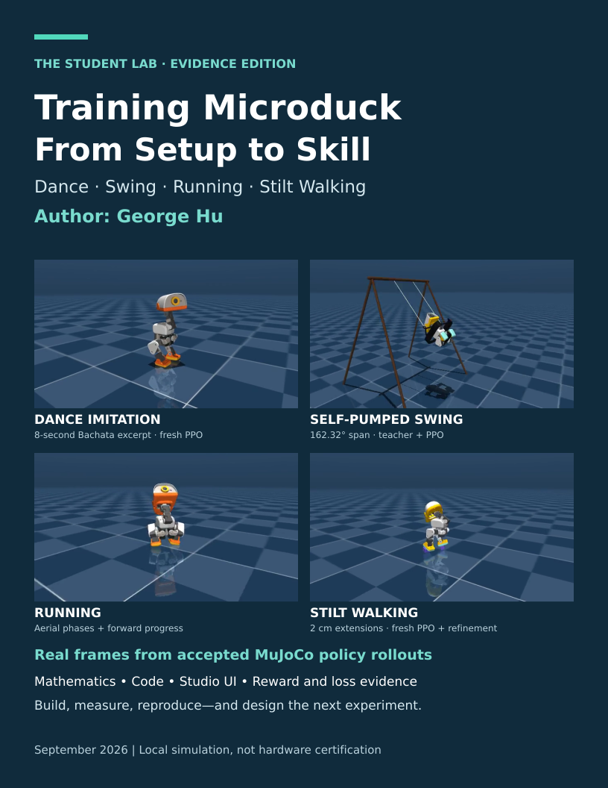{.book-cover}

# A laboratory book, not a victory montage

**Author: George Hu**  
**Evidence edition: September 2026**  
**Audience:** students who can read Python and want to connect reinforcement-learning mathematics to a robot that actually moves in simulation.

This book teaches four related experiments: **Dance imitation, Self-pumped Swing, Running, and Stilt Walking**. “Stith” in the original request is interpreted as the repository's **Stilt walking** scenario. Ordinary walking is the conceptual prerequisite for the last two tasks; it is not a fifth claimed experiment.

You will build an experiment from a clean setup, specify observable inputs and physical goals, run the existing RLX implementation, export a policy, evaluate complete episodes, and investigate failures. The objective is not to memorize a magic recipe. It is to learn how to tell the difference between a functioning training pipeline and a learned behavior.

## How to study this expanded edition

Start with the mathematical foundations and **PPO Code Laboratory**, including the runnable `learning_lab.py` arithmetic and saved-evidence exercises. Then read the Studio parameter map and one case from input to exported evaluation. Each expanded case gives code-reading anchors, concrete arrays, actual staged budgets, reward construction, recorded outputs, failed attempts and guarded reproduction. Read all four to compare different acquisition problems rather than assuming one reward recipe solves every movement.

Use **From a Passing Simulation to a Robotics Research Practicum** for the final comparison and sim-to-real planning assignment. The final **Complete reproduction appendix** carries the guarded base/continuation procedures. New diagrams are labeled explanatory; reward/loss plots remain original measured evidence; refreshed UI screenshots show saved runs and do not imply new training. Copy commands from the Markdown edition rather than the wrapped PDF.

## What “from scratch” means here

There are two meanings that must not be mixed:

1. **From a clean workspace:** you prepare the simulator, recipe, data, training process, evaluation, and evidence yourself. Every chapter supports this learning path.
2. **From randomly initialized policy weights using PPO alone:** this describes the selected Dance run and the initial Running/Stilt training stages. It **does not** describe the successful Swing initialization.

Swing required a disclosed behavior-cloning/data-aggregation teacher stage before PPO refinement. Fresh PPO did not discover the required large swing in the tested budget. A truthful textbook makes that failure useful instead of relabeling imitation as reinforcement learning.

All four cover panels are frames decoded from saved API-delivered videos of accepted policies. They are not AI-generated robots, rendered target poses, or demonstrations used as substitute test evidence. A still image identifies a rollout; it cannot prove motion. The accompanying full videos and per-step measurements supply that proof.

## The evidence you are learning from

| Experiment | Established result | Scope boundary |
|---|---|---|
| Dance | 16/16 API episodes; 5/5 separate eight-second audits; mean joint RMSE 0.08438 rad | First eight seconds of a Bachata clip; extended test repeats that excerpt |
| Running | 16/16 API episodes and 5/5 audits; 0.738–0.775 m/s; 35.0–39.8% aerial samples | Fixed 0.75 m/s command; curved trajectories remain |
| Stilt Walking | 16/16 API episodes and 5/5 audits; 0.230–0.242 m/s | Only 2 cm extensions, blend 0, 0.014 kg per foot, fixed 0.25 m/s command |
| Swing | 16/16 API episodes and 5/5 audits; 162.32° symmetric span | Teacher initialization plus PPO; nominal dynamics; narrow geometry margin |

The separate audits use different reset seeds, not independently trained policy seeds. Swing's nominal resets lead to effectively identical trajectories across those seeds. Five repeated passes therefore do not establish five independent robustness successes. None of these results establishes real-hardware safety, robustness to unknown terrain, arbitrary dance imitation, or general command following.

The underlying experiments already exist. **Building this book does not rerun training**: it packages their original measurements, code-grounded explanations, and a fresh visual inspection of saved Studio runs. Distinguish historical training validation from the book's own build and link checks.

## Suggested learning paths

| Path | Sequence | Deliverable |
|---|---|---|
| First encounter | Setup → observation contract → Studio → inspect one saved rollout | Annotated diagram and a correct explanation of one failure gate |
| First reproduction | PPO foundations → Dance preparation → short pipeline smoke → full selected recipe | New uniquely named run with policy, audit, and MP4 |
| Locomotion laboratory | Stilt chapter → Running chapter → heading/contact analysis | Comparison of reward success and physical skill success |
| Advanced learning | Swing bootstrap → PPO refinement → validation-led checkpoint selection | Separate imitation/PPO accounting and an honest ablation report |

A short smoke run only proves that the plumbing operates; it is not expected to learn a skill. Conversely, millions of transitions do not guarantee success. Set aside compute time for the chapter's complete schedule, monitor the first rollout, and do not keep spending on a broken environment.

### Prerequisites and notation

You should know arrays, functions, loops, basic derivatives, expectations, and mean/variance. An observation is $o_t$, an action is $a_t$, reward is $r_t$, policy parameters are $\theta$, and critic parameters are $\phi$. Time $t$ counts **control steps**, each 0.02 seconds, unless explicitly labeled wall-clock time. An environment transition is one action applied to one simulated robot. With sixteen robots, one vector step contributes sixteen transitions.

The chapters use three labels in prose:

- **Measured:** numbers read from saved experiment evidence.
- **Implementation:** behavior found in the repository's executable code.
- **Proposed:** an extension for students, not a claim that a new experiment has already passed.

## How to use the two editions

The Markdown edition is the editable source for study notes and reproducible commands. Paths in prose and shell examples are **workspace-root-relative** unless a command explicitly changes directory. Image links are relative to this book directory. The PDF contains vector mathematics and vector design diagrams, plus original raster plots and high-density UI captures. Zoom into a formula or diagram: edges should remain sharp.

The book bundles plots, decoded cover frames, selected audit JSON, and video-validation receipts under `assets/`. The large MP4 files, checkpoint lineages, raw traces, and full training journals remain in the existing gitignored experiment folders. Share those separately if a reader needs to replay the original experiment without retraining. A fresh Git clone is not an evidence archive.

Source reports: [Dance evidence](../dance-imitation-e2e/REPORT.md), [remaining-scenario evidence](../remaining-scenarios-e2e/REPORT.md), and [technical interpretation](../remaining-scenarios-e2e/INTERPRETATION.md). Those reports preserve the long audit tables; this book explains how to reason about them.

# Set up the complete learning system

## Architecture: who does what?

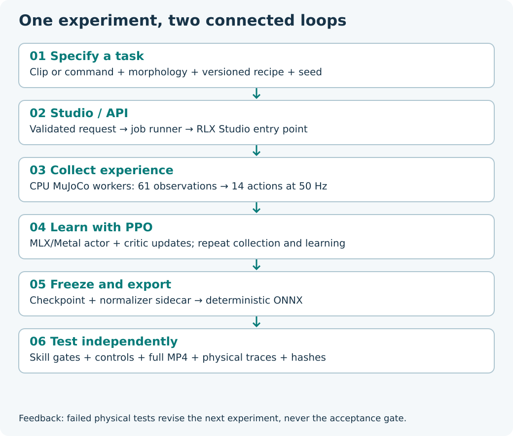

The browser does not optimize neural-network weights. The Next.js API validates a recipe, runs the Studio Python entry point, exposes status and artifacts, and serves the saved video. MuJoCo computes the physical transitions on the **CPU**. RLX performs actor/critic optimization through MLX, using Apple Metal in this measured setup. Do not infer that the Microduck simulator runs on the GPU from generic RLX examples.

| Workspace component | Read first | Responsibility |
|---|---|---|
| `rlx/` | `rlx/README.md` | PPO, rollout storage, actor/critic, Studio training and audits |
| `microduck_local/` | `README.md` and `AGENTS.md` in that directory | Robot contract, CPU simulation, task physics and rendering |
| `duck-viewer/` | `duck-viewer/README.md` | Studio controls, API jobs, telemetry and artifact delivery |
| `microduck_rl/` | Upstream robot files and playbook | Source MJCF and separate official GPU/sim-to-real stack |
| `dance-clip/` | Selected JSON plus provenance | Dance reference data, not executable policy weights |

The older local SB3 training commands and the RLX Studio route are different execution paths. This book uses **RLX PPO**. Do not silently switch to SB3 because both tools have a command named “train.” The user-facing reference `rlx/examples/ppo_microduck_dance.py` explains the original standalone pattern; the API actually launches `rlx/examples/ppo_microduck_studio.py`.

## Inventory before installing anything

From the workspace root:

```bash
pwd
git status --short
test -f rlx/examples/ppo_microduck_studio.py
test -f microduck_local/src/microduck_local/contract.py
test -d microduck_rl/src/mjlab_microduck/robot/microduck
command -v uv node npm ffmpeg ffprobe
```

Existing students on this machine can use `rlx/.venv-microduck/bin/python`. That path is an environment created for the recorded experiments, **not a file supplied by Git**. On another Mac, create the documented environment rather than copying a virtual environment between machines:

```bash
cd rlx
uv sync --python 3.12
uv pip install --python .venv/bin/python -e ../microduck_local
.venv/bin/python examples/ppo_microduck_studio.py --help
cd ..
```

Pin Python 3.12 explicitly: the RLX checkout's own `.python-version` can select 3.13, while the sibling local harness requires Python 3.12. If your checkout lacks the upstream robot directory, follow the root setup instructions to obtain the sibling `microduck_rl` repository before training. Preserve its revision. The local harness resolves the model relative to the workspace; `MICRODUCK_RL_DIR` is available for a nonstandard layout. This is an Apple-Silicon RLX/MLX walkthrough, not a promise that the same Metal commands work on a generic CPU-only Linux machine.

Where chapter commands use `rlx/.venv-microduck/bin/python`, substitute `rlx/.venv/bin/python` if you followed the clean setup above. The API creates an isolated `uv` execution environment using editable RLX and local-harness packages; it does not simply reuse your shell's activated Python. Inspect `pythonArgs()` in `duck-viewer/lib/rlx-job.ts` when diagnosing a mismatch.

## Start Studio, then inspect without training

If Studio already runs, use its displayed URL. Do not kill somebody else's server to reclaim a preferred port. For a new local instance:

```bash
cd duck-viewer
npm ci
PORT=63317 MICRODUCK_STUDIO_PYTHON="$(command -v python3.12)" \
  npm run dev -- --hostname 127.0.0.1
```

Set `MICRODUCK_STUDIO_PYTHON` to a real compatible interpreter on your machine; an empty command substitution is not a valid setup. Dependency installation can require network access. The recorded Studio URL is `http://127.0.0.1:63317`; if you choose another port, pass that same URL to every API and video-check command.

The live `duck-lab` WebSocket viewer is useful for exploration, but it is distinct from the Studio API's saved evaluation video. This book's completion evidence is tied to the saved run name, checkpoint hash, ONNX, and audit, not whatever policy happens to be displayed in a live simulation pane.

## The smallest safe preflight

```bash
node duck-viewer/scripts/rlx-dance-api-e2e.mjs --help
rlx/.venv-microduck/bin/python \
  rlx/scripts/dance_e2e.py --help
rlx/.venv-microduck/bin/python \
  rlx/scripts/audit_scenarios.py --help
```

These help commands do not launch training. Next, prepare a recipe and inspect its JSON before launching the shared driver with `--execute`. The driver refuses to launch without that flag; it does not provide a recipe-preview mode. Confirm that the command points at the intended scenario and a **new run name**. Never use the historical successful name for an exercise: overwriting a checkpoint destroys your control condition.

A complete preflight must establish that dependencies import, the model loads, input paths are real, the API is reachable, and the intended configuration is visible. The inventory and help commands above check only part of that contract: `--help` does not instantiate MuJoCo or contact Studio. A separate **Pipeline smoke** run checks environment construction and HTTP job delivery. Neither help output nor a smoke pass means a policy has learned. Keep these separate in your notebook.

### Exercise: write an experiment contract

Before touching a reward, write five sentences: (1) the robot's observable input; (2) the behavior desired in physical units; (3) the exact episode length; (4) the failure conditions; and (5) which artifacts would let a classmate challenge your conclusion. A useful answer says “both feet airborne for at least 3% of a complete 12-second Running episode,” not “the graph should look good.”

# Mathematical foundations: from observations to PPO

## State is not the same as observation

MuJoCo maintains a simulator state $s_t$: body poses, velocities, contacts, joint states, and constraint information. The policy receives only an observation $o_t=g(s_t,c_t)$, where $c_t$ contains observable task commands. Privileged information can be used to score a task or train a teacher without becoming an actor input. Confusing these roles produces policies that cannot run under the intended interface.

The implementation preserves the **61-input / 14-output** contract. The following indices are zero-based half-open slices from `microduck_local/src/microduck_local/contract.py`:

| Slice | Contents | Interpretation |
|---|---|---|
| `0:3` | Base angular velocity | IMU-like rotational feedback |
| `3:6` | Projected gravity | Orientation relative to gravity |
| `6:20` | Joint position relative to default | Fourteen posture errors |
| `20:34` | Joint velocity | Fourteen motion rates |
| `34:48` | Last action | Recent target command and action history |
| `48:51` | Twist command | Desired forward/lateral/yaw motion |
| `51:55` | Head command slots | Task-conditioned signals |
| `55:61` | Body command slots | Task-conditioned signals |

This table is the base locomotion convention, not a claim that every recipe uses velocity commands. Dance encodes sine/cosine phase at indices `59:61`. Swing has no temporal phase: its twist slots hold `(0, body_y_axis.x, body_y_axis.z)`, and its head/body command slots are zeroed. Preserving dimensions is necessary but not sufficient: a policy must also receive the same slot meanings at evaluation. Do not append an absolute heading, a future reference frame, or a teacher-only pendulum state without explicitly changing the experimental contract.

The base Dance/Running/Stilt action is a raw joint-target offset in radians. The actor's Gaussian/linear outputs are not restricted to $[-1,1]$. The environment clips the applied offset:

$$q^{\mathrm{target}}_t=q^{\mathrm{default}}+\operatorname{clip}(a_t,-4,4).$$

Swing intentionally uses a different task wrapper: it bounds actions to $[-1,1]$, applies its planar projection $P$ when enabled, and scales around a seated pose. Its effective target is $q^{\mathrm{seated}}+0.7P(\operatorname{clip}(a_t,-1,1))$, subject to the base environment's final offset clipping. Preserve this wrapper when evaluating or exporting a Swing actor; matching only tensor dimensions is insufficient.

This is not a raw torque command. Actuator physics and joint limits mediate how targets become motion. The standard controller period is $\Delta t=0.02$ s: a 0.005-second physics timestep with four simulation substeps per action. Thus 400, 500, 600 and 1,200 control steps correspond to 8, 10, 12 and 24 seconds.

**Worked example.** An offset of 0.10 rad is about 5.73°. It changes one joint's target relative to its default, not the robot's global heading by 5.73°. This distinction matters when a reward appears to encourage turning but actually excites a leg.

## Normalization is part of the learned policy

Signals have different units and scales: radians, radians per second, gravity direction and commands. A running mean $\mu$ and variance $v$ transform observations before the network:

$$\widetilde{o}=\operatorname{clip}\!\left(\frac{o-\mu}{\sqrt{v+\epsilon}},-c,c\right).$$

Changing $\mu$ or $v$ while holding network weights fixed changes the physical policy. That is why a safetensors file without its metadata/normalization sidecar is not an interchangeable checkpoint, and why Swing freezes observation statistics when refining an already competent imitation policy.

The exported ONNX incorporates this transformation. Feed raw contract observations into that exported model; **do not normalize them a second time**. The training wrapper may normalize rewards independently using running discounted-return variance:

$$\widetilde r_t=\operatorname{clip}\!\left(\frac{r_t}{\sqrt{v_R+\epsilon}},-c,c\right).$$

This is a scale transformation, not subtraction of the mean reward. Observation-statistics freezing does not freeze reward statistics. For comparisons across checkpoints, a deterministic **raw** return measured in a fixed environment is easier to interpret than the evolving normalized training signal.

## Policy, critic and discounted return

The actor and critic use hidden layers of 512, 256 and 128 units with ELU activations in the Microduck model. The Gaussian actor defines a distribution over fourteen actions:

$$\pi_\theta(a\mid o)=\mathcal N\!\left(\mu_\theta(o),\operatorname{diag}(\sigma_\theta^2)\right).$$

Training samples this distribution to explore. Deterministic exported evaluation uses its mean. An initial action standard deviation is therefore an exploration setting, not a motor-noise or hardware-safety guarantee. A resumed checkpoint loads its learned log standard deviation; a displayed `initialStd` does not automatically reset that learned quantity.

The critic predicts discounted future reward:

$$V_\phi(o_t)\approx\mathbb E\left[\sum_{k=0}^{\infty}\gamma^k r_{t+k}\mid o_t\right].$$

For intuition, $1/(1-\gamma)$ is an effective discount scale, not the episode length. At $\gamma=0.99$, that scale is about 100 control steps or two seconds; at 0.995 it is about 200 steps or four seconds. Long episodes still matter: the policy must survive and repeat good decisions beyond this approximate horizon.

Reward shaping determines what optimization prefers. A reward $r_t=\sum_i w_i f_i(s_t,a_t,c_t)$ combines feature terms with weights. The weights are not probabilities and need not sum to one. Before increasing a weight, inspect the feature's units, sign, range and how often the required states occur. No coefficient can make PPO learn from an aerial phase or a large swing that never appears in its sampled experience.

## GAE: distinguish a fall from a timeout

GAE stands for **Generalized Advantage Estimation**. PPO needs an advantage estimator but does not require GAE specifically; this implementation uses it to combine one-step TD residuals with information from later transitions. The dedicated **GAE Workshop** develops the bias–variance intuition, lambda endpoints, a corrected three-transition numerical example, and the code-level distinction between a true terminal, an external timeout and a rollout-buffer cutoff.

Let $d_t$ indicate a true terminal transition and $u_t$ a time-limit truncation. These belong to the transition after applying $a_t$, not to the next freshly reset episode. The critic bootstrap is:

$$b_t=\begin{cases}
0 & d_t=1,\\
V(o^{\mathrm{final}}_{t+1}) & d_t=0,\ u_t=1,\\
V(o_{t+1}) & \text{otherwise}.
\end{cases}$$

Then the temporal-difference error and generalized advantage estimate are:

$$\delta_t=r_t+\gamma b_t-V(o_t),$$
$$\widehat A_t=\delta_t+\gamma\lambda\left(1-\mathbf1[d_t\lor u_t]\right)\widehat A_{t+1}.$$

The value target is $\widehat R_t=\widehat A_t+V(o_t)$. The repository's `compute_generalized_advantage_estimate` uses this transition-aligned structure. A time limit bootstraps from the terminal observation but stops the advantage recursion; a fall both stops recursion and removes the bootstrap. Autoreset observations must not leak the next episode into the previous one's target.

**Numerical exercise.** Take $r_t=1$, $V(o_t)=3$, $\gamma=0.99$, final value 4 and next-episode reset value 100. A timeout has $\delta_t=1+0.99(4)-3=1.96$. A true termination has $\delta_t=-2$. Accidentally using the reset value gives 97, a large fictitious advantage. This is a data-boundary bug, not a hyperparameter problem.

## PPO's clipped update

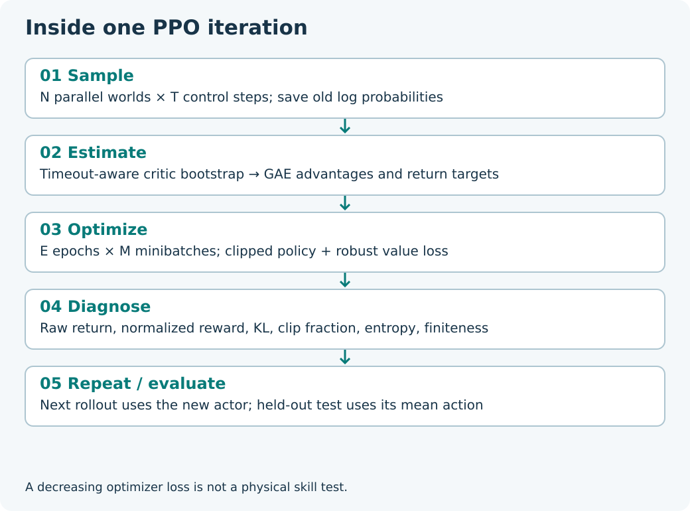

The old policy generated the batch. For an action stored in that batch, define the likelihood ratio:

$$\rho_t(\theta)=\exp\!\left(\log\pi_\theta(a_t\mid o_t)-\log\pi_{\mathrm{old}}(a_t\mid o_t)\right).$$

PPO maximizes the conservative surrogate

$$L^{\mathrm{clip}}=\mathbb E_t\left[\min\left(\rho_t\widehat A_t,\operatorname{clip}(\rho_t,1-\varepsilon,1+\varepsilon)\widehat A_t\right)\right].$$

The implementation minimizes its negative. For positive advantage, an action was better than predicted; increasing its probability helps until the clipped surrogate stops rewarding an excessively large increase. Negative-advantage samples apply the complementary pressure. Clipping is not a proof of monotonic return improvement.

This short fragment is an explanatory NumPy equivalent of the policy-loss calculation, not a replacement optimizer:

```python
log_ratio = np.clip(new_log_prob - old_log_prob, -20.0, 20.0)
ratio = np.exp(log_ratio)
surrogate = ratio * advantage
bounded = np.clip(ratio, 1 - clip_coef, 1 + clip_coef)
policy_loss = -np.minimum(surrogate, bounded * advantage).mean()
```

The actual MLX code also normalizes minibatch advantages when configured. The log-ratio bound prevents an overflowing exponential before gradient clipping can act. It is a numerical guard separate from PPO's policy-ratio clip interval.

## The actual critic loss is robust, not plain MSE

Do not teach a generic squared-error objective as if it were the exact current code. RLX uses a Huber-style value error with $\kappa=10$:

$$h_\kappa(e)=\begin{cases}\frac12e^2,&|e|\le\kappa,\\
\kappa(|e|-\frac12\kappa),&|e|>\kappa.\end{cases}$$

With value clipping enabled, form $V_c=V_{\mathrm{old}}+\operatorname{clip}(V_{\mathrm{new}}-V_{\mathrm{old}},-\varepsilon,\varepsilon)$ and use

$$L_V=\mathbb E\left[\max\left(h_\kappa(V_{\mathrm{new}}-\widehat R),h_\kappa(V_c-\widehat R)\right)\right].$$

The minimized total objective is

$$L=-L^{\mathrm{clip}}+c_V L_V-c_H\mathcal H(\pi).$$

The selected recipes have entropy coefficient $c_H=0$, while entropy is still measured and the Gaussian policy still samples actions. Zero entropy bonus does **not** mean zero exploration. `value_coefficient` defaults to 0.5 in core `PPOConfig`, but the Studio entry point supplies its own default of **1.0**. The selected Studio runs therefore use 1.0 unless explicitly overridden at that lower-level CLI. A scalar “loss” combines these terms with different scales; it is not a universal score comparable across different rewards.

## Count the work correctly

For $N$ environments, $T$ steps per rollout, $M$ minibatches and $E$ epochs:

$$B=NT,\qquad B_{\mathrm{mini}}=B/M,\qquad U_{\mathrm{iteration}}=EM.$$

The **recorded E2E recipe overrides**, not the UI's current default presets, use $N=16,T=128,M=4,E=4$ for Dance/Running/Stilts: 2,048 transitions per iteration, minibatches of 512, and sixteen optimizer updates. Dance's 4,001,792 transitions give 1,954 iterations and 31,264 optimizer minibatches. The recorded Swing recipe uses $T=256,E=2$: 4,096 transitions per iteration, minibatches of 1,024 and eight updates. Its 524,288-transition refinement has 128 iterations and 1,024 optimizer minibatches. Behavior-cloning gradient steps are not part of this PPO count. Use the parameter chapter to distinguish these selected settings from current UI defaults.

More epochs reuse the same experience more heavily; they do not generate additional physical transitions. More environments change throughput and sample correlation. At a fixed total transition budget, increasing batch size reduces the number of policy refreshes. Tune these together rather than treating them as independent “more is better” sliders.

## Read diagnostics without inventing convergence

| Signal | What it measures | What it cannot establish |
|---|---|---|
| Raw deterministic return | Reward sum under a fixed evaluation setup | Skill if the reward can be exploited |
| Normalized rollout reward | Stochastic training reward on an evolving scale | Direct comparability across normalization histories |
| Policy/value/total losses | Actual minibatch optimization objectives | Successful motion or a requirement of monotonic decline |
| Approximate KL | Policy-distribution change on sampled data | A guarantee on unseen states |
| Clip fraction | Fraction of ratios outside the PPO interval | A target that should always be zero |
| Entropy | Spread of the sampled action distribution | Task-relevant exploration by itself |
| Explained variance | Agreement of critic values with sampled return targets | Actor competence; negative values can coexist with a passing actor |

Explained variance is approximately $1-\mathrm{Var}(\widehat R-V)/\mathrm{Var}(\widehat R)$. A negative value means a poor critic fit relative to a constant predictor on that data. Swing's critic is not consistently well explained; its physically validated actor must not be used to claim perfect value convergence.

The saved plots retain raw measurements and label any smoothing; they are not redrawn to look successful. Compare policies on the **same** raw reward/environment, identify whether a curve includes a continuation or a fresh start, and inspect the physical tracking plot next. An upward reward trend followed by a failed geometry test is a failed skill result, not an inconvenient outlier to erase.

## A numerical lesson from a failed Stilt run

An earlier Stilt run stopped with nonfinite critic gradients. A separate probe demonstrated an ELU implementation issue: an inactive exponential branch can overflow and poison gradients even when the forward output looks finite. The stable form used in the Microduck model is conceptually:

```python
def stable_elu(values):
    negative_branch = mx.exp(mx.minimum(values, 0.0)) - 1.0
    return mx.where(values >= 0.0, values, negative_branch)
```

The original failing minibatch was not preserved, so the probe supports a plausible mechanism rather than proving every detail of that historical failure. The lesson is precise: check forward values, gradients and updated parameters; save failure evidence; do not treat gradient clipping as a cure for a NaN that already exists.

### Foundation exercises

1. Compute batch size and optimizer updates for each selected recipe. Verify Dance and Swing counts against the arithmetic above.
2. Implement the one-transition timeout example in plain Python. Make termination take precedence when both flags are true.
3. For advantages +2 and −2, calculate the clipped objective at ratios 0.7, 1.0 and 1.3 with $\varepsilon=0.2$. Explain which direction of movement is discouraged.
4. Read an exported-policy audit's native/ONNX parity number. Explain why a small action error tests export fidelity, not physical robustness.
5. Design a reward ablation with one changed coefficient and an unchanged physical evaluator. Predict a failure mode before running it.

# PPO Code Laboratory: Follow One Batch End to End

## Learning goals and the four kinds of data

After this laboratory you should be able to trace one observation through the actor, environment, rollout buffer, advantage estimator and optimizer; calculate the exact sample budget; distinguish a demonstration from an on-policy transition; and independently read the four saved audit files. The mathematics below is grounded in `rlx/rlx/algorithms/ppo.py`, `rlx/rlx/buffers/rollout_buffer.py`, `rlx/rlx/utils/utils.py` and `rlx/rlx/models/microduck.py`. The accompanying [learning_lab.py](learning_lab.py) runs arithmetic and evidence inspection with the Python standard library. It is not a replacement PPO trainer.

| Data object | Who creates it? | Input and target | Where it is used |
|---|---|---|---|
| Dance reference clip | Motion preparation | Time-indexed target joint angles | Environment reward and independent tracking evaluator |
| Swing imitation dataset | Simulator teacher queried during teacher/student rollouts | Ordinary observation and teacher action | Supervised actor-mean training |
| PPO rollout buffer | Current stochastic student in the physical environment | Observation, sampled action, reward, boundary flags, old log probability and value | GAE and repeated PPO minibatches |
| Evaluation traces | Frozen exported mean actor | Physical states and task-specific measurements over a complete episode | Acceptance gates, plots and video evidence |

These are not four interchangeable forms of a training CSV. Dance uses imitation **as a reward objective** in a fresh PPO experiment; that does not imply Dance used Swing's supervised BC optimizer. Running and Stilts generate learning data through interaction rather than loading a labeled gait dataset. Swing explicitly adds a supervised acquisition stage. Never claim that all four activities used BC/DAgger, or that a Dance target clip is itself a trained policy.

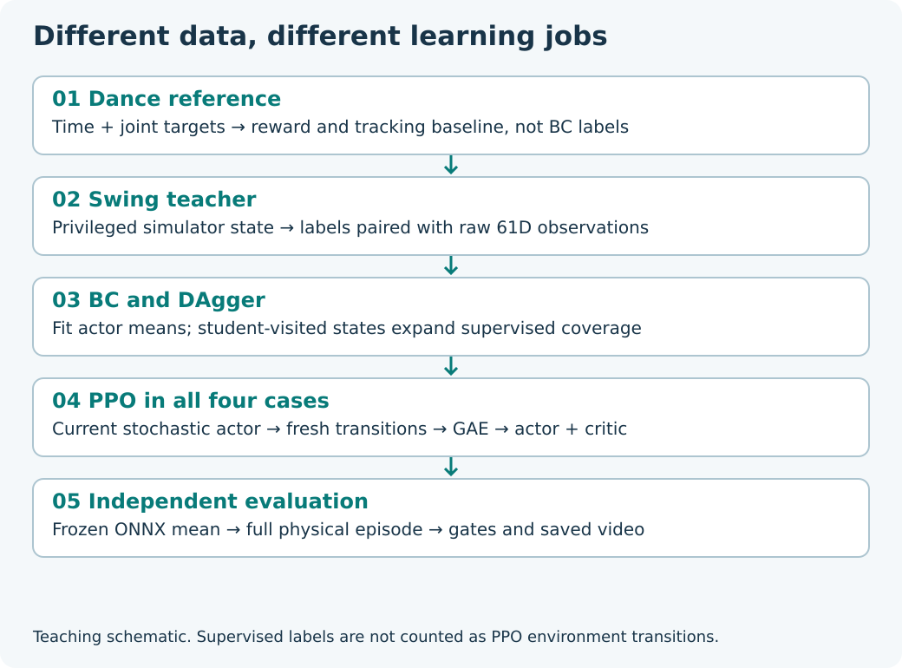

## The actual actor–critic, not an unspecified neural network

There are **two separate multilayer perceptrons**, not one shared hidden trunk: an actor mean network `61 → 512 → 256 → 128 → 14` and a critic `61 → 512 → 256 → 128 → 1`. Each hidden layer uses the numerically stable ELU implementation. The actor also owns fourteen trainable log-standard-deviation values, one per joint; they do not depend on the current observation. The critic predicts one scalar discounted value for each observation. The architecture is feed-forward, not recurrent: previous action and other observation fields provide limited history, but there is no LSTM hidden state.

Counting weights and biases gives 197,774 actor-mean parameters, fourteen log-standard deviations, and 196,097 critic parameters: **393,885 trainable parameters** in total. This is a derived architecture count, not a measurement of model quality. Each linear layer contributes `(input_width + 1) × output_width`. The deterministic exported policy does not need the critic or exploration standard deviation. Its required computation is the learned observation transformation followed by the actor mean.

At each control tick the actor returns `mean.shape == (16, 14)` for sixteen environments. The critic returns `(16, 1)`. The policy distribution samples

$$a_{n,j}=\mu_{n,j}+\exp(\ell_j)\epsilon_{n,j},\qquad \epsilon_{n,j}\sim\mathcal N(0,1).$$

Microduck clips its log standard deviation to `[-5.0, -0.5]`, corresponding approximately to standard deviations `[0.00674, 0.60653]`. This is the Microduck model's restriction, not the generic distribution helper's range. `initialStd=0.1` starts near `log(0.1)=-2.30259` for fresh weights. A checkpoint can restore a different learned value; inspect the initializer rather than assuming the fresh-model flag won.

The Gaussian joint log probability is summed across action dimensions:

$$\log\pi(a\mid o)=\sum_{j=1}^{14}\left[-\frac12\left(\frac{a_j-\mu_j}{\sigma_j}\right)^2-\log\sigma_j-\frac12\log(2\pi)\right].$$

Consequently, `log_probs` has one scalar per environment transition, not fourteen independent PPO objectives. Correlated movement is represented through the observation-dependent action means and the physics; the exploration covariance is diagonal.

**Important action bookkeeping.** The rollout buffer stores the sampled Gaussian action and its matching log probability. The environment subsequently clips/transforms that action into a joint target. Do not replace the saved sample with its clipped target when recomputing Gaussian log probabilities: the denominator would no longer refer to the same action. Large saturation is still undesirable because many distinct samples produce nearly identical applied targets; logging saturation is a useful proposed diagnostic, not an existing success certificate.

## Trace a single collection tick

Read `PPO.train()` and locate the following sequence. This is an execution map, not runnable substitute code:

1. Evaluate `network(observation)` to produce distribution and critic value.
2. Sample the action and compute its old-policy joint log probability.
3. Call `env.step(...)`. CPU MuJoCo advances each world; the adapter returns the next normalized observation, reward, terminal flags and diagnostic information.
4. Extract timeout values from the actual terminal observation when needed. Autoreset observations belong to a new episode and cannot substitute for that state.
5. Append one vectorized row to the buffer. Store observations, actions, rewards, flags, values and log probabilities without losing the environment index.
6. Advance the transition counter by `num_envs`, not by one. Move to the next tick using the returned observation.

For sixteen environments one collection tick represents sixteen transitions and 0.02 seconds of simulated time **in each world**. The policy does not receive CPU wall time or the entire MuJoCo state as an input. The training process alternates collection and updates; “MLX accelerated” does not mean MuJoCo physics in this route has moved onto a GPU. The ordinary Mac path here uses CPU physics plus MLX/Metal neural-network work.

## Inspect the rollout tensors

For Swing, `T=256`, `N=16`, observation dimension `61` and action dimension `14`. `RolloutBuffer.reset()` allocates the following float32 arrays:

| Buffer field | Shape before flattening | Meaning |
|---|---|---|
| `observations` | `(256, 16, 61)` | Normalized actor/critic inputs at action time |
| `next_observations` | `(256, 16, 61)` | Adapter-returned next inputs; special timeout information is handled separately |
| `actions` | `(256, 16, 14)` | Sampled, pre-environment-transform actions |
| `rewards` | `(256, 16)` | Training rewards, normalized when configured |
| `values`, `log_probs` | Each `(256, 16)` | Old critic predictions and old-policy action log probabilities |
| `terminations`, `truncations` | Each `(256, 16)` | Separate physical-failure and time-limit boundaries |
| `advantages`, `returns` | Each `(256, 16)` | Reserved buffer fields; this PPO path passes computed GAE/returns into `update()` |

The timeout-value list is collected outside those buffer fields and stacked for GAE. The return target is `advantages + buffer.values`. Some allocated buffer fields are not the active source of the update argument; verify actual reads, not only class member names.

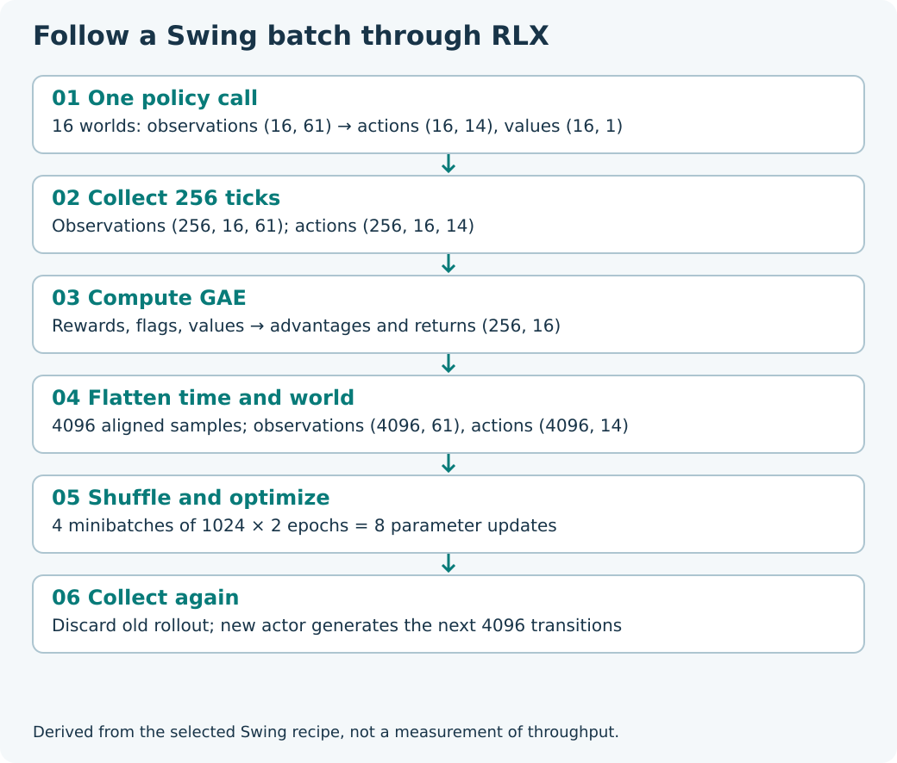

`flatten()` reshapes the first two dimensions together: `(256,16,61)` becomes `(4096,61)`. The flat sample index is `time_index × 16 + environment_index`. All arrays must be flattened and indexed consistently. It would be a serious silent error to permute actions independently from observations, advantages or old log probabilities.

Each epoch generates a new permutation of the 4,096 sample indices. Four minibatches contain 1,024 transitions each; two epochs give eight optimizer steps per iteration. The next collection starts only after those updates. The buffer is reset for the next iteration: these PPO updates do **not** train indefinitely from a permanent replay pool of old policies.

## Why “524,288 transitions” is a budget, not a giant batch

The selected Swing continuation uses:

$$16\times256=4,096\text{ transitions per rollout},$$
$$524,288/4,096=128\text{ collect/update iterations},$$
$$128\times2\times4=1,024\text{ optimizer steps}.$$

There are 1,048,576 sample presentations across the two epochs, but still only 524,288 newly collected environment transitions. BC training steps, DAgger teacher labels, audits and rendering are not counted in that PPO number. Nor does the number include earlier failed experiments or the Running/Stilt base stages.

At 50 Hz the Swing PPO phase represents `524288 × 0.02 = 10485.76` aggregate simulated seconds, about 2.913 hours summed over all worlds. Dividing by sixteen gives 655.36 simulated seconds per environment stream. Those streams can contain many resets; neither number is a single continuous 24-second episode or measured wall-clock runtime. Do not use either quantity to estimate real-robot battery time.

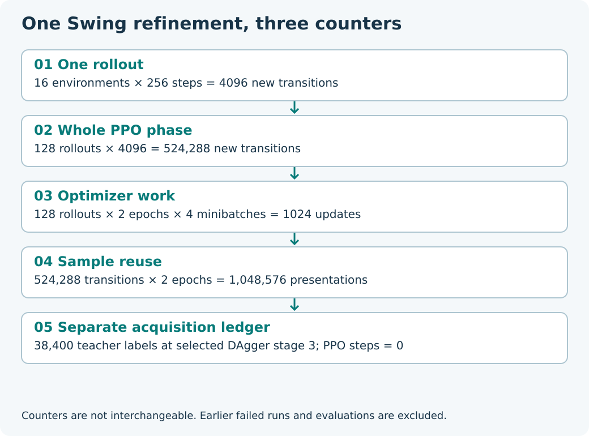

`PPO.train()` finishes complete rollouts. For a hypothetical request of 4,000,000 transitions with batch size 2,048:

$$\left\lceil4,000,000/2,048\right\rceil\times2,048=4,001,792.$$

The audit stores Dance's effective 4,001,792-step recipe; its training summary does not separately store `requested_transitions`. Our evidence reader reports that difference instead of inventing the original user request. Treat UI rounding, requested budget, effective recipe, observer counters and cumulative checkpoint lineage as different records that should reconcile.

## Work through timeout-aware GAE numerically

This is a one-transition boundary test. Continue with the **GAE Workshop** for the full three-transition backward calculation, when PPO uses GAE, and why lambda one still retains a value bootstrap at a nonterminal cutoff.

Suppose one final step has reward `1`, old value `2`, discount `0.99`, terminal-state value `5`, and reset-state value `99`. These are **synthetic arithmetic inputs** chosen to expose a bug, not robot measurements.

- Physical termination: bootstrap is zero, so the advantage is `1 - 2 = -1`.
- Time-limit truncation without physical termination: bootstrap the terminal observation, so the advantage is `1 + 0.99 × 5 - 2 = 3.95`.
- Incorrectly bootstrapping the reset observation would give `97.01`. That rewards a transition based on a different episode.
- When both flags are true, termination wins: the correct result is `-1`.

In a multi-step sequence the backward recursion is

$$\delta_t=r_t+\gamma b_t-V(o_t),$$
$$\widehat A_t=\delta_t+\gamma\lambda(1-d_t)\widehat A_{t+1},$$

where `d_t` is termination **or** truncation, while `b_t` distinguishes their different bootstrap rules. A timeout bootstraps its own terminal value, but does not propagate advantages from the next reset episode. At a rollout boundary that is not an episode boundary, the last critic value provides the bootstrap.

The selected `gamma` and GAE `lambda` govern the discounted objective and estimator trade-off. A useful intuition is the decay scale, not a hard planning horizon: `gamma=0.99` has `1/(1-gamma)=100` control steps, about two seconds, while `0.995` gives 200 steps, about four seconds. Reward information is not literally discarded after that time. GAE's `lambda` further changes the advantage weighting; it is not the simulator timestep.

## Read the clipped objective with its sign intact

For a fixed batch sample let `ratio = exp(new_log_prob - old_log_prob)`. A positive advantage encourages increased probability; a negative one encourages decreased probability. The maximized surrogate is the smaller of unclipped and clipped products. The source minimizes its negative using `maximum` of the two negative terms.

For `clip=0.2`:

| Advantage | Ratio | Unclipped product | Clipped product | Maximized surrogate |
|---|---|---|---|---|
| +2 | 0.7 | 1.4 | 1.6 | 1.4 |
| +2 | 1.0 | 2.0 | 2.0 | 2.0 |
| +2 | 1.3 | 2.6 | 2.4 | 2.4 |
| −2 | 0.7 | −1.4 | −1.6 | −1.6 |
| −2 | 1.0 | −2.0 | −2.0 | −2.0 |
| −2 | 1.3 | −2.6 | −2.4 | −2.6 |

The plateau is on the helpful-update side; clipping does not make every out-of-range ratio harmless. It also does not constrain all future observations or guarantee monotonically better robot performance. Swing's rejected longer continuation is a concrete reason to keep a physically validated earlier checkpoint.

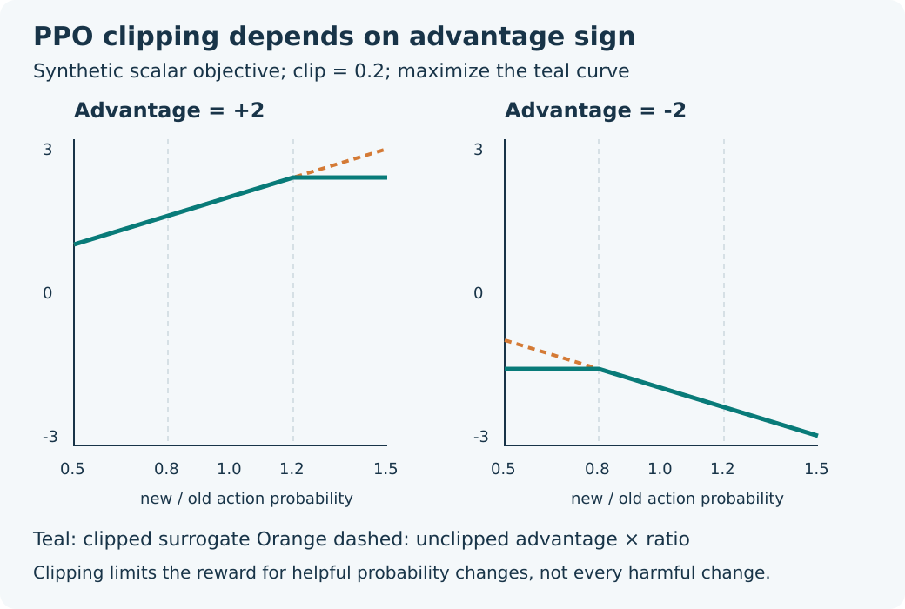

The implementation additionally clips **log ratios** to `[-20,20]` before exponentiation to avoid numerical overflow. That finite guard is distinct from the small PPO ratio interval, such as Swing's `[0.95,1.05]`. Gradient norm clipping is a third mechanism, operating on the update gradient rather than on action probabilities. None of the three replaces finite-value checks or a physical skill evaluator.

When enabled, advantage normalization occurs inside each minibatch: subtract that minibatch's mean and divide by its standard deviation plus `1e-8`. Therefore the table demonstrates the objective for already chosen advantages; it does not claim those exact unnormalized values survive the real minibatch transformation. Old log probabilities, old values and return targets remain fixed while the same rollout is reused across epochs.

## The critic's Huber loss and a misleading total loss

The current implementation uses Huber value error with threshold 10:

$$h(e)=\begin{cases}\tfrac12e^2,& |e|\le10,\\10|e|-50,&|e|>10.\end{cases}$$

For an error of 2, Huber loss is 2; for 20 it is 150, rather than squared-error loss 200 under the half-square convention. This limits growth of the error derivative but does not repair invalid observations or NaN gradients. With value clipping enabled the code takes the **larger** of Huber error under the new value and under the clipped change from the old value, then averages.

The selected Studio value coefficient is 1.0. Swing's saved last-100-update means contain `policy_loss=-0.0003224187`, `value_loss=0.3731174710` and `mean_loss=0.3727950529`. With entropy coefficient zero, adding the first two recovers the third. A positive total loss here mostly reflects critic fitting, not proof the actor is failing. Its negative explained variance remains a critic diagnostic that should be reported rather than hidden behind a passing skill badge.

The saved Swing entropy is also negative. This is **differential entropy** of a continuous Gaussian, not discrete Shannon entropy; negative values are possible for concentrated distributions. It does not mean a negative probability or zero stochastic exploration.

## Run the arithmetic lab before training

From the workspace root, these commands have no simulation or hardware side effects:

```bash
python3 docs/microduck-training-student-book/learning_lab.py
python3 docs/microduck-training-student-book/learning_lab.py --evidence
rlx/.venv-microduck/bin/python \
  docs/microduck-training-student-book/test_book.py
```

The first command prints the synthetic GAE and clipping cases plus budget calculations. The second reads the four bundled audit JSONs and cross-checks transition counts, iterations and optimizer steps against recipe arithmetic. Expected selected-phase counts are:

| Case | Actual transitions | PPO iterations | Optimizer minibatches | Saved trained audit passes |
|---|---|---|---|---|
| Dance | 4,001,792 | 1,954 | 31,264 | 5/5 |
| Running continuation | 2,097,152 | 1,024 | 16,384 | 5/5 |
| Stilts continuation | 1,048,576 | 512 | 8,192 | 5/5 |
| Swing refinement | 524,288 | 128 | 1,024 | 5/5 |

These pass counts are historical artifact contents, **not a new audit performed by this script**. The script's `policy_sha256` identifies the saved artifact claim; it does not hash a missing live ONNX or certify that today's code produced it. The book tests include regressions for timeout/termination precedence, no cross-reset advantage propagation, sign-correct clipping, invalid budgets, and agreement with every saved audit.

The scalar GAE implementation is a pedagogical port for one environment. It omits MLX, vectorization, automatic differentiation and integration with normalization. Compare it with the actual source, then run native RLX tests when changing the trainer. Do not replace production code with a teaching implementation simply because its small examples pass.

## Student checkpoint: explain it without slogans

1. Why is `(4096,14)` the action batch but `(4096,)` the log-probability batch?
2. If you double epochs but keep the rollout budget fixed, which counter doubles and which stays fixed? Calculate Swing's new optimizer count.
3. If you double `num_envs` while keeping `num_steps` and total transitions fixed, why do fewer policy refreshes not imply an equivalent experiment?
4. Change the scalar timeout example so the next episode has reward 1,000. The preceding timeout advantage must stay 3.95. Explain the masking operation.
5. Compare a zero-action control with a randomly initialized network. Why do they answer different causal questions?
6. State the full Swing result in one sentence including imitation acquisition, selected PPO budget, deterministic acceptance conditions, and the absence of hardware evidence.

**Answer checks.** Fourteen independent Gaussian log terms are summed to one joint action density; four Swing epochs would give 2,048 optimizer minibatches with the same 524,288 transitions; doubling environments halves the 128 policy refreshes at fixed horizon/budget. A null control tests passive physics, while an untrained actor tests whether generic network actions suffice. Neither replaces a teacher-only control when attributing improvement to Swing's PPO phase.

# GAE Workshop: Why PPO Uses Advantages and How Timeouts Change Them

## Start with the question PPO must answer

**GAE means Generalized Advantage Estimation.** It estimates whether a sampled action led to a better or worse outcome than the policy's value baseline predicted. PPO needs an advantage estimate for its policy-gradient objective, but **does not require GAE specifically**. Returns minus a baseline and other estimators are possible. This RLX implementation chooses GAE to combine information from multiple future rewards without relying entirely on either a noisy complete return or a single critic prediction. See the original [GAE] and [PPO] references in the practicum bibliography.

Consider a Running action that briefly lifts both feet. Its immediate reward can look promising while the robot is already rotating toward a fall. Conversely, a stabilizing action may receive little immediate reward but enable useful motion later. PPO needs a credit-assignment signal for the sampled action, not just the current reward or a final episode-wide thumbs-up.

The theoretical advantage is

$$A^\pi(o_t,a_t)=Q^\pi(o_t,a_t)-V^\pi(o_t),$$

where $Q^\pi$ is the expected discounted return after taking the particular action and following the policy, and $V^\pi$ averages over the policy's actions from that observation. In a partially observed robot, $V(o_t)$ is the feed-forward critic's observation-based approximation; it is not an oracle for the complete simulator state or unobserved history.

An advantage of `+0.4` means better than that baseline, not “the robot earned exactly 0.4 reward” or “move the joint by 0.4 radians.” An advantage of `-0.4` means worse than the baseline, even if the immediate reward was positive. Estimates can be wrong when the critic, boundary handling, or sampled data is poor.

## When GAE runs—and when it does not

In `rlx/rlx/algorithms/ppo.py`, one training iteration has four stages:

1. **Collect:** use the current stochastic actor to gather a full vectorized rollout, saving rewards, old values, old action log probabilities, termination flags and timeout information.
2. **Estimate:** evaluate the last-state critic and compute GAE backward over the rollout. Form critic return targets as `advantages + old_values`.
3. **Optimize:** shuffle samples into minibatches. PPO uses the advantages in its clipped actor objective and the return targets in its critic loss. In this implementation, advantage normalization occurs inside each optimizer minibatch.
4. **Repeat:** discard the old rollout and collect new experience under the updated policy.

GAE belongs between collection and PPO optimization. It is not an extra action-selection network and it does not create more environment transitions. Two update epochs reuse the same computed rollout advantages; they are not two independent GAE datasets or two new physical rollouts.

The selected Swing refinement performs this computation for 128 rollouts of shape `(256,16)`, one scalar advantage for each of its 524,288 transitions. Dance, Running and Stilts use the same mechanism with their selected rollout horizons and rewards. Swing's earlier BC/DAgger stages do **not** need GAE: they train the actor mean against teacher action labels, and the selected initializer's critic is not pretrained. Deterministic ONNX inference and physical skill evaluation also do not compute GAE to choose an action.

## Build the estimate from TD residuals

At a transition that genuinely continues, the one-step temporal-difference residual is

$$\delta_t=r_t+\gamma V(o_{t+1})-V(o_t).$$

Interpret this as “reward just observed plus predicted remaining return, minus what the critic predicted before acting.” A positive residual is better news than the old prediction. GAE combines this news with subsequent residuals:

$$\widehat A_t^{\mathrm{GAE}(\gamma,\lambda)}
=\sum_{l=0}^{\infty}(\gamma\lambda)^l\delta_{t+l}.$$

That compact expression assumes an appropriately continuing trajectory or terminal boundary. Real implementations use a **finite collected segment**, explicit episode-boundary masks, and a critic bootstrap at a nonterminal cutoff. They must not sum residuals from the next reset episode.

For three consecutive transitions with no intervening reset, the finite backward sweep is

$$\widehat A_2=\delta_2,$$
$$\widehat A_1=\delta_1+\gamma\lambda\widehat A_2,$$
$$\widehat A_0=\delta_0+\gamma\lambda\widehat A_1.$$

The final residual already contains the correct boundary bootstrap. Initializing the backward sweep's future advantage to zero does **not** imply that the final state's value should also be zero. Those are different quantities.

## What gamma and lambda each control

- **Gamma, $\gamma$:** discounts future rewards and affects the value objective being estimated. It is not a noise filter applied only to GAE.
- **Lambda, $\lambda$:** controls how strongly later TD residuals influence the current advantage. It changes the estimator without changing the environment's reward function.
- **Their product, $\gamma\lambda$:** is the per-transition weight in the residual trace. With `gamma=0.99` and `lambda=0.95`, this is exactly `0.9405`.

| Lambda | What the estimator becomes | Qualification |
|---|---|---|
| `0` | One-step TD advantage, $\widehat A_t=\delta_t$ | Usually less sampling variance but stronger reliance on an approximate next-state critic |
| Between `0` and `1` | A weighted multi-step residual trace | Trades sampling variance against bootstrap approximation; no universal best value |
| `1` | Discounted multi-step return minus the initial value baseline | Pure empirical return only when the segment reaches a true terminal boundary; otherwise a final critic bootstrap remains |

For a segment with $K$ transitions and no earlier boundary, setting $\lambda=1$ makes the intermediate value terms telescope:

$$\widehat A_t=
\sum_{l=0}^{K-1}\gamma^l r_{t+l}
+\gamma^K V(o_{t+K})-V(o_t).$$

At a true terminal, the continuation value is zero by definition, leaving the usual Monte Carlo return minus baseline. At a nonterminal rollout cutoff or external timeout, removing the last value term would change the target. Therefore “lambda one is always Monte Carlo” is too imprecise for this simulator. Similarly, “lambda zero is always highly biased” ignores the quality of the value function: the issue is reliance on its approximation, not a guaranteed fixed error.

## Timeout-aware means two different boundary decisions

A **true terminal** ends the return being modeled: for example, a fall that ends the task under its defined failure rule. An **external timeout** stops collection even though the modeled process could continue. Both may trigger an implementation reset, so “the simulator reset” is not sufficient to distinguish them.

The rule for a true terminal is to assign zero **continuation value**, not to declare its observation meaningless. That final observation can still be valid and useful for debugging and evaluation. What is zero is the future return beyond the task's terminal boundary.

Let $d_t$ be `terminated` and $u_t$ be `truncated`. These are flags for the transition just completed. Define

$$b_t=\begin{cases}
0,&d_t=1,\\
V(o^{\mathrm{final}}_{t+1}),&d_t=0\ \text{and}\ u_t=1,\\
V(o_{t+1}),&d_t=0\ \text{and}\ u_t=0.
\end{cases}$$

Then compute

$$\delta_t=r_t+\gamma b_t-V(o_t),$$
$$\widehat A_t=\delta_t+\gamma\lambda\bigl(1-\mathbf1[d_t\lor u_t]\bigr)\widehat A_{t+1}.$$

**Decision one:** may the TD residual bootstrap a final value? **Decision two:** may the advantage trace continue into the next stored transition? A timeout answers **yes** to the first but **no** to the second when the next stored transition belongs to a reset episode.

| Boundary | Value used in the last residual | Propagate the next episode's advantage? |
|---|---|---|
| Ordinary transition | Next-state value | Continue within the same episode |
| External timeout with autoreset | Value of the saved final observation | No |
| True terminal | Zero continuation value | No |
| Both flags true | Zero; termination takes precedence | No |
| Rollout buffer ends but episode continues | `last_value` from the ongoing state | No observed tail beyond this segment; initialize the backward tail to zero |

The last row is not a reason to mark the environment `terminated`. A 256-step Swing rollout can finish in the middle of a 1,200-step episode. The next rollout may continue that world, but this finite estimator still needs its current last-state bootstrap.

Not every clock-based ending is an external timeout. If a finite deadline is **part of the task definition**, it can be a true terminal; the state/observation needs the remaining-time information for the usual Markov formulation. Do not change an environment's flags based only on the word “timeout” in a log. The official Farama time-limit documentation makes this distinction [TimeLimits]. This RLX path follows the flags and terminal observations actually returned by its adapter.

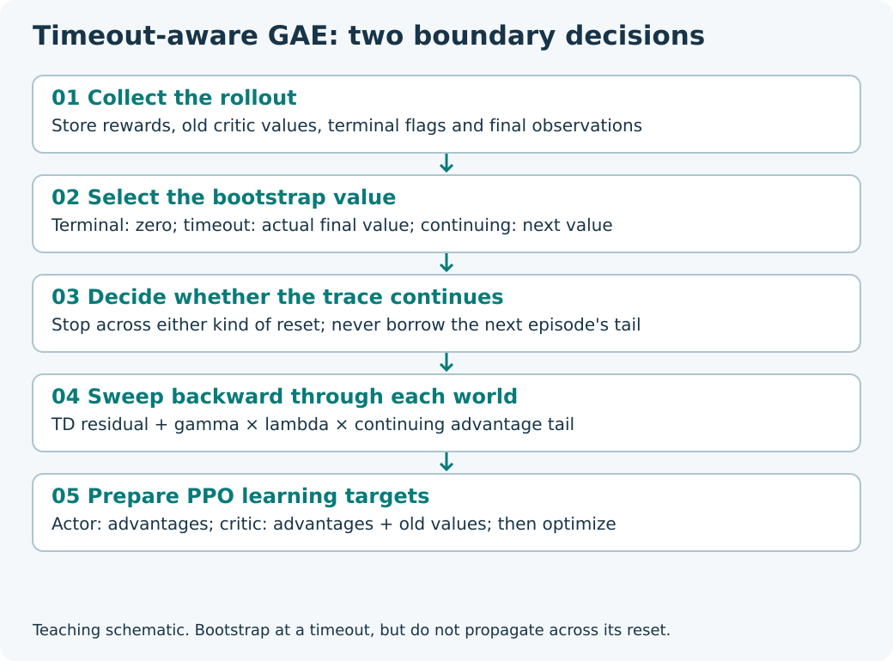

## The supplied three-transition example, corrected exactly

Use the following **synthetic** data. These are not saved Microduck reward measurements, and they are not normalized again inside this example:

$$\gamma=0.99,\qquad\lambda=0.95,\qquad\gamma\lambda=0.9405.$$

| Transition | Current value | Reward | Value after applying the action | Boundary |
|---|---|---|---|---|
| `t=0` | $V(o_0)=1.0$ | $r_0=0.5$ | $V(o_1)=1.2$ | Continues |
| `t=1` | $V(o_1)=1.2$ | $r_1=0.2$ | $V(o_2)=1.1$ | Continues |
| `t=2` | $V(o_2)=1.1$ | $r_2=0.0$ | $V(o_3^{\mathrm{final}})=0.9$ | External timeout |

There are three transitions, indexed `0,1,2`, and four observation values. The timeout occurs **after the third action**, producing the final observation $o_3$. That final observation is not the subsequently reset observation.

### First compute every TD residual

At the timeout:

$$\delta_2=0+0.99(0.9)-1.1=0.891-1.1=\boxed{-0.209}.$$

The value `-0.211` in the motivating draft is an arithmetic error, not a rounding convention. Keeping it would incorrectly change every preceding advantage.

At the earlier transitions:

$$\delta_1=0.2+0.99(1.1)-1.2=\boxed{0.089},$$
$$\delta_0=0.5+0.99(1.2)-1.0=\boxed{0.688}.$$

### Sweep backward without rounding intermediate values

$$\widehat A_2=\delta_2=\boxed{-0.209},$$
$$\widehat A_1=0.089+0.9405(-0.209)=\boxed{-0.1075645},$$
$$\widehat A_0=0.688+0.9405(-0.1075645)=\boxed{0.58683558775}.$$

Rounded to six decimals, the forward-ordered advantage vector is

```text
advantages = [0.586836, -0.107565, -0.209000]
```

Notice the credit assignment: `t=1` has a positive immediate reward and positive one-step residual, but a negative multi-step advantage because the later outcome is disappointing relative to its value prediction.

The critic's return targets are $\widehat R_t=\widehat A_t+V(o_t)$:

```text
value_targets = [1.58683558775, 1.0924355, 0.891]
```

At the final timeout, the critic target is `0.891`, exactly the zero immediate reward plus discounted final value. RLX fits these targets with its robust critic loss; the actor uses the advantages in the clipped objective. These displayed advantages are **before** the source's optimizer-minibatch normalization. A normalized advantage may have a different sign relative to the minibatch mean, so do not claim this tiny vector directly predicts every production gradient.

## Now make the third transition a true terminal

Keep the same recorded rewards and current values for a controlled mathematical comparison, but change only the final boundary semantics. In an actual newly defined terminal task, one would also need a value function trained for that objective; holding values fixed here isolates the mask's effect.

$$\delta_2^{\mathrm{terminal}}=0-1.1=-1.1,$$
$$\widehat A_1^{\mathrm{terminal}}=0.089+0.9405(-1.1)=-0.94555,$$
$$\widehat A_0^{\mathrm{terminal}}=0.688+0.9405(-0.94555)=-0.201289775.$$

| Quantity | Correct external-timeout calculation | Zero-bootstrap terminal calculation |
|---|---|---|
| $\widehat A_0$ | $0.58683558775$ | $-0.201289775$ |
| $\widehat A_1$ | $-0.1075645$ | $-0.94555$ |
| $\widehat A_2$ | $-0.209$ | $-1.1$ |
| $\widehat R_2$ | $0.891$ | $0$ |

If the boundary really was an external timeout, using the right column would be a bug. Here it even flips the **unnormalized** first advantage's sign. This illustrates why a final-step mask error can affect actions earlier in a rollout, not only its last entry.

The error is not always downward. At the boundary,

$$\delta_{\mathrm{wrong}}-\delta_{\mathrm{correct}}
=-\gamma V(o^{\mathrm{final}}).$$

With final value `+0.9`, the error is `-0.891`. With final value `-0.9`, it is `+0.891`. If the final value is zero there is no difference for that residual. Correct handling avoids the **wrong objective at a collection boundary**; it does not guarantee smoother curves, a well-fitted critic, PPO stability or successful robot motion.

## A lambda comparison on exactly the same data

| Lambda | $\widehat A_0$ | $\widehat A_1$ | $\widehat A_2$ |
|---|---|---|---|
| `0` | $0.688$ | $0.089$ | $-0.209$ |
| `0.95` | $0.58683558775$ | $-0.1075645$ | $-0.209$ |
| `1` | $0.5712691$ | $-0.11791$ | $-0.209$ |

For `lambda=1`, explicitly verify the nonterminal boundary term:

$$\widehat A_0=0.5+0.99(0.2)+0.99^2(0)+0.99^3(0.9)-1=0.5712691.$$

Dropping the final value would instead give `-0.302`. That latter number is the complete-terminal return-minus-baseline for these three rewards, not the correct external-timeout target. The example shows why an endpoint slogan about lambda is not enough; you must also state where the trajectory ends.

## Map the lesson to the actual RLX code

| Source location | Responsibility | Boundary failure it prevents |
|---|---|---|
| `rlx/rlx/environments/microduck.py` | Preserve the timeout's finite 61-vector as `terminal_observation`; normalize it with `update=False`; provide its validity mask | Using a reset observation or updating statistics just to score a saved final state |
| `PPO._truncation_values` in `rlx/rlx/algorithms/ppo.py` | Require `terminal_observation` and `_terminal_observation` for real timeouts, evaluate their critic values | Silently guessing a missing terminal value |
| `PPO.train` in the same file | Collect timeout values, evaluate `last_value`, call GAE, construct return targets | Confusing a rollout cutoff with an episode termination |
| `compute_generalized_advantage_estimate` in `rlx/rlx/utils/utils.py` | Reverse-scan rewards, values and flags with separate bootstrap and trace rules | Carrying advantage from a reset episode into its predecessor |
| `PPO._loss_and_metrics` | Normalize minibatch advantages and consume fixed advantage/return targets | Mistaking GAE for an action-selection or reward-generation stage |

At the vector level, these operations are per environment. If one of sixteen worlds falls while another times out, their masks must differ. Do not terminate the whole batch because any environment ended. Likewise, `info["terminal_observation"]` is a name for a stored boundary observation; it does not imply that every corresponding transition has `terminated=True`.

The backward scan is numerical credit-assignment arithmetic, **not backpropagation through time through the robot simulator**. The feed-forward actor does not become recurrent because GAE scans a trajectory backward. PPO subsequently differentiates its network loss; this implementation does not differentiate through MuJoCo physics to compute the advantages.

## Run and inspect the tested example

From the workspace root, run:

```bash
python3 docs/microduck-training-student-book/learning_lab.py --gae
rlx/.venv-microduck/bin/python \
  docs/microduck-training-student-book/test_book.py
```

`--gae` prints the inputs, TD residuals, advantages, critic targets, terminal comparison and all three lambda settings. It uses only the Python standard library and does not train, run MuJoCo, or contact a robot. Floating-point output may contain a tail such as `-0.20900000000000007`; the values above are the corresponding exact decimal arithmetic, not extra measured precision.

Read `scalar_gae()` in [learning_lab.py](learning_lab.py) alongside the vectorized RLX function. `gae_walkthrough()` deliberately passes `last_value=99.0` in the autoreset examples: the timeout/termination branches must ignore that reset-state value. For a genuinely unfinished rollout without a boundary flag, passing `last_value=0.9` reproduces this three-transition timeout estimate, because both use the same real boundary value and have no observed advantage tail beyond the segment.

The tests check the exact corrected numbers, critic targets, true-terminal comparison, lambda endpoints, nonterminal rollout bootstrap, termination precedence, no cross-reset advantage propagation and the sign of the error when a negative timeout value is dropped. The small scalar tests supplement—not replace—the native trainer's vectorized integration tests.

### Student exercises with answer checks

1. **Explain the pipeline:** which PPO stage consumes GAE? Answer: the actor update consumes advantage estimates; the critic fits `advantage + old_value`. Neither the BC label loss nor exported action inference needs this calculation.
2. **Change the final value:** set it to zero without changing the flags. At this fixed set of earlier values, the timeout and terminal calculations now coincide. Explain why that numerical coincidence does not make the flags interchangeable.
3. **Detect reset leakage:** make the following episode's first reward enormous. The prior timeout's advantage must not change. Its terminal observation still supplies a value bootstrap, but its trace stops.
4. **Check the endpoint:** derive `0.5712691` for lambda one, including `gamma**3 × 0.9`. Explain why calling it an unbootstrapped Monte Carlo return would be wrong.
5. **Connect to Swing:** why can correct GAE coexist with negative explained variance? Because boundary correctness does not ensure an accurate critic. It also does not prove the actor meets the independent tension and geometry gates.

The practical rule is: **PPO consumes advantages; GAE estimates them; the boundary determines the bootstrap; and the physical evaluator determines whether the robot learned the intended skill.**

# Parameters and the Microduck Studio UI

## What a Studio recipe controls

Microduck Studio turns a browser form into a command for
`rlx/examples/ppo_microduck_studio.py`. The browser sends a recipe object to
`POST /api/rlx`; `duck-viewer/lib/rlx-job.ts` validates and normalizes that
object, translates it into command-line arguments, and starts one of four
operations: `train`, `eval`, `render`, or `export`.

This distinction matters because the value visible in an input is a
**requested value**, while the value returned by the API is the
**normalized value**. The value that finally affects an operation is the
**effective value**. These can differ:

* Numeric inputs may be clamped to a supported range.
* `totalTimesteps` is rounded up to a whole rollout batch.
* The Pipeline smoke profile forces randomization off and forces one PPO
  update epoch, even if the submitted object contains other values.
* Render always disables domain randomization, observation noise, action
  delay, and random yaw.
* Swing evaluation always starts still. Training assistance does not carry
  into a skill evaluation.
* Resuming loads model and normalization state from a checkpoint. Some
  requested initialization values therefore no longer initialize anything.

The API response is the first authoritative record of the normalized recipe:

```json
{
  "accepted": true,
  "action": "train",
  "recipe": {
    "...": "the complete normalized RlxRecipe"
  }
}
```

The saved checkpoint sidecar is the authoritative record of the Python
training process. A saved `evaluation.json` additionally records
`evaluation_request`, including the normalized recipe, evaluation mode,
horizon, and Swing target. Do not reconstruct an experiment later from a
screenshot or from remembered slider positions.

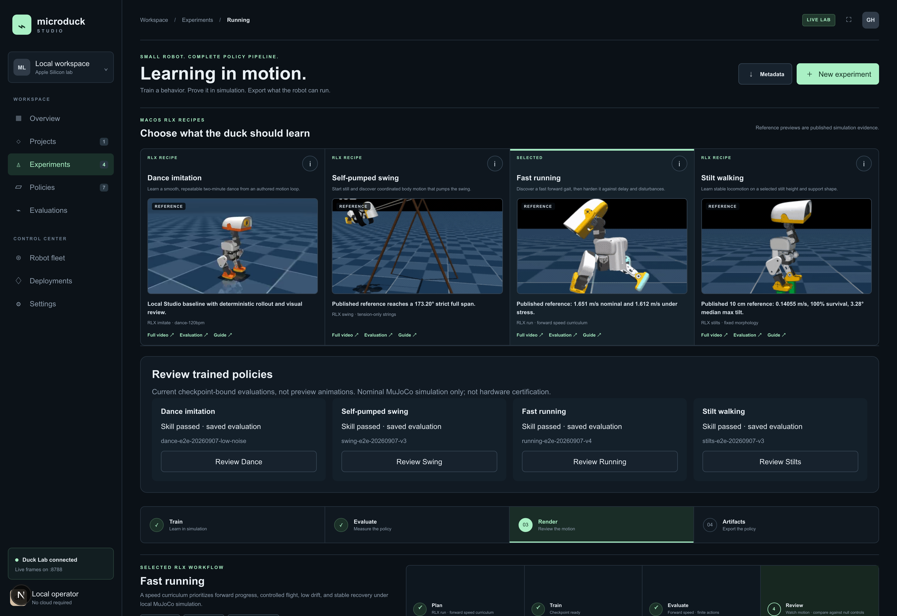

The screenshots inspect saved accepted runs, but the recipe form displays the current UI state. Entering an old run name retrieves its artifacts; it does not reconstruct every historical training parameter. Use the versioned JSON recipe and checkpoint sidecar, not the screenshot values, to reproduce the measured run.

## Select or create a run

Studio opens on the **Experiments** workspace. The first major table is headed
**Choose what the duck should learn** and offers four radio-style rows:
**Dance imitation**, **Self-pumped swing**, **Fast running**, and
**Stilt walking**.

To select an existing run:

1. Select the experiment row. This changes the active recipe and resets the
   form to that experiment's defaults.
2. In **Microduck PPO Recipe**, enter the existing run's name exactly in
   **Run name**.
3. Wait for the status poll to populate the checkpoint, ONNX, evaluation,
   render, and metadata indicators for that experiment/run pair.
4. Use the existing artifacts for evaluation or rendering. Do not select
   **Start RLX** unless you intend to replace the run or explicitly continue
   its checkpoint.

To create a run:

1. Select an experiment.
2. Select **New experiment**. Studio generates a name such as
   `running-143012` and scrolls to the recipe.
3. Replace that generated name with a descriptive identifier if needed.
4. Select **Pipeline smoke** first.
5. Expand **Advanced PPO and environment settings** to inspect the visible
   parameters and reward weights.
6. Select **Start RLX**.

`runName` is lowercased, spaces and unsupported characters become hyphens,
leading and trailing hyphens are removed, and the result is truncated to 48
characters. An empty result is rejected. Artifacts are owned by
`rlx/runs/studio/<experimentId>/<runName>/`; choosing the same experiment and
run name addresses the same files.

## Profiles: smoke is wiring, full is learning

The profile buttons are policy presets, not merely labels.

| Profile | Defaults and enforced settings | Meaning |
|---|---|---|
| `smoke` | Defaults: 2 envs, 2 rollout steps, 1 minibatch and 4 total timesteps. Enforced: 1 update epoch and all four randomization flags off. | Verifies process launch, environment stepping, PPO update, checkpoint, ONNX, evaluation, and render plumbing. It does not demonstrate a learned skill. |
| `full` | Scenario defaults, normally 16 envs; 24 rollout steps except Swing 64; 4 minibatches; scenario PPO defaults; randomization on unless explicitly disabled | Performs an actual training experiment. Full evaluation uses skill criteria rather than pipeline-only validity. |

Valid explicit API values can override smoke's environment count, rollout steps, minibatches, and budget. Those values are defaults, not hard limits; use the normalized response to see the actual batch. Only the stated enforced settings are forced by the smoke profile.

The full training budgets selected by **Default full** are 1,000,000 steps for
Dance and 4,000,000 steps for Swing, Running, and Stilts. These are experiment
budgets, not guarantees of success.

The rollout batch is

$$
B = N_{\text{env}}N_{\text{step}}.
$$

Studio normalizes the requested training budget to

$$
T_{\text{effective}} =
\max\left(B,\left\lceil\frac{T_{\text{requested}}}{B}\right\rceil B\right).
$$

For example, 16 environments and 24 rollout steps produce a batch of 384
transitions. A request for 1,000,000 steps becomes 1,000,320 so that PPO never
ends with a partial rollout.

## Identity, duration, and artifact fields

The following table covers every recipe field concerned with identity,
profiles, time horizons, and saved outputs. “Default” means the value chosen
by `normalizeRecipe` when an API caller omits the field.

| Field | Valid/default value | Purpose and effect |
|---|---|---|
| `experimentId` | `dance`, `swing`, `running`, or `stilts`; omitted becomes `dance` | Selects the environment, reward-key allowlist, artifact stem, PPO defaults, episode horizon, and skill evaluator. |
| `runName` | Sanitized lowercase name, `[a-z0-9_-]`, maximum 48 characters; scenario defaults are `dance-studio`, `swing-studio-01`, `running-studio`, and `stilts-10cm-studio` | Names the artifact directory. Reusing it addresses and may replace the same final checkpoint and ONNX files. |
| `profile` | `smoke` or `full`; omitted or unknown becomes `smoke` | Chooses pipeline versus skill evaluation and applies profile-dependent defaults and overrides. |
| `totalTimesteps` | Integer effectively clamped to 1–40,000,000, then raised to at least one batch and rounded up to a batch multiple; profile defaults are 4 or the scenario full budget | Number of **new** environment transitions requested from this training invocation. On resume, it is not the cumulative target. |
| `numEnvs` | 1–64 after rounding; default 2 in smoke, 16 in full | Number of parallel environments. It multiplies rollout size, throughput, memory use, and the step increment of the trainer. |
| `numSteps` | Integer 1–100,000; default 2 in smoke, 64 for full Swing, 24 for other full recipes | Control steps collected per environment before each PPO update. Longer rollouts improve temporal coverage but increase latency and batch size. |
| `numMinibatches` | Integer 1–100,000; default 1 in smoke, 4 in full; must not exceed or fail to divide `numEnvs * numSteps` | Splits one rollout batch into equal optimizer minibatches. Invalid divisibility is rejected rather than silently repaired. |
| `maxEpisodeS` | Finite value greater than 0 and at most 3,600; default 1 in smoke; full defaults: Dance 4, Swing 24, Running 12, Stilts 12 | Training/evaluation episode timeout. At 50 Hz, seconds multiply by 50 to give nominal control steps per complete episode. Full Running rejects values below 12 seconds. |
| `evalSteps` | Integer 1–10,000,000; default 4 in smoke; full default is the larger of 50 times the episode horizon and 500, except Running has a 600-step floor | Number of evaluation control steps **per environment**. Full Running rejects fewer than 600. Full Swing therefore defaults to 1,200. |
| `renderSeconds` | Finite value greater than 0 and at most 3,600; Dance defaults to 120, other recipes default to `maxEpisodeS` | Render-only horizon. It does not lengthen training episodes. Studio renders one 640 x 360 three-quarter-view episode. |
| `checkpointInterval` | Integer 0–40,000,000; default 100,000 | Interval in newly trained steps for snapshots under `checkpoints/`. Zero disables periodic snapshots, but the initial and final checkpoint behavior remains. |

The browser exposes `runName`, `profile`, `totalTimesteps`, and `numEnvs`.
The other fields in this table are API-capable fields. They can be supplied by
an HTTP recipe or the repository's API driver even though the current Studio
form does not show them.

## Scenario inputs and environment fields

| Field | Valid/default value | Purpose and effect |
|---|---|---|
| `danceClip` | `null`, or an existing JSON file resolving under workspace `dance-clip/` or `rlx/artifacts/`; Dance only | Replaces the built-in `dance-120bpm` motion source. The Python metadata records the resolved path and SHA-256 hash. |
| `dancePoseSigma` | `null`, or any finite number greater than 0; Dance only | Sets the width of the per-joint Gaussian pose-match term. Smaller values judge joint error more sharply; larger values grant partial credit farther from the target pose. |
| `locomotionForwardCommand` | `null`, or finite $0 < v_x \le 1.5$ m/s; Running or Stilts only | Pins every sampled command to `(v_x, 0, 0)`. `null` leaves the recipe's command sampler and curriculum active. The same pin is forwarded to train, evaluate, and render. |
| `domainRand` | Boolean; full defaults on, smoke forces off | Randomizes supported physical properties across resets. It improves robustness but broadens the learning problem. |
| `obsNoise` | Boolean; full defaults on, smoke forces off | Perturbs observations to reduce dependence on exact simulated sensing. |
| `actionDelay` | Boolean; full defaults on, smoke forces off | Introduces control delay so the policy must tolerate latency. |
| `randomYaw` | Boolean; full defaults on, smoke forces off | Randomizes initial yaw where the recipe supports it. Swing always resolves this to false because yaw is fixed to the seat axis. |
| `stiltHeightCm` | 0.8–300 cm; Studio default 10 cm | Defines stilt length. It changes morphology, leverage, center-of-mass geometry, and the policy's balance problem. Evaluate and render with the same value used in training. |
| `stiltBlend` | 0–1; Studio default 0.5 | Blends the stilt support/contact shape. Zero and one are the endpoints; intermediate values trade contact characteristics. |
| `stiltMassKg` | 0.001–2 kg in the API; Studio default 0.029 kg | Mass of each stilt. This changes inertia and actuator demand. The lower-level CLI can derive mass from height when omitted, but a normalized Studio recipe always sends an explicit value. |
| `swingInitialAngleDeg` | 0–30 degrees; default 0 | Training assistance that starts the swing displaced from rest. It is useful for discovery, but is forced back to 0 for skill evaluation. |
| `swingInitialRateRadS` | 0–1 rad/s; default 0 | Training assistance that gives initial angular motion. Like angle assistance, it does not count as learned self-pumping and is removed for skill evaluation. |
| `swingPlanarActions` | Boolean; effective only for Swing; default true in Studio/API | Restricts discovery actions to the mechanism's useful plane, reducing irrelevant exploration. Non-Swing recipes normalize it to false. |
| `swingMinSpanDeg` | 1–180 degrees; default 150 | Skill-evaluation threshold for **symmetric total span**. A 150-degree target requires at least 75 degrees on each side, plus complete episodes, valid geometry, and tensioned strings. |

The current browser exposes stilt and swing controls under **Advanced PPO and
environment settings**. It does not expose `danceClip`, `dancePoseSigma`, or
`locomotionForwardCommand`; those are API fields. Dance clips are normally
created in the **Animate** tab and can be selected by a caller that submits the
resulting path.

## PPO optimization fields

| Field | Valid/default value | Purpose and effect |
|---|---|---|
| `seed` | Normalized to an integer 1–2,147,483,647; default 1 | Seeds NumPy, MLX, and environment randomness. A seed is evidence for reproducibility, not proof that one result generalizes. |
| `learningRate` | Clamped to $10^{-6}$–0.1; Dance/Running/Stilts default $3\times10^{-4}$, Swing $10^{-4}$ | Adam step size. Too large destabilizes policy and critic updates; too small can make a fixed budget ineffective. |
| `gamma` | Clamped to 0.8–1; Dance/Running/Stilts default 0.99, Swing 0.995 | Reward discount. Higher values preserve more credit across long behaviors; Swing uses a longer horizon because pumping gains accumulate over many cycles. |
| `clipCoefficient` | Clamped to 0.01–1; Dance/Running/Stilts default 0.2, Swing 0.1 | PPO policy-ratio clip $\epsilon$. Smaller values make each update more conservative. |
| `updateEpochs` | Integer normalized to 1–20; Dance/Running/Stilts default 5, Swing 3; smoke effectively 1 | Number of passes over each rollout batch. More passes reuse data more aggressively and can overfit or increase KL drift. |
| `entropyCoefficient` | Clamped to 0–1; Dance/Running/Stilts default 0.01, Swing 0.002 | Weight on policy entropy. More entropy encourages exploration; too much can prevent a precise deterministic mean policy. |
| `maxGradNorm` | Clamped to 0.01–10; Dance/Running/Stilts default 0.5, Swing 1.0 | Global gradient-norm clipping threshold. It limits update spikes but cannot repair a malformed reward. |
| `initialStd` | Finite $0 < \sigma \le 10$; Dance/Running/Stilts default $e^{-0.5}\approx0.6065$, Swing 0.1 | Initial Gaussian action standard deviation for a **new** model. It is ignored when a checkpoint supplies the existing network and its learned log standard deviation. |
| `normalizeRewards` | Boolean; default true only for Swing | Enables return/reward normalization in the normalized training environment. It changes the scale seen by PPO and the meaning of the displayed rollout curve. |
| `freezeObservationNormalization` | Boolean; default false; true requires `resumeFromCheckpoint` | Loads observation-normalizer statistics from the checkpoint and prevents further updates. Useful when fine-tuning should preserve the old input scaling. |
| `resumeFromCheckpoint` | Boolean; default false; true requires the selected run's checkpoint to exist | Adds `--init-from` for training. The existing model, observation statistics, return statistics when present, and cumulative step count are loaded. |

The browser currently exposes the six main PPO values from `learningRate`
through `maxGradNorm`. `seed` is part of the browser recipe state but has no
general visible input; the Swing recovery buttons set it to 2.
`initialStd`, reward normalization, and normalization freezing are API-only.
The general browser shows checkpoint continuation only in the Swing controls,
although the API field itself is valid for all four recipes.

## Fixed PPO behavior not represented by recipe fields

Several important PPO settings are deliberately not editable through
`RlxRecipe`.

| Fixed setting | Effective Studio value | Role |
|---|---|---|
| `gae_lambda` | 0.95 for Dance, Running, and Stilts; 0.98 for Swing | Controls the bias/variance horizon of generalized advantage estimates. |
| `normalize_advantages` | `true` | Centers and scales advantages before the PPO policy loss. |
| `clip_value_loss` | `true` | Enables pessimistic clipping of critic changes. |
| `value_coefficient` | 1.0 in the Studio runner; core `PPOConfig` default is 0.5 | Scales critic loss in the combined PPO objective. |
| Huber delta | 10 | Makes critic loss quadratic near zero and linear for large errors. |
| Log-ratio cap | `[-20, 20]` | Prevents overflow before exponentiating the policy probability ratio. |

Generalized advantage estimation uses

$$
\delta_t = r_t + \gamma V(s_{t+1}) - V(s_t),
$$

$$
\hat A_t = \sum_{l=0}^{L-1}(\gamma\lambda)^l\delta_{t+l}.
$$

Here, the bootstrap is zero for true termination, uses the terminal-observation value for time-limit truncation, and advantage propagation stops at either boundary. These compact equations describe a single uninterrupted segment; the foundations chapter gives the exact boundary-aware recursion. The critic consumes actor observations, even though the conventional shorthand above calls them $s$.

Studio passes `gae_lambda=0.95` for Dance, Running, and Stilts, and `0.98` for
Swing. Advantages are normalized before each loss calculation:

$$
\hat A \leftarrow
\frac{\hat A-\operatorname{mean}(\hat A)}
{\operatorname{std}(\hat A)+10^{-8}}.
$$

The policy ratio is

$$
r_t(\theta)=
\exp\left(
\operatorname{clip}\left[
\log\pi_\theta(a_t|s_t)-\log\pi_{\text{old}}(a_t|s_t),
-20,20
\right]\right).
$$

The `[-20, 20]` cap is a numerical guard applied before exponentiation. The
policy objective uses the standard pessimistic PPO maximum of the negative
unclipped and clipped surrogate losses.

The critic does **not** use ordinary mean-squared error. For error
$e=V_\theta(s)-R$, it uses a Huber loss with delta 10:

$$
H_{10}(e)=
\begin{cases}
\frac{1}{2}e^2, & |e|\le 10,\\
10(|e|-5), & |e|>10.
\end{cases}
$$

Value clipping is enabled. The implementation computes both the Huber loss of
the new value and the Huber loss after clipping the value change to the same
`clipCoefficient` interval used by PPO, then takes the larger loss. This is
the pessimistic value-clipping form:

$$
L_V=\operatorname{mean}
\left[
\max\left(
H_{10}(V_\theta-R),
H_{10}(V_{\text{old}}+
\operatorname{clip}(V_\theta-V_{\text{old}},-\epsilon,\epsilon)-R)
\right)
\right].
$$

The combined minimized loss is

$$
L=L_{\text{policy}}-c_H H(\pi)+c_V L_V.
$$

Core `PPOConfig` declares `value_coefficient=0.5`, but the current Studio
Python command parser explicitly defaults `--value-coefficient` to `1.0`.
Because `rlx-job.ts` does not pass that flag, **Studio's effective
`value_coefficient` is 1.0**, not the core dataclass default. The metadata
records this effective value. `clip_value_loss=true` and
`normalize_advantages=true` are also parser defaults and are not exposed by
the Studio recipe.

The Microduck actor clamps each learned action log standard deviation to
`[-5, -0.5]` before sampling and constrains the stored parameter after updates.
Thus the effective standard deviation remains between
$e^{-5}\approx0.0067$ and $e^{-0.5}\approx0.6065$. Although the API accepts an
`initialStd` as high as 10, a fresh model immediately uses the clamped upper
bound. This is separate from the wider generic distribution utility's bounds;
the Microduck model's tighter limits are the ones that govern these recipes.

## Requested versus effective values on resume

**Continue current checkpoint** means “train for another
`totalTimesteps`,” not “train until cumulative steps equal
`totalTimesteps`.” If a checkpoint contains 250,000 completed steps and the
new request contains 500,000, the resulting metadata reports approximately
750,000 cumulative steps, subject to rollout-batch rounding.

Resume loads:

* Actor and critic parameters, including learned action log standard deviation.
* Observation running mean, variance, and count.
* Return-normalization statistics when present.
* The previous cumulative step count for metadata.

Resume does not restore an optimizer state in this runner; a new Adam
optimizer is constructed with the newly requested learning rate. It also does
not use `initialStd`, because no new actor is created. Requested PPO
coefficients, rollout shape, rewards, randomization, and episode settings take
effect for the new training segment. This makes a resumed run a fine-tuning
stage, not a byte-for-byte continuation of an interrupted optimizer.

`freezeObservationNormalization=true` preserves the loaded observation
scaling while the policy changes and also restores the checkpoint's
normalizer epsilon and clipping values. With it false, loaded mean, variance,
and count seed the normalizer and continue updating under the new
environment's epsilon and clipping defaults. Reward normalization is
separately controlled by `normalizeRewards`; loaded return statistics are
restored when available.

Be careful with artifacts. Training writes the selected run's final checkpoint
and normally exports ONNX automatically. Starting a fresh run with the same
name and `resumeFromCheckpoint=false` replaces the final lineage at that path.
A changed reward weight defines a new experiment conceptually, so use a new run
name instead of evaluating an old checkpoint against a newly edited reward
form.

## Reward weights: sign and interpretation

`rewardWeights` is an object mapping known term keys to absolute,
non-negative coefficients. Unknown keys, negative values, infinities, and
NaNs are rejected; the API caps each weight at 10,000. Penalty measurements
are already negative, so their coefficients remain positive. Do not negate a
penalty weight.

Conceptually,

$$
r_t=\sum_i w_i q_i(s_t,a_t),\qquad w_i\ge0,
$$

where reward measurements $q_i$ are positive and penalty measurements are
non-positive. Increasing a coefficient increases that term's influence, but
does not guarantee the desired motion is explored. If no rollout ever enters
the target state, change the curriculum or physics assistance before endlessly
retuning weights.

### Dance reward terms

| Key and default | Kind | What it pays for |
|---|---|---|
| `pose_match` 4 | Reward | Joint pose at the current clip frame; `dancePoseSigma` controls tolerance. |
| `rotation_match` 4 | Reward | Body rotation synchronized to clip timing. |
| `stick_it` 5 | Reward | Finishing a one-shot trick standing on both feet. |
| `on_feet` 5 | Reward | Remaining upright, tall, and in foot contact during a loop. |
| `travel` 3 | Reward | Forward movement rather than dancing in place. |
| `no_slip` 0.5 | Penalty | Planted feet sliding over the floor. |
| `no_spin` 0.3 | Penalty | Unwanted yaw when travel should remain straight. |
| `gentle_head` 1 | Penalty | Head-floor impacts, scaled by severity. |
| `soft_landings` 0.75 | Penalty | Excessive landing impact. |
| `no_limit_parking` 1 | Penalty | Holding joints against end stops. |
| `save_energy` 0.5 | Penalty | Excessive actuator torque. |

### Swing reward terms

| Key and default | Kind | What it pays for |
|---|---|---|
| `swing_peak_progress` 224 | Reward | A new angular frontier on either side; prevents repeated payment for the same arc. |
| `swing_height` 8 | Reward | Height throughout the episode. |
| `swing_late_height` 24 | Reward | Height later in the attempt, encouraging sustained pumping. |
| `swing_energy` 0.5 | Reward | Useful pendulum height and angular speed. |
| `swing_lateral_penalty` 3 | Penalty | Sideways offset from the swing plane. |
| `swing_lateral_barrier_penalty` 8 | Penalty | Strong charge beyond the safe lateral band. |
| `swing_lateral_velocity_penalty` 3 | Penalty | Fast sideways movement. |
| `swing_out_of_plane_penalty` 1 | Penalty | Roll and yaw angular velocity. |
| `swing_alignment_penalty` 18 | Penalty | Misalignment of the two attachment axes. |
| `swing_alignment_barrier_penalty` 4 | Penalty | Strong charge after alignment exceeds its valid range. |
| `string_slack_penalty` 8 | Penalty | Slack or unequal string lengths. |
| `string_extension_penalty` 12 | Penalty | Strings stretched beyond intended length. |
| `invalid_episode_penalty` 10 | Penalty | Persistent invalid mechanism geometry. |
| `action_rate_penalty` 0.03 | Penalty | Abrupt changes between policy actions. |
| `joint_torque_penalty` 0.001 | Penalty | Excessive actuator force. |
| `joint_limit_penalty` 1 | Penalty | Motion beyond joint limits. |

### Running reward terms

| Key and default | Kind | What it pays for |
|---|---|---|
| `keep_pace` 4 | Reward | Matching commanded body-frame velocity. |
| `track_turn` 2 | Reward | Matching commanded yaw rate. |
| `air_time` 3 | Reward | Useful duration of individual foot flight. |
| `flight` 0 | Reward | Optional bounded both-feet flight, gated by upright posture and command-directed speed. |
| `yaw_tracking` 0 | Reward | Optional yaw-only tracking from observed gyro and commanded turn rate. |
| `stay_upright` 2 | Reward | Upright trunk while allowing running lean. |
| `pose` 1 | Reward | Speed-appropriate running posture. |
| `head_up` 3.5 | Reward | Head alignment with its command. |
| `foot_clearance` 2 | Penalty | A moving foot at the wrong height. |
| `plant_the_foot` 0.1 | Penalty | Skidding by a planted foot. |
| `smooth_moves` 1 | Penalty | Jerky actions as the gait curriculum advances. |
| `no_limit_parking` 1 | Penalty | Joints held against end stops. |
| `calm_roll` 0.025 | Penalty | Excessive trunk roll and pitch angular velocity. |

### Stilts reward terms

| Key and default | Kind | What it pays for |
|---|---|---|
| `track_lin_vel` 2.5 | Reward | Requested linear velocity. |
| `track_ang_vel` 1 | Reward | Requested yaw rate. |
| `yaw_tracking` 0 | Reward | Optional yaw-only tracking independent of roll and pitch. |
| `upright` 3 | Reward | A level trunk on raised contacts. |
| `pose` 0 | Reward | Optional pull toward the default leg pose. |
| `head_pose` 0.25 | Reward | Requested head posture without dominating balance. |
| `feet_air_time` 2 | Reward | Controlled swing phases while walking. |
| `action_rate_penalty` 0.2 | Penalty, fixed | Twenty percent of the walking curriculum's dynamic action-rate penalty. It is displayed but excluded from editable `rewardWeights`. |
| `ang_vel_xy_penalty` 0.05 | Penalty | Excessive roll and pitch angular velocity. |

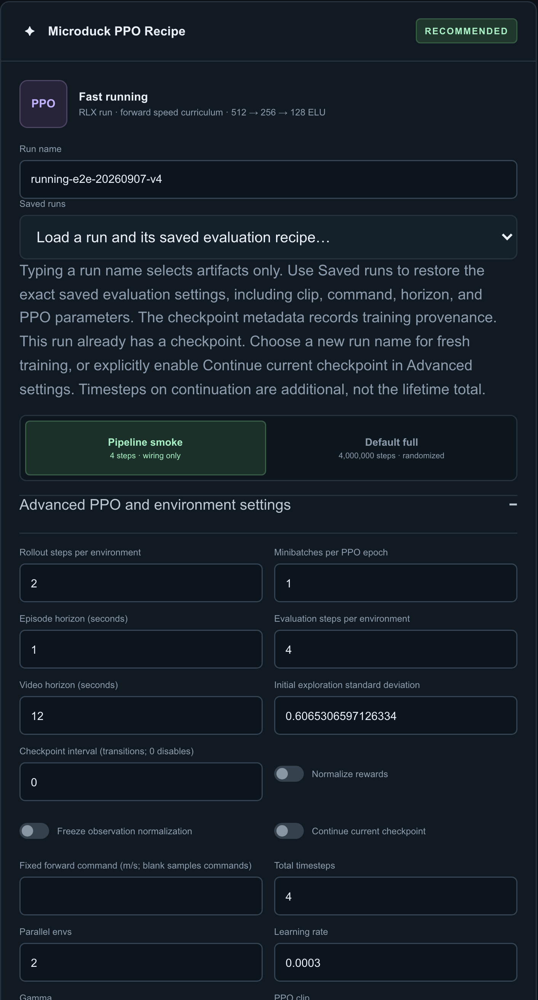

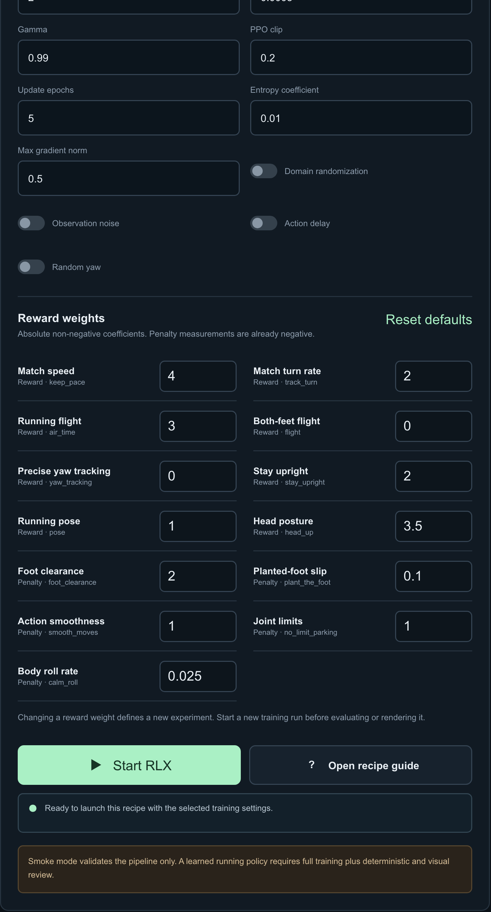

## Train from the UI

1. Select the experiment and choose a unique run name.
2. Select **Pipeline smoke** and leave reward defaults unchanged.
3. Select **Start RLX**. The button changes to a running state, the progress
   bar advances, and **Reward history** receives one point per completed PPO
   rollout. A normalized curve is labeled as normalized when Swing reward
   normalization is active.
4. Open **View logs** if launch or validation fails. The log is the right place
   to find an invalid minibatch divisor, missing checkpoint, invalid clip path,
   or Python error.
5. Confirm that checkpoint, metadata, and ONNX artifacts appear. Smoke proves
   the pipeline only.
6. Select **Default full**, inspect advanced settings, assign a new run name
   if this is a materially different reward or environment recipe, and select
   **Start RLX** again.

Only one local RLX process can run at a time. A job for another run makes the
button read **RLX busy**. **Stop train/eval/render** sends `SIGTERM` and marks
the current job cancelled.

For Swing, the UI supplies a staged recovery workflow. **Apply exact Discovery
settings** requests 250,000 new steps, seed 2, 16 environments, 12 degrees and
0.35 rad/s of initial assistance, planar actions, no randomization/noise/delay,
and the Swing PPO defaults. After still-start evaluation demonstrates at least
10 degrees mean span or 20 degrees best span, **Apply exact Consolidation
settings** requests 500,000 additional steps from the same checkpoint, reduces
assistance to 4 degrees and 0.12 rad/s, and enables randomization, noise, and
delay.

## Evaluate from the UI

1. Select the experiment and enter the run name containing a checkpoint or
   ONNX policy.
2. Set **Pipeline smoke** only when checking execution. Select **Default full**
   when asking whether the skill passes.
3. Select **Run evaluation** in **Evaluation gate**.
4. Read the saved scope. Smoke maps to `evaluation_mode=pipeline`; full maps
   to `evaluation_mode=skill`.
5. Inspect **Rollout validity** separately from the scenario metric. Finite
   observations, actions, and rewards prove numerical execution, not skill.
6. Require the scenario row to say **Accepted** before treating the skill gate
   as passed.

Evaluation prefers the run's ONNX file when present and otherwise evaluates
the checkpoint. The report hashes its source. Studio only retains an
authoritative verdict while those owned artifact bytes and the normalized
environment settings still match. Editing the current form does not rewrite a
saved result, and changing the evaluated environment invalidates its authority.

Full Dance evaluates at least 500 steps and the complete clip horizon. Full
Running requires 600 steps and a 12-second episode. Full Stilts defaults to at
least 600 steps in Studio because its full episode horizon is 12 seconds. Full
Swing uses 1,200 steps, starts from 0 degrees and 0 rad/s, and applies the
selected symmetric span target.

## Render and review from the UI

1. After a checkpoint exists, select **Render rollout**.
2. Studio chooses ONNX when available, otherwise the checkpoint.
3. Wait for the **LATEST RUN** video player and contact-sheet links to appear.
4. Play the complete MP4, then open the contact sheet for time-separated
   posture and metric checks.
5. Compare the visible behavior with the intended skill and, when relevant,
   with a null control. Reward and return alone can approve the wrong motion.
6. Select **I reviewed the rendered motion** only after completing that review.

Render is intentionally deterministic and clean: one episode, 640 x 360,
three-quarter camera, and all randomization/noise/delay/yaw perturbations off.
Dance disables fall termination so a requested 120-second choreography render
can continue; this does not erase a fall from visual review.

The deployment handoff remains gated until an ONNX file exists, deterministic
skill evaluation passes, the render exists, and the visual-review checkbox is
selected. Hardware validation remains a separate requirement.

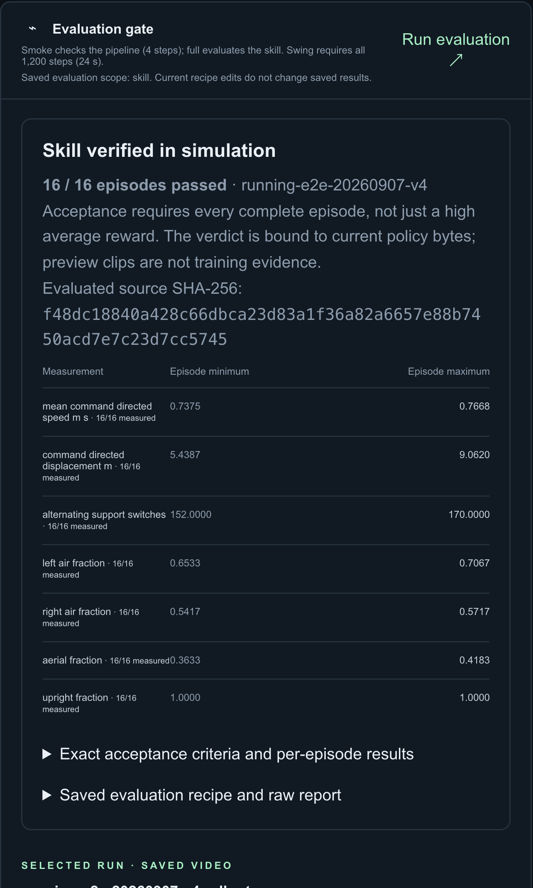

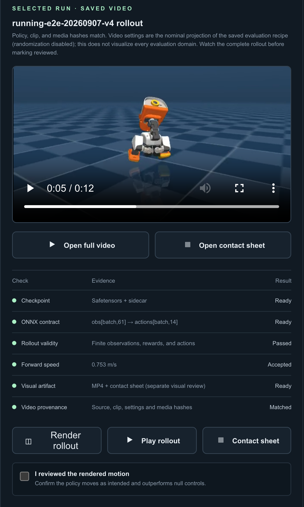

## UI versus API reference

The UI is intentionally simpler than `RlxRecipe`. The API is the complete
surface.

| Surface | Fields you can set directly | Important behavior |
|---|---|---|
| Main Studio form | Experiment, run name, profile, total timesteps, parallel envs, six PPO controls, four randomization toggles, stilt controls, swing controls, editable reward weights | Optimized for normal local operation. Scenario selection resets the form to defaults. |
| Studio preset buttons | Full/smoke profiles and exact Swing Discovery/Consolidation values | Presets modify several fields together. Read the resulting form before launch. |
| `POST /api/rlx` | Every `RlxRecipe` field | Returns the normalized recipe. Use this surface for rollout shape, horizons, clip paths, pinned commands, initial exploration, normalization controls, and checkpoint cadence. |
| Python CLI | Studio recipe arguments plus lower-level source/output, backend, actuator, render geometry, and evaluator controls | The Studio wrapper intentionally fixes many CLI details to preserve a consistent local workflow. |

For API-driven evidence, save both the submitted recipe and the accepted
normalized recipe. The repository's HTTP driver does this as
`requestedRecipe` and `normalizedRecipe`. That pairing explains clamping,
defaults, profile overrides, and rollout rounding without guesswork.

## Parameter-reading checklist

Before accepting a run, answer these questions from artifacts rather than
memory:

1. Which `experimentId` and sanitized `runName` own the files?
2. Was the operation smoke/pipeline or full/skill?
3. How many **new** steps were requested, what batch multiple was effective,
   and what cumulative step count is in metadata?
4. Was the model new or loaded through `resumeFromCheckpoint`?
5. Which PPO values were effective, including fixed GAE, advantage
   normalization, value coefficient, value clipping, Huber delta, and
   log-standard-deviation limits?
6. Were reward normalization and observation-normalizer freezing active?
7. Which randomization and morphology settings governed training, evaluation,
   and rendering?
8. Do reward keys and weights match the checkpoint's experiment?
9. Does deterministic evaluation explicitly assess the skill, rather than
   merely pass the finite pipeline check?
10. Has the complete rendered motion been inspected?

That discipline turns the Studio from a collection of controls into a
reproducible experiment system.

# Dance Imitation: Learning a Timed Joint Choreography

## Learning Objectives

After this chapter, you should be able to:

- explain why playing an authored animation is different from controlling a physical robot;
- trace the dance experiment from clip preparation through PPO, ONNX export, and independent evaluation;
- derive the pose and dynamic-tracking metrics used to reject a stationary imitation;
- distinguish training reward, optimizer telemetry, deterministic skill evidence, and visual evidence;
- reproduce the recorded experiment without expanding its claim beyond the selected excerpt.

This chapter studies one verified result: a Microduck policy learned an **eight-second excerpt** from `dance-clip/bachata_microduck_v2.clip.json`. The source clip lasts 60.923 seconds, but the experiment did not train or validate the complete choreography. A separate sixteen-second test repeats the learned eight-second excerpt twice. It does not evaluate the first sixteen seconds of the original clip.

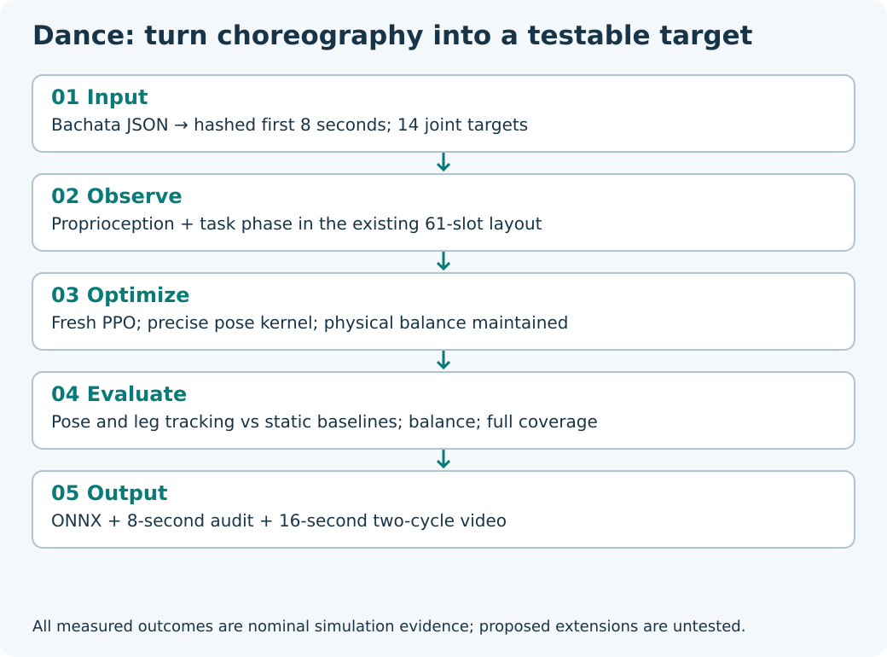

### Evidence labels used in this chapter

- **Measured** means a number is read from the retained recipe, checkpoint sidecar, JSONL optimizer journal, evaluation JSON, NPZ trace, or media validation artifact.
- **Implemented contract** means a behavior is enforced by the current source or focused tests, but the sentence is not itself a new experiment.
- **Inference** means a conclusion follows from measured evidence and code structure but was not isolated by a controlled ablation.
- **Pseudocode** is explanatory and is not directly executable.
- **Runnable** marks commands that can be executed from the workspace root. Commands that launch training are separately labeled because they are expensive and create new artifacts.

## Source-of-Truth Map

The chapter is grounded in the following workspace files:

| Evidence role | Authoritative local source |
|---|---|
| Deployment observation and action order | `microduck_local/src/microduck_local/contract.py` |
| Physics step, raw/applied action handling, observations | `microduck_local/src/microduck_local/walk_env.py` |
| Clip JSON loader and 50 Hz interpolation | `microduck_local/src/microduck_local/motion.py` |
| Imitation behavior and default reward terms | `microduck_local/src/microduck_local/behaviors/imitate.py` |
| Phase injection and weighted reward assembly | `microduck_local/src/microduck_local/behaviors/env.py` |
| Dance-specific Gaussian pose replacement and state evidence | `rlx/rlx/environments/microduck_recipes.py` |
| RLX vector adapter and normalization | `rlx/rlx/environments/microduck.py` |
| Actor-critic architecture and checkpoint format | `rlx/rlx/models/microduck.py` |
| PPO rollout, GAE, loss, numerical guards, and sample counting | `rlx/rlx/algorithms/ppo.py` |
| Deterministic ONNX graph | `rlx/rlx/export/microduck_onnx.py` |
| Studio train/eval/render/export CLI | `rlx/examples/ppo_microduck_studio.py` |
| Strict dance gate | `rlx/rlx/environments/dance_evaluation.py` |
| Excerpt and recipe generator | `rlx/scripts/dance_e2e.py` |
| Independent checkpoint/control audit | `rlx/scripts/audit_dance.py` |
| Recorded successful recipe | `rlx/artifacts/dance-e2e-20260907/recipe-low-noise.json` |
| Recorded successful checkpoint metadata | `rlx/runs/studio/dance/dance-e2e-20260907-low-noise/dance.safetensors.json` |
| Recorded independent result | `rlx/artifacts/dance-e2e-20260907/final-audit/audit.json` |

The local training playbook in `microduck_local/AGENTS.md` supplies the interpretation rules used here: do not change the 61/14 interface per task, do not treat reward as proof, export the observation normalizer with ONNX, compare with null controls, and visually inspect deterministic rollouts.

## The Task: Animation Becomes Control

An animation clip supplies desired joint angles over time. At control step $t$, let the fourteen-joint target be

$$
\mathbf{q}^{*}_t \in \mathbb{R}^{14}.
$$

The simulator contains the robot's actual joint positions $\mathbf{q}_t$, velocities, orientation, contacts, and actuator dynamics. A policy does not directly set $\mathbf{q}_t=\mathbf{q}^{*}_t$. It emits fourteen raw actions,

$$
\mathbf{a}_t = \pi_\theta(\mathbf{o}_t) \in \mathbb{R}^{14},
$$

which the environment transforms into servo targets through $\mathbf q^{\mathrm{target}}_t=\mathbf q^{\mathrm{default}}+\operatorname{clip}(\mathbf a_t,-4,4)$. The actor itself has a linear mean and Gaussian sampling, not a tanh-bounded output. The base environment records the raw previous action while clipping the applied offset. MuJoCo then advances the physical state. Balance, inertia, contact, and actuator response determine what pose is reached.

This distinction matters. A diagnostic controller that directly chased the reference joint angles fell after 0.98 seconds. The successful policy had to approximate the choreography while also learning stabilization. Therefore, the output is not an animation player. It is a feedback controller whose behavior is conditioned on the standard 61-dimensional observation.

The clip loader uses fourteen joint values and `rootPitch`. It does not imitate authored `rootYaw`, `rootRoll`, `rootPosition`, or contact annotations. The demonstrated result is consequently **time-aligned joint-pose imitation with physical balance**, not exact reconstruction of the full authored world-space motion.

## Inputs and Contract

The experiment preserves the shared deployment interface:

| Item | Contract |
|---|---|
| Observation | 61 floating-point values |
| Action | 14 raw joint-target offsets; applied offsets clipped to $[-4,4]$ rad |
| Control rate | 50 Hz |
| Selected reference | First contiguous 8 seconds |
| Reference samples | 400 control steps |
| Training actuator | Nominal XML servo model |
| Policy output | Deterministic ONNX actor |

### Exact observation tensor

**Implemented contract.** One unnormalized observation is a `float32` vector in this fixed order:

| Slice | Width | Meaning | Dance-specific behavior |
|---|---:|---|---|
| `0:3` | 3 | trunk angular velocity | ordinary physical state |
| `3:6` | 3 | projected gravity in the trunk frame | exposes pitch and roll, not world yaw |
| `6:20` | 14 | joint position minus `DEFAULT_POSE` | ordinary physical state |
| `20:34` | 14 | joint velocity | intentionally delayed one control step |
| `34:48` | 14 | previous raw policy action | raw value, even if the actuator command was clipped |
| `48:51` | 3 | twist command | zero for this Dance recipe |
| `51:55` | 4 | head command | tiny keep-alive noise in the base behavior |
| `55:59` | 4 | first four body-command values | tiny keep-alive noise in the base behavior |
| `59:61` | 2 | last two body-command values | replaced by clip phase $(\sin\phi,\cos\phi)$ |

The vector environment presents a batch with shape `(num_envs, 61)`. During training, running mean and variance are updated from these raw observations, normalization uses

$$
\widehat{\mathbf o}
=
\operatorname{clip}
\left(
\frac{\mathbf o-\boldsymbol\mu_o}
{\sqrt{\boldsymbol\sigma_o^2+10^{-8}}},
-10,10
\right),
$$

and the normalized `float32` batch is passed to the MLX network. Evaluation gives raw observations to the exported ONNX graph because the graph contains the same subtraction, variance offset, square root, division, and clipping operations.

### Exact action tensor and actuator path

**Implemented contract.** Training samples a batch shaped `(num_envs, 14)` from a diagonal Gaussian. The deterministic actor returns its mean. There is no actor-side `tanh`:

$$
\mathbf a_t \sim
\mathcal N\!\left(\boldsymbol\mu_\theta(\widehat{\mathbf o}_t),
\operatorname{diag}(\boldsymbol\sigma_\theta^2)\right).
$$

The environment stores the full raw action in `last_action`, exposes that raw value in the next observation, and only then computes

$$
\widetilde{\mathbf a}_t
=
\operatorname{clip}(\mathbf a_t,-4,4).
$$

With action delay disabled in the recorded recipe, the MuJoCo servo target is

$$
\mathbf q^{\mathrm{ctrl}}_t
=
\mathbf q^{\mathrm{default}}+\widetilde{\mathbf a}_t.
$$

The physics timestep is 0.005 seconds and each control action is held for four MuJoCo steps, giving a 0.02-second control interval. The recorded policy's exported ONNX interface is named `observations -> actions`, uses `float32`, and has dynamic batch shapes `("batch", 61) -> ("batch", 14)`.

The policy is memoryless, so it needs an observable clock. The existing imitation environment places a cyclic phase signal into two otherwise unused body-command slots:

$$
\phi_t = 2\pi \frac{t \bmod T}{T},
\qquad
\mathbf{p}_t =
\begin{bmatrix}
\sin \phi_t \\
\cos \phi_t
\end{bmatrix}.
$$

Using sine and cosine avoids a discontinuous scalar clock at the loop boundary. It also preserves the 61-value interface: the observation layout is not enlarged or reordered. The frozen-phase negative control confirms that this timing information matters. With the two phase slots held fixed, the final network survived but failed all five held-out trials because its dynamic tracking gain became negative.

The reference-preparation script records hashes for both the original source and generated excerpt. It retains the first eight seconds without amplitude scaling or teacher actions, interpolates the endpoint on the 50 Hz grid, and keeps looping enabled. Those provenance details prevent a later run from silently training on a different clip.

## Motion Dataset Construction

### Authored JSON contract

**Implemented contract.** `load_clip` accepts version-1 JSON with this logical schema:

```json
{
  "version": 1,
  "name": "clip name",
  "duration": 8.0,
  "loop": true,
  "keys": [
    {
      "t": 0.0,
      "joints": [0.0, 0.0, 0.0, 0.0, 0.0, 0.0, 0.0, 0.0, 0.0, 0.0, 0.0, 0.0, 0.0, 0.0],
      "rootPitch": 0.0
    }
  ]
}
```

Each `joints` array is interpreted in the deployment joint order:

```text
left_hip_yaw, left_hip_roll, left_hip_pitch, left_knee, left_ankle,
neck_pitch, head_pitch, head_yaw, head_roll,
right_hip_yaw, right_hip_roll, right_hip_pitch, right_knee, right_ankle
```

The source Bachata file has 401 authored keys over 60.92307692307693 seconds. The prepared eight-second file has 55 retained/interpolated keys, while the loaded training array has 400 control-rate rows. Authored key count and training sample count are therefore different quantities.

### Resampling onto the control grid

For duration $D$ and control frequency $f_c=50$ Hz, the loader computes

$$
T=\max(\operatorname{round}(Df_c),1),
\qquad
t_i=\frac{i}{f_c},
\quad
i\in\{0,\ldots,T-1\}.
$$

Every joint and `rootPitch` is independently linearly interpolated at each $t_i$. The eight-second reference therefore contains samples at 0.00 through 7.98 seconds. `Clip.at(400)` wraps to index zero because the excerpt is looping. The preparation script nevertheless appends an authored endpoint key at exactly 8.0 seconds, obtained by querying the original source clip at source step 400. That endpoint makes the generated JSON explicit at the excerpt boundary; the runtime loader still constructs exactly 400 rows.

**Pseudocode, not runnable:**

```text
source = parse_json(source_path)
sorted_keys = sort(source.keys by key.t)
full_clip = resample_each_joint_and_pitch(sorted_keys, 50_hz)
excerpt_steps = round(seconds * 50)
excerpt_keys = authored_keys_where_t_is_less_than_seconds
endpoint_joints, endpoint_pitch = full_clip.at(excerpt_steps)
append_key(t=seconds, joints=endpoint_joints, rootPitch=endpoint_pitch)
write_looping_excerpt_and_sha256_provenance()
```

**Measured.** The recorded source hash is `306164a79a0edb494c856cda09c9f0b4a36546fcf85bb53f940ed0dc697f6a12`; the generated reference hash is `108bf9e56b374b36d2d86c0698bace538ac5d1db0b57d4669d94d4c739190eac`. Twelve of fourteen reference joints exceed the evaluator's 0.03-rad moving-joint threshold; eight of those are leg joints. Left and right hip-yaw remain below that threshold in the full eight-second excerpt.

### What is and is not a dataset

This workflow does not construct observation-action demonstrations. There are no teacher actions, behavior-cloning labels, replay transitions, or privileged-state inputs. The "dataset" is a deterministic time-indexed target table:

$$
\mathcal D_{\mathrm{motion}}
=
\left\{
\left(i,\mathbf q_i^*,p_i^*\right)
\right\}_{i=0}^{399},
$$

where $p_i^*$ is reference root pitch. PPO still collects its own on-policy tuples $(\mathbf o_t,\mathbf a_t,r_t,\mathbf o_{t+1})$ from physics. Calling the clip a motion dataset is useful, but calling it a demonstration-action dataset would be incorrect.

## Policy and Optimizer Architecture

### Actor-critic

**Implemented contract.** Actor and critic are separate multilayer perceptrons. Each uses hidden widths 512, 256, and 128 with ELU activations:

$$
\text{actor mean}: 61 \rightarrow 512 \rightarrow 256 \rightarrow 128 \rightarrow 14,
$$

$$
\text{critic}: 61 \rightarrow 512 \rightarrow 256 \rightarrow 128 \rightarrow 1.
$$

The actor also owns fourteen state-independent log-standard-deviation parameters. For the recorded run, all are initialized to $\log(0.1)$. The Microduck model constrains log standard deviation to `[-5.0, -0.5]` before sampling and after every optimizer update. The deterministic ONNX export discards the critic and stochastic standard deviation, retaining only normalization plus the actor mean.

The complete trainable actor-critic contains 393,885 scalar parameters: 197,774 in the actor mean, 14 actor log-standard deviations, and 196,097 in the critic. The two networks do not share hidden layers.

### Rollout storage

One rollout buffer stores:

- observations and next observations: `(128, 16, 61)`;
- actions: `(128, 16, 14)`;
- rewards, terminations, truncations, values, and log probabilities: `(128, 16)`.

The rollout therefore holds 2,048 environment transitions. Timeout states are handled separately: if an episode truncates, PPO requires the true `terminal_observation`, evaluates its critic value, and uses that value in GAE instead of bootstrapping from the autoreset observation.

## Reward Design

The most important shaping term is a per-joint Gaussian pose score. With precision parameter $\sigma=0.2$ rad,

$$
r_{\text{pose},t}
=
\frac{1}{14}
\sum_{j=1}^{14}
\exp\left[
-\left(
\frac{q_{t,j}-q^{*}_{t,j}}{0.2}
\right)^2
\right].
$$

The final recipe multiplies this term by 40. A joint exactly on target contributes 1 before weighting. An error equal to $\sigma$ contributes $e^{-1}\approx0.368$. This sharper, per-joint kernel makes a broad stationary compromise less rewarding than the inherited pose score did.

The complete reward also retains terms for root-pitch matching, staying on the feet, avoiding slip and spin, gentle head contact, soft landings, joint-limit avoidance, and energy use. Forward travel is disabled. In compact form,

$$
r_t
=
40r_{\text{pose},t}
+4r_{\text{rotation},t}
+5r_{\text{feet},t}
-0.5c_{\text{slip},t}
-0.3c_{\text{spin},t}
-c_{\text{head},t}
-0.75c_{\text{landing},t}
-c_{\text{limit},t}
-0.0005c_{\text{energy},t}.
$$

This equation communicates the structure, not permission to infer causality from weights alone. The experiment did not perform a complete one-factor ablation. It established that the recorded combination worked, while earlier two-million-transition variants did not meet the dynamic-tracking gate.

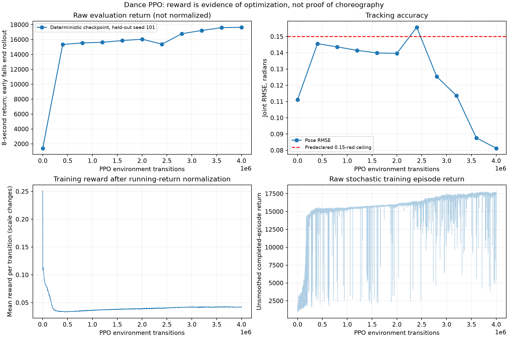

### Exact reward assembly

**Implemented contract.** `BehaviorEnv` evaluates every configured term after the physics step, multiplies it by the active non-negative weight, and uses Python's built-in compensated `sum` for the scalar reward. Penalty functions return non-positive values; their weights remain non-negative.

| Output contribution | Recorded weight | Active meaning |
|---|---:|---|
| `pose_match` | 40.0 | per-joint Gaussian pose score with $\sigma=0.2$ |
| `rotation_match` | 4.0 | instantaneous root-pitch agreement for a looping clip |
| `stick_it` | 5.0 | zero for this looping clip |
| `on_feet` | 5.0 | upright, standing-height, foot-contact score |
| `no_slip_penalty` | 0.5 | squared horizontal velocity of contacting feet |
| `no_spin_penalty` | 0.3 | negative squared yaw rate |
| `travel` | 0.0 | explicitly disabled |
| `gentle_head_penalty` | 1.0 | head-floor impact penalty |
| `soft_landings_penalty` | 0.75 | vertical landing-impact penalty |
| `no_limit_parking_penalty` | 1.0 | joint-limit parking penalty |
| `save_energy_penalty` | 0.0005 | motor-strain penalty |

The `dancePoseSigma` option does not add a second pose reward. It replaces the inherited whole-body two-kernel function in the environment's precomputed reward rows with the per-joint Gaussian shown above. This distinction matters when reproducing earlier stages: setting `pose_match` to 40 without also setting `dancePoseSigma` uses a different function.

**Inference.** The per-joint mean makes errors local: tracking thirteen joints cannot fully hide one badly wrong joint. The inherited implementation first sums squared error over all fourteen joints and applies broad whole-pose kernels, so it is easier for a nearly static compromise to retain substantial credit. The experiment history is consistent with that mechanism, but it is not a complete controlled ablation.

## Training Process

The successful actor began from random initialization. It used no behavior cloning, teacher policy, physical assistance, joint-target feed-forward, or warm-start checkpoint. The recorded run used:

| Setting | Value |
|---|---:|
| Seed | 7 |
| Environment workers | 16 |
| Rollout length | 128 steps per worker |
| Batch size | 2,048 transitions |
| PPO epochs | 4 |
| Minibatches per epoch | 4 |
| Learning rate | $10^{-4}$ |
| Discount $\gamma$ | 0.99 |
| GAE $\lambda$ | 0.95 |
| PPO clip $\epsilon$ | 0.2 |
| Initial action standard deviation | 0.1 rad |
| Total transitions | 4,001,792 |

### Requested versus actual PPO samples

Let

$$
B=N_{\mathrm{env}}N_{\mathrm{step}}
$$

be transitions per rollout. The PPO loop always collects a complete rollout before checking its outer `while self.step < target` condition again. Therefore, for a generic requested target $S$,

$$
U=\left\lceil\frac{S}{B}\right\rceil,
\qquad
S_{\mathrm{actual}}=UB.
$$

The Studio CLI checks only that $S\ge B$; it does not require divisibility. A request for 4,000,000 transitions with this recipe would actually collect 4,001,792. Progress messages clamp their displayed `steps` to the requested target, while checkpoint metadata and the training journal retain `algorithm.step`, the actual count. Students should use the latter for sample accounting.

**Measured successful run:**

$$
B=16\times128=2{,}048,
$$

$$
U=\frac{4{,}001{,}792}{2{,}048}=1{,}954.
$$

Each update performs four epochs and four minibatches per epoch:

$$
K=4\times4=16
$$

optimizer steps per rollout, for

$$
1{,}954\times16=31{,}264
$$

optimizer minibatches in total. Each minibatch contains $2{,}048/4=512$ transitions. Because the same rollout is revisited for four epochs, PPO performs 8,192 transition-presentations per update, but only 2,048 are newly sampled environment transitions. Do not report 16,007,168 transition-presentations as fresh experience.

PPO compares the updated policy with the policy that collected a rollout. For advantage estimate $\hat A_t$ and probability ratio

$$
\rho_t(\theta)=
\frac{\pi_\theta(a_t\mid o_t)}
{\pi_{\theta_{\mathrm{old}}}(a_t\mid o_t)},
$$

the clipped policy objective is

$$
L^{\text{clip}}(\theta)
=
\mathbb{E}_t
\left[
\min\left(
\rho_t\hat A_t,
\operatorname{clip}(\rho_t,1-\epsilon,1+\epsilon)\hat A_t
\right)
\right].
$$

Clipping limits how strongly one update can exploit the current batch. It does not guarantee monotonic reward or skill improvement. The run performed 1,954 rollout/update cycles and 31,264 optimizer minibatches. The first update had approximate KL 7.76 and clip fraction 0.905, an aggressive startup retained in the evidence. Over the final 100 updates, mean approximate KL was 0.05317 and explained variance was 0.8951.

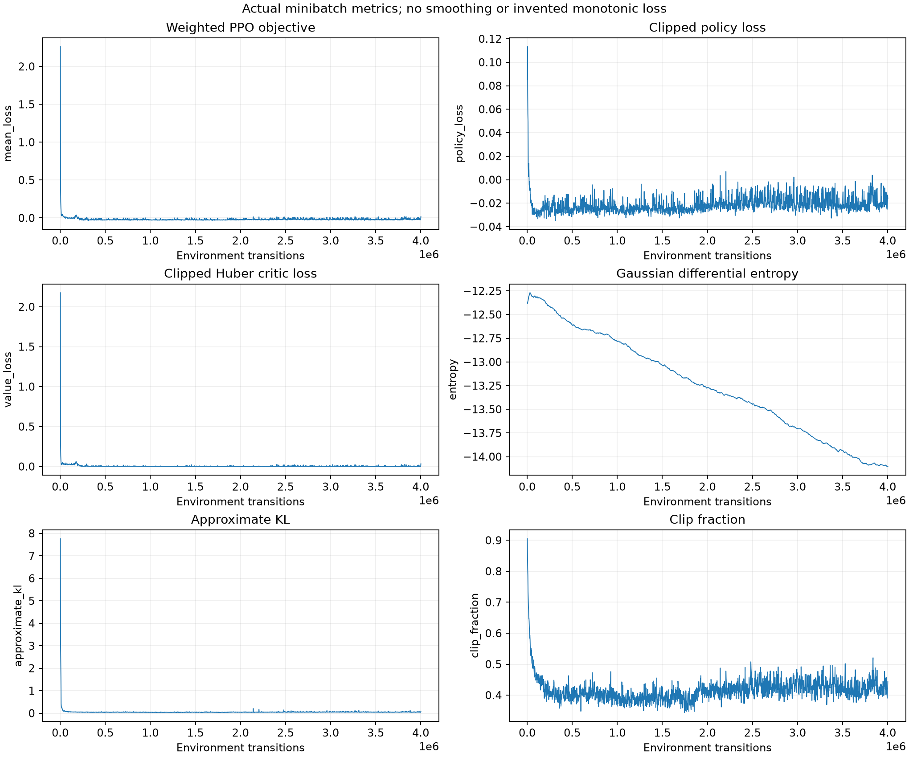

Training used observation normalization and running discounted-return reward normalization. The exported ONNX actor contains the frozen observation normalizer. Normalized rollout reward is therefore an optimizer input, not a directly comparable physical score. The evidence keeps raw completed-episode return, normalized collection reward, and deterministic checkpoint return separate.

### Actual PPO implementation details

The current RLX implementation adds several details beyond the compact textbook equation:

- advantages are normalized independently inside every optimizer minibatch;
- log probability ratios are clipped to `[-20, 20]` before exponentiation;
- value prediction uses a clipped value target and a Huber-like loss with transition point 10;
- value loss coefficient is 1.0 in the recorded recipe;
- entropy coefficient is 0, although entropy is still measured;
- gradient global norm is clipped to 0.5;
- loss, gradients, critic timeout values, update inputs, model parameters, and saved tensors are checked for finite values;
- a non-finite gradient aborts with an eager diagnostic naming unstable tensors rather than silently saving a corrupt checkpoint.

The recorded checkpoint also stores the running return-normalizer statistics. ONNX does not need those statistics: reward normalization affects optimization, not inference.

### Recorded experiment stages

The retained evidence shows an engineering sequence, not a single predeclared hyperparameter sweep:

| Stage | Retained evidence | Fresh transitions | Key change | Recorded outcome |
|---|---|---:|---|---|
| Pipeline smoke | `rlx/artifacts/dance-e2e-20260907/smoke/` | 4,096 | prove train/checkpoint/export plumbing | no skill claim |
| Broad-kernel Bachata | `recipe.json`, run `dance-e2e-20260907-bachata` | 2,000,896 | pose weight 40, inherited pose function, initial std 0.3 | standing/stability without passing dynamic gate |
| Precision tracking | `recipe-tracking.json`, run `dance-e2e-20260907-tracking` | 2,000,896 | replace pose term with $\sigma=0.2$ per-joint kernel | better pose discrimination, still no final skill pass |
| Low-noise full run | `recipe-low-noise.json`, run `dance-e2e-20260907-low-noise` | 4,001,792 | initial std 0.1 and longer budget | selected run; independent audit passed |
| Independent audit | `final-audit/audit.json` | 0 training transitions | ONNX, controls, hashes, traces, plots, parity | five of five held-out episodes passed |
| Repeated-cycle extension | `final-audit/extended-16s.json` | 0 training transitions | 800-step horizon over looping excerpt | three of three episodes passed two repeats |

All three substantive PPO recipes use seed 7 and fresh initialization. They are not continuation stages. The final five evaluation seeds test rollout/reset variation under deterministic policy inference; they are not five independently trained policies.

## Outputs and Reproducible Workflow

The workflow produces a prepared reference, recipe JSON, checkpoint and metadata, optimizer journal, deterministic ONNX model, skill report, plots, MP4 files, and contact sheets. Run these commands from the repository root. They are the recorded reproduction path, not a quick tutorial run:

### Runnable: inspect the retained evidence without training

```bash
python3 -m json.tool \
  rlx/artifacts/dance-e2e-20260907/reference-provenance.json
python3 -m json.tool \
  rlx/artifacts/dance-e2e-20260907/recipe-low-noise.json
python3 -m json.tool \
  rlx/runs/studio/dance/dance-e2e-20260907-low-noise/dance.safetensors.json
python3 -m json.tool \
  rlx/artifacts/dance-e2e-20260907/final-audit/audit.json
```

### Runnable: regenerate only the excerpt and recipe

This command writes a prepared reference and recipe. Despite its name, `dance_e2e.py` does **not** launch PPO:

```bash
(
set -eu
test ! -e rlx/artifacts/dance-reproduction-YYYYMMDD-HHMMSS
rlx/.venv-microduck/bin/python rlx/scripts/dance_e2e.py \
  --source dance-clip/bachata_microduck_v2.clip.json \
  --output rlx/artifacts/dance-reproduction-YYYYMMDD-HHMMSS \
  --seconds 8 --train-steps 4001792 \
  --run-name dance-e2e-reproduction-YYYYMMDD-HHMMSS
)
```

### Runnable and expensive: execute the full recorded train/eval/render/export path

Use a fresh run name and artifact path. The Studio server must already be available at `http://127.0.0.1:63317`.

```bash
(
set -eu
test ! -e rlx/runs/studio/dance/dance-e2e-reproduction-YYYYMMDD-HHMMSS
test ! -e rlx/artifacts/dance-reproduction-YYYYMMDD-HHMMSS/api-e2e.json
node duck-viewer/scripts/rlx-dance-api-e2e.mjs \
  --execute --base-url http://127.0.0.1:63317 \
  --recipe-json rlx/artifacts/dance-reproduction-YYYYMMDD-HHMMSS/recipe.json \
  --run dance-e2e-reproduction-YYYYMMDD-HHMMSS \
  --report rlx/artifacts/dance-reproduction-YYYYMMDD-HHMMSS/api-e2e.json \
  --timeout-seconds 7200
)
```

### Runnable: independently audit a completed reproduction

This runs deterministic simulation and optional rendering, but no PPO updates:

```bash
(
set -eu
test ! -e rlx/artifacts/dance-reproduction-YYYYMMDD-HHMMSS/audit
rlx/.venv-microduck/bin/python rlx/scripts/audit_dance.py \
  --run rlx/runs/studio/dance/dance-e2e-reproduction-YYYYMMDD-HHMMSS \
  --recipe rlx/artifacts/dance-reproduction-YYYYMMDD-HHMMSS/recipe.json \
  --output rlx/artifacts/dance-reproduction-YYYYMMDD-HHMMSS/audit \
  --seeds 101 102 103 104 105 --history-stride 2 --render
)
```

The API driver performs train, evaluation, render, and export. It requires `--execute`, preserves render/export evidence after a failed full-profile skill evaluation, and exits nonzero when the final gate fails. The independent audit evaluates the exported ONNX actor and controls rather than trusting the training process.

### Runnable: focused tests without training

```bash
rlx/.venv-microduck/bin/python -m pytest \
  rlx/tests/test_dance_evaluation.py \
  rlx/tests/test_dance_pipeline.py \
  rlx/tests/test_microduck_dance.py
```

These tests cover clip routing, hashes, normalization choices, training telemetry shape, strict gate behavior, malformed evidence rejection, checkpoint/export contracts, and smoke integration surfaces. The gated integration test that actually trains is excluded unless its opt-in environment variable is set.

## Evaluation: Proving Motion, Not Merely Pose

Ordinary pose RMSE is

$$
\operatorname{RMSE}_{\text{pose}}
=
\sqrt{
\frac{1}{14T}
\sum_{t=1}^{T}
\sum_{j=1}^{14}
(q_{t,j}-q^{*}_{t,j})^2
}.
$$

A stationary policy can sometimes obtain a moderate RMSE by holding the reference's average pose. The evaluator therefore identifies moving joints whose reference standard deviation is at least 0.03 rad. It compares policy tracking error with a constant-reference-mean baseline:

$$
G_{\text{dynamic}}
=
1-
\frac{
\operatorname{RMSE}(\mathbf{q}_{M}-\mathbf{q}^{*}_{M})
}{
\operatorname{RMSE}(\mathbf{q}^{*}_{M}-\overline{\mathbf{q}^{*}_{M}})
}.
$$

Here $M$ is the selected moving-joint set; the leg metric restricts it to moving leg joints. A gain of zero means the policy is no better than holding the average target pose. Positive gain means it tracks the changing motion better than that static baseline. The strict pass requires:

- the complete 400-step horizon with no fall;
- contiguous, finite, time-aligned state measurements;
- upright score at least 0.9 for at least 95% of samples;
- fourteen-joint pose RMSE at most 0.15 rad;
- dynamic gain at least 20%;
- at least two moving leg joints and positive leg dynamic gain.

No smoothing, fitted lag, or temporal realignment is applied. All episodes must pass independently.

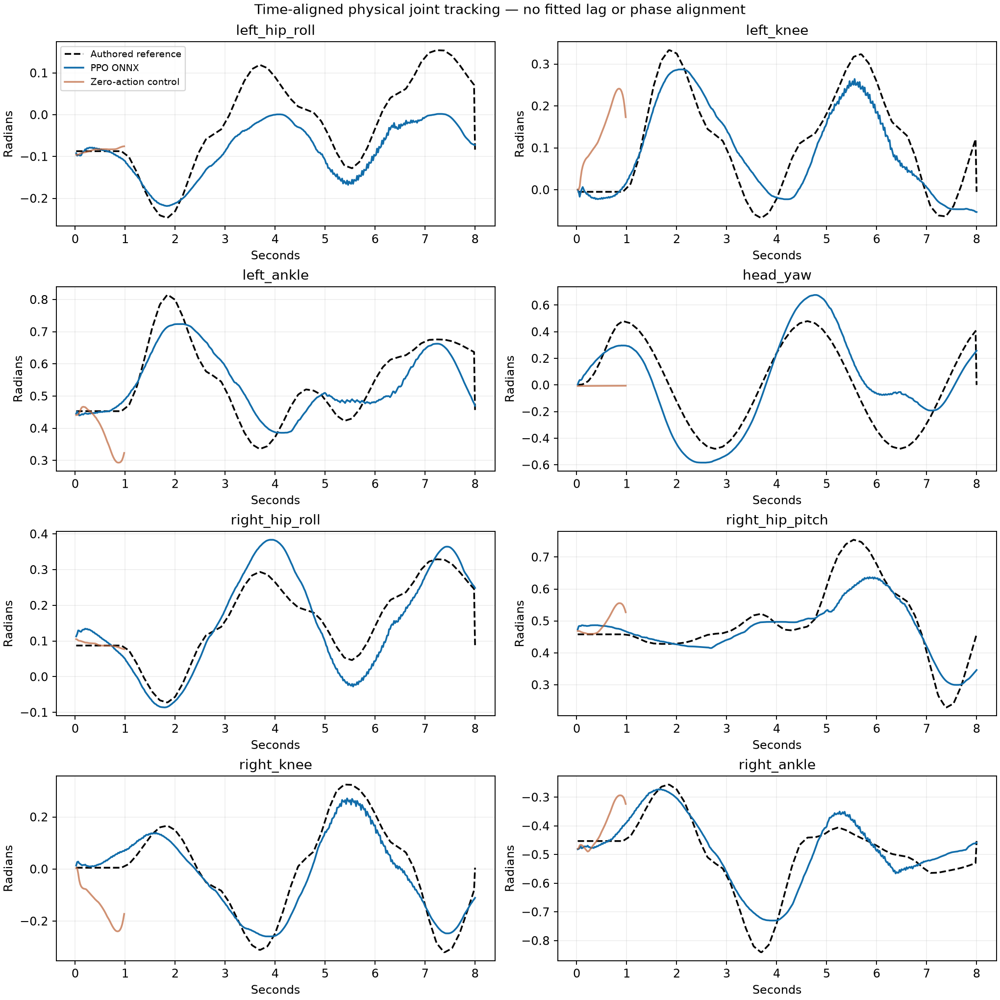

The held-out ONNX audit passed five of five eight-second episodes. Mean pose RMSE was 0.08438 rad, mean dynamic gain was 38.39%, mean leg gain was 52.52%, and upright coverage was 100%. Three sixteen-second, two-cycle episodes also passed. The zero-action control passed zero of five and fell after 0.86 to 0.98 seconds; an untrained network fell after 0.74 seconds. Native and ONNX actions agreed within $3.58\times10^{-7}$ maximum absolute error.

These results support one local simulation claim: this recorded PPO recipe learned this selected excerpt. They do not establish the full Bachata clip, arbitrary dances, training-seed robustness, BAM equivalence, disturbance robustness, or hardware readiness.

## Reading the Evaluation JSON

The Studio report and independent audit answer related but different questions.

| Field | Meaning | Limitation |
|---|---|---|
| `pipeline_passed` | execution, finite values, and requested generic checks passed | does not alone prove dance skill |
| `skill_status` | `passed` or `failed` from the strict dance assessor in full mode | applies only to the configured horizon and conditions |
| `terminated` | count of fall/terminal events | zero does not imply accurate imitation |
| `truncated` | count of time-limit completions | expected for complete non-falling episodes |
| `pose_rmse_rad` | all-joint, all-step time-aligned RMSE | a static mean pose can still score moderately |
| `dynamic_tracking_rmse_rad` | RMSE on joints moving at least 0.03 rad standard deviation | moving set is horizon-dependent |
| `constant_mean_baseline_rmse_rad` | error of holding each moving joint at its reference mean | not a learned baseline policy |
| `dynamic_gain` | fractional improvement over the constant-mean baseline | negative values mean worse than static |
| `leg_dynamic_gain` | same calculation on moving leg joints | excludes head-only success |
| `mean_joint_correlation` | mean centered trajectory correlation over moving joints | diagnostic only; not a pass threshold |
| `upright_fraction` | fraction of samples with upright score at least 0.9 | does not measure foot placement quality |
| `height_m` | trunk-height mean and minimum | diagnostic only in the current dance gate |
| `raw_return` | sum of unnormalized task reward for that rollout | reward-weight dependent and shortened by early falls |
| `reward_per_step` | raw return divided by observed steps | can look high for an incomplete episode |
| `finite` | all stored observations/actions/rewards/traces were finite | necessary, never sufficient |

**Measured.** In the final independent audit, the five trained episodes have pose RMSE 0.0782-0.0983 rad, dynamic gain 28.05%-42.86%, leg gain 45.74%-54.74%, 400 measured steps, no termination, and upright fraction 1.0. Their mean values are summaries of five individually passing episodes, not pooled evidence that can hide a failing seed.

The final Studio `evaluation.json` used sixteen vector lanes at seed 7 and also passed all sixteen. The independent audit used seeds 101-105 in single environments. Agreement between those paths is useful because the Studio report exercises the production orchestration while the audit controls policy source, null policies, traces, checkpoint history, hashes, and ONNX parity.

### Why early-fall metrics can mislead

The moving-joint set is computed from the target samples that were actually observed. A zero-action rollout that falls after 43-49 steps sees only the early portion of the dance; in the retained audit that shortened window contains only three or four joints above the movement threshold and no moving leg joints. Its pose RMSE near 0.10 rad is therefore not comparable to a full 400-step pass. Completeness, contiguous phase, and leg-motion gates must be checked before interpreting the scalar RMSE.

## Failure Modes and Iteration Lessons

The experiment history shows why a complete evidence loop matters. A 4,096-transition smoke run proved only that training, checkpointing, and export were connected. It could not support a skill claim. A broader inherited pose kernel produced stable standing after roughly two million transitions, but the actor failed dynamic and leg tracking. Tightening the pose kernel improved pose accuracy without immediately solving timed motion. The final successful combination used the sharper $\sigma=0.2$ kernel, lower initial exploration standard deviation, and approximately four million transitions.

That sequence should not be read as a controlled proof that each adjustment was necessary. For example, the experiment did not include a four-million-transition run with the earlier 0.3 action standard deviation. It instead demonstrates an engineering progression: identify the stationary exploit, make the objective discriminate it, reduce destructive exploration for a precision task, and allow enough samples for the dynamic behavior to emerge.

The checkpoint history also rejects simple early stopping by reward. The policy remained near a standing compromise for a long interval, suffered a visible setback around 2.4 million transitions, and then improved its measured dynamic gain from about $-2\%$ at two million transitions to 17% at 3.2 million and 36% at 3.6 million. The final artifact was selected after the predetermined run completed and was then subjected to held-out physical tests.

When diagnosing a new dance run, ask in order: Did every episode cover the full reference? Did the actor remain upright? Is pose RMSE acceptable? Does it beat the constant-pose baseline? Do multiple leg joints move? Does the deterministic ONNX video agree with the metrics? A "no" at an earlier question cannot be repaired by a favorable answer later.

### Failure diagnosis matrix

| Symptom | Evidence to inspect first | Likely interpretation | Next safe experiment |
|---|---|---|---|
| Falls in under one second | `terminated`, steps, contact sheet, zero control | stabilization not acquired or action noise too destructive | inspect deterministic checkpoint history before changing reward |
| Survives but `dynamic_gain <= 0` | current/target traces and frozen-phase control | stationary compromise or timing input ignored | verify phase slots 59:61 vary and use the per-joint pose kernel |
| Good overall gain, non-positive leg gain | moving-joint counts and leg traces | head motion is carrying the aggregate metric | inspect leg-joint amplitudes and keep the leg-specific gate |
| Pose RMSE improves while gain remains below 0.20 | constant-mean baseline and checkpoint history | more accurate average pose without enough choreography | continue only if deterministic history shows dynamic progress |
| High training reward, failed ONNX | raw episode returns versus strict audit | optimizer objective and task evidence disagree | trust deterministic audit; inspect normalizer/export identity |
| Native actor and ONNX disagree | `onnx_parity_max_abs_error`, source hashes | export, normalization, or wrong-artifact problem | stop skill interpretation until parity is restored |
| Phase is repeated or skipped | `phase_step.contiguous` and trace length | evidence plumbing or autoreset alignment bug | fix measurement path; do not smooth or realign |
| Evaluation varies across nominal seeds although randomization is off | per-seed reset traces | worker seed changes initial numerical/reset trajectory | report spread; do not call them independent training seeds |
| Sixteen-second test passes | reference hash and loop flag | two repeats of the same learned excerpt | do not relabel as unseen sixteen-second choreography |

### Controls and what they falsify

- **Zero action** asks whether the spawn pose, passive servos, and gravity already satisfy the gate.
- **Untrained network** asks whether the architecture's random initial mean accidentally survives or tracks.
- **Frozen phase** preserves the trained network and physical feedback while removing the changing clock from its policy input. Its five episodes survived upright but had dynamic gains from -16.28% to -6.47%, which supports the claim that timed conditioning is functionally used.
- **Direct reference chasing** asks whether simply applying the authored joint targets is already a stable controller. The retained diagnostic fell at step 49, despite a favorable partial-window dynamic gain, showing why complete-horizon criteria come first.
- **Native/ONNX parity** asks whether the deployable graph represents the deterministic checkpoint actor on the same recorded observations.

The frozen-phase result is strong evidence for phase dependence, but it is not a complete feature attribution study. Setting two normalized inputs to fixed raw values also moves them away from their training distribution. The correct claim is that removing the changing phase signal breaks dynamic tracking, not that every learned timing mechanism has been isolated.

## How to Read the Figures

The reward figure separates stochastic training data from deterministic checkpoints. A falling exploratory episode can produce a downward raw-return spike even while the deterministic mean policy improves. Conversely, a high normalized reward cannot prove choreography.

The loss figure reports the actual PPO minibatch objective terms. Policy loss is a batch-relative surrogate, so it need not steadily approach zero. Value loss measures critic error under changing targets. Approximate KL and clip fraction indicate update size. Entropy describes the Gaussian action distribution; differential entropy may be negative.

The tracking figure is closest to the task claim because it compares physical joint trajectories against the authored targets at the same time steps. It should still be read with the acceptance table and video: the final motion retains visible timing lag, hip-roll offsets, and head-yaw overshoot.

## Read the saved Dance result in Studio

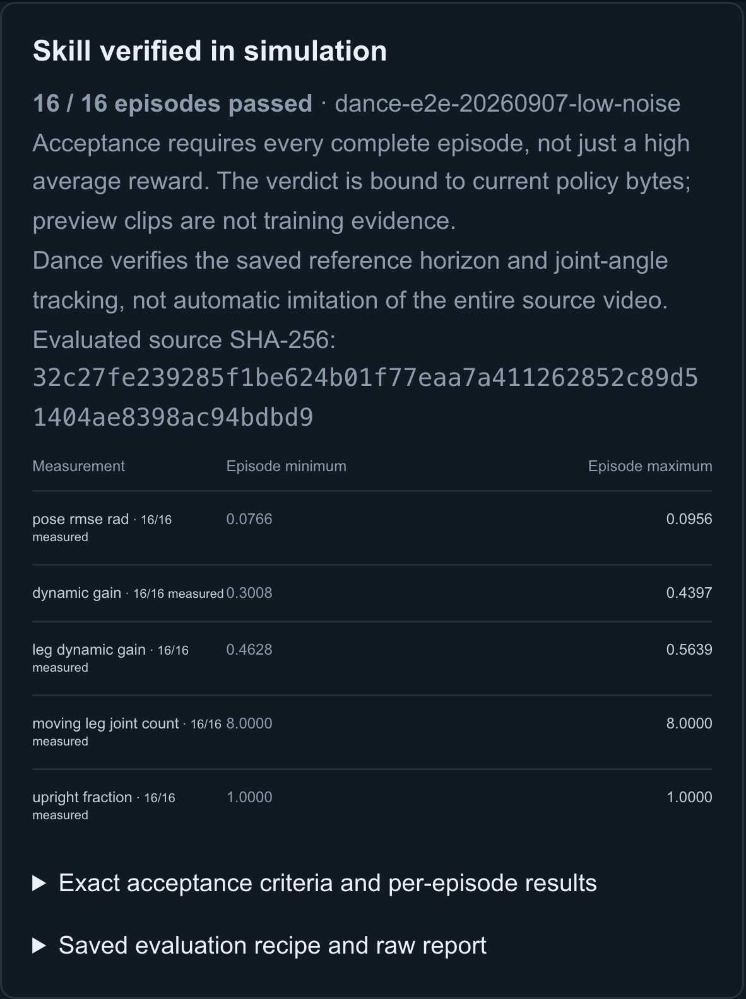

Select **Dance imitation**, then use **Saved runs** to restore the historical run and evaluation settings. Merely typing a run name selects artifacts; it does not restore its reference clip or recipe. Check the run identifier, 16/16 complete API episodes, joint-tracking ranges and the source hash. The five independent audit seeds in this chapter are a different evaluation set, not a contradiction of the UI's sixteen environments. Inspect the reference horizon before claiming the whole source choreography was learned, and play the complete saved video rather than treating this screenshot as proof of movement.

## Exercises

**Easy: verify the excerpt boundary.** Read the generated `reference-provenance.json` and `reference.clip.json`.

Acceptance check: report an excerpt start of 0 seconds, duration of 8 seconds, 400 control-rate poses, looping enabled, and no amplitude scaling. State explicitly that the source is longer.

**Easy: reconstruct the 61-value observation map.** Starting from `microduck_local/src/microduck_local/contract.py` and `_get_obs` in `walk_env.py`, write every half-open slice and its width. Then identify the exact two indices overwritten by `BehaviorEnv` for imitation.

Acceptance check: widths sum to 61; joint position, joint velocity, and previous action each have width 14; phase is at indices 59 and 60.

**Intermediate: account for PPO samples.** For a hypothetical request of 4,000,000 transitions under the recorded 16-by-128 rollout, calculate actual collected transitions, rollout updates, optimizer minibatches, minibatch size, and transition-presentations.

Acceptance check: distinguish newly collected environment transitions from repeated epoch presentations and explain why displayed progress may differ from checkpoint metadata.

**Intermediate: recompute dynamic gain.** Load one `trained-seed*.npz` trace from the final audit. Select joints whose target standard deviation is at least 0.03 rad, compute tracking RMSE and the constant-mean baseline RMSE, then calculate $G_{\text{dynamic}}$.

Acceptance check: your formula matches the evaluator, uses no fitted time shift, and produces a gain above 0.20 for the selected passing trace.

**Runnable exercise scaffold:**

```bash
python3 - <<'PY'
import numpy as np
path = "rlx/artifacts/dance-e2e-20260907/final-audit/trained-seed101.npz"
trace = np.load(path)
current = trace["current"]
target = trace["target"]
moving = np.flatnonzero(target.std(axis=0) >= 0.03)
tracking = np.sqrt(np.mean((current[:, moving] - target[:, moving]) ** 2))
baseline = np.sqrt(np.mean((target[:, moving] - target[:, moving].mean(axis=0)) ** 2))
print({"moving": moving.tolist(), "tracking": tracking, "baseline": baseline, "gain": 1 - tracking / baseline})
PY
```

**Intermediate: verify ONNX graph identity.** Inspect the retained ONNX graph's input/output names, element types, shapes, and normalization initializers.

Acceptance check: report `observations` and `actions`, `float32`, dynamic batch axes, widths 61 and 14, and the presence of observation mean, variance, epsilon, and clip constants.

**Advanced: design a falsification audit.** Compare the trained actor with zero action, an untrained actor, and the trained actor with frozen phase inputs. Specify what each control tests.

Acceptance check: require complete episodes, per-episode results, ONNX/native parity, physical tracking, and visual review. Reject any argument that uses reward alone or treats a repeated excerpt as unseen choreography.

**Advanced: test a timing-lag hypothesis without weakening the gate.** Compute cross-correlation between current and target trajectories as a diagnostic, but keep the official zero-lag RMSE and gain unchanged.

Acceptance check: clearly label the fitted lag as exploratory analysis. Do not use it to convert a failed official episode into a pass.

**Advanced: design a training-seed study.** Specify at least five independently initialized PPO runs with fixed recipe, fixed sample budget, distinct training seeds, and the same held-out evaluation seed set.

Acceptance check: separate within-policy rollout variation from between-training-seed variation; predeclare how many policies must pass; retain failed checkpoints and videos.

## Evidence Gaps and Claim Boundary

The retained artifacts do not answer several important questions:

- only one successful training seed is recorded, so scratch-PPO reliability is unknown;
- the recipe sequence changes both exploration standard deviation and sample budget between the tracking and successful runs, so their individual causal effects are not isolated;
- there is no four-million-transition run with initial standard deviation 0.3;
- there is no domain-randomized or BAM audit of the selected Dance actor;
- the source choreography beyond the first eight seconds was not trained or evaluated;
- evaluator thresholds are fixed and regression-tested, but they are engineering acceptance criteria rather than hardware-derived tolerances;
- the independent audit uses nominal simulation with randomization disabled and does not apply pushes, terrain changes, sensor corruption, latency variation, or actuator mismatch;
- visible lag and joint-specific overshoot are documented qualitatively, but no frequency-domain or phase-delay tolerance is part of the gate.

The stop condition for this chapter is therefore narrow: the recorded deterministic ONNX policy is verified to balance and dynamically track the selected looping eight-second joint excerpt under the retained nominal MuJoCo conditions. Nothing in the evidence upgrades that result to complete-song imitation, robust learning across seeds, sim2real readiness, or safe hardware deployment.

# Stilt Walking: adapting to a changed body

## Learning goals

After this chapter, you should be able to:

1. trace the Stilt experiment from morphology construction through the 61-input/14-output policy contract;
2. derive every selected reward contribution from the current source;
3. distinguish reset initialization, reward schedules, PPO continuation, and evaluation;
4. count the exact transitions, rollout batches, minibatches, and saved checkpoints;
5. reproduce the tracked base-and-continuation workflow without silently substituting a stale checkpoint; and
6. state why a nominal simulator pass is not evidence of hardware safety or morphology generalization.

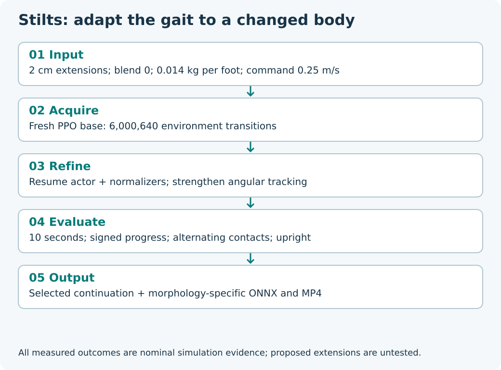

## Case-study question

Stilt walking asks whether the same fourteen actuators can control a robot whose
ground-contact geometry has changed. The selected experiment is deliberately
narrow:

| Property | Selected value |
| --- | ---: |
| Stilt height | $2\ \text{cm}$ |
| Shape blend | $0$ |
| Added mass per foot | $0.014\ \text{kg}$ |
| Fixed forward command | $0.25\ \text{m/s}$ |
| Actuator model | XML position actuators |
| Control period | $\Delta t=0.02\ \text{s}$ |
| Episode horizon | $500$ steps, or $10\ \text{s}$ |
| Domain randomization | disabled |
| Observation noise | disabled |
| Action delay | disabled |
| Random initial yaw | disabled |

The claim is therefore not "Microduck learned stilts." The evidence supports:

> One deterministic actor completed the declared walking gate on five reset
> seeds in nominal local MuJoCo with one fixed 2 cm stilt morphology and one
> fixed forward command.

Height changes the ankle-to-contact lever arm. Shape blend changes the footprint
generated by `_stilt_mesh_data`. Added mass changes each foot's inertia. These
are changes to the simulator transition function
$p(s_{t+1}\mid s_t,a_t)$, not render-only options.

## How the simulator body is changed

`rlx/rlx/environments/microduck_recipes.py` constructs the morphology before
the environment is created:

1. `validate_stilt_options` accepts heights from 0.8 to 300 cm, blend in
   $[0,1]$, and positive mass.
2. `_stilt_mesh_data` creates top and bottom rounded-rectangle rings and joins
   them with triangle faces.
3. `_build_stilt_model` disables the original sole collision geometry.
4. A rigid `stilt_left` or `stilt_right` body is attached below each ankle.
5. The new mesh collision uses friction `(1.0, 0.005, 0.0001)` and priority 1.
6. The `left_foot` and `right_foot` sites move to the bottom of the stilts.
7. The STAND keyframe trunk height is increased by the stilt height.

At blend 0, the generated bottom dimensions interpolate to approximately
$22\times32$ mm and the top to $23\times41$ mm. The body extends downward
$0.02$ m. Each collision geom receives the full selected `mass=0.014`; the
separate purple visual geom has zero mass and no contacts.

The default mass formula is

$$
m_{\text{default}}=0.012+0.001h_{\text{cm}}\quad\text{kg}.
$$

For $h=2$ cm this is exactly $0.014$ kg, matching the explicit recipe. Recording
all three values still matters: a 2 cm run must not be audited as a 10 cm run,
even if both happen to use a valid default.

### Physics difference from ordinary running

Stilt and Running use the same base robot, timestep, joint order, action target
mapping, and policy tensor dimensions. Their task physics differ:

| Aspect | Stilt Walking | Running |
| --- | --- | --- |
| Contact body | generated rigid stilt under each ankle | original foot sole |
| STAND trunk height | raised by 2 cm | unchanged |
| Added distal mass | 0.014 kg per foot | none |
| Reward implementation | base walking reward, reweighted | dedicated running behavior reward |
| Required both-feet flight | no | yes |
| Selected command | 0.25 m/s | 0.75 m/s |

The extra distal mass and contact offset affect swing inertia and ankle torque
requirements. The narrow stilt contact also changes how small ankle rotations
move the center of pressure. A controller trained on ordinary soles has no
guarantee of retaining stability.

## Reset initialization is a stage of the experiment

There is no special dropped-in stilt pose or morphology curriculum. Every
episode begins from the modified STAND keyframe:

$$
q_j=q^{\text{STAND}}_j+\epsilon_j,\qquad
\epsilon_j\sim U(-0.03,0.03)\ \text{rad},
$$

with zero generalized velocity and an additional trunk-height perturbation
$U(0,0.01)$ m. Random yaw is disabled, so the initial root quaternion uses
yaw zero. The stilt builder has already raised the STAND root by $0.02$ m.

The native Stilt command sampler can generate standing and low-speed
multidirectional commands. The selected recipe then wraps that sampler with
`_pin_locomotion_forward_command`, which overwrites only the twist command:

$$
\texttt{twist\_cmd}=[0.25,\ 0,\ 0].
$$

The small head and body command slots are still sampled in their contract
keep-alive ranges. The command is resampled internally, then repinned to the
same fixed twist, so this tracked run has no speed curriculum.

## Exact policy input and output

The policy receives the same raw 61-float observation used by the local walking
contract:

| Slice | Width | Value |
| --- | ---: | --- |
| `0:3` | 3 | base angular velocity |
| `3:6` | 3 | projected gravity |
| `6:20` | 14 | joint position relative to `DEFAULT_POSE` |
| `20:34` | 14 | one-control-step-lagged joint velocity |
| `34:48` | 14 | previous raw policy action |
| `48:51` | 3 | forward, lateral, yaw-rate command |
| `51:55` | 4 | head command |
| `55:61` | 6 | body command |

Stilt height, blend, mass, contacts, world position, and absolute yaw are not
actor inputs. The actor can specialize to the selected morphology because every
training transition uses it; it cannot observe a changed morphology at
deployment.

The following is the **actual first raw observation** stored in
`stilts-v3-audit/trained-seed501.npz`, grouped only for readability:

```text
gyro:
[0.000000, 0.000000, 0.000000]
projected_gravity:
[0.000000, 0.000000, -1.000000]
joint_pos_rel:
[ 0.029786,  0.008408, -0.004889,  0.003520,  0.021663,
  0.029569, -0.025637,  0.019733, -0.020873,
  0.013535, -0.002452,  0.020996, -0.011165, -0.006701]
lagged_joint_vel:
[0.000000, 0.000000, 0.000000, 0.000000, 0.000000, 0.000000,
 0.000000, 0.000000, 0.000000, 0.000000, 0.000000, 0.000000,
 0.000000, 0.000000]
last_action:
[0.000000, 0.000000, 0.000000, 0.000000, 0.000000, 0.000000,
 0.000000, 0.000000, 0.000000, 0.000000, 0.000000, 0.000000,
 0.000000, 0.000000]
twist_cmd:
[0.250000, 0.000000, 0.000000]
head_cmd:
[-0.035180, 0.030712, -0.009921, 0.005958]
body_cmd:
[0.003957, 0.004153, -0.001262, -0.029673, -0.008775, 0.011752]
```

The matching **actual deterministic actor output** is:

```text
[-3.149575, -0.346301,  0.516845, -0.618428, -0.770612,
  1.001862,  0.629953,  0.250239, -1.113191,
  2.662313, -1.061865, -0.190807,  0.981774,  0.260208]
```

Output indices follow the joint order:

```text
[left_hip_yaw, left_hip_roll, left_hip_pitch, left_knee, left_ankle,
 neck_pitch, head_pitch, head_yaw, head_roll,
 right_hip_yaw, right_hip_roll, right_hip_pitch, right_knee, right_ankle]
```

The output is a target offset, not torque:

$$
q_t^{\text{target}}
=q^{\text{default}}+\operatorname{clip}(a_t,-4,4).
$$

The raw action is retained in the next observation and action-rate penalty;
only the applied target is clipped. Observation normalization is performed by
the training wrapper and baked into the exported ONNX actor. The NPZ vector
above is the raw environment observation, not the normalized network input.

## Reward trace: every selected term

`StiltEnv._compute_reward` first calls
`MicroduckWalkEnv._compute_reward`, then rescales named terms to the recipe
weights. The selected final weights are:

```json
{
  "track_lin_vel": 20,
  "track_ang_vel": 4,
  "upright": 1,
  "feet_air_time": 4,
  "head_pose": 0.1,
  "ang_vel_xy_penalty": 0.02
}
```

`pose` remains present with weight 0. The inherited action-rate penalty is also
present, even though it is not a recipe key.

Let $\mathbf v_b=(v_x,v_y,v_z)$ be trunk velocity rotated into the body frame,
$\boldsymbol\omega=(\omega_x,\omega_y,\omega_z)$ the gyro, $\mathbf g_b$ the
projected gravity vector, and $\mathbf c=(c_x,c_y,c_\omega)$ the twist command.

### Linear command tracking

```text
walk_env._compute_reward
  -> body_lin_vel()
  -> quat_rotate_inverse(trunk quaternion, world base velocity)
  -> squared xy command error + vertical-speed squared
```

$$
e_v=(c_x-v_x)^2+(c_y-v_y)^2+v_z^2,
$$

$$
r_{\text{lin}}=20\exp(-e_v/0.1).
$$

Including $v_z^2$ prevents vertical bouncing from receiving the same score as
level translation at the requested horizontal speed.

### Combined angular tracking

$$
e_\omega=(c_\omega-\omega_z)^2+\omega_x^2+\omega_y^2,
$$

$$
r_{\text{ang}}=4\exp(-e_\omega/0.5).
$$

For the selected zero-yaw command, the term favors small yaw rate while also
charging roll and pitch rates inside the Gaussian. The v2 base used weight
0.5; v3 increases it to 4.

### Upright posture

Because upright projected gravity is approximately $(0,0,-1)$,

$$
r_{\text{upright}}
=\exp\left[-(g_x^2+g_y^2)/0.05\right].
$$

This is bounded by one. It does not require absolute yaw.

### Leg pose

The implementation still computes

$$
r_{\text{pose}}
=w_{\text{pose}}
\exp\left[-\frac{\sum_{j\in\text{legs}}(q_j-q_j^{\text{default}})^2}{0.5}\right],
$$

but the selected Stilt recipes set $w_{\text{pose}}=0$. It therefore
contributes exactly zero while preserving the common term structure.

### Head-pose tracking

For the four head joints,

$$
r_{\text{head}}
=0.1\cdot\frac14\sum_{j\in\text{head}}
\exp\left[-\left(\frac{q_j-q_j^{\text{default}}-h_j^{\text{cmd}}}{0.5}\right)^2\right].
$$

The sampled head command is observable at indices `51:55`.

### Dense foot air time

For each foot $f$, the environment resets $\tau_f$ to zero on contact and adds
$0.02$ s off contact. If a motion command is active, each foot contributes one
while

$$
0.125<\tau_f<0.300\ \text{s}.
$$

Thus

$$
r_{\text{air}}=4
\sum_{f\in\{L,R\}}
\mathbb 1[0.125<\tau_f<0.300].
$$

This is a per-step dense window, not a touchdown jackpot. It permits a walking
gait with almost no both-feet-airborne time.

### Roll/pitch angular-velocity penalty

$$
r_{\omega xy}=-0.02(\omega_x^2+\omega_y^2).
$$

The sign is non-positive by construction.

### Inherited action-rate schedule

The base walking environment computes

$$
r_{\Delta a}=-w(n)\sum_{j=1}^{14}(a_{t,j}-a_{t-1,j})^2,
$$

then `StiltEnv` multiplies this term by 0.2. The effective coefficients are:

| Per-environment lifetime steps | Total transitions at 16 envs | Effective coefficient |
| ---: | ---: | ---: |
| 0 | 0 | 0.02 |
| 12,000 | 192,000 | 0.04 |
| 18,000 | 288,000 | 0.08 |
| 24,000 | 384,000 | 0.12 |
| 30,000 | 480,000 | 0.16 |
| 36,000 | 576,000 | 0.20 |

The lifetime counter is environment-process state, not checkpoint metadata.
The Studio continuation restores the network and normalization statistics but
does not restore this counter, so the schedule begins again in the continuation
process. The 1,048,576-transition continuation is long enough to traverse all
six rows again.

The total selected reward is the ordinary sum of these contributions.

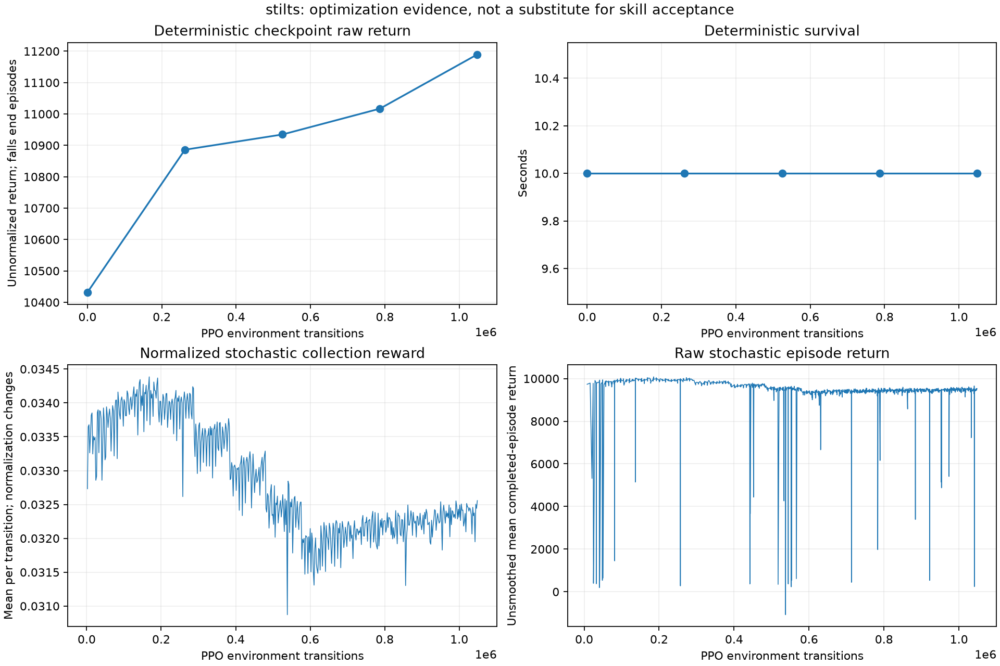

## PPO applied to this case

Both base and continuation use:

| PPO quantity | Value |
| --- | ---: |
| Parallel environments $N$ | 16 |
| Steps per rollout $T$ | 128 |
| Batch size $B=NT$ | 2,048 transitions |
| Minibatches | 4 |
| Minibatch size | 512 |
| Epochs per rollout | 4 |
| Optimizer updates per rollout | 16 |
| $\gamma$ | 0.99 |
| GAE $\lambda$ | 0.95 |
| Policy ratio clip | 0.2 |
| Value coefficient | 1.0 |
| Entropy coefficient | 0 |
| Gradient norm limit | 0.5 |

The actor samples a diagonal Gaussian during collection. A zero entropy
coefficient removes the entropy *bonus* but does not remove sampling. The
exported and audited actor uses the deterministic Gaussian mean.

For each transition, RLX stores observation, action, reward, termination,
truncation, old value, and old log probability. Time-limit truncations
bootstrap from the final pre-reset observation; true falls do not. GAE produces
$\hat A_t$, which is normalized within each minibatch.

The policy ratio is

$$
\rho_t=\exp\left[
\operatorname{clip}(
\log\pi_\theta(a_t|o_t)-\log\pi_{\text{old}}(a_t|o_t),-20,20)
\right].
$$

RLX minimizes the negative clipped surrogate. The critic uses a Huber-style
error with threshold 10 and value clipping at 0.2. Gradients are checked for
finiteness before the optimizer result is accepted.

### Exact work counts

| Stage | Transitions | Rollout/update cycles | Optimizer minibatches | Learning rate |
| --- | ---: | ---: | ---: | ---: |
| Stilt v2 base | 6,000,640 | 2,930 | 46,880 | $3\times10^{-4}$ |
| Stilt v3 continuation | 1,048,576 | 512 | 8,192 | $1\times10^{-4}$ |
| Entire selected lineage | 7,049,216 | 3,442 | 55,072 | two stages |

The base is fresh PPO from randomly initialized actor/critic parameters with
initial action standard deviation 0.6. The continuation loads actor, critic,
learned log standard deviation, observation running statistics, and reward
return statistics. It creates a fresh Adam optimizer; optimizer moments are not
stored in the checkpoint. The continuation recipe's `initialStd: 0.6` does not
reset the loaded log standard deviation.

The continuation changes the learning objective by raising angular tracking
from 0.5 to 4. It does not change the morphology, fixed command, episode
horizon, or strict evaluation criteria.

## Exact physical acceptance criteria

The evaluator is separate from the reward and requires every episode to pass.
It reads the command before `env.step()` and attaches post-transition physical
metrics afterward, so a transition is scored against the command that produced
it.

For commanded samples,

$$
\hat{\mathbf c}_t=\frac{\mathbf c_t}{\|\mathbf c_t\|},
\qquad
\bar v_{\parallel}=
\frac{1}{N_c}\sum_{t\in C}\mathbf v_{h,t}\cdot\hat{\mathbf c}_t.
$$

The tracking ratio is

$$
\rho_v=
\frac{\sum_{t\in C}\mathbf v_{h,t}\cdot\hat{\mathbf c}_t}
{\sum_{t\in C}\|\mathbf c_t\|}.
$$

Signed displacement projects world-position increments onto an intended command
direction. The direction is anchored at each command change and advanced only
by commanded yaw. The first sample establishes position and receives no
displacement credit.

An episode passes only if:

| Criterion | Required value |
| --- | ---: |
| Complete horizon | 500 samples, truncated at 10 s without termination |
| Valid metric coverage | every sample finite; contacts binary; heading normalized |
| Upright sample | upright at least 0.9 |
| Upright fraction | at least 0.95 |
| Active command speed | at least 0.05 m/s |
| Commanded fraction | at least 0.50 |
| Mean command-directed speed | at least 0.06 m/s |
| Signed intended displacement | at least 0.30 m |
| Speed tracking ratio | at least 0.30 |
| Alternating exclusive-support switches | at least 4 |
| Air fraction for each foot | at least 0.05 |
| Contact fraction for each foot | at least 0.10 |
| Foot events | both feet lift off and touch down |
| Both-feet aerial fraction | not required |

## Measured evidence and margins

The selected final audit produced:

| Seed | Directed speed | Signed displacement | Speed ratio | Support switches | L/R air fraction |
| ---: | ---: | ---: | ---: | ---: | ---: |
| 501 | 0.2314 | 1.8273 | 0.9254 | 90 | 0.368 / 0.358 |
| 502 | 0.2366 | 1.2806 | 0.9463 | 92 | 0.364 / 0.360 |
| 503 | 0.2416 | 2.1831 | 0.9664 | 92 | 0.390 / 0.356 |
| 504 | 0.2387 | 2.2887 | 0.9549 | 90 | 0.410 / 0.352 |
| 505 | 0.2300 | 1.4662 | 0.9199 | 91 | 0.370 / 0.350 |

All five completed 500 steps with upright fraction 1.0. Their aerial fraction
was only 0.002, which is consistent with walking and illustrates why Running
needs a different gate.

The zero control fell after 39-46 steps on these seeds. It could show
instantaneous directed speed of 0.1575-0.1781 m/s from release dynamics, yet it
failed horizon, displacement, upright, and support-switch requirements. Random
control also failed. These controls demonstrate why speed alone is not the
skill.

The continuation checkpoint history on comparison seed 501 was:

| Continuation transitions | Raw return | Skill |
| ---: | ---: | --- |
| 0 | 10,431.73 | PASS |
| 262,144 | 10,886.09 | PASS |
| 524,288 | 10,934.60 | PASS |
| 786,432 | 11,016.86 | PASS |
| 1,048,576 | 11,189.72 | PASS |

The initializer already passed on that seed. PPO refinement increased raw
return by 757.9966 under the final reward configuration, but the continuation
must not be credited with acquiring the entire gait.

Training evidence recorded 512 finite update cycles and 8,192 optimizer
minibatches. The last-100 approximate KL mean was 0.0191, clip fraction 0.2322,
and explained variance 0.1992; maximum approximate KL was 0.7690. These are
optimizer diagnostics, not substitutes for the physical audit.

ONNX contract validation reported input `batch x 61`, output `batch x 14`, and
native/ONNX maximum absolute action error $9.537\times10^{-7}$.

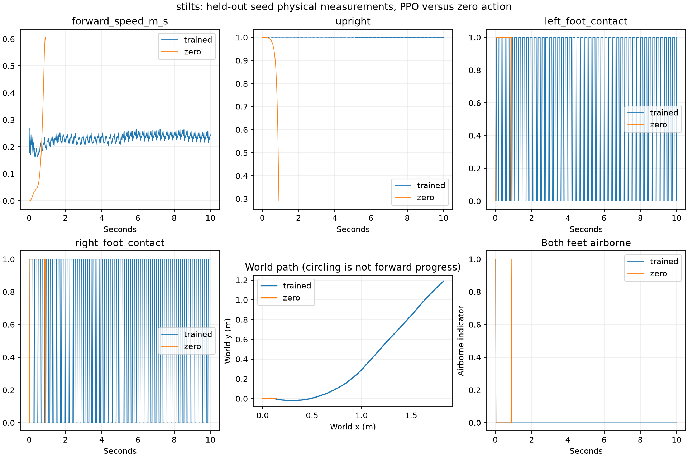

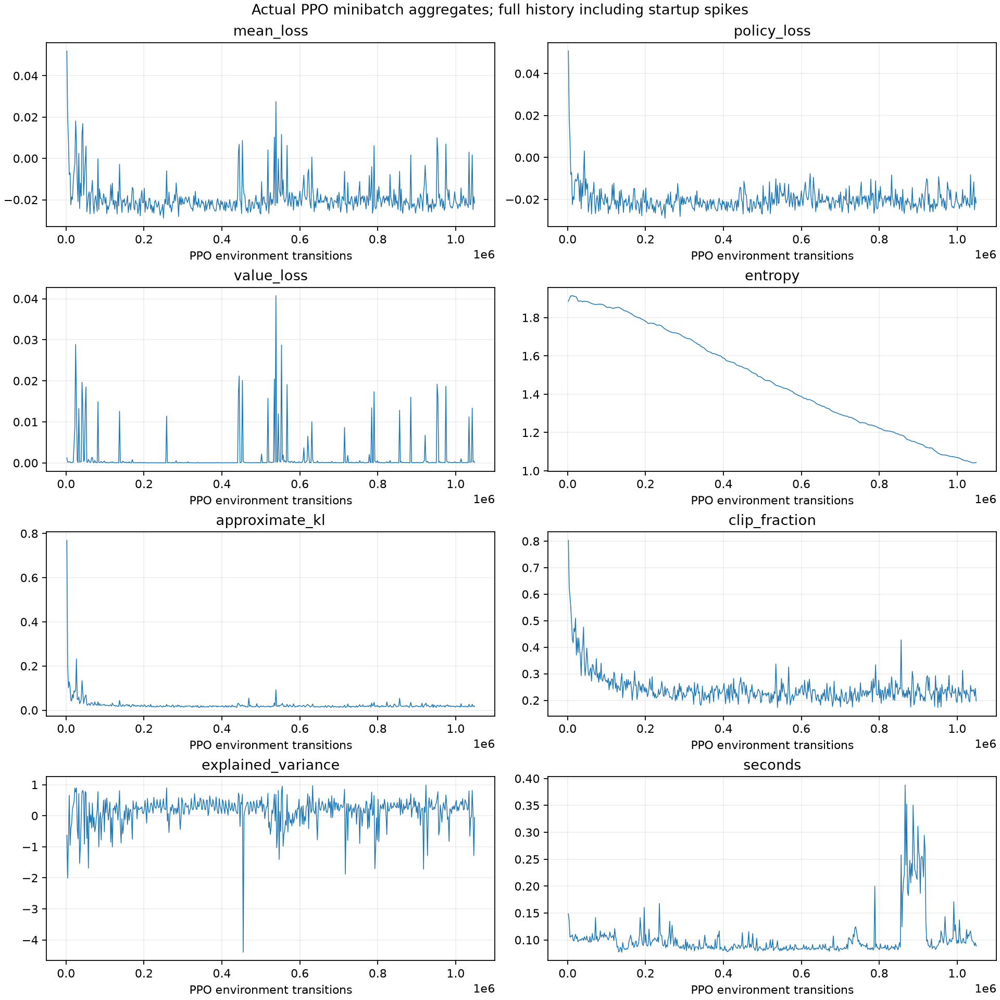

## Failure history and causal lessons

### Stilt v1: numerical failure

Stilt v1 stopped at 1,980,416 of 4,001,792 transitions because critic-layer
gradients became non-finite. Logged observations, actions, old log
probabilities, old values, advantages, and returns were finite. A separate MLX
probe reproduced finite ELU forward outputs with non-finite gradients for large
positive inputs. The current stable ELU bounds the inactive exponential branch.

The failed minibatch was not saved. The probe is a compatible mechanism, not
proof of the unique historical cause.

### Stilt v2: learned locomotion, failed intended progress

The 6,000,640-transition base learned moving alternating support, but four of
five historical audit episodes failed signed intended displacement. Body-frame
velocity reward can remain high while the world trajectory curves. The v3
continuation strengthened the already observable angular-rate signal rather
than adding absolute heading, which the actor cannot observe.

### Common reward exploits

| Exploit | Why reward may allow it | Gate that rejects it |
| --- | --- | --- |
| stand upright | upright and head rewards remain available | directed speed and displacement |
| shuffle one foot | velocity without bilateral events | liftoff/touchdown and support switches |
| circle | body-frame speed remains positive | signed intended displacement |
| passive release motion | initial dynamics create speed | full horizon and displacement |
| synchronous bounce | air time without alternating walking | exclusive-support switches |

## Reproducing the tracked result safely

Do not run the continuation recipe in an empty directory. Its
`resumeFromCheckpoint` flag makes the Studio job reject a missing local
checkpoint.

Use the complete guarded **Stilt Walking: all stages** block in
`docs/microduck-training-student-book/REPRODUCTION.md`. That appendix is the
authoritative command surface. It:

1. requires fresh base, report, and continuation paths;
2. runs `recipes/stilts-base.json`;
3. accepts only success or the specifically recognized post-training skill
   failure;
4. verifies that training, render, and export completed;
5. verifies `stilts.safetensors` and `stilts.safetensors.json`; and
6. copies both into the distinct continuation directory.

After the guard succeeds, use the appendix's continuation, audit, and
`verify-rlx-video.mjs` commands unchanged. A nonzero audit is a failed
experiment to retain.

The first two post-guard commands are reproduced here with the same valid
syntax; replace the timestamp consistently:

```bash
node duck-viewer/scripts/rlx-dance-api-e2e.mjs --execute \
  --base-url http://127.0.0.1:63317 --experiment stilts \
  --recipe-json docs/remaining-scenarios-e2e/recipes/stilts.json \
  --run stilts-reproduction-YYYYMMDD-HHMMSS \
  --report rlx/artifacts/scenarios-e2e-20260907/stilts-reproduction-YYYYMMDD-HHMMSS-api.json \
  --timeout-seconds 7200

rlx/.venv-microduck/bin/python rlx/scripts/audit_scenarios.py \
  --recipe-json docs/remaining-scenarios-e2e/recipes/stilts.json \
  --run rlx/runs/studio/stilts/stilts-reproduction-YYYYMMDD-HHMMSS \
  --output rlx/artifacts/scenarios-e2e-20260907/stilts-reproduction-YYYYMMDD-HHMMSS-audit \
  --seeds 501 502 503 504 505 --render
```

Run the appendix's matching `verify-rlx-video.mjs` command afterward; it also
requires `PLAYWRIGHT_PACKAGE` to resolve as described at the top of the
appendix.

The following is a **conceptual checklist, not a replacement shell command**:

```text
fresh paths
  -> guarded base train
  -> verify train state and expected verdict
  -> verify checkpoint plus normalization sidecar
  -> copy into fresh continuation run
  -> continue with final recipe
  -> deterministic five-seed audit
  -> video byte/decode/browser verification
```

No chapter command should bypass the reproduction appendix with an
unconditional `|| true`, copy only the safetensors file, or reuse a directory
whose provenance is unknown.

## Simulator versus hardware

The selected result does not exercise:

- BAM actuator dynamics or bus latency;
- randomized mass, friction, sensor noise, action delay, or initial yaw;
- stilt attachment compliance, backlash, manufacturing tolerance, or loosening;
- cable routing, servo temperature, current limits, battery sag, or impacts;
- uneven terrain, disturbances, arbitrary commands, or other stilt dimensions.

The XML target controller can apply behavior that a real XL330 installation may
not reproduce. The exported tensor contract is necessary for deployment
compatibility, but it is not a safety certificate. The next sim2real step is to
port this fixed morphology and reward design to the official mjlab/BAM training
stack, add declared randomization, retrain, and perform hardware-specific
validation with physical fall protection.

## Read the saved Stilt result in Studio

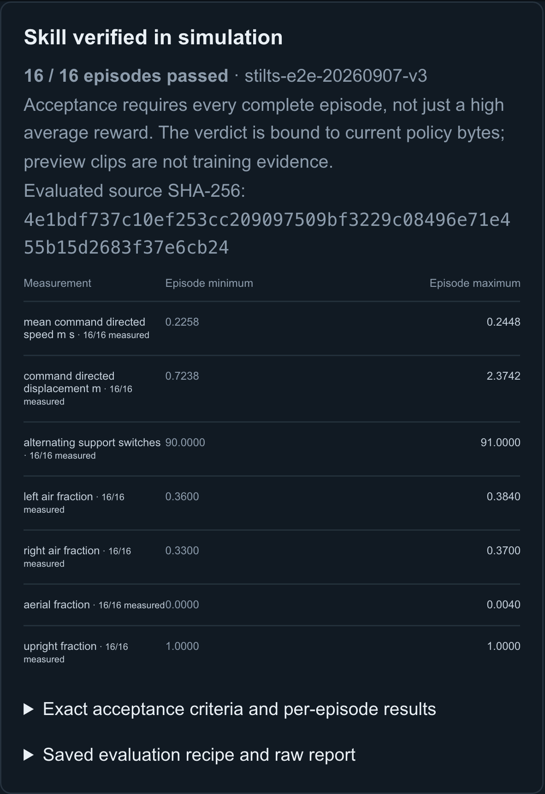

Select **Stilt walking** and restore the saved run through **Saved runs**. Confirm the morphology in the saved evaluation recipe: 2 cm extensions, blend 0 and 0.014 kg per foot. A current height slider does not retroactively change the saved verdict. Reconcile the sixteen API environments shown here with the five separate audit seeds reported above, then inspect the complete ten-second video for alternating stilt contacts and unwanted body support. This is a screenshot of retained evidence, not a newly executed training or audit run.

## Exercises

1. **Decode the tensor.** Identify the exact indices in the recorded
   observation that make yaw-rate tracking learnable. Identify the missing
   quantities that make absolute-heading reward inappropriate.
2. **Compute one reward.** With body velocity $(0.20,0.02,0.01)$ m/s and
   command $(0.25,0,0)$, compute the unweighted linear Gaussian and its
   weight-20 contribution.
3. **Trace the morphology.** Explain why moving the foot site without replacing
   collision geometry would not reproduce this task.
4. **Count PPO.** Verify 2,930 base cycles and 512 continuation cycles from the
   recipes. Then compute the total number of times each base transition is
   reused across update epochs.
5. **Audit a false positive.** Construct a 500-sample contact sequence with
   high air fractions but zero alternating exclusive-support switches.
6. **Interpret continuation.** Explain why the 757.9966 return increase supports
   refinement but not fresh acquisition.
7. **Design a morphology matrix.** Predeclare held-out height, blend, and mass
   combinations and decide whether failure should be reported as lack of
   generalization or as invalid experiment identity.

Advanced extensions such as morphology-conditioned policies, randomized
attachments, pushes, terrain, and BAM retraining are proposals. They are not
capabilities demonstrated by the selected artifacts.

# Running: an aerial gait with intended progress

## Learning goals

After this chapter, you should be able to:

1. distinguish running from fast grounded stepping using contact-state evidence;
2. trace the exact 61-input observation and 14-output action through the
   Running environment;
3. derive every selected positive and penalty reward term;
4. explain which built-in curricula are active and which are bypassed by the
   fixed-command recipe;
5. count the base and continuation PPO work exactly; and
6. interpret the measured pass without claiming straight-line perfection or
   hardware readiness.

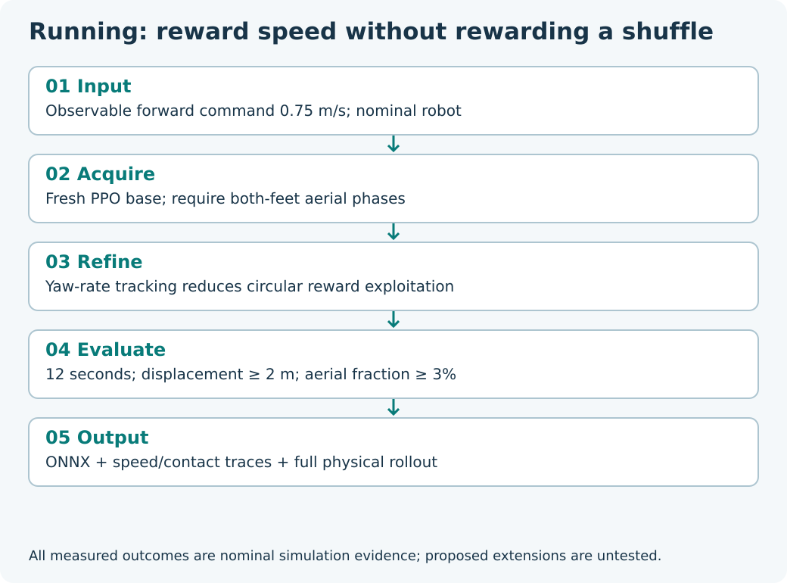

## Case-study question

For this experiment, "running" means more than moving quickly. A passing policy
must:

- survive the full 12-second episode;
- make signed progress along the intended command direction;
- repeatedly exchange exclusive support between feet;
- lift and land both feet; and
- spend a declared fraction of samples with both feet off the ground.

The tracked command is

$$
\mathbf c=(0.75,\ 0,\ 0),
$$

or 0.75 m/s forward with no lateral or yaw-rate request. The selected physics
is nominal XML simulation: no domain randomization, observation noise, action
delay, or random initial yaw.

The evidence supports:

> One deterministic actor produced an aerial command-directed gait on five
> reset seeds under the selected 0.75 m/s nominal simulator condition.

It does not establish arbitrary-speed running, commanded turning, disturbance
recovery, energy efficiency, or safe hardware behavior.

## Why Running is not a faster Stilt task

Running and Stilt Walking share the tensor contract and target-offset action
interface, but their optimization problems differ:

| Aspect | Running | Stilt Walking |
| --- | --- | --- |
| Contact geometry | original feet | generated stilts |
| Command | 0.75 m/s | 0.25 m/s |
| Reward stack | dedicated `run` behavior | reweighted walking reward |
| Posture model | speed-regime leg tolerances | fixed walking Gaussian |
| Air-time window | 0.15-0.35 s | 0.125-0.300 s |
| Both-feet flight reward | explicit optional term | none |
| Both-feet flight gate | at least 3% | none |
| Episode | 600 steps | 500 steps |

Running requires dynamic lean and roll/pitch motion. Its upright Gaussian is
therefore broader than walking's. It also uses a speed-dependent pose width and
an explicit both-feet-flight feature. Simply raising the walking command would
retain incentives that can favor grounded stepping.

## Reset, command handling, and active curricula

Every episode starts from STAND with independent joint perturbations
$U(-0.03,0.03)$ rad, root-height perturbation $U(0,0.01)$ m, zero velocity, and
yaw zero because `randomYaw` is disabled.

The reusable `run` behavior contains a command curriculum:

- a standing fraction that rises from 0.02 to 0.10;
- a 55% straight-forward bucket;
- an omnidirectional remainder; and
- a staged speed ceiling from 0.4 to 1.1 m/s.

That curriculum is **not active in the selected E2E experiment**.
`_pin_locomotion_forward_command` calls the native sampler and then overwrites
the twist command with `[0.75, 0, 0]`. The head/body keep-alive commands remain
sampled. The tracked policy therefore specializes to one speed and direction.

One reward-internal curriculum remains active: `smooth_moves` calls
`_run_action_rate_pen`, whose internal coefficient is scheduled by
per-environment lifetime steps. With the default stage scale:

| Per-env steps | Total transitions at 16 envs | Internal coefficient | Effective after recipe weight 0.1 |
| ---: | ---: | ---: | ---: |
| 0 | 0 | 0.1 | 0.01 |
| 250,000 | 4,000,000 | 0.2 | 0.02 |
| 375,000 | 6,000,000 | 0.3 | 0.03 |
| 562,500 | 9,000,000 | 0.4 | 0.04 |
| 750,000 | 12,000,000 | 0.5 | 0.05 |

The 6,000,640-transition base reaches the 0.3 rung only at its end. The
continuation process starts a new environment lifetime counter and runs only
2,097,152 transitions, so its effective smoothness coefficient remains 0.01.
The checkpoint restores policy and normalization state, not this environment
counter.

## Exact policy input and output

The raw observation is:

$$
o_t=[
\boldsymbol\omega_b(3),
\mathbf g_b(3),
\Delta\mathbf q(14),
\dot{\mathbf q}_{t-1}(14),
\mathbf a_{t-1}(14),
\mathbf c_{\text{twist}}(3),
\mathbf c_{\text{head}}(4),
\mathbf c_{\text{body}}(6)
]\in\mathbb R^{61}.
$$

Absolute world position and absolute yaw are absent. Yaw *rate* is present in
the gyro, and commanded yaw rate is present at index 50. This distinction is
why `yaw_tracking` is learnable while an absolute-heading reward is not.

The following is the **actual first raw observation** from
`running-v4-audit/trained-seed501.npz`:

```text
gyro:
[0.000000, 0.000000, 0.000000]
projected_gravity:
[0.000000, 0.000000, -1.000000]
joint_pos_rel:
[ 0.029786,  0.008408, -0.004889,  0.003520,  0.021663,
  0.029569, -0.025637,  0.019733, -0.020873,
  0.013535, -0.002452,  0.020996, -0.011165, -0.006701]
lagged_joint_vel:
[0.000000, 0.000000, 0.000000, 0.000000, 0.000000, 0.000000,
 0.000000, 0.000000, 0.000000, 0.000000, 0.000000, 0.000000,
 0.000000, 0.000000]
last_action:
[0.000000, 0.000000, 0.000000, 0.000000, 0.000000, 0.000000,
 0.000000, 0.000000, 0.000000, 0.000000, 0.000000, 0.000000,
 0.000000, 0.000000]
twist_cmd:
[0.750000, 0.000000, 0.000000]
head_cmd:
[0.037858, 0.021488, -0.049252, 0.009214]
body_cmd:
[-0.000709, 0.001986, 0.003957, 0.041533, -0.012620, -0.029673]
```

The matching **actual deterministic actor output** is:

```text
[ 2.288563,  0.807669,  3.515622, -0.709707, -6.582819,
  2.529023,  0.497528,  9.825796,  3.089725,
  6.087962, -3.619488, -9.271533, -8.283561, -0.033699]
```

These are raw actor means. Several exceed $\pm4$. The environment stores the
raw vector as `last_action` and uses it in the smoothness penalty, but clips
the applied offset:

$$
q_t^{\text{target}}
=q^{\text{default}}+\operatorname{clip}(a_t,-4,4).
$$

This recorded vector is therefore also concrete evidence that "14-action
space" does not mean the network output is tanh-bounded. XML actuator dynamics
convert target positions into physical motion; the actor does not command
torque directly.

The raw observation is normalized before the network. The exported ONNX actor
contains the observation normalizer, so evaluation supplies the raw 61-vector
and does not normalize it a second time.

## Reward trace: all effective selected terms

The recipe explicitly supplies:

```json
{
  "keep_pace": 12,
  "track_turn": 2,
  "flight": 4,
  "air_time": 1,
  "stay_upright": 2,
  "pose": 0.1,
  "head_up": 1,
  "foot_clearance": 0.5,
  "smooth_moves": 0.1,
  "plant_the_foot": 0.05,
  "yaw_tracking": 8
}
```

Because weight overrides replace only named terms, two default `run` terms are
also active:

```json
{
  "no_limit_parking": 1,
  "calm_roll": 0.025
}
```

The total selected reward is the sum of the following contributions.

### `keep_pace`: baseline-subtracted body-frame speed

Let

$$
e_v=(c_x-v_x)^2+(c_y-v_y)^2+v_z^2,
\qquad
b=\exp[-(c_x^2+c_y^2)/0.1].
$$

For a nonzero translational command,

$$
f_{\text{pace}}
=\frac{\max(0,\exp(-e_v/0.1)-b)}
{\max(1-b,10^{-6})},
$$

$$
r_{\text{pace}}=12f_{\text{pace}}.
$$

The subtraction makes standing worth zero at nonzero command while retaining a
gradient toward the command. Body-frame velocity is computed by inverse
rotation of world base velocity using the trunk quaternion. It is not the
MuJoCo COM-inertial local frame.

### `track_turn`: combined yaw and roll/pitch rate

$$
f_{\text{turn}}
=\exp\left[
-\frac{(c_\omega-\omega_z)^2+\omega_x^2+\omega_y^2}{0.5}
\right],
$$

$$
r_{\text{turn}}=2f_{\text{turn}}.
$$

Running v3 used weight 8. The continuation reduces it to 2 because this
combined term penalizes roll and pitch motion that a dynamic gait may need.

### `yaw_tracking`: focused observable yaw-rate control

$$
f_{\text{yaw}}
=\exp\left[-\left(\frac{\omega_z-c_\omega}{0.25}\right)^2\right],
\qquad
r_{\text{yaw}}=8f_{\text{yaw}}.
$$

This term uses only gyro yaw rate and the observable yaw-rate command. It
cannot directly know whether accumulated world heading has drifted.

### `air_time`: per-foot flight window

For each foot, an air timer resets on contact and advances by 0.02 s off
contact. While a motion command is active,

$$
f_{\text{air}}=
\sum_{f\in\{L,R\}}\mathbb 1[0.15<\tau_f<0.35],
\qquad
r_{\text{air}}=f_{\text{air}}.
$$

The value can be 0, 1, or 2 each step.

### `flight`: both feet airborne, upright, and moving as commanded

Let $L$ and $R$ denote contact and
$v_\parallel=\mathbf v_{b,xy}\cdot\hat{\mathbf c}_{xy}$.

$$
f_{\text{flight}}
=\mathbb 1[\neg L\land\neg R]
\operatorname{clip}\left(\frac{u-0.8}{0.2},0,1\right)
\operatorname{clip}\left(\frac{v_\parallel}{0.4},0,1\right),
$$

where $u=-g_z$. The contribution is

$$
r_{\text{flight}}=4f_{\text{flight}}.
$$

The multiplicative gates make stationary hopping, sideways flight, and an
airborne fall poor solutions.

### `stay_upright`: broad dynamic posture Gaussian

$$
r_{\text{upright}}
=2\exp[-(g_x^2+g_y^2)/0.12].
$$

The denominator 0.12 is broader than the walking value 0.05, so modest running
lean is less heavily taxed.

### `pose`: speed-regime leg posture

For the ten leg joints,

$$
f_{\text{pose}}
=\exp\left[-\frac1{10}\sum_j
\left(\frac{\Delta q_j}{\sigma_j}\right)^2\right].
$$

At the selected command norm 0.75, the running-regime widths are used:

```text
[0.4, 0.08, 0.6, 0.6, 0.4,
 0.4, 0.08, 0.6, 0.6, 0.4]
```

corresponding to yaw, roll, pitch, knee, and ankle for each leg. The selected
contribution is $0.1f_{\text{pose}}$.

### `head_up`: head command tracking

$$
f_{\text{head}}
=\frac14\sum_{j\in\text{head}}
\exp\left[-\left(\frac{\Delta q_j-h_j^{\text{cmd}}}{0.5}\right)^2\right],
$$

$$
r_{\text{head}}=f_{\text{head}}.
$$

The low selected weight 1 replaces the behavior default 3.5.

### `foot_clearance`: moving-foot height cost

For each foot geom, let $h_f$ be height above its calibrated planted height and
$s_f$ horizontal world speed:

$$
f_{\text{clear}}
=-\sum_f |h_f-0.03|s_f,
\qquad
r_{\text{clear}}=0.5f_{\text{clear}}.
$$

The term is zero when no motion command is active. It is a penalty, not a
Gaussian reward.

### `plant_the_foot`: contact slip cost

For contacting feet,

$$
f_{\text{slip}}
=-\sum_{f\text{ in contact}}(v_{f,x}^2+v_{f,y}^2),
\qquad
r_{\text{slip}}=0.05f_{\text{slip}}.
$$

### `smooth_moves`: scheduled raw-action change cost

$$
f_{\text{smooth}}
=-\alpha(n)\sum_j(a_{t,j}-a_{t-1,j})^2,
\qquad
r_{\text{smooth}}=0.1f_{\text{smooth}}.
$$

The exact active schedule was listed above. Because raw actions are used, large
saturated requests remain costly even when applied offsets clip at $\pm4$.

### `no_limit_parking`: hard-stop avoidance

For each joint, normalize position within its compile-time range:

$$
z_j=\frac{|q_j-\text{mid}_j|}{\text{halfRange}_j},
\qquad
p_j=\max(0,z_j-0.88).
$$

Then

$$
r_{\text{limit}}=-25\sum_jp_j^2.
$$

This inherited term has effective weight 1.

### `calm_roll`: body roll/pitch rate penalty

$$
r_{\text{calm}}
=-0.025(\omega_x^2+\omega_y^2).
$$

All penalty functions are non-positive before multiplication by non-negative
weights.

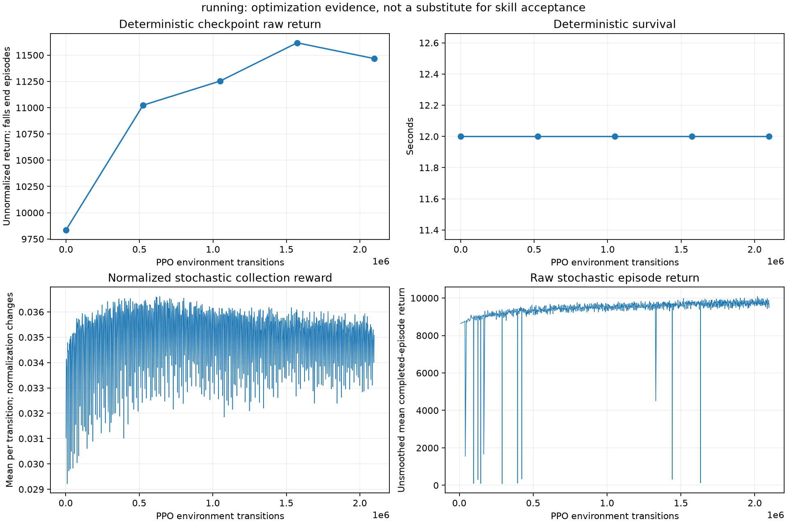

## PPO applied to Running

The actor and critic use 512, 256, and 128-unit ELU hidden layers. Collection
uses stochastic Gaussian actions; export uses the deterministic mean.

Both selected stages use:

| PPO quantity | Value |
| --- | ---: |
| Environments | 16 |
| Steps per environment per rollout | 128 |
| Transitions per rollout | 2,048 |
| Minibatches | 4 |
| Samples per minibatch | 512 |
| Update epochs | 4 |
| Optimizer minibatches per rollout | 16 |
| $\gamma$ | 0.99 |
| GAE $\lambda$ | 0.95 |
| Ratio/value clip | 0.2 |
| Value coefficient | 1.0 |
| Entropy coefficient | 0 |
| Max gradient norm | 0.5 |

### How an aerial transition affects PPO

Suppose a sampled action produces both-feet flight while upright and moving
forward. It can increase `flight`, `air_time`, and `keep_pace`, but may also
increase `smooth_moves`, `calm_roll`, or clearance cost. GAE combines the
immediate net reward with later value estimates. If the resulting advantage is
positive, PPO increases that sampled action's likelihood, subject to the
clipped ratio. If the aerial phase leads to a fall, later lost reward and a
non-bootstrapped terminal value can make its advantage negative.

This is why "reward flight" does not mean "every airborne action is reinforced."
The full temporal outcome matters.

The following is a **conceptual calculation only**, not the repository
optimizer:

```python
# Conceptual only: one sample's PPO policy term.
ratio = exp(clip(new_logp - old_logp, -20, 20))
surrogate = ratio * normalized_advantage
bounded = clip(ratio, 0.8, 1.2) * normalized_advantage
policy_loss_sample = -min(surrogate, bounded)
```

The actual RLX code evaluates minibatches, uses a clipped Huber critic loss,
checks loss/gradient/parameter finiteness, and applies gradient-norm clipping.

### Exact stage counts and restored state

| Stage | Transitions | Rollout/update cycles | Optimizer minibatches | Learning rate |
| --- | ---: | ---: | ---: | ---: |
| Running v3 base | 6,000,640 | 2,930 | 46,880 | $3\times10^{-4}$ |
| Running v4 continuation | 2,097,152 | 1,024 | 16,384 | $1\times10^{-4}$ |
| Entire selected lineage | 8,097,792 | 3,954 | 63,264 | two stages |

The base starts with randomly initialized network weights and standard
deviation 0.6. The continuation loads:

- actor and critic parameters;
- learned actor log standard deviation;
- observation mean, variance, and count; and
- reward-return normalization statistics.

It does not restore Adam optimizer moments or the behavior environment's
lifetime curriculum counter. `initialStd: 0.6` is passed on the command line but
does not replace the loaded actor's learned log standard deviation.

Running v4 changes the objective from combined angular weight 8 to 2 and adds
yaw-only weight 8. It does not change physics, command, or acceptance floors.

## Exact physical acceptance criteria

For commanded samples,

$$
\hat{\mathbf c}_t=\frac{\mathbf c_t}{\|\mathbf c_t\|},
\qquad
\bar v_\parallel=
\frac1{N_c}\sum_{t\in C}\mathbf v_{h,t}\cdot\hat{\mathbf c}_t,
$$

$$
\rho_v=
\frac{\sum_{t\in C}\mathbf v_{h,t}\cdot\hat{\mathbf c}_t}
{\sum_{t\in C}\|\mathbf c_t\|}.
$$

For signed displacement, evaluator version 2 anchors an intended world heading
when the twist command changes, advances it only by commanded yaw, projects
each world-position increment onto that intended direction, and sums:

$$
d_\parallel
=\sum_{t=2}^{T}
(\mathbf p_t-\mathbf p_{t-1})
\cdot\hat{\mathbf d}^{\,\text{intended}}_t.
$$

A policy can therefore have high body-frame speed and still fail if it turns
away from the intended path.

Every episode must satisfy:

| Criterion | Required value |
| --- | ---: |
| Complete horizon | 600 samples, truncated at 12 s without termination |
| Valid metric coverage | all samples finite; contacts binary; heading normalized |
| Upright sample | at least 0.9 |
| Upright fraction | at least 0.95 |
| Active translational command | at least 0.1 m/s |
| Commanded fraction | at least 0.50 |
| Mean command-directed speed | at least 0.35 m/s |
| Signed intended displacement | at least 2.0 m |
| Speed tracking ratio | at least 0.35 |
| Alternating exclusive-support switches | at least 8 |
| Air fraction for each foot | at least 0.08 |
| Contact fraction for each foot | at least 0.10 |
| Foot events | both feet lift off and touch down |
| Both-feet aerial fraction | at least 0.03 |

## Measured evidence and margins

The selected audit produced:

| Seed | Directed speed | Displacement | Speed ratio | Aerial fraction | Support switches |
| ---: | ---: | ---: | ---: | ---: | ---: |
| 501 | 0.7622 | 6.2711 | 1.0162 | 0.3867 | 167 |
| 502 | 0.7746 | 6.4911 | 1.0329 | 0.3983 | 168 |
| 503 | 0.7383 | 3.8483 | 0.9844 | 0.3900 | 169 |
| 504 | 0.7600 | 5.6116 | 1.0134 | 0.3500 | 170 |
| 505 | 0.7644 | 9.0130 | 1.0192 | 0.3983 | 167 |

All five completed 600 steps with upright fraction 1.0. Each foot had both
substantial air time and substantial contact time. The aerial fractions are
more than ten times the 0.03 floor.

Zero control fell after 44-49 steps; random control fell after 43-45 steps.
Their short release dynamics produced about 0.125-0.144 m/s directed speed, but
they failed the complete physical gate.

### What the continuation changed

On comparison seed 501:

| Continuation transitions | Raw return | Skill | Key outcome |
| ---: | ---: | --- | --- |
| 0 | 9,835.52 | FAIL | displacement $-0.2392$ m |
| 524,288 | 11,023.29 | PASS | displacement $4.7544$ m |
| 1,048,576 | 11,253.39 | PASS | displacement $8.5150$ m |
| 1,572,864 | 11,617.39 | PASS | displacement $6.2940$ m |
| 2,097,152 | 11,467.54 | PASS | displacement $5.7800$ m |

The initializer was already aerial: aerial fraction 0.275 with 156 support
switches and mean directed speed 0.6664 m/s. It failed only intended
displacement. Running v4 is therefore a steering/refinement case, not fresh
discovery of running.

The final raw-return change versus initialization was 1,683.18 under the final
reward configuration. The final return is lower than the preceding checkpoint;
that dip is retained. Model selection is based on the declared physical gate,
not a requirement that every scalar rise monotonically.

Training recorded 1,024 finite rollout/update cycles and 16,384 optimizer
minibatches. Last-100 means included approximate KL 0.0308, clip fraction
0.3393, and explained variance 0.5853. Maximum approximate KL was 2.8238, a
transient worth noticing but not, by itself, a failure verdict.

The ONNX audit reported `batch x 61` input, `batch x 14` output, native/ONNX
maximum absolute action error $1.431\times10^{-6}$, and parameter L2 change
7.6725 from the loaded initializer.

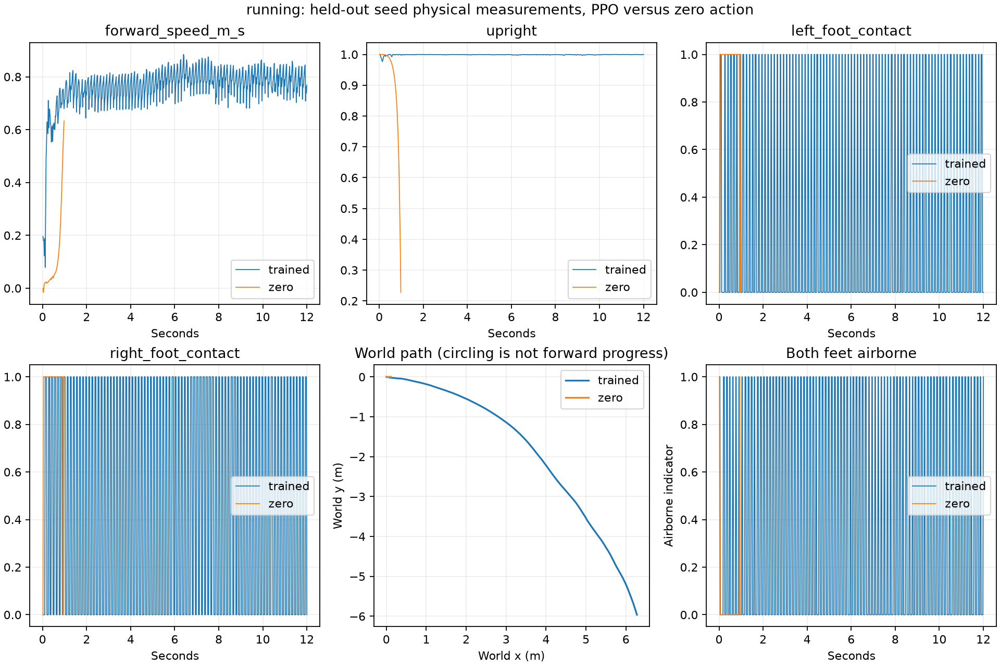

## Failure history and reward hacking

### Running v1: recipe evidence only

Running v1 did not produce an accepted skill result.

### Running v2: fast grounded stepping

Running v2 learned speed but failed the aerial requirement. This is the central
classification lesson: a gait can be fast, alternating, and upright while
remaining walking.

### Running v3: aerial gait, wrong world progress

Running v3 acquired aerial phases around 0.7 m/s, but three of five recorded
episodes failed signed intended displacement. The actor's local velocity could
look correct while accumulated yaw produced a curved world path.

The v4 response was deliberately observable:

- reduce the combined roll/pitch/yaw Gaussian from 8 to 2;
- add yaw-rate-only tracking at weight 8; and
- keep the strict evaluator unchanged.

Adding absolute heading to the reward would score a hidden variable. Lowering
the displacement floor would redefine the task around the failure.

### Exploit map

| Candidate behavior | Reward weakness | Independent rejection |
| --- | --- | --- |
| fast grounded walk | speed and alternating support | aerial fraction |
| stationary hopping | both feet airborne | flight speed gate and displacement |
| sideways or backward flight | airborne motion | command-directed projection |
| circular run | local speed remains high | signed intended displacement |
| face-forward dive | transient speed | upright and full horizon |
| joint saturation | applied target clips | raw-action smoothness and limit parking |

## Reading reward and PPO diagnostics

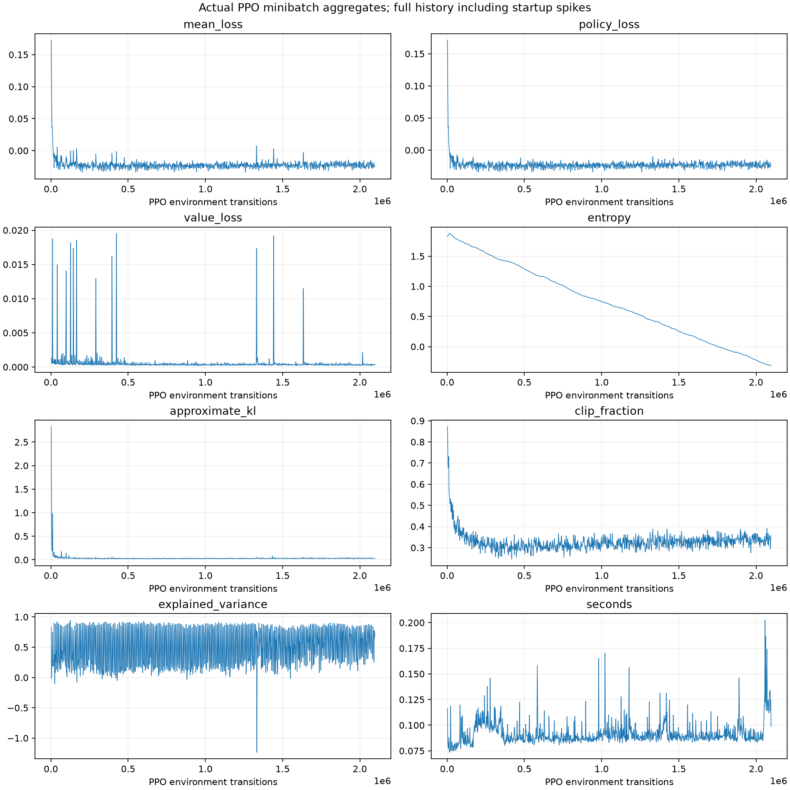

Normalized stochastic collection reward, raw completed-episode return, and
deterministic checkpoint return are different measurements. Reward
normalization changes scale over training. Sampled actions can terminate early.
The deterministic audit uses the actor mean and raw reward.

Policy loss is batch-relative. Approximate KL measures policy movement on the
sampled batch. Clip fraction reports the fraction of probability ratios outside
the unclipped interval. Value loss and explained variance describe critic fit.
None establishes running without contact and trajectory evidence.

## Reproducing the tracked result safely

The continuation cannot discover the base checkpoint from another run. Studio
requires the checkpoint to exist in the continuation run directory before it
adds `--init-from`.

Use the complete guarded **Running: all stages** procedure in
`docs/microduck-training-student-book/REPRODUCTION.md`. It is intentionally
long because it verifies:

1. fresh non-overlapping paths;
2. the base API report identity;
3. successful base training;
4. only the specifically recognized base skill-failure outcome;
5. successful render/export evidence;
6. both checkpoint and normalization sidecar; and
7. a copy into a distinct continuation run.

Then run the appendix's continuation, five-seed audit, and video verifier
commands unchanged. Keep a failed audit as a failed artifact.

The first two post-guard commands are reproduced here with the same valid
syntax; replace the timestamp consistently:

```bash
node duck-viewer/scripts/rlx-dance-api-e2e.mjs --execute \
  --base-url http://127.0.0.1:63317 --experiment running \
  --recipe-json docs/remaining-scenarios-e2e/recipes/running.json \
  --run running-reproduction-YYYYMMDD-HHMMSS \
  --report rlx/artifacts/scenarios-e2e-20260907/running-reproduction-YYYYMMDD-HHMMSS-api.json \
  --timeout-seconds 7200

rlx/.venv-microduck/bin/python rlx/scripts/audit_scenarios.py \
  --recipe-json docs/remaining-scenarios-e2e/recipes/running.json \
  --run rlx/runs/studio/running/running-reproduction-YYYYMMDD-HHMMSS \
  --output rlx/artifacts/scenarios-e2e-20260907/running-reproduction-YYYYMMDD-HHMMSS-audit \
  --seeds 501 502 503 504 505 --render
```

Run the appendix's matching `verify-rlx-video.mjs` command afterward; it also
requires `PLAYWRIGHT_PACKAGE` to resolve as described at the top of the
appendix.

This is a **conceptual sequence, not executable shell syntax**:

```text
running-base.json
  -> 6,000,640 fresh PPO transitions
  -> preserve failed base skill verdict
  -> guarded checkpoint + sidecar handoff
running.json
  -> 2,097,152 continuation transitions
  -> deterministic seeds 501..505
  -> negative controls
  -> ONNX parity, video, and browser checks
```

Do not shorten the process to "copy an old running.safetensors and run v4."
That would lose provenance and may pair weights with the wrong normalizer.

## Simulator versus hardware

The nominal result omits:

- BAM actuator dynamics, current limits, and communication latency;
- randomized mass, friction, noise, delay, and yaw;
- terrain variation, impacts, pushes, and recovery;
- battery sag, thermal behavior, cable forces, backlash, and wear;
- command-speed or turning generalization;
- hardware fall protection and emergency-stop validation.

The raw actor output also demonstrates substantial target saturation on the
first recorded step. That is not automatically unsafe in XML simulation, but
it is a reason not to treat the local pass as a hardware command-quality
certificate.

The appropriate next step is to port the environment and reward design to the
official `microduck_rl` mjlab/BAM stack, retrain with declared randomization and
larger-scale sampling, export through the official path, and validate on
hardware under a separate safety protocol.

## Read the saved Running result in Studio

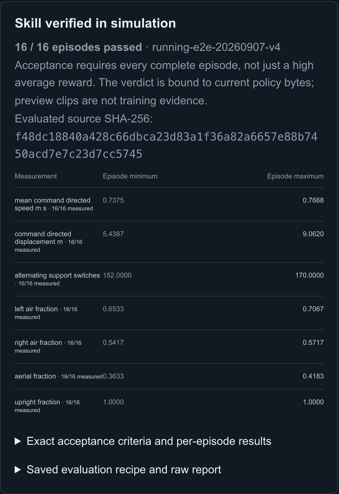

Select **Fast running** and use **Saved runs** to restore the historical recipe. Check that the saved command is 0.75 m/s and the complete evaluation lasts twelve seconds. Read the physical metric ranges and source hash before opening the video. Sixteen API episodes and five independent audit trials are distinct evidence sets. Watch the path as well as the feet: the passing result includes aerial phases but still curves, so this screenshot must not be described as proof of straight-line path following. No new training is performed by the capture procedure.

## Exercises

1. **Classify a gait.** A policy reaches 0.72 m/s and completes 600 steps, but
   its aerial fraction is 0.01. List the exact failed gate.
2. **Decode observability.** Explain why yaw-rate tracking is learnable from
   indices `0:3` and `48:51`, while absolute-heading error is not.
3. **Apply clipping.** Convert the recorded first actor output into the applied
   clipped offset vector. Which entries saturate?
4. **Compute a flight reward.** Evaluate `flight` for no contacts, upright
   0.9, and directed speed 0.2 m/s.
5. **Count PPO reuse.** Explain why 2,048 collected transitions create 16
   optimizer minibatches without becoming 32,768 new physical transitions.
6. **Interpret the lineage.** State separately what Running v3 acquired and
   what Running v4 improved.
7. **Audit a circle.** Construct a trajectory with high body-frame speed and
   near-zero signed intended displacement.
8. **Design held-out commands.** Predeclare speeds and yaw-rate commands, then
   specify whether you are testing interpolation, extrapolation, or a new task.

Command curricula, turning, randomization, pushes, energy constraints, and
hardware deployment are future experiments. They must earn their own audit
results rather than inheriting the nominal v4 pass.

# Swing: Teacher-Assisted Acquisition and PPO Refinement

## Learning Objectives

After this chapter, you should be able to:

- explain why the successful Swing result is **teacher acquisition followed by PPO refinement**, not scratch-PPO discovery;
- write the exact privileged teacher equation and map its 13 parameters into the 14-action contract;
- unpack every block of the student's 61-observation input without claiming that privileged swing angle or rate is appended;
- reconstruct the saved behavior-cloning and DAgger datasets, including shapes, counts, start bounds, and the actual no-mixture beta schedule;
- explain the BC loss, optimizer, minibatching, normalization statistics, and why a lower BC loss did not determine checkpoint selection;
- calculate exactly how 524,288 PPO transitions become 128 rollouts and 1,024 optimizer minibatches;
- explain what happens to the actor mean, critic, state-independent `actor_log_std`, normalizers, and optimizer state at the imitation-to-RL handoff;
- read bootstrap JSON, checkpoint sidecars, PPO JSONL telemetry, API reports, audits, and rollout traces without confusing their meanings;
- apply the strict physical gate and explain why the million-transition continuation is a failed policy even though it still swings widely;
- distinguish runnable repository examples from conceptual pseudocode and reproduce the staged pipeline without overwriting evidence.

The central attribution rule is non-negotiable:

> The selected observation-only actor acquired Swing through behavior cloning and on-policy DAgger. It already passed the strict Swing gate with `ppo_steps: 0`. PPO then refined that competent initializer for 524,288 transitions.

Fresh PPO did not discover the large-amplitude behavior. A scratch-PPO run completed 1,048,576 transitions but produced only about 2.23 degrees of still-start bidirectional span. Conversely, calling the final policy "just imitation" would also be wrong: PPO changed both actor and critic, raised the audited deterministic return and span, and produced its own optimization telemetry.

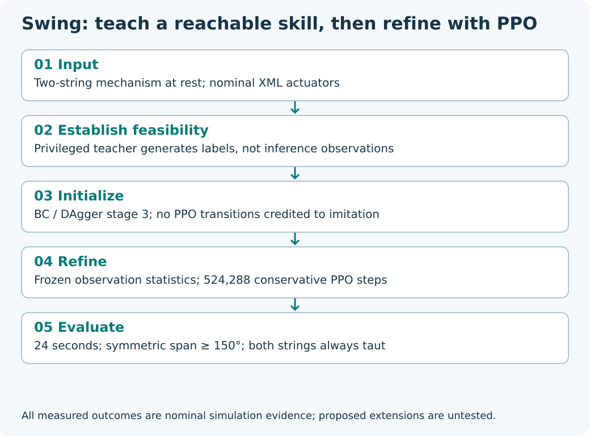

## The Task and Its Physical Measurements

The simulated robot sits in a retained swing seat suspended by two compliant tendons. Control runs at 50 Hz. The policy always uses the shared 61-observation, 14-action interface.

The swing recipe measures the average anchor location, the average seat-attachment location, and the average attachment velocity. If the anchor-to-attachment vector is $(x,y,z)$, then the sagittal swing angle and rate are

$$
\theta = \operatorname{atan2}(x,-z),
$$

$$
\dot\theta =
\frac{-z\dot x+x\dot z}{x^2+z^2}.
$$

The angle is zero when the seat hangs below the anchors. Positive and negative values are the two directions in the vertical swing plane. The teacher consumes $\theta$ in radians and $\dot\theta$ in radians per second. Reports convert $\theta$ to degrees.

The strict task begins from rest:

$$
\theta_0=0,\qquad \dot\theta_0=0.
$$

The bootstrap collector may reset inside bounded intervals around nonzero angle and rate. Those starts are data-acquisition aids, not accepted evaluation conditions. Skill-mode argument validation rejects nonzero Swing initial-angle or initial-rate bounds.

The tendon length metrics are sampled from MuJoCo. The reported spring-only tension is

$$
F_{\text{spring}}=k\max(l-l_0,0).
$$

Safety-limit constraint forces are excluded. A positive sampled value therefore means the modeled tendon spring was stretched at that 50 Hz sample; it is not a continuous-time hardware load guarantee.

### Planar action projection

The actor still emits 14 values. The environment clips each to $[-1,1]$ and, for this recipe, projects them into a sagittal subspace:

- action indices `0, 1, 7, 8, 9, 10` are set to zero;
- pairs `(2,11)`, `(3,12)`, and `(4,13)` are replaced by equal-and-opposite values;
- indices `5` and `6`, the neck-pitch and head-pitch actions, remain independently available;
- the projected action is stored in the observation's `last_action` block;
- the Swing wrapper passes the base environment the offset
  `SEATED_POSE - DEFAULT_POSE + 0.7 * projected_action`;
- the base environment clips that offset to `[-4,4]` and adds `DEFAULT_POSE`,
  so the effective joint target is
  `SEATED_POSE + 0.7 * projected_action` when the final offset clip is
  inactive.

This is an environment-side action restriction, not an extra teacher input and not a smaller deployed action tensor.

## Why Scratch PPO Failed

PPO estimates a policy gradient from sampled trajectories:

$$
\nabla_\theta J(\theta)
\approx
\mathbb{E}
\left[
\nabla_\theta\log\pi_\theta(a_t\mid o_t)\hat A_t
\right].
$$

If rollouts contain only stillness or tiny oscillation, PPO receives little evidence about the coordinated phase-dependent motion that injects energy into the swing. A larger reward coefficient cannot retrospectively assign credit to an action sequence that was never sampled.

The failed scratch run is therefore evidence about acquisition under that recipe, not proof that PPO can never learn Swing. Its optimizer ran, but the state-action distribution did not contain the required behavior. The successful pipeline deliberately changed that distribution:

1. a bounded privileged controller generated useful action labels;
2. BC placed an observation-only student near those labels;
3. DAgger queried the teacher on states reached by the student;
4. strict evaluation selected a competent imitation checkpoint;
5. PPO refined that checkpoint under the real reward and on-policy exploration.

## Stage 0: The Exact Privileged Teacher

The teacher parameter vector has 13 finite values:

$$
\mathbf{p}=(b,k_\theta,k_{\dot\theta},
\mathbf{o}_{0:5},\mathbf{a}_{0:5}).
$$

For a simulator state $(\theta,\dot\theta)$, it computes

$$
q=\tanh(b+k_\theta\theta+k_{\dot\theta}\dot\theta),
$$

$$
\mathbf{s}=
\operatorname{clip}(\mathbf{o}+\mathbf{a}q,-1,1),
$$

where $\mathbf{s}\in\mathbb{R}^5$. The saved source gives:

```text
bias                 0.14797230529360234
angle gain         -12.002270229601733
rate gain           -0.5333935911538304

offsets [-0.2263374287, -0.2579816298,  0.0721266818,
         -0.2121294270,  0.1456699723]

amplitudes [-0.4865735091, -0.9590667100, -1.0000000000,
             0.6472595167, -0.6942870027]
```

The five sagittal values are inserted into the 14-action array as follows:

```python
# Conceptual transcription of teacher_action; see the source for runnable code.
action = zeros(14)
action[2:7] = sagittal
action[11:14] = -sagittal[:3]
```

Thus:

- `action[2:7]` controls left hip pitch, left knee, left ankle, neck pitch, and head pitch;
- `action[11:14]` mirrors the first three values onto right hip pitch, right knee, and right ankle with opposite sign;
- yaw, roll, head yaw, and head roll remain zero.

Only `label_observation()` calls the private simulator method `_swing_state()`. Tests inspect the script's syntax tree to enforce that boundary. The exported `ObservationActor` stores only an ONNX session and accepts finite arrays shaped `[batch, 61]`; it has no environment or teacher reference.

## The Student's Exact 61 Observations

Each raw student observation is a fresh `float32[61]` array:

| Slice | Width | Meaning for Swing |
|---|---:|---|
| `0:3` | 3 | base angular velocity |
| `3:6` | 3 | gravity projected into the trunk frame |
| `6:20` | 14 | joint position relative to the shared default pose |
| `20:34` | 14 | one-control-step-lagged joint velocity |
| `34:48` | 14 | previous projected policy action |
| `48:51` | 3 | Swing command: `(0, body_y_axis_x, body_y_axis_z)` |
| `51:55` | 4 | head command, zero in Swing |
| `55:61` | 6 | body command, zero in Swing |

The student does **not** receive a separately appended $\theta$ or $\dot\theta$. It must infer useful phase information from ordinary proprioception: angular velocity, projected gravity, joint state, prior action, and the retained command slots. The Swing-specific command assignment changes values within the existing contract; it does not alter the size or ordering.

The 14 outputs remain normalized action offsets. The ONNX export contains the observation normalizer and deterministic actor mean. It exports neither a Gaussian sample nor the critic.

## Stage 1: Initial Behavior Cloning

### Demonstration collection

Initial collection executes teacher actions. The four reset bounds are:

```text
(maximum |angle| in degrees, maximum |rate| in rad/s)
(0, 0), (2, 0.05), (5, 0.1), (10, 0.2)
```

`reset()` samples uniformly inside the signed interval for each bound. The collector runs eight episodes, cycling through those four bounds twice. Every episode can contribute at most 1,200 control steps. The saved run reached the full count:

$$
8\text{ episodes}\times1{,}200
=9{,}600\text{ examples}.
$$

For each pre-action state it saves:

- the raw student observation $\mathbf{o}_i\in\mathbb{R}^{61}$;
- the teacher label $\mathbf{a}^T_i\in[-1,1]^{14}$;
- batch provenance containing seed, reset bounds, sample count, executed behavior, and label source.

### Frozen input normalization

The bootstrap computes an observation mean $\mathbf{m}_{\text{obs}}$ and
observation variance $\mathbf{v}_{\text{obs}}$ once from these initial 9,600
raw observations:

$$
\mathbf{m}_{\text{obs}}=
\operatorname{mean}(\mathbf{O},\text{axis}=0),
$$

$$
\mathbf{v}_{\text{obs}}=
\max\left(\operatorname{var}(\mathbf{O},\text{axis}=0),
\mathbf{f}^2\right).
$$

The per-dimension standard-deviation floors are:

| Observation block | Floor |
|---|---:|
| angular velocity `0:3` | 0.03 |
| projected gravity `3:6` | 0.01 |
| joint position `6:20` | 0.01 |
| joint velocity `20:34` | 0.25 |
| last action `34:48` | 0.05 |
| all 13 command values `48:61` | 0.01 |

Training inputs are

$$
\tilde{\mathbf{o}}_i=
\operatorname{clip}
\left(
\frac{\mathbf{o}_i-\mathbf{m}_{\text{obs}}}
{\sqrt{\mathbf{v}_{\text{obs}}+10^{-8}}},
-10,10
\right).
$$

Crucially, later DAgger observations do not update
$\mathbf{m}_{\text{obs}}$ or $\mathbf{v}_{\text{obs}}$. The saved provenance
calls this `normalizer_frozen_sample_count: 9600`. PPO also freezes this
observation normalizer, preserving the coordinate system in which the actor
was fitted. These symbols denote input-normalization statistics;
$\mu_\theta(\cdot)$ below denotes the actor's mean action.

### Objective and optimizer

Only the actor-mean network is optimized:

$$
L_{\text{BC}}(\theta)
=
\frac{1}{14N}
\sum_{i=1}^{N}
\left\|
\mu_\theta(\tilde{\mathbf{o}}_i)-\mathbf{a}^{T}_i
\right\|_2^2.
$$

The factor $14$ is required because MLX `mean` reduces over both the batch
dimension and all 14 action components. Writing $1/N$ with the same squared
Euclidean norm would describe a loss scaled 14 times larger.

Implementation details:

- actor and critic architecture: separate `61 -> 512 -> 256 -> 128` ELU MLPs;
- actor output width: 14;
- optimizer: MLX Adam with learning rate $3\times10^{-4}$;
- shuffled minibatch size: at most 512;
- requested epochs per stage: 80;
- loss reduction: mean over batch and action dimensions;
- no validation split, explicit regularizer, learning-rate schedule, early-stopping criterion, or BC gradient clipping is present;
- optimizer state persists across BC/DAgger stages in one bootstrap process;
- checkpoint serialization stores model weights and normalizers, not the BC Adam state.

The initial dataset has $\lceil9600/512\rceil=19$ minibatches per epoch, so 80 epochs produce $19\times80=1{,}520$ optimizer updates.

## Stage 2: On-Policy DAgger

Pure BC trains on the teacher's state distribution $d_{\pi_T}$. During deployment, small student errors change future observations, so the student instead encounters $d_{\pi_\theta}$. DAgger reduces this covariate shift by asking the teacher what should have been done on states the current student actually visits:

$$
\mathcal{D}_{k+1}
=
\mathcal{D}_k
\cup
\{(\mathbf{o},\pi_T(s)):
\mathbf{o}\sim d_{\pi_{\theta_k}}\}.
$$

In this implementation the ordering is exact:

1. reset a bounded-start environment;
2. read raw 61D observation $\mathbf{o}_t$;
3. query privileged state and compute teacher label $\mathbf{a}^T_t$ **before acting**;
4. append $(\mathbf{o}_t,\mathbf{a}^T_t)$;
5. pass raw $\mathbf{o}_t$ to the exported ONNX actor, whose embedded
   normalizer computes
   $\tilde{\mathbf{o}}_t=\operatorname{clip}((\mathbf{o}_t-\mathbf{m}_{\text{obs}})
   /\sqrt{\mathbf{v}_{\text{obs}}+10^{-8}},-10,10)$ before evaluating
   $\mu_{\theta_k}(\tilde{\mathbf{o}}_t)$, and execute that returned action;
6. receive $\mathbf{o}_{t+1}$ and repeat;
7. append the new batch to all earlier data and retrain on the accumulated dataset.

This is DAgger because the labels come from the teacher while the visited states come from the learner.

### The actual beta schedule

Many DAgger descriptions define a mixture policy

$$
\pi_{\beta_k}=\beta_k\pi_T+(1-\beta_k)\pi_{\theta_k}.
$$

The saved Swing bootstrap does **not** sample a stochastic or linearly decaying mixture. Its effective execution schedule is the hard switch:

| Collection stage | Executed action source | Effective $\beta$ |
|---|---|---:|
| initial BC collection | teacher | 1 |
| DAgger stages 1-5 | student ONNX actor | 0 |

The teacher still labels every DAgger state. Saying that beta "decays over five iterations" would invent behavior not present in the source.

### Dataset shapes and stage counts

Each stage attempts eight more 1,200-step episodes, so it adds up to 9,600 rows. The saved run completed all batches:

| Stage | Interpretation | Cumulative rows | Observation shape | Label shape | Updates | Strict result |
|---|---|---:|---|---|---:|---|
| 0 | teacher-distribution BC | 9,600 | `[9600,61]` | `[9600,14]` | 1,520 | fail: span, geometry, tension |
| 1 | first learner-distribution aggregation | 19,200 | `[19200,61]` | `[19200,14]` | 3,040 | fail: span |
| 2 | second aggregation | 28,800 | `[28800,61]` | `[28800,14]` | 4,560 | fail: one tension sample |
| 3 | third aggregation | 38,400 | `[38400,61]` | `[38400,14]` | 6,000 | **pass; selected** |
| 4 | fourth aggregation | 48,000 | `[48000,61]` | `[48000,14]` | 7,520 | fail: geometry |
| 5 | fifth aggregation | 57,600 | `[57600,61]` | `[57600,14]` | 9,040 | fail: span |

The final saved `demonstrations.npz` contains finite `float32` arrays:

```text
observations: (57600, 61)
labels:       (57600, 14)
```

This final archive includes data collected after the selected stage. The selected checkpoint itself was trained through stage 3 on 38,400 rows. Therefore `demonstrations.npz` row count and selected checkpoint `teacher_samples` intentionally differ.

### Why BC loss does not select the policy

Stage 3 had last BC loss about 0.00346 and passed. Stage 5 had a lower last loss, about 0.00158, but failed the 150-degree span gate. Stage 4 also had lower mean loss than stage 3 but violated geometry.

Supervised error averages all action dimensions over the collected dataset. It does not directly encode long-horizon phase stability, bidirectional amplitude, tendon tension, or the worst physical sample. Therefore selection is lexicographic:

```text
(strict pass,
 minimum valid-geometry fraction,
 minimum both-strings-tensioned fraction,
 minimum bidirectional span)
```

Pass status dominates all other fields. A larger but invalid swing cannot beat a smaller valid pass.

The selected stage-3 strict episode had approximately:

- positive peak: $79.09^\circ$;
- negative peak: $-77.60^\circ$;
- symmetric bidirectional span: $155.20^\circ$;
- valid geometry: 100%;
- both strings tensioned: 100%;
- maximum alignment: 0.00224;
- minimum sampled spring tension: 0.290 N.

Both bootstrap evaluation lanes were effectively identical under nominal deterministic resets. They verify repeatable execution, not disturbance robustness.

## The Imitation-to-PPO Handoff

The selected checkpoint is a full actor-critic container, but imitation trained only `model.actor_mean`.

### What is competent

- actor mean weights have been fitted through BC/DAgger;
- observation mean, variance, count, epsilon, and clip are saved;
- deterministic ONNX parity has been checked;
- the observation-only actor passes the strict still-start gate.

### What is not pretrained

- the critic remains at its random initialization;
- no BC optimizer state is loaded into PPO;
- reward-return normalization has not learned a useful scale: bootstrap saves mean 0, variance 1, and count $10^{-4}$;
- the bootstrap metadata correctly states `steps: 0`, `ppo_steps: 0`, and `critic: "random, not pretrained"`.

### Exploration standard deviation

The actor-critic owns a state-independent 14-vector `actor_log_std`. The bootstrap creates the model with `initial_std=0.1`, so initially

$$
\log\sigma_j=\log(0.1)\approx-2.302585
$$

for every action dimension. BC does not optimize this vector because its optimizer targets `model.actor_mean` only. It is nevertheless serialized and loaded with the checkpoint.

At PPO construction and after every update, MicroDuck constrains

$$
-5\le\log\sigma_j\le-0.5.
$$

The inherited value $\log(0.1)$ is already inside that interval. PPO samples

$$
\mathbf{a}_t=
\mu_\theta(\tilde{\mathbf{o}}_t)
+\boldsymbol\sigma\odot\boldsymbol\epsilon_t,
\qquad
\boldsymbol\epsilon_t\sim\mathcal{N}(0,I),
$$

while deterministic evaluation and ONNX use only $\mu_\theta$. Entropy coefficient zero means entropy is logged but not rewarded; `actor_log_std` can still change through the PPO likelihood objective.

### Normalizer and optimizer handling

PPO loads the bootstrap observation statistics and freezes observation-statistic updates. Reward normalization remains enabled and updates `return_rms` from discounted raw rewards:

$$
R_t^{\text{disc}}=\gamma R_{t-1}^{\text{disc}}+r_t,
\qquad
\hat r_t=
\operatorname{clip}
\left(
\frac{r_t}{\sqrt{\operatorname{Var}(R^{\text{disc}})+10^{-8}}},
-10,10
\right).
$$

PPO starts a new Adam optimizer at learning rate $3\times10^{-6}$. Both actor and critic parameters are then optimized by the PPO objective. The actor begins from a useful solution; the critic begins by catching up to on-policy returns.

## Stage 3: Exactly 524,288 PPO Transitions

The selected recipe is:

| Setting | Value |
|---|---:|
| PPO transitions | 524,288 |
| parallel environments | 16 |
| rollout steps per environment | 256 |
| rollout transitions | 4,096 |
| update epochs | 2 |
| minibatches per epoch | 4 |
| minibatch rows | 1,024 |
| optimizer steps per rollout | 8 |
| learning rate | $3\times10^{-6}$ |
| $\gamma$ | 0.995 |
| GAE $\lambda$ | 0.98 |
| normalize advantages | true |
| policy/value clip coefficient | 0.05 |
| clipped value loss | true |
| value coefficient | 1.0 |
| entropy coefficient | 0 |
| max gradient norm | 0.5 |
| reward normalization | enabled |
| observation normalization | frozen |
| checkpoint interval | 262,144 transitions |

A **transition** is one environment control step from one vector lane. It is not one optimizer step and not one MuJoCo physics substep.

The arithmetic is:

$$
16\text{ envs}\times256\text{ steps}=4{,}096
\text{ transitions per rollout},
$$

$$
524{,}288/4{,}096=128
\text{ rollout/update cycles},
$$

$$
4{,}096/4=1{,}024
\text{ rows per minibatch},
$$

$$
128\times2\times4=1{,}024
\text{ optimizer minibatches}.
$$

Because checkpoints are written at step 0 and every 262,144 transitions, the run contains snapshots at:

```text
0, 262144, 524288
```

The 19,200 transitions used by the later 16-lane, 1,200-step deterministic evaluation are evaluation data, not part of the 524,288 training budget.

### PPO objective details

The implementation forms GAE, normalizes advantages within each optimizer minibatch, and applies the clipped PPO policy loss. Log probability ratios are clipped to `[-20,20]` before exponentiation to prevent finite but extreme differences from overflowing.

The critic uses clipped Huber loss with transition at absolute error 10. Value predictions may also be clipped around the old value by the same 0.05 coefficient. Gradients are checked for finiteness, clipped to norm 0.5, and the save helper refuses non-finite tensors.

Timeouts are not treated as true terminal failures. For truncated lanes, PPO requires the original terminal observation, evaluates its critic value, and uses that value in GAE. Autoreset observations are not substituted for the timed-out final state.

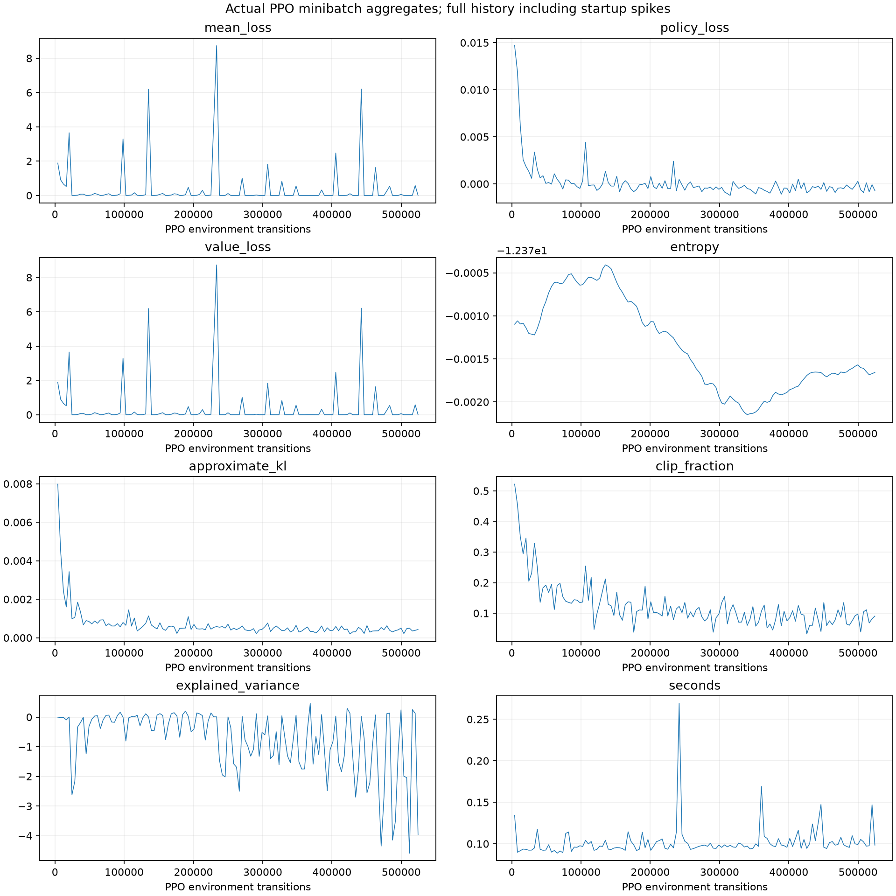

The saved v3 JSONL has:

- 128 collection rows;
- 128 update rows;
- 27 completed-episode rows containing 432 episode returns;
- 283 total rows;
- 1,024 optimizer steps reported across all updates;
- finite numeric update telemetry.

Across the final 100 update rows, mean approximate KL was about 0.000472 and clip fraction about 0.0969. Mean explained variance was about $-0.8999$.

Negative explained variance means the critic's value errors varied more than returns around a constant baseline on those minibatch samples. It is a real optimization limitation. It does not automatically invalidate the deterministic actor's separately measured physical pass, but it warns against claiming a well-fitted value function or treating PPO loss telemetry as proof of skill.

## Reward Structure

The reward weights used by the selected recipe are:

| Term | Weight |
|---|---:|
| new peak progress | 224 |
| height gain | 8 |
| late height gain | 24 |
| energy gain | 0.5 |
| lateral penalty | 3 |
| lateral barrier | 8 |
| lateral velocity | 3 |
| out-of-plane angular velocity | 1 |
| alignment penalty | 18 |
| alignment barrier | 4 |
| string slack/imbalance | 8 |
| string extension | 12 |
| invalid episode | 10 |
| action rate | 0.03 |
| joint torque | 0.001 |
| joint limit | 1 |

The peak term pays only newly reached positive and negative angular frontiers. If $p_t$ and $n_t$ are the best positive and negative magnitudes so far, the implementation pays bounded increments of their squared normalized values. The per-step frontier advance is capped at $8\Delta t$ before squaring:

$$
r_{\text{frontier},t}
\propto
\Delta\left(\frac{p_t}{\pi}\right)^2
+
\Delta\left(\frac{n_t}{\pi}\right)^2.
$$

Repeatedly revisiting an old peak does not farm the same progress reward.

Height and energy are

$$
h(\theta)=\operatorname{clip}(1-\cos\theta,0,2),
$$

$$
E(\theta,\dot\theta)=
\operatorname{clip}
\left(
h(\theta)+\frac{1}{2}\frac{L}{g}\dot\theta^2,
0,2
\right).
$$

The environment subtracts the reset's assisted-energy baseline before paying height or energy gain. A validity multiplier decays near lateral, alignment, slack, and extension boundaries. Two consecutive invalid samples latch the episode as invalid, set positive validity to zero, and activate the invalid-episode penalty.

Reward remains a training signal, not the acceptance definition. The gate below inspects physical measurements directly.

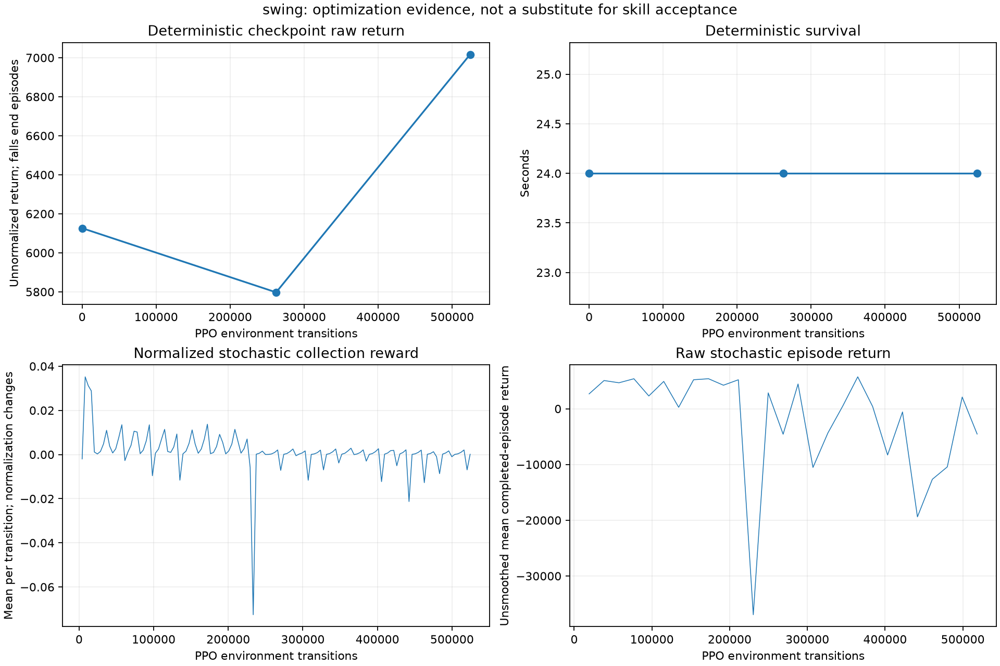

## Reading the Artifact and Log Schemas

### Bootstrap outputs

`stage-NN/training.json` describes one supervised stage:

- `stage`: 0 for initial BC, 1-5 for DAgger stages;
- `samples`: cumulative dataset rows used at that stage;
- `epochs_started`: epochs entered before a time budget stopped training;
- `optimizer_updates`: completed BC minibatches;
- `mean_bc_loss`, `last_bc_loss`: supervised MSE, not return;
- `onnx_parity_max_error`: maximum difference on a sampled parity batch;
- `strict_passed`: result of the two-lane strict evaluation;
- `selection_key`: lexicographic physical checkpoint-ranking tuple;
- `strict_episodes`: complete per-lane physical reports.

`provenance.json` records source/script hashes, hard limits, collection batches, all stage summaries, selected stage, frozen-normalizer count, artifact hashes, timings, and explicit limitations.

`demonstrations.npz` stores the final accumulated raw observations and teacher labels. It does not identify which rows alone trained the selected checkpoint; use stage metadata for that.

`swing.safetensors.json` is the checkpoint sidecar. The bootstrap sidecar records teacher source, parameters, sample count, normalizer policy, `ppo_steps: 0`, and random-critic status. The PPO sidecar nests that record under `initialization.loaded_metadata` and adds the PPO recipe and current `steps`.

### PPO `training-metrics.jsonl`

Each line is one JSON object:

- `phase: "collection"`: one 4,096-transition rollout, wall seconds, ending `env_steps`, and mean **normalized stochastic collection reward per transition**;
- `phase: "update"`: optimizer time, eight minibatch updates, policy/value/total losses, Gaussian entropy, approximate KL, clip fraction, explained variance, and ending `env_steps`;
- `phase: "episodes"`: raw completed-episode returns and lengths emitted when lanes finish, plus their mean raw return.

Collection `mean_reward` and episode `mean_raw_return` are intentionally different scales. The former is normalized and per transition; the latter is an unnormalized sum over an episode. Neither equals deterministic evaluation return.

### Evaluation and audit outputs

`evaluation.json` records one vectorized deterministic evaluation, including:

- recipe and source hashes;
- finite/pipeline/skill status;
- 16 per-lane Swing episode reports;
- raw rollout return;
- action magnitudes;
- metric summaries;
- termination and truncation counts.

The independent audit runs trained, zero, and random controls over named seeds and writes per-seed `.npz` traces, an `audit.json`, plots, comparison media, and hashes. Each trace preserves time-series values such as angle, tension, and lateral offset; the summary is not a substitute when diagnosing the exact failing sample.

The API report records requested and normalized recipes, operation state, captured process logs, final evaluation, render/export evidence, and any failure. A succeeded training operation plus a failed skill evaluation is still a failed experiment outcome.

## Strict Evaluation

For each 24-second, 1,200-step episode, let $\theta^+$ be the maximum positive angle and $\theta^-$ the magnitude of the most negative angle. The evaluator reports:

$$
S_{\text{peak-to-peak}}=\theta^+ + \theta^-,
$$

$$
S_{\text{bi}}=2\min(\theta^+,\theta^-).
$$

The symmetric metric prevents one large excursion and one weak return from passing. For example, $+90^\circ$ and $-40^\circ$ yield $130^\circ$ peak-to-peak but only $80^\circ$ bidirectional span.

Every episode must satisfy all of the following:

- $S_{\text{bi}}\ge150^\circ$;
- exactly 1,200 measured steps;
- time-limit truncation after the complete horizon, with no termination;
- finite required metrics at every sample;
- absolute lateral offset at most 0.020 m;
- alignment between 0 and 0.050;
- both string lengths between 0.370 m and 0.394 m;
- `valid_geometry == 1` at every measured sample;
- strictly positive spring tension in both strings at every sample.

The evaluator accumulates vector lanes and reset episodes separately. It never pools positive peaks from one episode with negative peaks from another.

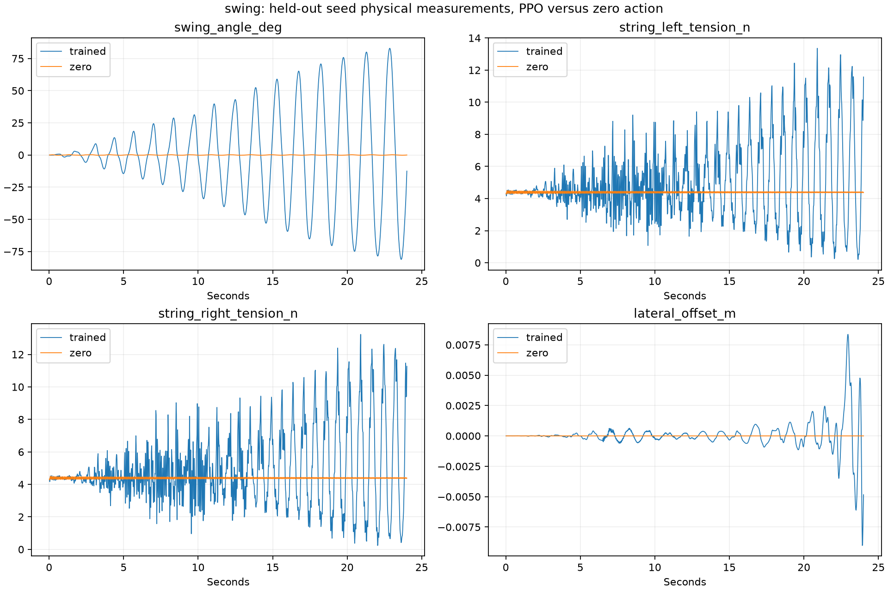

## Checkpoint Selection and the Bad Continuation

The selected v3 final policy produced:

- 16/16 passing API-evaluation episodes;
- five passing independent audit seeds, 501-505;
- positive peak about $82.94^\circ$;
- negative peak about $-81.16^\circ$;
- symmetric span about $162.32^\circ$;
- maximum lateral offset about 0.00902 m;
- maximum alignment about 0.04607 against a 0.050 limit;
- minimum sampled spring tension about 0.209 N;
- deterministic raw return about 7,016.89;
- native/ONNX maximum action difference about $1.132\times10^{-6}$.

The selected BC/DAgger initializer already passed. The final audit's saved initial-policy trace reports about $154.62^\circ$ span and raw return 6,126.39. PPO raised the same nominal seed's return by about 890.50, or 14.5%, and raised the span to $162.32^\circ$. Those are refinement measurements, not acquisition credit.

The seeds are nearly identical because the nominal Swing reset has no enabled domain randomization, observation noise, action delay, random yaw, or nonzero start bounds. Repeating deterministic dynamics checks reproducibility and pipeline consistency; it does not estimate a broad success probability.

### Why the 1,048,576-transition continuation is rejected

Swing v2 used the same teacher-assisted family and trained to 1,048,576 transitions. Its 524,288 checkpoint passed, but its final checkpoint failed:

- bidirectional span remained large, about $160.03^\circ$;
- valid geometry fraction fell to about 0.9475;
- maximum alignment reached about 0.1633, over three times the 0.050 limit;
- both-strings-tensioned fraction was about 0.99917, meaning one of 1,200 samples failed;
- minimum sampled spring tension was 0 N;
- deterministic raw return became about -711.97 under the physical evaluation.

This is not "almost a pass." The gate is fail-closed and requires every sampled step. Large amplitude does not compensate for invalid geometry or lost tension.

The million-transition failure also explains the v3 lineage: v3 did **not** continue from the bad v2 final checkpoint or copy back the v2 524k snapshot as its final result. It repeated the teacher-assisted initialization and declared a 524,288-transition budget, then required a fresh evaluation and audit. The shorter schedule was selected from evidence that further PPO updates could damage the skill.

## Complete Staged Pipeline

### What is runnable and what is conceptual

Code blocks marked `bash` below are repository commands. They perform real supervised training, PPO, evaluation, rendering, or audit and require the documented environment.

Short Python snippets earlier in the chapter are conceptual transcriptions. They explain equations and indexing but omit imports, environment construction, budgets, hashing, and overwrite guards. Use `rlx/scripts/bootstrap_swing_e2e.py` and `rlx/examples/ppo_microduck_studio.py` as the runnable implementations.

### Safe reproduction

Run from the repository root. Use one fresh timestamp in every matching path. The fail-closed block requires both the bootstrap output and the entire destination run directory to be new; any failed command stops the block before subsequent copies.

```bash
(
set -eu
test ! -e /tmp/swing-bootstrap-reproduction-YYYYMMDD-HHMMSS
test ! -e rlx/runs/studio/swing/swing-reproduction-YYYYMMDD-HHMMSS
rlx/.venv-microduck/bin/python rlx/scripts/bootstrap_swing_e2e.py \
  --source docs/remaining-scenarios-e2e/recipes/swing-teacher.json \
  --output /tmp/swing-bootstrap-reproduction-YYYYMMDD-HHMMSS

test -f /tmp/swing-bootstrap-reproduction-YYYYMMDD-HHMMSS/swing.safetensors
test -f /tmp/swing-bootstrap-reproduction-YYYYMMDD-HHMMSS/swing.safetensors.json
test -f /tmp/swing-bootstrap-reproduction-YYYYMMDD-HHMMSS/provenance.json
mkdir -p rlx/runs/studio/swing
mkdir rlx/runs/studio/swing/swing-reproduction-YYYYMMDD-HHMMSS
cp /tmp/swing-bootstrap-reproduction-YYYYMMDD-HHMMSS/swing.safetensors \
  /tmp/swing-bootstrap-reproduction-YYYYMMDD-HHMMSS/swing.safetensors.json \
  rlx/runs/studio/swing/swing-reproduction-YYYYMMDD-HHMMSS/
)
```

Before PPO, inspect:

```bash
jq '{selected_stage, samples, normalizer_frozen_sample_count, limitations}' \
  /tmp/swing-bootstrap-reproduction-YYYYMMDD-HHMMSS/provenance.json

jq '.metadata | {steps, ppo_steps, dagger_iteration, teacher_samples, critic}' \
  rlx/runs/studio/swing/swing-reproduction-YYYYMMDD-HHMMSS/swing.safetensors.json
```

The expected semantics are `steps: 0`, `ppo_steps: 0`, teacher assistance declared, and a random critic. Do not proceed from an initializer whose strict evaluation failed merely because its BC loss is low.

With Studio already running at `http://127.0.0.1:63317`, execute the tracked recipe:

```bash
node duck-viewer/scripts/rlx-dance-api-e2e.mjs \
  --execute --base-url http://127.0.0.1:63317 \
  --experiment swing \
  --recipe-json docs/remaining-scenarios-e2e/recipes/swing.json \
  --run swing-reproduction-YYYYMMDD-HHMMSS \
  --report rlx/artifacts/scenarios-e2e-20260907/swing-reproduction-YYYYMMDD-HHMMSS-api.json \
  --timeout-seconds 7200
```

Then run the independent physical audit:

```bash
rlx/.venv-microduck/bin/python rlx/scripts/audit_scenarios.py \
  --recipe-json docs/remaining-scenarios-e2e/recipes/swing.json \
  --run rlx/runs/studio/swing/swing-reproduction-YYYYMMDD-HHMMSS \
  --output rlx/artifacts/scenarios-e2e-20260907/swing-reproduction-YYYYMMDD-HHMMSS-audit \
  --seeds 501 502 503 504 505 --render
```

For browser/video verification, follow the complete guarded Swing procedure in `docs/microduck-training-student-book/REPRODUCTION.md`. Its `PLAYWRIGHT_PACKAGE` default is workstation-specific and must be set appropriately elsewhere.

Important stop rules:

- a nonzero bootstrap or training exit means the stage did not complete;
- a nonzero audit exit is evidence of a failed gate and must remain visible;
- do not copy a checkpoint when its sidecar or provenance is missing;
- do not reinterpret a completed optimizer run as a successful skill;
- do not resume from the failed million-transition final policy;
- do not claim hardware safety, BAM equivalence, or robustness from nominal XML evidence.

## Source-Grounded Limits and Unknowns

The repository and saved artifacts establish the exact counts and outcomes reported above. They do **not** establish:

- the size or search algorithm of the earlier controller-parameter search population; `swing-teacher.json` preserves only the selected 13 values and a source-evidence hash;
- a BC train/validation generalization gap, because no held-out supervised split is recorded;
- robustness to randomized starts, disturbances, sensor noise, delay, actuator mismatch, or domain randomization;
- continuous-time tendon tension between 50 Hz samples;
- hardware-safe loads or sim-to-real transfer;
- five independent training seeds; the five audit seeds replay essentially identical nominal dynamics;
- scratch-PPO impossibility in principle; only failure of the recorded scratch recipe is shown.

Unknown quantities must remain unknown rather than being reconstructed from filenames or inferred from the final pass.

## Read the saved Swing result in Studio

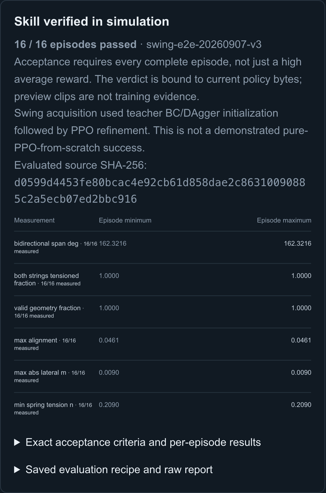

Select **Self-pumped swing** and restore the historical run with **Saved runs**. Verify the 1,200-step still-start horizon, 150-degree bidirectional target and evaluated source hash. Inspect all geometry/tension rows rather than accepting the largest angular peak as a complete result. The screenshot's sixteen nominal API episodes and the separate five audit seeds do not imply randomized robustness. The saved video is the final mean actor—not the privileged teacher or an animation. This read-only UI capture launches neither imitation nor PPO training.

## Exercises

**Easy: reconstruct the teacher action.** Given the saved 13 parameters, $\theta=0.1$ rad, and $\dot\theta=-0.2$ rad/s, compute $q$, the five clipped sagittal values, and all 14 action entries.

Acceptance check: six specified action indices are zero; the right hip-pitch, knee, and ankle entries negate the first three left sagittal entries; all outputs are in $[-1,1]$.

**Easy: label the observation blocks.** Write the half-open slice for each of the eight 61D blocks and identify which values are Swing-specific.

Acceptance check: no extra angle/rate block is invented; the Swing command occupies `48:51`; head and body command blocks remain present and zero.

**Intermediate: verify dataset arithmetic.** Derive the cumulative sample count and BC optimizer-update count for every stage.

Acceptance check: use eight episodes times 1,200 samples per collection stage and `ceil(N/512) * 80` updates; explain why stage 3 uses 38,400 rows while the final NPZ contains 57,600.

**Intermediate: explain beta honestly.** Compare a textbook decaying-mixture DAgger schedule with the implementation's collection policy.

Acceptance check: report effective beta 1 for initial collection and 0 for every DAgger collection; distinguish executed student action from retained teacher label.

**Intermediate: audit imitation-to-RL state.** Make a table for actor mean, critic, `actor_log_std`, observation normalizer, return normalizer, and optimizer.

Acceptance check: actor mean is pretrained; critic is random; log standard deviation is inherited at $\log(0.1)$; observation statistics are inherited and frozen; return statistics start at the bootstrap defaults and update; PPO Adam is fresh.

**Intermediate: derive PPO work counts.** Starting from 16 environments, 256 steps, four minibatches, two epochs, and 524,288 transitions, compute rollout size, number of updates, minibatch size, and optimizer minibatches.

Acceptance check: 4,096 transitions per rollout, 128 updates, 1,024 rows per minibatch, and 1,024 optimizer minibatches.

**Advanced: parse telemetry without mixing scales.** Read `training-metrics.jsonl` and separately aggregate collection reward, completed raw episode return, KL, clip fraction, and explained variance.

Acceptance check: preserve the distinction between normalized stochastic per-transition reward, raw stochastic episode return, and deterministic evaluation return.

**Advanced: implement the strict span metric.** Given an angle series, compute positive peak, negative peak, peak-to-peak span, and symmetric bidirectional span. Reject incomplete episodes and missing metrics.

Acceptance check: $+90^\circ/-40^\circ$ gives $130^\circ$ peak-to-peak and $80^\circ$ bidirectional span; peaks from different episodes are never combined.

**Advanced: select a checkpoint.** Compare stages 2-5 using BC loss, strict pass, geometry fraction, tension fraction, and span.

Acceptance check: choose stage 3 even though later stages have lower BC loss; explain the lexicographic selection key and why one zero-tension sample fails stage 2.

**Advanced: diagnose the bad continuation.** Compare the 524,288-transition pass with the 1,048,576-transition final policy.

Acceptance check: do not call the longer policy better because its amplitude remains high; identify alignment, geometry fraction, and zero-tension evidence; recommend a fresh bounded rerun or checkpoint selection rather than continuing the failed final weights.

**Research extension: design a robustness study without claiming results.** Propose randomized initial angle/rate, observation noise, delay, actuator variation, and multiple training seeds.

Acceptance check: distinguish acquisition experiments, checkpoint selection data, and held-out robustness tests; predeclare the physical gate and report all failures.

# Evaluation, debugging and the next research project

## Five outputs, five different questions

A complete experiment answers five questions independently. Do not compress them into one green badge.

| Evidence layer | Question | Minimum retained evidence |
|---|---|---|
| Training | Did the intended optimizer run on physical experience? | Recipe, transition counts, JSONL updates, finite parameters |
| Export | Does ONNX reproduce the native actor? | Normalizer-bearing ONNX, checkpoint identity, action parity |
| Skill | Does the robot perform the declared task? | Complete-episode metrics, all gates, controls, failure reasons |
| Media | Does the video actually contain the saved rollout? | Full decode, duration/frame count, source identity, playback/seek |
| Interpretation | Is the claim narrower than its evidence? | Scope, failed attempts, initializer provenance, untested extensions |

The separate `audit.json` files bundled with this book preserve the original checkpoint hashes, effective environment options, controls, physical measurements, and training diagnostics. The paired video-validation receipts preserve the earlier media checks. Fresh `assets/ui-capture.json` records which saved run the browser opened and played during book creation.

## A reproducible evidence notebook

Create a new directory before each experiment. Record the source revision and dirty diff, environment versions, model XML identity, input reference hash, requested recipe, API-normalized recipe, initializer, seed and purpose. Save failed runs alongside successful ones. A useful manifest is not a photograph of a terminal window: it is machine-readable data with enough identity to reject a stale file.

For each trained policy, retain:

```text
run/
  scenario.safetensors
  scenario.safetensors.json
  scenario.onnx
  training-metrics.jsonl
  evaluation.json
  checkpoints/
  render/ep0.mp4
audit/
  audit.json
  video-validation.json
  reward-learning.png
  ppo-losses.png
  physical-tracking.png  (joint-tracking.png for Dance)
  trained-seed*.npz
  zero-seed*.npz
  comparison.mp4
```

The full historical evidence folders are not included automatically by Git. The book copies the figures and audit receipts so it remains readable without those folders, but reproducing a plot from raw samples still requires the original journals/NPZ files or a new training run.

### Read a bundled audit without loading MLX

This complete inspection snippet runs from the workspace root using ordinary Python:

```python
import json
from pathlib import Path

root = Path("docs/microduck-training-student-book/assets")
audit = json.loads((root / "running-audit.json").read_text())
trials = audit["controls"]["trained"]
assert len(trials) == 5
assert all(trial["passed"] for trial in trials)
for trial in trials:
    episode = trial["episodes"][0]
    print(trial["seed"], episode["steps"],
          episode["command_directed_displacement_m"],
          episode["aerial_fraction"])
```

This verifies the saved report contents, not a newly simulated policy. To test a new checkpoint, run the audit command. To establish real-world transfer, neither this snippet nor the local simulator is sufficient.

## Why the controls matter

**Zero action** asks whether the spawn pose or passive physics can satisfy the reward. It does not mean frozen world state; a zero target offset can still fall or move. **Random/untrained policy** asks whether an arbitrary network already scores well. **Loaded initializer** measures what was present before refinement. **Frozen phase** in Dance tests whether dynamic timing actually contributes. A reference animation is a visualization of desired pose, not a physically valid control baseline.

Controls must share the relevant environment and horizon. If one terminates early, label that termination. Do not extend its last frame and imply it survived. If you compare normalized training return to raw deterministic control return, the comparison is invalid even if both axes say “reward.”

## Measuring progress when a robot turns

Running exposed an important difference between body-frame speed, path length and intended displacement. A robot can move quickly forward relative to its own rotating torso while returning near its starting position. Its path length is positive, but it did not obey a zero-turn forward command.

The locomotion evaluator anchors an intended heading for each command segment, advances it only by commanded yaw, and projects **signed world-position increments** onto that intended direction. It also measures body-frame directed velocity and contact transitions. These are complementary checks, not interchangeable formulas. The first position sample establishes the anchor; it does not receive unobserved displacement credit.

The actor need not observe world position for the evaluator to measure it. Observation restrictions constrain the deployed policy's inputs; an independent measurement system may use richer state to judge the outcome. Adding an absolute-heading reward to an actor that cannot infer heading would be a separate design decision, not a free fix.

## Debugging by layer

| Symptom | First diagnostic | Avoid this shortcut |
|---|---|---|
| No checkpoint | API operation state, Python stderr, paths, dependency imports | Increasing training timesteps |
| Immediate NaNs | Observation/action/return ranges, gradients, ELU branch and normalizers | Smoothing the curve or ignoring nonfinite updates |
| Good reward, stationary Dance | Moving-joint variance and static-pose baseline | Calling a balanced pose imitation |
| Fast but grounded Running | Both-foot aerial fraction and liftoff/contact events | Lowering the flight gate to make the run pass |
| High speed, no progress | Signed displacement and heading drift | Using traveled distance instead |
| Large Swing, failed geometry | Tension, lateral error, seat/string alignment at every sample | Reporting peak angle alone |
| Native works, ONNX fails | Input normalization once, tensor dimensions, checkpoint hashes | Re-exporting unrelated weights until something moves |
| MP4 opens but result is wrong | Run name, video URL, source hash, complete horizon | Treating browser playback as a skill test |

Move from the cheapest falsifying test to the more expensive one. A wrong file path should be fixed before rerunning millions of transitions. A valid file with a failed skill gate needs a new learning experiment, not another file-extension check.

## A disciplined improvement ladder

### Level 1: make the measurement reproducible

Rebuild the book, inspect the four saved videos, and explain one acceptance failure from a historical run. Change no reward. Deliver a one-page claim/evidence table with exact units and horizon. This teaches students that an experiment starts with a test, not with a neural network.

### Level 2: reproduce one selected recipe

Use a fresh run name, the exact clip or morphology, and the complete initializer lineage. Keep nominal dynamics and the same evaluator. Expect numerical differences across hardware/software revisions; a published count is not a guarantee of a bit-identical trajectory. Report pass/fail and the magnitude of differences instead of altering thresholds retrospectively.

### Level 3: one-variable ablation

For Dance, vary pose precision while preserving the excerpt and physical gate. For Stilts, compare angular tracking weights at the same morphology. For Running, remove the yaw-only term and predict circling before collecting data. For Swing, compare a frozen and updating observation normalizer from the **same** bootstrap. These are proposed experiments. Do not imply that the book's evidence already proves their outcomes.

### Level 4: held-out robustness

Use separate development and test seeds. The historical reset-seed sets in this book have been inspected and used in experiment development; once students repeatedly tune against them, they are no longer an untouched test set. Reserve new seeds, disturbances and commands before selecting the winner. If nominal resets have no effective randomness, introduce a declared controlled perturbation rather than claiming statistical independence from different integers alone.

Train multiple seeds when studying reliability of the learning algorithm. Resetting one actor five times estimates different behavior than training five independent actors. Keep both costs and both uncertainty sources explicit.

### Level 5: transfer the design, not the claim

Port the promising task to the official `microduck_rl` training stack with its actuator modeling, randomization and hardware-specific validation. The nominal Swing teacher showed poor BAM behavior in the separate feasibility search, so actuator transfer is a real missing capability, not paperwork. An ONNX file matching 61 inputs and 14 outputs is necessary for interface compatibility; it is not permission to put the policy on hardware.

## Scenario-specific advanced projects

| Project | What to change | How to decide whether it helped |
|---|---|---|
| Dance phrase curriculum | Progress from eight seconds to longer phrases; validate phase transitions and loader coverage | New complete-phrase audits, static baselines, balance and continuity; no claim about ignored root channels |
| Dance tempo conditioning | Expose a tempo command using an explicitly documented compatible slot convention | Held-out tempos without retiming the evaluation trace after the fact |
| Stilt morphology generalization | Controlled height/mass/blend grid or morphology-conditioned actor | Held-out geometries, clearance/contact checks, consistent units and evaluation morphology |
| Running generalization | Multiple speed commands and turning segments | Correct command-segment progress, flight and stability across unseen commands |
| Running efficiency | Add measured mechanical energy/torque constraints | Compare efficiency only among policies already passing the same skill gate |
| Swing scratch exploration | Progressively reduce teacher data or design a clearly labeled training curriculum | Still-start skill without inference-time teacher; separate data and PPO budgets |
| Swing robustness margin | Perturb dynamics and penalize unsafe near-boundary geometry | Preserve bidirectional span while improving minimum tension and alignment margins |

A curriculum can change the training distribution without relaxing the final evaluation. However, label assisted resets and teacher labels. If the actor fails from stillness without the assistance, the final skill remains unlearned under the original task.

## Selected exercise answers

**Stilt contact question:** $480/500=0.96$ upright coverage passes, but right-foot air fraction 0.04 fails the 0.05 minimum. The episode fails even if every other measure is excellent.

**Running speed question:** $0.30/0.75=0.40$ passes the 0.35 speed-ratio minimum. Absolute directed speed 0.30 m/s fails the 0.35 m/s floor. One cannot substitute the ratio for the speed floor.

**Swing span question:** peaks +90° and −40° give 130° peak-to-peak but only $2\min(90,40)=80$° symmetric span. A spectacular one-sided excursion is insufficient.

**Dance static baseline:** if tracking RMSE is 0.08 rad and the matching moving-joint static baseline is 0.10 rad, gain is $1-0.08/0.10=0.20$. It reaches the dynamic threshold but still needs every other gate, including leg motion and balance. Compare the same selected joints in numerator and denominator.

## Capstone: a defensible experiment report

Submit a Markdown report with: hypothesis; exact input and observation semantics; reward equation; requested/effective parameters; full checkpoint lineage; budget in transitions and optimizer steps; reward/loss/physical figures; per-episode gates; negative controls; full MP4 and validation receipt; failed attempts; and limitations. Add a short paragraph explaining what evidence would disprove your claim.

Suggested grading: 25% reproducibility, 25% physical evaluation, 20% mathematical/code explanation, 20% interpretation and honest limitations, 10% clarity of figures and media. A failed skill experiment can earn a strong grade if it is reproducible and teaches a falsifiable lesson. A polished video with untraceable weights cannot.

# Evidence index and implementation reading map

## Original rollouts

These links point to the local full-resolution source videos. If the large evidence directories were not shared, recreate them using the reproduction appendix instead of expecting them in a fresh clone.

- [Dance: sixteen uninterrupted seconds, two excerpt cycles](../../rlx/artifacts/dance-e2e-20260907/final-audit/extended-render/ep0.mp4).
- [Dance: reference, PPO and null comparison](../../rlx/artifacts/dance-e2e-20260907/final-audit/comparison.mp4).
- [Running: complete API-delivered twelve-second rollout](../../rlx/artifacts/scenarios-e2e-20260907/running-v4-audit/api-video.mp4).
- [Stilts: complete API-delivered ten-second rollout](../../rlx/artifacts/scenarios-e2e-20260907/stilts-v3-audit/api-video.mp4).
- [Swing: complete API-delivered twenty-four-second rollout](../../rlx/artifacts/scenarios-e2e-20260907/swing-v3-audit/api-video.mp4).

The cover captures frames at Dance 3 s, Running 6 s, Stilts 5 s and Swing 18 s. The exact MP4 hashes and frame provenance are in [asset-manifest.json](asset-manifest.json). These are native 640×360 video frames, not fabricated high-resolution stills. On the cover each occupies about 3.69 inches horizontally, approximately 174 source pixels per inch. Design diagrams and equations are vector; original reward/loss figures retain their native pixel dimensions; UI screenshots were captured at three device pixels per CSS pixel.

## Read code in dependency order

| File | Study question |
|---|---|
| `microduck_local/src/microduck_local/contract.py` | Where do observation slots, joint order and timing come from? |
| `rlx/rlx/environments/microduck_recipes.py` | How does a scenario construct and instrument its environment? |
| `rlx/rlx/environments/microduck.py` | Where do normalization, autoresets and terminal observations cross the vector boundary? |
| `rlx/rlx/models/microduck.py` | How are policy, critic, stable ELU and checkpoint metadata defined? |
| `rlx/rlx/utils/utils.py` | How does GAE stop at resets while bootstrapping timeouts? |
| `rlx/rlx/algorithms/ppo.py` | Where are clipped objectives, robust critic loss and finite-update guards implemented? |
| `rlx/examples/ppo_microduck_studio.py` | Which defaults does Studio actually supply to PPO? |
| `duck-viewer/lib/rlx-job.ts` | Which API values are clamped, overridden or rounded? |
| `rlx/rlx/environments/dance_evaluation.py` | How are moving-joint baselines and temporal coverage measured? |
| `rlx/rlx/environments/locomotion_evaluation.py` | How do intended progress and aerial/contact gates prevent reward exploits? |
| `rlx/rlx/environments/swing_evaluation.py` | How are continuous geometry and symmetric span assessed? |
| `rlx/scripts/bootstrap_swing_e2e.py` | How are privileged teacher labels separated from actor inference? |

## Verification scope and remaining gaps

The source experiment reports record native RLX tests (418 passed, 2 skipped), Node tests (74 passed), and report-generator tests (18 passed), alongside successful targeted lint/build checks. They also record **12 existing broader local-harness test failures** and optional mjlab collection failures where that dependency was not installed. These are historical validation records, not a claim that the whole workspace currently passes every possible suite.

Book generation checks source/asset links, parameter coverage, preserved image hashes, script syntax, readable PDF output, mathematical typesetting and saved-run browser playback. It does not replace simulation audits or repeat expensive training. Consult `validation.json` for the fresh book-build checks and the original reports for experiment execution evidence.

## Further study

The executable repository is the source of truth for the exact formulas taught here. For background, search the original paper **Schulman et al., “Proximal Policy Optimization Algorithms,” arXiv:1707.06347 (2017)** and **Schulman et al., “High-Dimensional Continuous Control Using Generalized Advantage Estimation,” arXiv:1506.02438 (2015)**. Treat a paper's generic objective as context, then read the current implementation for additions such as robust value loss and numerical guards. This book's measured outcomes come from local audit artifacts, not from those papers.

# From a Passing Simulation to a Robotics Research Practicum

## What this book has—and has not—trained

The experiments train neural controllers of a simulated Microduck using the robot's shared observation/action dimensions and model assets. They do **not** establish that these four exported actors are ready to execute on a physical Microduck. All selected final audit environments use nominal XML actuators, with domain randomization, observation noise, action delay and random yaw disabled. A green simulated skill badge is meaningful within those conditions, but it is not hardware approval.

The authoritative local playbook, `microduck_local/AGENTS.md`, specifies a progression: prototype locally, port the task into an upstream mjlab configuration, and retrain with the official `microduck_rl` sim-to-real recipe. The upstream README describes BAM actuator physics, friction and backlash modeling, randomization and a deployment contract. This chapter teaches how to prepare that progression; it deliberately does not invent a hardware deployment command for unvalidated Swing/Stilt mechanisms.

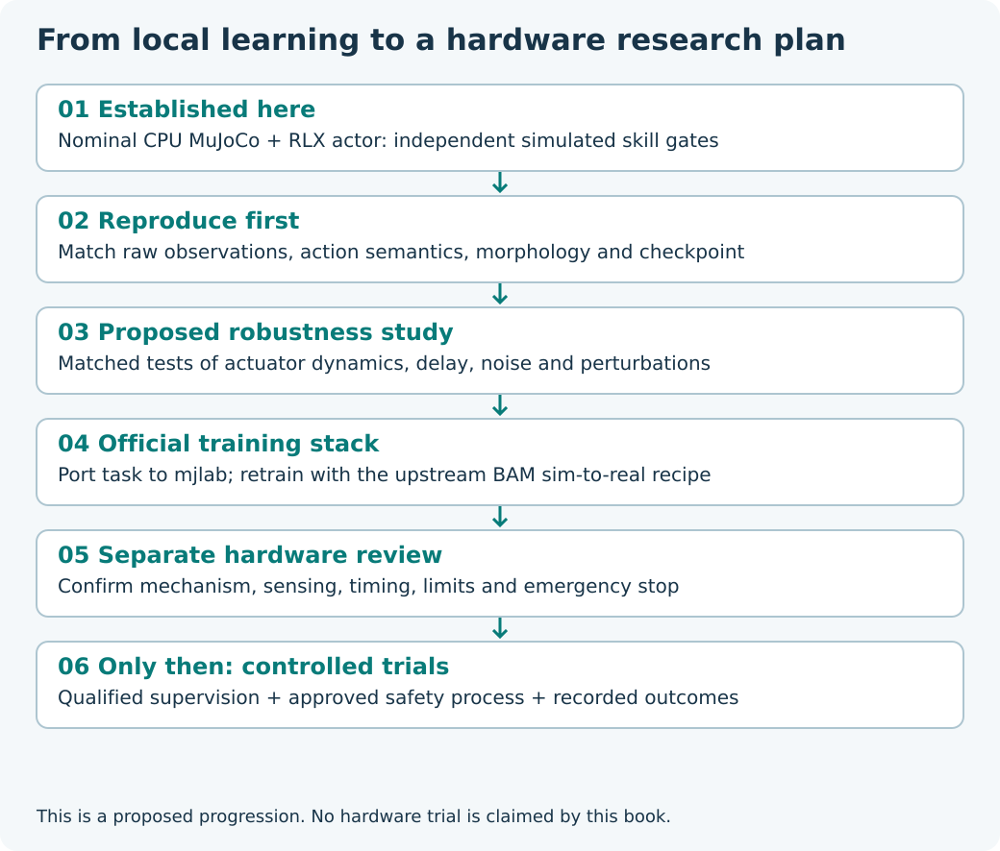

## Compatibility has three layers

**Tensor compatibility.** Does ONNX accept the expected float tensor and return fourteen actions? Are values finite? Does native/ONNX parity hold? This catches serialization and normalizer mistakes, not a bad behavior.

**Semantic compatibility.** Does slot 59 still mean the same thing? Are joint order, sign, zero position, previous action, command values, units, clipping and the 50 Hz period identical? Dance needs its phase commands. Swing reuses command slots for body-axis information and applies a seated, planar action wrapper. A generic locomotion runtime that supplies different commands or adds actions to a standing default pose can be incompatible despite identical tensor sizes. The wrapper is part of the policy's physical meaning even when not all of it lives inside ONNX.

**Physical compatibility.** Are servo response, available torque, battery behavior, contact friction, compliance, inertia, delay and sensor quality sufficiently represented? A perfectly exported action can still ask for motion the real plant cannot produce. Adding a seat or a stilt changes the plant, not just a rendering mesh. The simulated retained Swing seat/tendon system is not evidence of a fabricated, instrumented and safety-reviewed physical apparatus.

Use these three layers as separate rows in your report. “ONNX works” answers only part of the first row. The source model also caps Gaussian exploration during training, but those numerical caps are not a motor current limit or a mechanical safety bound.

## A closed-loop timing exercise

The 50 Hz policy period allocates 20 ms per observation-to-action cycle. A **proposed measurement worksheet**, not an existing benchmark, should record:

| Interval | Measure on the target runtime | Why it matters |
|---|---|---|
| Sensor acquisition and timestamp age | Joint/IMU sample time versus decision time | The controller may act on stale state |
| Observation assembly | Exact transforms and ordering | Frame or sign errors create systematically wrong feedback |
| ONNX inference | Median, tail latency and deadline misses | A fast mean hides occasional missed control ticks |
| Command delivery | Decision time versus applied servo command | Variable delay changes closed-loop behavior |
| Logging and watchdog | Overhead and response to invalid output | Diagnostics must not silently break the control deadline |

For a synthetic example, 3 ms sensing, 1 ms feature assembly, 4 ms inference and 5 ms command delivery total 13 ms, leaving 7 ms within a 20 ms cycle. This arithmetic is not a measurement of this robot. If the 99th-percentile end-to-end time is 24 ms, an 8 ms average does not establish reliable 50 Hz operation. Do not infer hardware timing from a browser's frame rate or the trainer's aggregate transitions per second.

## Design a robustness matrix before changing the trainer

Start with a frozen baseline ONNX and preserve the original evaluator. Separate **evaluation perturbations** from **training randomization**: the former measures robustness of an existing actor; the latter changes the distribution from which a new actor learns. A single randomization flag is not a substitute for naming the distribution and recording its bounds.

| Axis | Proposed experiment | Hold fixed | Report beyond return |
|---|---|---|---|
| Actuator model | Re-evaluate nominal result with the documented BAM path where supported | Task, policy identity and episode gate | Completion, tracking, action saturation, physical failures |
| Sensor uncertainty | Perturb only documented sensor channels in simulation | Command semantics and noise seed set | Failures versus noise level and observation clipping |
| Timing | Compare documented delay settings | Episode duration and control rate | Phase lag, contact/geometry violations |
| Starting state | Expand allowable initial yaw/posture within a specified safe simulation set | Command and evaluator | Worst-case completion, not just mean return |
| Contact and morphology | Controlled friction or geometry studies using supported model options | Actuator, policy and movement command | Slips, impacts, unintended body contacts |
| Disturbance recovery | A declared simulator push protocol, if implemented | Push timing/magnitude distribution | Time to recover and fraction of complete accepted episodes |

These rows are a research plan, not a claim that every knob already exists in the Studio UI. Inspect the constructor and source support before writing a CLI flag. When a perturbation is unsupported, implement and test it as a separate scoped project rather than quietly ignoring the request. Do not vary every factor simultaneously in the first diagnostic experiment: it becomes difficult to explain a failure. Once individual sensitivities are understood, a joint held-out distribution can test interactions.

## How each case changes the transfer question

**Dance:** phase synchronization and joint calibration matter as much as the action shape. The learned target is an eight-second retargeted excerpt, not a semantic understanding of arbitrary choreography. Before extending the claim, test held-out excerpts, tempo changes and physical balance under the same well-defined tracking metric. Make any new phase-generation rule explicit; an ONNX without its intended phase source is not the complete controller.

**Running:** the model learned a fixed forward command and still follows curved paths. First separate velocity tracking from path-following. A heading controller or a broader command curriculum would be a new experiment, not a property already certified by the 0.75 m/s result. Foot-contact timing, impact dynamics and ground friction may change the aerial-phase gate on another plant.

**Stilts:** the selected morphology is two-centimeter extensions with a specific blend and foot mass. Another extension length changes contact leverage and inertia. It is not justified to attach longer stilts and assume the same policy is robust. A morphology-conditioned actor would require observable parameters, training coverage and new evaluation; adding privileged geometry at inference would violate the declared observation semantics unless the contract were deliberately redesigned.

**Swing:** the teacher uses privileged angle/rate only for simulator labeling, while the final actor uses ordinary contract observations. This distinction prevents one information leak, but does not prove that the relevant real sensor features are accurate enough. Seat retention, lateral alignment, compliant tendon behavior and string tension require separate mechanism and measurement work. The audit observes spring-only tension at 50 Hz control samples; it neither measures total continuous-time tensile force nor establishes a safe mechanical loading envelope.

For all four, keep a qualified operator's hardware procedure, motor/thermal limits, emergency stop and mechanical risk assessment outside the learning reward. A reward penalty for collisions cannot serve as an emergency stop. This book does not authorize unrestricted on-robot exploration or autonomous DAgger teacher interventions on physical hardware.

## Make reproduction portable, not workstation-dependent

The examples retain original local run names because they identify actual evidence. A fresh clone may not contain gitignored checkpoints, large MP4s, bootstrap NPZs or the original source dance files. The bundled audit and screenshot copies remain useful for reading, but do not synthesize missing weights. Record which evidence is available before promising a full replay.

A reproducible handoff has three inventories:

1. **Source inventory:** root and RLX revisions, upstream robot-model revision, uncommitted changes, Python/MLX/MuJoCo/ONNX Runtime versions, and the exact environment creation command.
2. **Experiment inventory:** input clip or teacher source and hashes, effective recipe, seeds, reset bounds, morphology/actuator settings, parent checkpoint and sidecar hashes, teacher versus PPO budget ledger.
3. **Output inventory:** final checkpoint and sidecar, ONNX, raw training JSONL, criteria and complete-episode audit, full video with decode receipt, negative controls, and known failed stages.

The following read-only notebook command prints a small source inventory without importing MLX or initializing MuJoCo. Package versions refer to the interpreter executing it; use the actual training interpreter, not an unrelated global Python:

```bash
rlx/.venv-microduck/bin/python - <<'PY'
from importlib.metadata import PackageNotFoundError, version
from pathlib import Path
import json
import platform
import subprocess

root = Path.cwd()
revisions = {}
for relative in (".", "rlx", "microduck_rl", "microduck"):
    directory = root / relative
    if not directory.exists():
        revisions[relative] = "directory not present"
        continue
    result = subprocess.run(
        ["git", "-C", str(directory), "rev-parse", "HEAD"],
        capture_output=True, text=True,
    )
    revisions[relative] = result.stdout.strip() if result.returncode == 0 else "not available"
packages = {}
for package in ("mlx", "mujoco", "numpy", "onnx", "onnxruntime"):
    try:
        packages[package] = version(package)
    except PackageNotFoundError:
        packages[package] = "not installed in this interpreter"
print(json.dumps({"python": platform.python_version(),
                  "platform": platform.platform(),
                  "revisions": revisions, "packages": packages}, indent=2))
PY
git status --short
```

Git can report a parent repository revision when a subdirectory is not a separate checkout. Confirm repository boundaries with `git -C PATH rev-parse --show-toplevel` rather than interpreting identical hashes as independent pins. The command does not install packages, download data or reproduce training. Save its output in your own new run directory alongside the effective recipe.

Do not transplant a virtual environment between machines or overwrite original successful runs. In guarded reproduction commands replace the timestamp everywhere, keep base and continuation names distinct, and carry over both checkpoint files. A training process can finish normally while failing its skill gate; preserve that distinction and only use the narrowly specified base-checkpoint guard. A missing API report, failed optimizer process or nonfinite model is not an acceptable warm start.

## Build a fair experimental comparison

Choose one testable question: “Does a lower PPO learning rate preserve a passing Swing initializer better?” is narrower than “Which algorithm is best?” Define the metric and selection rule before viewing the final test set. Give candidates the same initializer and normalizer, use matched seeds where practical, and report the entire acquisition budget as well as the refinement budget. Comparing teacher-assisted Swing with scratch PPO while charging only the final 524,288 transitions hides the cost of teacher search and imitation.

Three seed types must be distinguished: training seeds, validation/checkpoint-selection seeds, and held-out evaluation seeds. Five evaluations of one checkpoint are not five independently trained policies. For deterministic nominal worlds, changing a seed may induce little or no physical variation, so repeated equal values are not evidence of broad robustness. The saved cases establish repeated checks under their stated conditions; do not attach a population-level confidence claim without a sampling design.

For a new study, record per-training-seed pass counts and raw metrics, the criterion used to select a checkpoint, and the number of failed attempts. If you inspect a “test” rollout and tune a reward from it, that rollout has become development evidence. Reserve a fresh final set. Keep thresholds unchanged when comparing methods; otherwise an apparent improvement may merely reflect an easier judge.

## A four-session course plan

| Session | Safe starting task | Student deliverable | Completion criterion |
|---|---|---|---|
| 1: Data and PPO | Run the standard-library arithmetic/evidence lab | Tensor diagram and transition ledger | Correct GAE boundary cases and all four audit budgets |
| 2: One complete case | Reproduce one chapter in a fresh named simulation run | Recipe, raw metrics, export, audit and full video | Report every gate, whether passed or failed |
| 3: Controlled change | One reward, exploration, or supported environment ablation | Matched baseline/candidate comparison | Same evaluator and documented initializer lineage |
| 4: Transfer proposal | Inspect upstream recipe and identify mismatches | Robustness matrix and hardware-readiness gap report | Separate established evidence from proposed experiments |

Actual training duration depends on the machine and chosen case; these are teaching units, not promises to finish a multi-million-transition run in a fixed lesson period. A rigorous failed experiment is a valid learning outcome. The objective is a student who can explain why a controller succeeds, show what it actually does, and name the conditions under which the claim could fail.

## Primary references and how to use them

The following archival primary sources were checked on September 8, 2026. They explain methods; they do not supply this repository's measurements. Exact recipe constants, reward implementations and task gates are established by the local source and audit artifacts cited throughout the chapters.

- **[PPO]** Schulman, Wolski, Dhariwal, Radford and Klimov. *Proximal Policy Optimization Algorithms*. 2017, arXiv:1707.06347. Read the clipped surrogate and alternating sampling/minibatch optimization. A pessimistic surrogate is not a guarantee that every trained robot policy improves.
- **[GAE]** Schulman, Moritz, Levine, Jordan and Abbeel. *High-Dimensional Continuous Control Using Generalized Advantage Estimation*. First posted 2015, arXiv:1506.02438. Study the estimator's bias–variance trade-off, then compare with this repository's explicit truncation handling.
- **[DAgger]** Ross, Gordon and Bagnell. *A Reduction of Imitation Learning and Structured Prediction to No-Regret Online Learning*. AISTATS 2011, PMLR 15:627–635. Study teacher labeling on learner-induced states and dataset aggregation. The selected Swing implementation uses teacher-only initial collection and student-only later collection rather than a gradual action-mixture schedule.
- **[Transfer]** Peng, Andrychowicz, Zaremba and Abbeel. *Sim-to-Real Transfer of Robotic Control with Dynamics Randomization*. ICRA 2018, arXiv:1710.06537. Study the physical mismatch motivation. This is background for a proposed robustness study, not validation of these four Microduck policies.
- **[TimeLimits]** Farama Foundation. *Gymnasium: Handling Time Limits*, version 0.26.3 tutorial; cross-checked against the official `TimeLimit` wrapper documentation on September 8, 2026. Distinguishes external truncation from an inherent finite-horizon termination and explains why the latter needs remaining-time information in the Markov state. Exact adapter field names in this book still come from local RLX code.

Read papers and code together. The paper gives the algorithmic idea; code specifies the actual loss reduction, clipping, normalization, terminal handling and optimizer; experiment artifacts establish what happened. A high-quality robotics report needs all three.

# Complete reproduction appendix

These guarded procedures are imported verbatim from the authoritative
remaining-scenario report, so the book contains the base-training and copy
guards rather than merely linking to them. Execute each procedure in order;
do not start with its final continuation block. Replace every
`YYYYMMDD-HHMMSS` with the same fresh identifier for that experiment. Existing
checkpoints must never be overwritten. The Dance chapter contains its full
fresh-PPO procedure.

On a clean setup, substitute your actual Python environment for
`rlx/.venv-microduck/bin/python`. Set `PLAYWRIGHT_PACKAGE` to the absolute
`package.json` path of your installed Playwright package; the recorded default
is specific to this workstation. Keep Studio running in a separate terminal.
These commands launch substantial real training, not book generation.

Copy commands from the Markdown edition. The PDF adds visual continuation
arrows when a long line wraps; those arrows are typesetting, not shell syntax.

The Swing bootstrap output under `/tmp` must also be new: replace
`/tmp/swing-bootstrap-reproduction` consistently with a fresh path before
repeating that section. Its successful checkpoint is an imitation initializer,
not a zero-cost scratch PPO result.

## Running: all stages

Run all stages from the repository root with the Studio server at `http://127.0.0.1:63317`. Replace `YYYYMMDD-HHMMSS` consistently with a fresh timestamp; base and continuation runs must remain distinct.

This continuation resumes the Running v3 final checkpoint. Train the tracked base recipe first. The recorded base completed training but failed its skill gate, so the API runner exits nonzero for that skill failure. Retain its failed verdict. Reuse its completed checkpoint only if the API train operation succeeded and both checkpoint and sidecar exist. The guarded block accepts only the runner's explicit skill-failure outcome; missing evidence, failed training, and other runner errors stop the copy. Do not ignore failures unconditionally or resume after this block fails.

```bash
(
set -eu
test ! -e rlx/runs/studio/running/running-base-reproduction-YYYYMMDD-HHMMSS
test ! -e rlx/artifacts/scenarios-e2e-20260907/running-base-reproduction-YYYYMMDD-HHMMSS-api.json
test ! -e rlx/runs/studio/running/running-reproduction-YYYYMMDD-HHMMSS
base_status=0
node duck-viewer/scripts/rlx-dance-api-e2e.mjs --execute --base-url http://127.0.0.1:63317 --experiment running --recipe-json docs/remaining-scenarios-e2e/recipes/running-base.json --run running-base-reproduction-YYYYMMDD-HHMMSS --report rlx/artifacts/scenarios-e2e-20260907/running-base-reproduction-YYYYMMDD-HHMMSS-api.json --timeout-seconds 7200 || base_status=$?
python3 - rlx/artifacts/scenarios-e2e-20260907/running-base-reproduction-YYYYMMDD-HHMMSS-api.json running-base-reproduction-YYYYMMDD-HHMMSS "$base_status" <<'PY'
import json
import sys
from pathlib import Path
report = json.loads(Path(sys.argv[1]).read_text(encoding='utf-8'))
recipe = report.get('requestedRecipe') or {}
if recipe.get('experimentId') != 'running' or recipe.get('runName') != sys.argv[2]:
    raise SystemExit('Base API report does not match this run')
operations = {op['action']: op for op in report.get('operations', [])}
train = operations.get('train', {})
if (train.get('state') or {}).get('phase') != 'succeeded' or train.get('error'):
    raise SystemExit('Base training did not succeed; refusing checkpoint copy')
failure = report.get('failure')
if int(sys.argv[3]) != 0:
    expected = 'Full Running skill evaluation failed; render and export evidence were collected.'
    evaluation = (operations.get('eval', {}).get('state') or {}).get('evaluation') or {}
    if (failure or {}).get('message') != expected or evaluation.get('skill_status') != 'failed':
        raise SystemExit('Unexpected runner failure; refusing checkpoint copy')
    for action in ('render', 'export'):
        operation = operations.get(action, {})
        if (operation.get('state') or {}).get('phase') != 'succeeded' or operation.get('error'):
            raise SystemExit('Base evidence collection failed; refusing checkpoint copy')
elif failure:
    raise SystemExit('Runner status contradicts API failure; refusing checkpoint copy')
PY
test -s rlx/runs/studio/running/running-base-reproduction-YYYYMMDD-HHMMSS/running.safetensors
test -s rlx/runs/studio/running/running-base-reproduction-YYYYMMDD-HHMMSS/running.safetensors.json
mkdir -p rlx/runs/studio/running/running-reproduction-YYYYMMDD-HHMMSS
cp rlx/runs/studio/running/running-base-reproduction-YYYYMMDD-HHMMSS/running.safetensors rlx/runs/studio/running/running-base-reproduction-YYYYMMDD-HHMMSS/running.safetensors.json rlx/runs/studio/running/running-reproduction-YYYYMMDD-HHMMSS/
)
```

After this block succeeds, the continuation runner below uses the target-local checkpoint and the selected recipe's reward weights. It does not reuse the base run's skill verdict.

Run from the repository root after starting the Studio server at `http://127.0.0.1:63317`:

```bash
node duck-viewer/scripts/rlx-dance-api-e2e.mjs --execute --base-url http://127.0.0.1:63317 --experiment running --recipe-json docs/remaining-scenarios-e2e/recipes/running.json --run running-reproduction-YYYYMMDD-HHMMSS --report rlx/artifacts/scenarios-e2e-20260907/running-reproduction-YYYYMMDD-HHMMSS-api.json --timeout-seconds 7200
rlx/.venv-microduck/bin/python rlx/scripts/audit_scenarios.py --recipe-json docs/remaining-scenarios-e2e/recipes/running.json --run rlx/runs/studio/running/running-reproduction-YYYYMMDD-HHMMSS --output rlx/artifacts/scenarios-e2e-20260907/running-reproduction-YYYYMMDD-HHMMSS-audit --seeds 501 502 503 504 505 --render
node duck-viewer/scripts/verify-rlx-video.mjs --recipe-json docs/remaining-scenarios-e2e/recipes/running.json --run rlx/runs/studio/running/running-reproduction-YYYYMMDD-HHMMSS --output rlx/artifacts/scenarios-e2e-20260907/running-reproduction-YYYYMMDD-HHMMSS-audit --base-url http://127.0.0.1:63317 --playwright-package "${PLAYWRIGHT_PACKAGE:-/Users/ghu/community/package.json}"
```

The audit command exits nonzero when the strict skill gate fails. That nonzero exit is expected evidence for a failed attempt, not permission to rewrite the result as successful.

## Stilt Walking: all stages

Run all stages from the repository root with the Studio server at `http://127.0.0.1:63317`. Replace `YYYYMMDD-HHMMSS` consistently with a fresh timestamp; base and continuation runs must remain distinct.

This continuation resumes the Stilt v2 final checkpoint. Train the tracked base recipe first. The recorded base completed training but failed its skill gate, so the API runner exits nonzero for that skill failure. Retain its failed verdict. Reuse its completed checkpoint only if the API train operation succeeded and both checkpoint and sidecar exist. The guarded block accepts only the runner's explicit skill-failure outcome; missing evidence, failed training, and other runner errors stop the copy. Do not ignore failures unconditionally or resume after this block fails.

```bash
(
set -eu
test ! -e rlx/runs/studio/stilts/stilts-base-reproduction-YYYYMMDD-HHMMSS
test ! -e rlx/artifacts/scenarios-e2e-20260907/stilts-base-reproduction-YYYYMMDD-HHMMSS-api.json
test ! -e rlx/runs/studio/stilts/stilts-reproduction-YYYYMMDD-HHMMSS
base_status=0
node duck-viewer/scripts/rlx-dance-api-e2e.mjs --execute --base-url http://127.0.0.1:63317 --experiment stilts --recipe-json docs/remaining-scenarios-e2e/recipes/stilts-base.json --run stilts-base-reproduction-YYYYMMDD-HHMMSS --report rlx/artifacts/scenarios-e2e-20260907/stilts-base-reproduction-YYYYMMDD-HHMMSS-api.json --timeout-seconds 7200 || base_status=$?
python3 - rlx/artifacts/scenarios-e2e-20260907/stilts-base-reproduction-YYYYMMDD-HHMMSS-api.json stilts-base-reproduction-YYYYMMDD-HHMMSS "$base_status" <<'PY'
import json
import sys
from pathlib import Path
report = json.loads(Path(sys.argv[1]).read_text(encoding='utf-8'))
recipe = report.get('requestedRecipe') or {}
if recipe.get('experimentId') != 'stilts' or recipe.get('runName') != sys.argv[2]:
    raise SystemExit('Base API report does not match this run')
operations = {op['action']: op for op in report.get('operations', [])}
train = operations.get('train', {})
if (train.get('state') or {}).get('phase') != 'succeeded' or train.get('error'):
    raise SystemExit('Base training did not succeed; refusing checkpoint copy')
failure = report.get('failure')
if int(sys.argv[3]) != 0:
    expected = 'Full Stilts skill evaluation failed; render and export evidence were collected.'
    evaluation = (operations.get('eval', {}).get('state') or {}).get('evaluation') or {}
    if (failure or {}).get('message') != expected or evaluation.get('skill_status') != 'failed':
        raise SystemExit('Unexpected runner failure; refusing checkpoint copy')
    for action in ('render', 'export'):
        operation = operations.get(action, {})
        if (operation.get('state') or {}).get('phase') != 'succeeded' or operation.get('error'):
            raise SystemExit('Base evidence collection failed; refusing checkpoint copy')
elif failure:
    raise SystemExit('Runner status contradicts API failure; refusing checkpoint copy')
PY
test -s rlx/runs/studio/stilts/stilts-base-reproduction-YYYYMMDD-HHMMSS/stilts.safetensors
test -s rlx/runs/studio/stilts/stilts-base-reproduction-YYYYMMDD-HHMMSS/stilts.safetensors.json
mkdir -p rlx/runs/studio/stilts/stilts-reproduction-YYYYMMDD-HHMMSS
cp rlx/runs/studio/stilts/stilts-base-reproduction-YYYYMMDD-HHMMSS/stilts.safetensors rlx/runs/studio/stilts/stilts-base-reproduction-YYYYMMDD-HHMMSS/stilts.safetensors.json rlx/runs/studio/stilts/stilts-reproduction-YYYYMMDD-HHMMSS/
)
```

After this block succeeds, the continuation runner below uses the target-local checkpoint and the selected recipe's reward weights. It does not reuse the base run's skill verdict.

Run from the repository root after starting the Studio server at `http://127.0.0.1:63317`:

```bash
node duck-viewer/scripts/rlx-dance-api-e2e.mjs --execute --base-url http://127.0.0.1:63317 --experiment stilts --recipe-json docs/remaining-scenarios-e2e/recipes/stilts.json --run stilts-reproduction-YYYYMMDD-HHMMSS --report rlx/artifacts/scenarios-e2e-20260907/stilts-reproduction-YYYYMMDD-HHMMSS-api.json --timeout-seconds 7200
rlx/.venv-microduck/bin/python rlx/scripts/audit_scenarios.py --recipe-json docs/remaining-scenarios-e2e/recipes/stilts.json --run rlx/runs/studio/stilts/stilts-reproduction-YYYYMMDD-HHMMSS --output rlx/artifacts/scenarios-e2e-20260907/stilts-reproduction-YYYYMMDD-HHMMSS-audit --seeds 501 502 503 504 505 --render
node duck-viewer/scripts/verify-rlx-video.mjs --recipe-json docs/remaining-scenarios-e2e/recipes/stilts.json --run rlx/runs/studio/stilts/stilts-reproduction-YYYYMMDD-HHMMSS --output rlx/artifacts/scenarios-e2e-20260907/stilts-reproduction-YYYYMMDD-HHMMSS-audit --base-url http://127.0.0.1:63317 --playwright-package "${PLAYWRIGHT_PACKAGE:-/Users/ghu/community/package.json}"
```

The audit command exits nonzero when the strict skill gate fails. That nonzero exit is expected evidence for a failed attempt, not permission to rewrite the result as successful.

## Swing: all stages

Run all stages from the repository root with the Studio server at `http://127.0.0.1:63317`. Replace `YYYYMMDD-HHMMSS` consistently with a fresh timestamp; base and continuation runs must remain distinct.

Swing v3 repeats bootstrap PPO with a 524,288-transition budget, not a continuation of the failed v2 final policy. The v2 524k checkpoint passed while its 1M final failed; this shorter schedule still requires a new held-out audit and is not a predeclared pass.

This recipe requires a teacher-assisted initializer. Reproduce the BC/DAgger stage first; it uses privileged state only to create training labels, never as an inference input to the exported actor. Preserve the initializer's own verdict.

```bash
rlx/.venv-microduck/bin/python rlx/scripts/bootstrap_swing_e2e.py --source docs/remaining-scenarios-e2e/recipes/swing-teacher.json --output /tmp/swing-bootstrap-reproduction
mkdir -p rlx/runs/studio/swing/swing-reproduction-YYYYMMDD-HHMMSS
test ! -e rlx/runs/studio/swing/swing-reproduction-YYYYMMDD-HHMMSS/swing.safetensors
cp /tmp/swing-bootstrap-reproduction/swing.safetensors /tmp/swing-bootstrap-reproduction/swing.safetensors.json rlx/runs/studio/swing/swing-reproduction-YYYYMMDD-HHMMSS/
```

Run from the repository root after starting the Studio server at `http://127.0.0.1:63317`:

```bash
node duck-viewer/scripts/rlx-dance-api-e2e.mjs --execute --base-url http://127.0.0.1:63317 --experiment swing --recipe-json docs/remaining-scenarios-e2e/recipes/swing.json --run swing-reproduction-YYYYMMDD-HHMMSS --report rlx/artifacts/scenarios-e2e-20260907/swing-reproduction-YYYYMMDD-HHMMSS-api.json --timeout-seconds 7200
rlx/.venv-microduck/bin/python rlx/scripts/audit_scenarios.py --recipe-json docs/remaining-scenarios-e2e/recipes/swing.json --run rlx/runs/studio/swing/swing-reproduction-YYYYMMDD-HHMMSS --output rlx/artifacts/scenarios-e2e-20260907/swing-reproduction-YYYYMMDD-HHMMSS-audit --seeds 501 502 503 504 505 --render
node duck-viewer/scripts/verify-rlx-video.mjs --recipe-json docs/remaining-scenarios-e2e/recipes/swing.json --run rlx/runs/studio/swing/swing-reproduction-YYYYMMDD-HHMMSS --output rlx/artifacts/scenarios-e2e-20260907/swing-reproduction-YYYYMMDD-HHMMSS-audit --base-url http://127.0.0.1:63317 --playwright-package "${PLAYWRIGHT_PACKAGE:-/Users/ghu/community/package.json}"
```

The audit command exits nonzero when the strict skill gate fails. That nonzero exit is expected evidence for a failed attempt, not permission to rewrite the result as successful.
