<!-- markdownlint-configure-file {"MD013": false, "MD024": {"siblings_only": true}, "MD060": false} -->

## Welcome to Microduck Lab

Microduck Lab is a learning and prototyping workspace for a small bipedal robot. It combines a CPU MuJoCo simulator, Stable Baselines3 Proximal Policy Optimization (PPO), ONNX policy export, a FastAPI lab server, and a Next.js 3D viewer. You can train locally on a Mac, inspect what the policy actually does, and carry successful environment ideas into the official GPU training stack.

The robot is about 25 cm tall and 800 g. Fourteen Dynamixel XL330 servos move its legs, neck, and head. An inertial measurement unit (IMU) reports angular velocity. The controller runs at 50 Hz, which means a policy chooses a new target every 0.02 seconds.

> [!IMPORTANT]
> Local policies are prototypes. Even the higher-fidelity BAM actuator path implements only part of the official domain-randomization recipe. Before hardware use, port the environment design to the sibling `microduck_rl` project and retrain with its official GPU stack.

### Who this book is for

You should be able to read basic Python and TypeScript. No previous robotics, control theory, MuJoCo, or reinforcement-learning experience is required. The labs build from source inspection to a tested behavior extension.

### Learning roadmap

1. Map the four-checkout workspace and its trust boundaries.
2. Learn the robot's joints, frames, timing, and simulated actuator loop.
3. Unpack the fixed 61-observation and 14-action interface.
4. Derive the reinforcement-learning quantities used by PPO.
5. Trace walking and behavior training through the actual modules.
6. Export, evaluate, render, and visually challenge a policy.
7. Stream simulated robots into the browser and use the teach workflow.
8. Author keyframes, train imitation behavior, and capture results.
9. Add a behavior with tests that act as executable contracts.
10. Complete a capstone from hypothesis to sim2real handoff plan.

### Prerequisites

* macOS or Linux with a command-line shell
* Python 3.12 and `uv`
* Node.js and npm
* Git
* The four sibling checkouts described in the next chapter
* Pandoc, XeLaTeX, Mermaid CLI, and librsvg only if rebuilding this book

### How to use the book

Read Chapters 1 through 6 in order. Then alternate a workflow chapter with its lab. Keep a lab journal containing the command, commit, seed, step budget, environment settings, outputs, and visual observations. A reward curve without those details is weak evidence.

Each chapter starts with objectives and ends with reflection questions. Commands labeled *smoke test* are intentionally too short to produce a useful policy. Their purpose is to test wiring, file generation, and error handling. Commands labeled *useful run* spend enough steps to begin assessing learning, although required steps vary by behavior and machine.

## Chapter 1: Workspace Map and Boundaries

### Objectives

After this chapter, you can:

* distinguish tracked projects from sibling upstream checkouts
* explain what each project contributes
* identify where local prototyping ends and official sim2real training begins
* follow a policy artifact from training to visualization and hardware handoff

### Four side-by-side checkouts

The workspace root contains four related directories. Two are tracked by this repository and two are separate upstream clones that are ignored here.

| Directory | Ownership in this workspace | Main role | Stack |
|-----------|-----------------------------|-----------|-------|
| `microduck_local/` | Tracked | Local CPU simulation, PPO training, ONNX export, evaluation, rendering, and the lab backend | Python 3.12, MuJoCo, Gymnasium, Stable Baselines3, FastAPI |
| `duck-viewer/` | Tracked | Browser rendering, policy assignment, teach controls, keyframe editing, and capture | Next.js 16, React 19, Three.js, React Three Fiber |
| `microduck/` | Sibling upstream clone, ignored | Robot software and shipped reference ONNX policies | Rust workspace and policy assets |
| `microduck_rl/` | Sibling upstream clone, ignored | Official MuJoCo Warp and mjlab GPU training stack, MJCF models, export and rehearsal tools | Python 3.12, CUDA-oriented training |

The root [README](../../README.md) and [workspace agent guidance](../../AGENTS.md) summarize setup and command boundaries. The local trainer's authoritative design rules live in [microduck_local/AGENTS.md](../../microduck_local/AGENTS.md).

The local project reads MJCF robot scenes from `microduck_rl` and can compare against shipped policies from `microduck`. Those checkouts remain independent. A change to this repository does not modify the upstream training recipe unless you deliberately port it.

### System architecture


The data flow has three important boundaries:

* The model boundary supplies MJCF scenes from `microduck_rl` to local MuJoCo.
* The policy boundary exports a deterministic ONNX graph with input shape `[1, 61]` and output shape `[1, 14]`.
* The evidence boundary separates training telemetry from deterministic evaluation and visual inspection.

A local run writes an SB3 model and `VecNormalize` statistics. Export combines both into `policy.onnx`. Evaluation and rendering consume the ONNX policy rather than the stochastic training policy. The lab can load local ONNX, shipped ONNX, or compatible checkpoints and stream body poses to the viewer.

### Prototype-to-hardware path

The honest path is:

1. Prototype observations, rewards, spawns, and curricula in `microduck_local`.
2. Lock behavior and contract expectations with tests.
3. Export and evaluate deterministic ONNX locally.
4. Render rollouts and compare null controls.
5. Port the successful environment design to an mjlab configuration in `microduck_rl`.
6. Retrain with the official GPU stack and its fuller domain randomization.
7. Use the official export and robot validation process.

Local ONNX compatibility is useful, but compatibility is not proof of physical robustness. A file can have the correct shape and still exploit modeling errors.

### Reflection questions

1. Why are `microduck` and `microduck_rl` sibling clones instead of vendored directories?
2. Which project owns the final sim2real claim?
3. What evidence must cross the prototype-to-GPU boundary besides network weights?

## Chapter 2: Module Architecture

### Objectives

After this chapter, you can:

* locate the modules responsible for contracts, simulation, training, export, and visualization
* trace dependencies without guessing filenames
* explain why the vector environment avoids importing PyTorch before forking on macOS
* identify the browser components that correspond to backend endpoints

### Python package map

The package manifest [microduck_local/pyproject.toml](../../microduck_local/pyproject.toml) declares these command entry points:

| Command | Python entry point | Purpose |
|---------|--------------------|---------|
| `train-walk` | `microduck_local.train:main` | Train velocity-command walking |
| `train-behavior` | `microduck_local.train_behavior:main` | Train a behavior recipe and emit live snapshots |
| `export-walk` | `microduck_local.export_onnx:main` | Bake normalization into deterministic ONNX |
| `eval-walk` | `microduck_local.eval_onnx:main` | Evaluate a walking policy |
| `eval-run` | `microduck_local.eval_onnx:main` | Evaluate the `run` behavior with run defaults |
| `render-rollout` | `microduck_local.render_rollout:main` | Produce MP4 and a diagnostic contact sheet |
| `duck-lab` | `microduck_local.viz_server:main` | Serve scene data, policies, teaching, clips, captures, and WebSocket frames |
| `bench-walk` | `microduck_local.bench:main` | Measure raw environment stepping |
| `bench-envs` | `microduck_local.bench_envs:main` | Measure full PPO throughput versus environment count |

The actual module dependency structure is shown below.


The central modules are:

* [contract.py](../../microduck_local/src/microduck_local/contract.py), the interface, timing, joint order, command ranges, noise, and model paths
* [walk_env.py](../../microduck_local/src/microduck_local/walk_env.py), the Gymnasium environment and walking rewards
* [vec_env.py](../../microduck_local/src/microduck_local/vec_env.py), parallel environments and shared compiled models
* [ppo_hparams.py](../../microduck_local/src/microduck_local/ppo_hparams.py), rollout, minibatch, value-loss, symmetry, and threading constants
* [symmetry.py](../../microduck_local/src/microduck_local/symmetry.py), signed mirror transforms, a lean rollout policy, and PPO with mirror loss
* [train.py](../../microduck_local/src/microduck_local/train.py), walking training and penalty-sign enforcement
* [train_behavior.py](../../microduck_local/src/microduck_local/train_behavior.py), behavior training, snapshots, warm starts, entropy annealing, and action-standard-deviation limits
* [export_onnx.py](../../microduck_local/src/microduck_local/export_onnx.py), deterministic policy export with normalization
* [eval_onnx.py](../../microduck_local/src/microduck_local/eval_onnx.py), headless rollout metrics
* [render_rollout.py](../../microduck_local/src/microduck_local/render_rollout.py), offscreen video, diagnostics, and null policies
* [viz_server.py](../../microduck_local/src/microduck_local/viz_server.py), the real-time lab and teach orchestrator
* [motion.py](../../microduck_local/src/microduck_local/motion.py), clip loading, interpolation, and phase encoding
* [behaviors/](../../microduck_local/src/microduck_local/behaviors), behavior definitions, reward catalog, spawn curricula, and `BehaviorEnv`

### Why one model serves many environments

A compiled MuJoCo `MjModel` is much larger than an `MjData` simulation state. [vec_env.py](../../microduck_local/src/microduck_local/vec_env.py) compiles once before `fork`, then workers inherit read-only pages copy-on-write. Actions, observations, rewards, and done flags travel through shared arrays, with semaphores for step signaling. Pipes remain for infrequent control messages and terminal information.

The default backend is `fork`. Alternatives are `subproc`, `dummy`, and `thread`. The threaded backend does not improve end-to-end stepping because only part of `env.step()` releases the Python Global Interpreter Lock. It also refuses unsafe shared-model domain randomization.

On macOS, the trainer creates workers before importing PyTorch. Forking a parent with initialized OpenMP or Accelerate thread pools can deadlock. This ordering appears in both training entry points and is a correctness constraint, not cosmetic import style.

### Viewer package map

The viewer manifest [duck-viewer/package.json](../../duck-viewer/package.json) uses Next.js, React, Three.js, and React Three Fiber. Important modules include:

* [app/page.tsx](../../duck-viewer/app/page.tsx), which dynamically loads the browser-only viewer
* [components/Viewer.tsx](../../duck-viewer/components/Viewer.tsx), the Three.js stage, streamed pose fan-out, camera control, selection, and panel composition
* [components/Duck.tsx](../../duck-viewer/components/Duck.tsx), robot geometry and body transforms
* [components/TeachPanel.tsx](../../duck-viewer/components/TeachPanel.tsx), reward recipes, progress, curricula, budgets, retraining, and fine-tuning
* [components/AnimPanel.tsx](../../duck-viewer/components/AnimPanel.tsx), joint and rig controls, keyframes, playback, save, and imitation training
* [components/RecordPanel.tsx](../../duck-viewer/components/RecordPanel.tsx), snapshots and video workflow
* [lib/lab.ts](../../duck-viewer/lib/lab.ts), HTTP types, WebSocket client, reconnection, and server contract
* [lib/anim.ts](../../duck-viewer/lib/anim.ts), client-side clip and pose contracts
* [lib/record.ts](../../duck-viewer/lib/record.ts), capture state and frame pumping

MuJoCo uses a Z-up world. Three.js uses Y-up by convention. `Viewer` rotates the simulation group by negative 90 degrees about X, then applies streamed body transforms within that group.

### Reflection questions

1. Why is `contract.py` upstream of training, evaluation, and export?
2. What failure can occur if PyTorch is imported before worker creation?
3. Which module owns browser protocol types, and which module owns server behavior?

## Chapter 3: Robot and Control Foundations

### Objectives

After this chapter, you can:

* name the fourteen controlled joints in contract order
* distinguish physics time from control time
* interpret body, world, and heading coordinate frames
* explain quaternions and projected gravity
* follow one action through the actuator and simulator

### Joint layout

The 14 servos use a fixed order. Indices 0 through 4 control the left leg, 5 through 8 control the neck and head, and 9 through 13 control the right leg.

| Index | Joint | Group |
|------:|-------|-------|
| 0 | `left_hip_yaw` | Left leg |
| 1 | `left_hip_roll` | Left leg |
| 2 | `left_hip_pitch` | Left leg |
| 3 | `left_knee` | Left leg |
| 4 | `left_ankle` | Left leg |
| 5 | `neck_pitch` | Neck and head |
| 6 | `head_pitch` | Neck and head |
| 7 | `head_yaw` | Neck and head |
| 8 | `head_roll` | Neck and head |
| 9 | `right_hip_yaw` | Right leg |
| 10 | `right_hip_roll` | Right leg |
| 11 | `right_hip_pitch` | Right leg |
| 12 | `right_knee` | Right leg |
| 13 | `right_ankle` | Right leg |

The default stand pose is a 14-vector of absolute joint angles in radians. The action does not directly replace it. The environment computes:

$$
q_{\text{target}} = q_{\text{default}} + \operatorname{clip}(a, -4, 4).
$$

Here $q_{\text{target}}$ is the actuator target, $q_{\text{default}}$ is `DEFAULT_POSE`, and $a$ is the policy action. The scale is 1 radian per action unit.

The observation and reward retain the raw, unclipped last action. This matters because otherwise outputs beyond the actuator limit would become invisible and unpenalized. The physical target remains clipped for safety in simulation.

### MuJoCo model and data

MuJoCo separates mostly static model information from dynamic state:

* `MjModel` contains bodies, joints, geoms, actuator configuration, inertias, constraints, and compiled scene structures.
* `MjData` contains positions, velocities, controls, forces, contacts, and sensor values for one simulation instance.

Many independent `MjData` objects can use one read-only `MjModel`. The local vector environment exploits this design for memory efficiency.

The walk scene strips some head and trunk floor contacts because ordinary walking should terminate on a fall. The full scene preserves those contacts for ground tricks such as headstands and floor-contact backward rolls.

### Physics and control rates

The physics timestep is:

$$
\Delta t_{\text{physics}} = 0.005\ \text{s}.
$$

Each policy action is held for four physics steps:

$$
\Delta t_{\text{control}} = 4 \times 0.005 = 0.02\ \text{s},
\qquad
f_{\text{control}} = \frac{1}{0.02} = 50\ \text{Hz}.
$$

This decimation lets MuJoCo resolve contacts and actuator dynamics at 200 Hz while the policy runs at the robot's 50 Hz control rate.

### Coordinate frames

A vector only has meaning relative to a frame.

The world frame is fixed to the simulated floor. The body frame rotates with the trunk. The heading frame keeps only trunk yaw, so its horizontal forward axis follows where the robot faces while its vertical axis stays aligned with world Z.

Walking twist commands are body-relative. A command such as $(0.4, 0, 0)$ asks for forward body-X motion regardless of world yaw. Ground-distance reporting can use the heading frame so trunk pitch does not turn falling speed into apparent forward progress.

A previous reward bug treated MuJoCo's local object-velocity output as the trunk body axes. For a body, that output uses the center-of-mass inertial frame, which can differ from the visual body frame. The current implementation rotates world base velocity by the inverse trunk quaternion for body-frame tracking.

### Quaternions

A unit quaternion represents orientation without Euler-angle singularities:

$$
q = (w, x, y, z),
\qquad
w^2 + x^2 + y^2 + z^2 = 1.
$$

MuJoCo stores quaternions as WXYZ. Three.js expects XYZW, so viewer code explicitly reorders components where needed.

The environment uses `quat_rotate_inverse(q, v)` to express a world vector $v$ in the trunk frame. Conceptually:

$$
v_{\text{body}} = R(q)^T v_{\text{world}},
$$

where $R(q)$ is the rotation matrix corresponding to $q$. The source unrolls cross products for performance while preserving the same arithmetic.

### Projected gravity

Projected gravity is the world downward unit vector seen from the trunk:

$$
g_{\text{body}} = R(q)^T (0, 0, -1).
$$

When upright, $g_{\text{body}} \approx (0, 0, -1)$. If the robot pitches or rolls, the X or Y components grow. This gives the policy roll and pitch information without exposing absolute yaw.

The absence of yaw is deliberate and consequential. A memoryless policy cannot observe its absolute compass heading. Rewards for world-anchored heading are therefore unlearnable noise. Straight-line deployment behavior belongs to an external velocity commander that measures yaw and adjusts the yaw-rate command.

### Actuator choices

The XML actuator uses MJCF position servos and is fast. The BAM actuator models more of the XL330 and gearbox behavior, including the firmware current limit, back electromotive force, load-dependent friction, battery sag, and a 3 to 6 physics-step bus delay.

XML is useful for rapid prototyping and some curriculum training wheels. BAM is more honest for hard impacts and saturated motion. Neither turns the local harness into the complete official sim2real stack.

### Lagged joint velocity

The observation uses the previous control step's joint velocity, then updates the stored value. This one-step lag matches the trailing moving-average behavior of Dynamixel present-velocity reporting and the official environment. Removing it would make simulation cleaner but the deployment contract less accurate.

### Reflection questions

1. Why does the policy output an offset from a default pose?
2. Which frame should compare with the twist command?
3. What information does projected gravity provide, and what information does it omit?
4. Why can a one-step sensor lag improve deployment fidelity?

## Chapter 4: The 61-Observation and 14-Action Contract

### Objectives

After this chapter, you can:

* reconstruct the observation vector by index and dimension
* explain the role of every block
* calculate the total dimension
* identify contract-preserving ways to add tasks
* explain why the action and observation contracts are hot-swap interfaces

### Observation layout

Every policy receives a float32 vector with exactly 61 elements in this order.

| Slice | Indices | Size | Meaning | Units or range |
|-------|---------|-----:|---------|----------------|
| `base_ang_vel` | `0:3` | 3 | IMU angular velocity in trunk coordinates | rad/s, uniform noise magnitude 0.03 when enabled |
| `projected_gravity` | `3:6` | 3 | World down expressed in trunk coordinates | Unitless, uniform noise magnitude 0.01 |
| `joint_pos_rel` | `6:20` | 14 | Joint position minus `DEFAULT_POSE` | rad, uniform noise magnitude 0.001 |
| `joint_vel` | `20:34` | 14 | One-control-step-lagged joint velocity | rad/s, uniform noise magnitude 0.25 |
| `last_action` | `34:48` | 14 | Previous raw policy output | Action units, not clipped in the observation |
| `twist_cmd` | `48:51` | 3 | Forward, lateral, and yaw-rate commands | m/s, m/s, rad/s |
| `head_pose_cmd` | `51:55` | 4 | Neck pitch, head pitch, yaw, and roll commands | Small command ranges in radians |
| `body_pose_cmd` | `55:61` | 6 | Body X, Y, Z, roll, pitch, and yaw command slots | Small keep-alive ranges or task signals |

The dimension arithmetic is:

$$
3 + 3 + 14 + 14 + 14 + 3 + 4 + 6 = 61.
$$

The command tail is:

$$
3 + 4 + 6 = 13.
$$

The action dimension is:

$$
|a| = 14,
$$

one target offset per joint in the fixed joint order.

### Why unused commands stay present

A static trick usually does not need a velocity command. The behavior environment sets twist to zero and samples tiny head and body command values so their normalization statistics remain alive. Imitation uses two body-command slots for sine and cosine phase. Spin uses yaw-rate command sign to tell the policy which direction to rotate.

These are contract-preserving adaptations. Removing unused slots or reordering the vector would break hot swapping and make exported policies incompatible with the official runtime.

### Command ranges

Walking samples forward velocity from $[-0.4, 0.4]$ m/s, lateral velocity from $[-0.3, 0.3]$ m/s, and yaw rate from $[-1, 1]$ rad/s. Command buckets include standing, turn-in-place, forced forward motion, and general omnidirectional motion. The run behavior owns a separate staged speed curriculum that eventually samples higher forward commands.

### Observation normalization

Training wraps the vector environment in `VecNormalize` with observation normalization enabled, reward normalization disabled, and an observation clip of 100. For each component $i$, the normalized input is:

$$
\hat{o}_i = \operatorname{clip}\left(
\frac{o_i - \mu_i}{\sqrt{\sigma_i^2 + 10^{-8}}},
-100,
100
\right).
$$

Here $o_i$ is a raw observation, $\mu_i$ and $\sigma_i^2$ are running mean and variance estimates, and $\hat{o}_i$ is the network input.

Export embeds $\mu$, $\sigma^2$, and the clipping operation in the ONNX graph. A raw SB3 checkpoint without `vecnormalize.pkl` is not a deployment artifact.

### Simplified observation assembly

The following example is simplified from [walk_env.py](../../microduck_local/src/microduck_local/walk_env.py). It preserves the actual slice order but omits noise and caching.

```python
# Simplified example: exact block order, reduced implementation detail.
obs = np.empty(61, dtype=np.float32)
obs[0:3] = gyro
obs[3:6] = projected_gravity
obs[6:20] = joint_position - DEFAULT_POSE
obs[20:34] = previous_step_joint_velocity
obs[34:48] = last_raw_action
obs[48:51] = twist_command
obs[51:55] = head_command
obs[55:61] = body_command
```

### Contract tests

[tests/test_env_contract.py](../../microduck_local/tests/test_env_contract.py) verifies shape, dtype, command slices, joint positions, action offsets, previous actions, projected gravity, frame semantics, domain-randomization reset behavior, friction variation, termination thresholds, and raw-action visibility. Its strongest integration test runs a shipped official policy and requires it to survive upright in the local environment.

[tests/test_export.py](../../microduck_local/tests/test_export.py) verifies ONNX names and shapes and compares exported output with SB3 deterministic prediction after external normalization. It also proves that omitting normalization changes actions.

Tests are executable contracts. They turn architectural statements into failures that block silent drift.

### Exercises

1. Write the start and end index of each block without looking at the table.
2. Explain why adding absolute yaw at index 61 would not be a harmless one-element extension.
3. Find three assertions in [tests/test_env_contract.py](../../microduck_local/tests/test_env_contract.py) that protect sim-to-runtime compatibility.

## Chapter 5: Reinforcement-Learning Foundations

### Objectives

After this chapter, you can:

* define an MDP and return
* distinguish a policy, state value, action value, and advantage
* derive GAE targets used by PPO
* interpret the clipped PPO, value, entropy, and symmetry losses
* connect every formula to current source constants

### Markov decision process

A Markov decision process (MDP) is a tuple:

$$
\mathcal{M} = (\mathcal{S}, \mathcal{A}, P, r, \gamma).
$$

The symbols mean:

* $\mathcal{S}$ is the state space. The simulator state is richer than the actor observation.
* $\mathcal{A}$ is the 14-dimensional action space.
* $P(s_{t+1} \mid s_t, a_t)$ is the transition distribution created by MuJoCo, actuator dynamics, randomization, and reset rules.
* $r(s_t, a_t, s_{t+1})$ is the scalar reward sum from named terms.
* $\gamma$ is the discount factor, currently 0.99.

The actor sees observation $o_t$, a partial representation of state $s_t$. Rewards may use privileged simulation quantities such as contacts or world position, but a learnable reward must still be predictable from information available to the policy, possibly through immediate consequences.

### Return

The discounted return from time $t$ is:

$$
G_t = \sum_{k=0}^{T-t-1} \gamma^k r_{t+k}.
$$

Here $T$ is the episode end, $r_{t+k}$ is a future reward, and $\gamma=0.99$ controls how much later rewards matter. At 50 Hz, one second is 50 decisions. Since $0.99^{50} \approx 0.605$, rewards one second later still matter, while very distant consequences receive less weight.

### Policy and value functions

A stochastic policy assigns a distribution over actions:

$$
\pi_\theta(a \mid o),
$$

where $\theta$ contains actor parameters. The implementation uses a diagonal Gaussian. The network predicts mean $\mu_\theta(o) \in \mathbb{R}^{14}$ and learns a state-independent vector `log_std`:

$$
a_i = \mu_{\theta,i}(o) + \exp(\ell_i)\epsilon_i,
\qquad
\epsilon_i \sim \mathcal{N}(0,1).
$$

The vector $\ell$ is `log_std`. During training, sampled noise supports exploration. Export emits only the deterministic mean $\mu_\theta(o)$.

The state-value function estimates expected return:

$$
V_\phi(o_t) = \mathbb{E}_{\pi}\left[G_t \mid o_t\right],
$$

where $\phi$ contains critic parameters. The action-value function is:

$$
Q^\pi(o_t,a_t) = \mathbb{E}_{\pi}\left[G_t \mid o_t,a_t\right].
$$

The advantage measures whether an action was better than the state's baseline:

$$
A^\pi(o_t,a_t) = Q^\pi(o_t,a_t) - V^\pi(o_t).
$$

### Temporal-difference residual and GAE

The one-step temporal-difference residual is:

$$
\delta_t = r_t + \gamma V(o_{t+1}) - V(o_t).
$$

Generalized Advantage Estimation (GAE) combines residuals:

$$
\hat{A}_t^{\text{GAE}(\gamma,\lambda)} =
\sum_{l=0}^{T-t-1} (\gamma\lambda)^l \delta_{t+l}.
$$

The current settings are $\gamma=0.99$ and $\lambda=0.95$. Lower $\lambda$ relies more on critic bootstrapping and can reduce variance at the cost of bias. Higher $\lambda$ approaches Monte Carlo return estimation.

The value target is:

$$
\hat{R}_t = \hat{A}_t + V_{\text{old}}(o_t).
$$

SB3 normalizes minibatch advantages before calculating the policy loss when the minibatch has more than one sample.

### PPO probability ratio

PPO compares the current policy with the policy that collected the rollout:

$$
r_t(\theta) =
\frac{\pi_\theta(a_t \mid o_t)}
{\pi_{\theta_{\text{old}}}(a_t \mid o_t)}
= \exp\left(
\log \pi_\theta(a_t \mid o_t)
{} - \log \pi_{\theta_{\text{old}}}(a_t \mid o_t)
\right).
$$

A positive advantage asks the update to make the action more likely. A negative advantage asks it to become less likely.

### Clipped PPO objective

The surrogate objective is:

$$
L^{\text{CLIP}}(\theta) =
\mathbb{E}_t\left[
\min\left(
 r_t(\theta)\hat{A}_t,
 \operatorname{clip}(r_t(\theta),1-\epsilon,1+\epsilon)\hat{A}_t
\right)
\right].
$$

The current clip width is $\epsilon=0.2$. The implementation minimizes the negative of this objective. Clipping limits the incentive for a large update when the new probability ratio moves beyond $[0.8,1.2]$.

### Value and entropy terms

The value loss is mean squared error:

$$
L_V(\phi) = \mathbb{E}_t\left[
\left(V_\phi(o_t)-\hat{R}_t\right)^2
\right].
$$

The value coefficient is $c_V=1.0$, matching the official stack rather than SB3's default 0.5.

For a diagonal Gaussian, entropy increases with standard deviation. The code records an entropy loss $L_H=-\mathbb{E}[H(\pi)]$ and adds it with coefficient $c_H=0.01$:

$$
L_{\text{base}} =
-L^{\text{CLIP}} + c_V L_V + c_H L_H.
$$

Because $L_H$ is negative, minimizing the total encourages exploration. `train_behavior` linearly anneals the entropy coefficient to zero, so the deterministic mean must carry the skill by the end. `train-walk` uses the constant SB3 PPO entropy coefficient.

### Symmetry and equivariance

A left-right reflection is encoded as a signed permutation $M$:

$$
M(v)_i = s_i v_{p_i},
$$

where $p$ is a permutation and $s_i \in \{-1,+1\}$. The operator is an involution:

$$
M(M(v)) = v.
$$

For a symmetric task, the policy should be equivariant:

$$
\pi_{\text{mean}}(M_o o) = M_a\pi_{\text{mean}}(o).
$$

The mirror loss is:

$$
L_{\text{sym}} =
\operatorname{MSE}\left(
\pi_{\text{mean}}(M_o o),
\operatorname{stopgrad}\left(M_a\pi_{\text{mean}}(o)\right)
\right).
$$

`stopgrad` means the mirrored target is detached. Gradients flow through the branch that processes mirrored observations. The total loss is:

$$
L = L_{\text{base}} + c_{\text{sym}}L_{\text{sym}},
$$

with default $c_{\text{sym}}=0.5$ for symmetric behaviors and 0 for one-sided behaviors or clip-driven imitation. The mirror map swaps left and right leg joints, applies required sign changes, and mirrors gyro, gravity, and command components in place.

Normalization does not generally commute with mirroring. The implementation therefore unnormalizes, mirrors in raw space, and renormalizes:

$$
M_{\text{norm}}(\hat{o}) =
\frac{M_o(\hat{o}\odot\sigma + \mu)-\mu}{\sigma}.
$$

Here $\odot$ is componentwise multiplication.

### Current training hyperparameters

The following values are verified in [ppo_hparams.py](../../microduck_local/src/microduck_local/ppo_hparams.py), [train.py](../../microduck_local/src/microduck_local/train.py), and [train_behavior.py](../../microduck_local/src/microduck_local/train_behavior.py).

| Hyperparameter | Current value | Meaning |
|----------------|--------------:|---------|
| Rollout steps per environment | 256 | Samples collected before each update |
| Target minibatch size | 1024 | Used while the buffer is small |
| Minibatches at larger buffers | 4 | Keeps update count from growing with helper environments |
| PPO epochs | 5 | Passes over each rollout buffer |
| Discount $\gamma$ | 0.99 | Future reward discount |
| GAE $\lambda$ | 0.95 | Bias and variance tradeoff |
| Clip $\epsilon$ | 0.2 | PPO ratio clip |
| Entropy coefficient | 0.01 | Exploration pressure at fresh-run start |
| Value coefficient | 1.0 | Critic loss weight |
| Maximum gradient norm | 1.0 | Gradient clipping threshold |
| Fresh learning rate | $10^{-3}$ | Walking constant rate and behavior schedule start |
| Behavior final learning rate | $10^{-4}$ | End of fresh linear decay |
| Cross-run fine-tune default start | $2\times10^{-4}$ | Cooler warm start |
| Cross-run fine-tune default end | $3\times10^{-5}$ | Cooler final rate |
| Desired KL default | Off | Upstream 0.01 target is not suitable at this local batch size |
| Mirror coefficient | 0.5 or 0 | Based on behavior symmetry unless explicitly overridden |
| Behavior `log_std` maximum | -0.5 | Standard deviation limited to about 0.607 |
| Actor and critic hidden layers | 512, 256, 128 | Separate ELU multilayer perceptrons |
| Default training environments | 32 | Quality-safe local default |

For 16 environments, the rollout buffer contains:

$$
256 \times 16 = 4096
$$

samples, producing four minibatches of 1024. At larger divisible buffers, `ppo_batch_size()` keeps four minibatches and allows each minibatch to grow.

### Warm-start risk

Every warm start reloads `log_std`. A long chain can ratchet standard deviation upward until clipped noise, rather than the mean policy, carries the behavior. The stochastic training policy can then look successful while deterministic ONNX fails immediately. `train_behavior` clamps `log_std` on load and after every rollout and anneals entropy. A lineage whose mean is already poisoned may require a fresh start rather than further consolidation.

### Reflection questions

1. Why does PPO need the old action log probability?
2. What different roles do entropy annealing and `log_std` clamping play?
3. Why is symmetry disabled for one-sided tricks and clip-driven imitation?
4. What does it mean for a policy to be equivariant rather than invariant?

## Chapter 6: Rewards, Observability, and Curricula

### Objectives

After this chapter, you can:

* distinguish positive shaping terms from penalties
* test whether a proposed reward is observable
* diagnose a reward exploit versus an exploration gap
* design a curriculum that changes practice conditions without silently changing the objective

### Reward composition

Walking sums named terms such as linear tracking, angular tracking, upright posture, pose, head pose, foot air time, action-rate penalty, and angular-velocity penalty. Behavior training replaces that stack with each behavior's `RewardTerm` recipe.

A positive term is generally bounded and dense. A penalty function returns a value less than or equal to zero and uses a non-negative weight. A training callback aborts if any logged penalty episode sum becomes positive.

The rule prevents a double negative:

$$
(-\text{weight})(-\text{cost}) = +\text{reward for violation}.
$$

Instead use:

$$
\text{term} = -\text{cost},
\qquad
\text{weight} \ge 0.
$$

The behavior environment clamps weight overrides to non-negative values, including values received from the viewer.

### Observability test

Before adding a reward, answer: Which observation indices let the policy predict whether this term will improve?

Examples:

* Uprightness is observable through projected gravity at indices 3 through 5.
* Head pose is observable through relative joint positions at indices 6 through 19.
* Yaw rate is observable through angular velocity and the twist command.
* Absolute world yaw is not observable.
* Absolute world position is not observable.

A privileged reward can use contacts or height when the action and observable posture provide a learnable path. A world-compass target cannot be inferred by a memoryless actor from the current contract.

### Dense shaping and no jackpots

A jackpot is a sparse or easily farmed reward spike. Dense bounded terms should provide slope toward the goal without letting a transient event dominate the episode. Two-layer Gaussians are used repeatedly: a wide component provides gradient far from the target, while a narrow component polishes the final pose.

For target error $e$, a two-layer score can be:

$$
r(e) = \alpha\exp\left(-\frac{e^2}{\sigma_{\text{wide}}^2}\right)
{} + (1-\alpha)\exp\left(-\frac{e^2}{\sigma_{\text{tight}}^2}\right).
$$

A narrow Gaussian alone can be nearly zero where the policy currently lives, producing no useful gradient. Several behavior postmortems in source comments document this failure.

### Exploration gap versus reward design

Ask one decisive question: Does any rollout ever do the target motion, even briefly?

If no rollout enters the target region, changing reward weights cannot assign value to unsampled states. Change the practice distribution. Useful tools include:

* reverse-curriculum spawns near successful end states
* mid-maneuver spawns with physically plausible momentum
* temporary stronger actuator physics
* shorter episodes focused on a sub-skill
* a staged progression from easy physics to honest BAM physics

If rollouts contain the motion but settle into the wrong shape, reward design can help. Inspect what is free, what is overpaid, and where the gradient vanishes.


### Curriculum restrictions

Persisted `CurriculumStage` objects should vary physics, spawn distribution, episode depth, or judging strictness. They should not carry separate reward terms or weights. Keeping one sealed objective across stages prevents each rung from learning a different exploit.

The viewer permits live per-stage weight experiments. That is an explicit human-in-the-loop exception. It produces an experiment, not an automatically trusted recipe. A successful adjustment must later be justified and incorporated as a stable term or environment design.

### Null controls

A policy should not receive credit for behavior caused by gravity, a spawn pose, or an assist. `render-rollout` supports:

* `zero`, which holds the default pose with zero action offsets
* `limp`, which targets current joint positions and removes restoring intent

Render the same seed and environment settings with a policy and a null control. If both appear to perform the maneuver, the environment or spawn is doing the work.

### Tests as reward contracts

[tests/test_behaviors.py](../../microduck_local/tests/test_behaviors.py) checks all registered environments, finite observations and rewards, penalty signs, positive-term bounds, keyword matching, spawn curricula, progress terms, and behavior-specific mechanics. [tests/test_penalty_scale.py](../../microduck_local/tests/test_penalty_scale.py) protects normalization and scaling assumptions. [tests/test_symmetry.py](../../microduck_local/tests/test_symmetry.py) checks algebraic and physical mirror behavior.

### Exercises

1. Propose a reward for straight running and reject any part that requires absolute yaw.
2. Design a two-layer height reward with a broad pull and narrow polish.
3. Describe a null-control experiment for a mid-roll spawn.
4. Explain why changing reward weights at every curriculum stage makes results hard to interpret.

## Chapter 7: Walking Training from Reset to Update

### Objectives

After this chapter, you can:

* trace a walking episode through reset, observation, action, physics, reward, and termination
* explain command sampling and domain randomization
* follow parallel rollout data into PPO
* distinguish throughput from learning speed

### Environment reset

`MicroduckWalkEnv.reset()` performs these operations:

1. Reset episode counters, actions, commands, contact timers, and reward sums.
2. Restore compile-time mass and friction defaults.
3. Apply a new domain-randomization draw if enabled.
4. Reset MuJoCo to the named `STAND` keyframe.
5. Add small joint-position noise, optional random yaw, and slight height noise.
6. Zero velocities and initialize controls.
7. Reset the BAM actuator state when active.
8. Sample commands.
9. Choose action lag for the XML path.
10. Prime lagged joint velocity and return the first observation.

Domain randomization must restore and then apply. Multiplying the already-randomized mass on every reset would create drift across episodes.

The current walking subset randomizes trunk mass by a factor from 0.9 to 1.1 and foot friction from 0.7 to 1.3. Foot geometry priority ensures the randomized foot friction actually determines the contact pair.

### One control step

A step stores the raw action, clips the applied action, adds it to `DEFAULT_POSE`, and advances four physics substeps. It then resamples commands when due, builds the next observation, calculates reward terms, checks fall and time-limit conditions, and emits episode reward sums at the boundary.

Walking terminates when projected gravity indicates more than about 70 degrees of tilt. A low trunk-height guard catches folded collapse, but the run behavior disables it because dynamic gait height can dip.

### Walking rewards

The walking recipe includes Gaussian tracking of body-frame linear velocity and angular velocity, projected-gravity uprightness, leg pose, head command tracking, and a dense air-time window. Penalties charge action changes and trunk roll or pitch angular velocity.

Linear tracking uses squared error:

$$
e_{\text{lin}}^2 =
\|c_{xy}-v_{xy}\|^2 + v_z^2,
$$

and reward:

$$
r_{\text{lin}} = 2\exp\left(-\frac{e_{\text{lin}}^2}{0.1}\right).
$$

Angular tracking includes yaw-rate error and roll or pitch rate:

$$
e_{\text{ang}}^2 =
(c_z-\omega_z)^2 + \omega_x^2 + \omega_y^2,
$$

$$
r_{\text{ang}} = 2\exp\left(-\frac{e_{\text{ang}}^2}{0.5}\right).
$$

The action-rate penalty grows through lifetime stages. It remains non-positive:

$$
r_{\Delta a} = -w(t)\|a_t-a_{t-1}\|^2.
$$

### Parallel rollouts

`train-walk` constructs 32 environments by default. `ForkVecEnv` steps them in worker processes and returns batches to SB3. `VecMonitor` records episode statistics. `VecNormalize` updates observation statistics. PPO collects 256 steps per environment before each update.

At 32 environments, one rollout contains:

$$
32 \times 256 = 8192
$$

transitions. `ppo_batch_size()` uses four minibatches of 2048 because the buffer is large enough and divisible.

### Throughput is not learning speed

Steps per second measures data production. Learning speed measures policy quality per step or per wall-clock time. Overlapped updates and very large batches improved raw throughput in experiments but reduced reward per step enough to lose overall. The default remains 32 environments, with synchronous updates.

Any performance change should receive a seed-matched A/B comparison at equal step counts. Comparing two runs only at equal wall time confounds algorithm quality with throughput.

### Training outputs

A walking run directory contains:

* `model.zip`, the SB3 actor-critic and optimizer state
* `vecnormalize.pkl`, running observation statistics
* `run.json`, run name, seed, environment options, source revision, and warm-start information
* `tb/`, TensorBoard logs
* `checkpoints/`, periodic model and normalization snapshots

The command printed at completion directs you to `export-walk`.

### Reflection questions

1. Why does friction randomization target the feet rather than only the floor?
2. What is the rollout buffer size for 24 environments?
3. Why can a faster configuration learn more slowly?

## Chapter 8: Behavior Training and Teaching

### Objectives

After this chapter, you can:

* describe `Behavior`, `RewardTerm`, `CurriculumStage`, and `BehaviorEnv`
* distinguish static tricks, locomotion, and clip imitation
* explain snapshots, warm restarts, and curriculum chains
* use the teach panel without confusing viewer helpers with training workers

### Behavior data model

A `Behavior` includes an ID, title, description, keyword phrases, reward terms, default step budget, success metric, symmetry flag, episode length, scene choice, termination choice, spawn families, optional state update, optional clip, forward command, demonstration spotter, and curriculum.

A `RewardTerm` contains a key, learner-facing sentence, default weight, function, and penalty flag. `BehaviorEnv` replaces walking rewards with the selected recipe while retaining the fixed observation and action contract.

The current registered behavior IDs are:

* `stand`
* `one_leg`
* `crouch`
* `spin`
* `imitate`
* `run`
* `headstand`
* `backflip`
* `airflip`

Definitions are distributed by trick family under [behaviors/](../../microduck_local/src/microduck_local/behaviors), then flattened by the package initializer for compatibility.

### Behavior reward loop

At each control step, `BehaviorEnv` refreshes foot contacts, calls the behavior's state function if one exists, evaluates each term, applies an override or default weight, and returns the sum plus named terms. Backflip uses a state function to integrate cumulative backward rotation because rotation progress requires episode memory.

### Fresh behavior training

`train-behavior` uses `SymmetryPPO`, linear learning-rate decay, entropy annealing, and a `log_std` cap. It writes:

* `progress.jsonl`, one status line per rollout
* `live.onnx`, an atomically replaced preview policy
* `model.zip` and `vecnormalize.pkl`, atomically refreshed at snapshots
* `behavior.json`, behavior, budget, weights, symmetry, and KL settings
* `policy.onnx`, the final deterministic export

The default snapshot interval is 150,000 steps. The lab watches `live.onnx` and hot-loads it onto the trainee duck.

### Warm restart and fine-tuning

Two uses of `--init-from` have different semantics:

* Pointing to the same run directory resumes an interrupted or resized run. The step counter continues toward an absolute target.
* Pointing to a different run directory starts a fresh fine-tune budget with inherited weights and normalization.

Same-run restarts preserve reward ramps by exporting `MICRODUCK_RAMP_OFFSET`. Cross-run fine-tunes use a cooler default learning-rate schedule. In both cases, loaded action standard deviations are clamped.

### Staged behavior curricula

A curriculum is a chain of separate stage runs. Each stage fine-tunes from the previous stage under its own environment variables. For backflip, stages progress from steady standing to landing, carrying over the crown, punching through the middle, and integrating the whole roll.

The lab splits a user-selected total budget across stages in proportion to declared stage steps. Per-stage pins can override individual shares. Progress includes both active-stage and cumulative counters.

The curriculum should alter what states the learner samples, not quietly redefine success. Stage reward weights are available for watched experiments, but they do not belong in the persisted `CurriculumStage` schema.

### Teach workflow

The browser's teach panel sends text to `POST /teach`. The server matches keywords, returns a behavior card, launches `python -m microduck_local.train_behavior`, tails progress, and streams the active recipe and stage. You can:

* choose a total practice budget
* inspect earners and penalties
* watch live per-term bars and the trainee's actual speed
* add catalog terms
* stop a run
* retrain from scratch with edited weights
* fine-tune a completed run
* start from a later stage when a predecessor exists

Helper ducks run the same `live.onnx` for independent visual samples. They do not add trainer environments. The trainer remains at the server's base count of 32.

### Catalog terms

The shared catalog in [behaviors/core.py](../../microduck_local/src/microduck_local/behaviors/core.py) includes reusable concepts such as head posture, flat feet, calm body, joint-limit parking, torque smoothness, soft landings, staying near the start, facing the start when observable through the command context, stall avoidance, and stepping rather than skid steering.

Catalog terms give visible problems a common vocabulary. They should not become a substitute for checking observability or exploration.

### Reflection questions

1. Why does a behavior keep all 61 observation slots?
2. How does a same-directory resume differ from cross-directory fine-tuning?
3. Why are helper ducks not training workers?
4. When should a curriculum change actuator strength rather than reward weight?

## Chapter 9: Export, Evaluation, and Visual Verification

### Objectives

After this chapter, you can:

* explain what the ONNX exporter embeds
* choose the correct evaluation environment
* interpret fall, tracking, and speed metrics
* render a diagnostic rollout and null control
* avoid claiming success from reward telemetry alone

### Deterministic ONNX export

`OnnxWalkPolicy` embeds observation mean, variance, epsilon, and clipping before the actor. It exports the actor's mean action, not a Gaussian sample and not the critic.

The graph contract is:

```text
input  obs      float32 [1, 61]
output actions  float32 [1, 14]
```

The exporter uses ONNX opset 17 and checks five random inputs against the PyTorch wrapper with explicit numerical tolerances.

### Evaluation

`eval-walk` creates either `MicroduckWalkEnv` or a requested `BehaviorEnv`, then runs deterministic ONNX episodes. It reports:

* mean episode length
* number and percentage of falls
* mean and 90th-percentile linear tracking error
* mean and 90th-percentile angular tracking error
* achieved body-X speed for the `run` behavior

Use `eval-run` or `--behavior run` for a run policy. A run policy was trained with BAM physics, no height termination, and a run-specific command distribution. Evaluating it as general walking asks a different question.

Metrics are necessary but incomplete. A crouch can satisfy orientation. A spawn can supply a maneuver. A policy can cycle through a target without holding it.

### Rendering

`render-rollout` creates an MP4 and a captioned contact sheet. Captions include time, policy driver, trunk and head height against stand references, pitch, tilt, accumulated trick rotation, foot contacts, and non-foot floor contacts. The summary counts reversals to distinguish a hold from repeated cycling.

The environment disables observation noise, domain randomization, action delay, and random yaw for a controlled visual probe. `--env KEY=VALUE` applies stage-specific settings to both process and instance channels.

The visual protocol is:

1. Export deterministic ONNX.
2. Evaluate several episodes and seeds.
3. Render at least two episodes.
4. Read the contact sheet, not only the MP4.
5. Render `limp` or `zero` with identical behavior and spawn settings.
6. Test standing starts for spawn-curriculum tricks.
7. Record the earliest frame where policy and control diverge.

### Visual failure patterns

Collapsed stand:

* Projected gravity may look upright.
* Trunk and head heights remain far below stand references.
* Non-foot bodies touch the floor.

Spawn-assisted trick:

* The target attitude is already present at frame zero.
* Limp control follows a similar path.
* Rotation credit or momentum may be initialized by the spawn.

Cycling hold:

* Mean pose metrics look acceptable.
* Pitch or height reversals are high.
* The robot repeatedly enters and leaves the target.

Noise-crutched policy:

* Training reward or stochastic evaluation looks strong.
* Deterministic ONNX saturates, falls, or remains motionless.
* `log_std` history is large or inherited through many warm starts.

### Sim2real honesty checklist

Before describing a policy as successful, state:

* that it is a local prototype
* which actuator model was used
* whether domain randomization was enabled
* deterministic evaluation results and seeds
* visual results and null-control comparison
* whether success occurs from plain standing starts
* what must be ported and retrained in `microduck_rl`

### Reflection questions

1. Why does export use the actor mean?
2. What can a contact sheet reveal that a scalar reward hides?
3. Why must a spawn-curriculum policy also be tested from standing?

## Chapter 10: Lab Server and Viewer Runtime

### Objectives

After this chapter, you can:

* describe the 50 Hz simulation and 25 Hz streaming relationship
* identify key HTTP and WebSocket channels
* follow a pose from MuJoCo to Three.js
* explain policy hot swapping, roster persistence, and capture conversion

### Runtime sequence

The lab owns simulation. Each duck has one environment, one observation, and an inference function. At 50 Hz, it chooses an action, steps MuJoCo, updates statistics, and resets on termination or truncation. Every second control tick, it sends a frame at about 25 Hz.

The viewer fetches geometry once from `GET /scene`. WebSocket frames then carry only changing body poses and status data. React state tracks roster changes, while mutable references receive high-frequency per-duck frame data without forcing a full React rerender on every message.

### Important HTTP routes

| Route | Method | Purpose |
|-------|--------|---------|
| `/scene` | GET | Compiled visual geometry and materials |
| `/policies` | GET | Shipped, local, and checkpoint policy palette |
| `/behaviors` | GET | Learner-facing behavior cards |
| `/teach` | POST | Start matched behavior training |
| `/teach/load` | POST | Load a finished run into the teach panel |
| `/teach/weights` | POST | Edit stage weights during an active chain |
| `/teach/stop` | POST | Stop active training |
| `/joints` | GET | Joint names, groups, limits, defaults, axes, and anchors |
| `/pose` | POST | Forward kinematics for an authored pose |
| `/clips` | GET | List authored clips |
| `/clips/{name}` | GET, PUT, DELETE | Load, save, or delete one clip |
| `/captures` | POST | Upload browser video for MP4 and GIF conversion |
| `/captures/{file}` | GET | Download a generated capture |
| `/runs/{name}` | DELETE | Delete a run, with optional curriculum-chain deletion |

The WebSocket route is `/ws`. Client messages can reset simulations, assign policies, spawn or remove ducks, and control the shared command protocol. The current viewer uses keyboard input for camera motion rather than teleoperation.

### Policy assignment and hot swap

A palette entry can refer to shipped ONNX, a finished local ONNX, or a checkpoint plus matching normalization file. Dropping a policy on a duck replaces its inference function. Stable duck IDs keep React components mounted while labels and brains change.

A trick policy can hand off to a standing or walking policy when completion, foot-contact, and angular-rate gates are satisfied. This mirrors a real deployment pattern: specialized policies share one observation and action contract and switch at defined boundaries.

### Scene and pose conversion

The server sends per-body position and WXYZ quaternion. The viewer builds merged body geometry, converts quaternion ordering when using Three.js, rotates the simulation group into Y-up display space, and interpolates visible transforms.

Rendering is deliberately light. Bodies are merged to reduce draw calls, device-pixel ratio is capped, and shadow-heavy or text-atlas-heavy choices are avoided because an earlier design lost the WebGL context.

### Persistence and failure behavior

The server writes roster state to `lab-state.json`. Training subprocesses do not survive a lab restart, but a restored trainee can retain its last `live.onnx` brain. The WebSocket client reconnects and tracks the age of the last frame because an open socket without arriving frames is stalled, not healthy.

Run deletion is guarded. Active curriculum stages depend on earlier stage directories, so any run in the active chain is protected until training stops.

### Capture

The browser records only the WebGL canvas. It hides selection markers, positions a follow camera, and requests frames from `captureStream(0)` on rendered frames. The lab uses the ffmpeg binary bundled through `imageio-ffmpeg` to create H.264 MP4 and palette GIF outputs. Capture tests verify slug safety, traversal rejection, filename uniqueness, odd-dimension cropping, and actual conversion.

### Reflection questions

1. Why fetch mesh geometry once but stream poses repeatedly?
2. Why use stable duck IDs instead of policy names as React keys?
3. What does an open WebSocket fail to prove?

## Chapter 11: Animation, Keyframes, and Imitation

### Objectives

After this chapter, you can:

* describe the version 1 clip format
* author valid keyframes in the browser
* explain 50 Hz interpolation and phase signals
* distinguish animation reference from physically executed motion

### Clip contract

Clips are JSON files stored under the local project's `clips/` directory. Version 1 contains a name, duration, loop flag, and ascending keyframes. Each keyframe contains time, 14 absolute joint angles, and root pitch.

A simplified valid clip is:

```json
{
  "version": 1,
  "name": "small-crouch",
  "duration": 1.0,
  "loop": false,
  "keys": [
    {
      "t": 0.0,
      "joints": [0.0, -0.0873, -0.4579, -0.0049, 0.4530, 0.3491, 0.3491, 0.0, 0.0, 0.0, 0.0873, 0.4579, 0.0049, -0.4530],
      "rootPitch": 0.0
    }
  ]
}
```

The editor clamps joints to MJCF limits. It requires a first key at time zero, ascending key times, and a duration that does not cut off the last key. Server-side forward kinematics previews the pose on a scratch model so authoring never disturbs live simulations.

### Interpolation

`motion.load_clip()` creates a 50 Hz grid and linearly interpolates each joint and root pitch. For keys $(t_0,q_0)$ and $(t_1,q_1)$, an intermediate target is:

$$
q(t) = (1-u)q_0 + uq_1,
\qquad
u = \frac{t-t_0}{t_1-t_0}.
$$

Looping clips wrap. One-shot clips hold the final pose after their last sample.

### Phase signal

A memoryless policy cannot know clip time from pose alone. The implementation writes phase into two existing body-command slots:

$$
\phi_t = 2\pi\frac{t}{T},
\qquad
p_t = (\sin\phi_t,\cos\phi_t).
$$

Using sine and cosine avoids a discontinuous scalar phase at the wrap boundary. The 61-element contract stays unchanged.

A clip makes bilateral mirror loss invalid by default because the current mirror transform changes one phase component and effectively changes clip timing. Clip-driven runs therefore disable symmetry unless explicitly overridden.

### Authored motion is not execution

The ghost duck displays kinematics. It does not prove the servos can produce the trajectory under gravity, contact, torque limits, and delay. Imitation RL turns choreography into a physical tracking problem. A physically impossible clip may remain impossible regardless of reward tuning.

### Animation workflow

1. Start the lab and viewer.
2. Open the animate panel.
3. Use joint sliders or rig controls to create a safe initial pose.
4. Add keys with increasing times.
5. Scrub and play the ghost preview.
6. Save the clip.
7. Select *train this* to launch the `imitate` behavior with the clip name.
8. Watch deterministic snapshots rather than trusting pose-match reward alone.
9. Render the final ONNX and compare actual body motion with the reference.

### Reflection questions

1. Why does the clip use absolute joints while policy actions are offsets?
2. What does the ghost preview omit?
3. Why are two phase values preferable to one sawtooth value?

## Chapter 12: Viewer UI Guide

### Objectives

After this chapter, you can:

* read the live status of every simulated duck
* select, remove, reset, and label ducks on the 3D stage
* navigate the camera with a mouse, trackpad, or keyboard
* load, spawn, assign, download, and delete policies
* start and monitor a teach run without confusing score with behavior
* author a motion clip with joints, rig controls, and keyframes
* capture screenshots, MP4 recordings, and GIFs
* configure the local Hugging Face connection without exposing a token

### Viewer workspace

Open <http://127.0.0.1:63317/> after starting `duck-lab` and `duck-viewer`. The 3D stage occupies the full window. The status panel is at the upper left, capture controls are at the top, policy tools are at the upper right, camera help is at the lower left, animation is at the bottom center, and teaching is at the lower right.

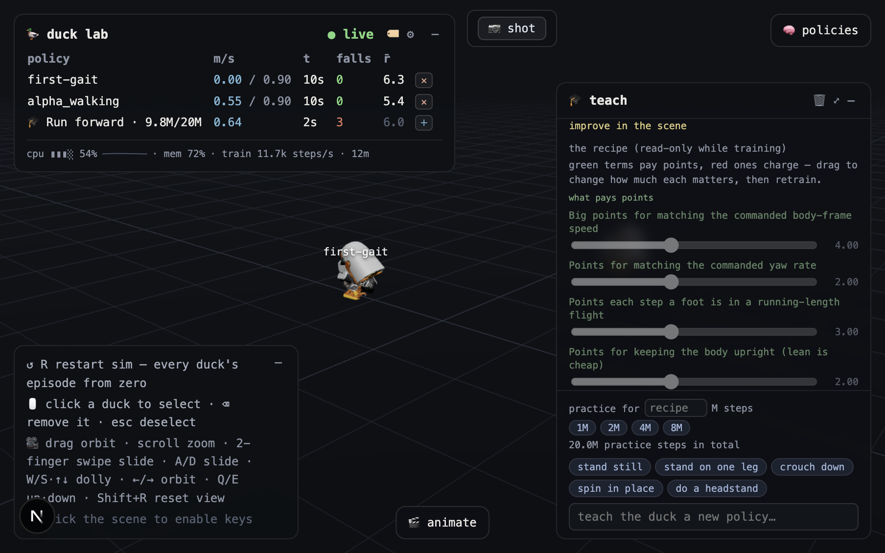

The interface is intentionally layered over the simulation. Most panels can be collapsed with the collapse button. Their open or closed state, camera position, label preference, and unfinished animation clip are kept in browser storage. Reloading the page therefore preserves the working layout. The duck roster is different: it is stored by the lab server and can survive a browser restart.

The values shown in these screenshots came from a live session. Speeds, rewards, elapsed times, CPU use, and training progress will differ in another run.

### Live status and duck roster

The upper-left status panel answers three questions: whether frames are arriving, which policies are on the stage, and whether the local process is healthy.

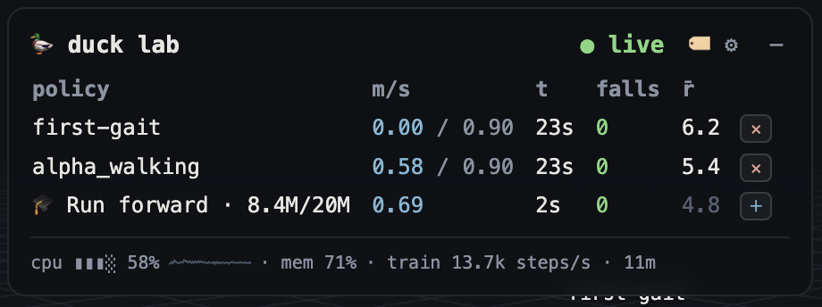

#### Connection indicator

* the live badge means WebSocket frames are arriving from `duck-lab`
* the stalled badge means the socket is connected but no frame has arrived for more than about three seconds
* the offline badge means the browser has no active lab connection

A stalled or offline badge does not necessarily mean the Next.js page failed. Check the backend at <http://127.0.0.1:8788/> and the viewer at <http://127.0.0.1:63317/> separately. A page can load while the simulation stream is unavailable.

#### Roster columns

Each row represents one running duck.

* `policy` identifies the assigned ONNX policy, checkpoint, trainee, or helper
* `m/s` shows achieved forward speed; walking policies also show commanded speed after the slash
* `t` shows time in the current episode
* `falls` counts detected falls in the current run
* `reward average` is a moving average of per-step reward, not proof that the motion looks correct
* the remove button removes a normal duck from the stage
* the add-helper button adds a helper when a training recipe supports spotter ducks

Click a roster row to select the same duck in the 3D scene. The selected row gains a marker, the duck gets an amber floor ring, and context-sensitive controls such as video recording become available. Click the empty stage or press `Esc` to clear the selection.

The system strip below the rows reports backend CPU use, memory use, and, during training, environment steps per second and elapsed training time. High CPU use is expected when many environments are training. A falling steps-per-second value is useful for diagnosing contention, but it does not measure policy quality.

Use the labels button to show or hide floating duck names, the settings button to open settings, and the collapse button to collapse the panel. Press plain `R` to restart every duck's simulation episode from step zero. The reset does not delete policies or checkpoints.

### Selection, labels, and scene feedback

Selection connects many otherwise separate tools. It tells capture which duck to frame, tells the policy panel which duck should receive a new brain, and gives keyboard removal a specific target.

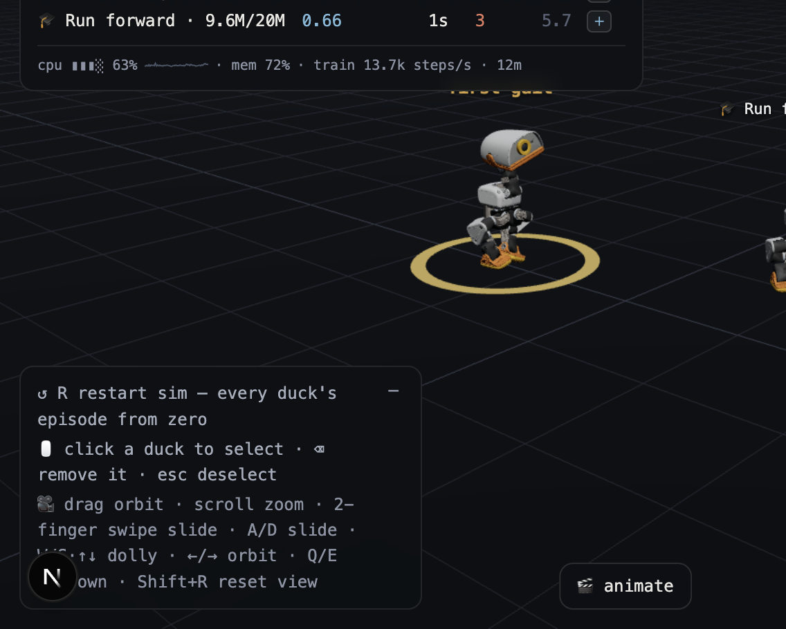

Use the scene as follows:

1. Click near a duck's trunk to select it.
2. Confirm the amber ring and highlighted roster row.
3. Use the newly available action, such as recording or policy assignment.
4. Press `Esc` or click empty floor space when finished.

The click test uses the duck's projected screen position rather than mesh ray casting. A short click selects; a drag of more than a few pixels is interpreted as camera orbit. If selection appears unreliable, release the pointer without moving it.

Floating labels can also show transient state. A cyan label indicates that a dragged policy chip can be dropped on that duck. Amber secondary text can describe a reset mode, spotter assignment, or handoff target. Labels and selection rings are hidden automatically from saved screenshots and recordings.

Use `Delete` or `Backspace` to remove the selected duck. Removal is blocked for protected training actors when deleting them would invalidate an active trainer transition. Use the teach panel's `stop` control for an active trainee instead of trying to delete it from the stage.

### Camera and stage controls

Open the lower-left controls panel when learning the stage. Click the scene once before using keyboard controls so the browser sends keys to the viewer rather than another panel.

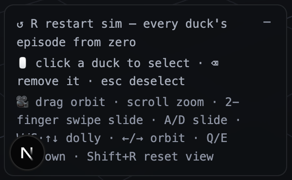

#### Mouse and trackpad

* Drag to orbit around the current target
* Scroll or use a vertical two-finger gesture to zoom
* Use a horizontal two-finger gesture to slide left or right
* Click a duck to select it
* Click empty floor space to deselect

The gesture recognizer locks to an axis after a small movement. Begin a horizontal swipe cleanly when the intention is to slide rather than zoom.

#### Keyboard movement

* Hold `W` or the Up Arrow key to move closer
* Hold `S` or the Down Arrow key to move farther away
* Hold `A` or `D` to slide left or right
* Hold the Left Arrow key or the Right Arrow key to orbit
* Hold `Q` or `E` to move up or down
* Press `Shift+R` to restore the home camera
* Press plain `R` to restart all simulation episodes
* Press `Esc` to deselect
* Press `Delete` or `Backspace` to remove the selected duck

Camera keys use smooth velocity rather than fixed jumps. Speed scales with distance from the target so motion remains controllable in close views. Keyboard shortcuts are ignored while typing in text fields and while a modal dialog is open.

### Policy library and hot swapping

Open the policies button to manage the brains available to the stage.

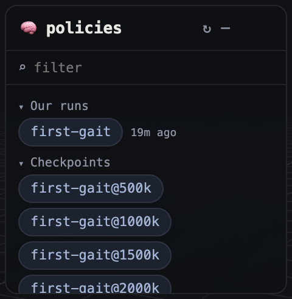

Policies are grouped into local runs, saved checkpoints, and shipped Pollen policies. Use the filter box to search names. Multiple search terms are combined, so each term must match the policy label, identifier, or curriculum family.

#### Assign a policy to an existing duck

1. Open the policy panel.
2. Drag a policy chip toward a duck.
3. Wait for the duck label or ring to turn cyan.
4. Release the chip to replace the duck's policy without respawning it.

A hot swap changes the neural policy while preserving the current simulated pose. The first actions from a very different policy may therefore look abrupt. Press `R` afterward when a clean episode start is needed.

As an alternative, click a policy chip once to arm it, then click a duck. The armed chip receives a blue highlight. Clicking empty floor space cancels the assignment.

#### Spawn another duck

Double-click a policy chip or drag it onto empty floor space. The lab creates a new simulation actor using that policy. Spawning many ducks raises rendering and backend work, so remove unused comparisons when frame rate falls.

#### Download and delete local runs

Hover a local-run chip to reveal its actions. The download button downloads the deployable `policy.onnx`, including the baked observation normalizer. Do not substitute a raw training checkpoint for this file.

The remove button opens an irreversible deletion confirmation. Deleting a run removes its directory and checkpoints from disk. A curriculum family is deleted as one unit. Shipped Pollen policies do not expose deletion, and an actively training run cannot be deleted.

Use the refresh button to refresh the library after an external training or export command creates new files. Curriculum stages are grouped under their family; expand the family to inspect individual stages.

### Teach panel and reward workflow

Open the teach button to turn a behavior request into a configured training run. The panel is a guided interface to registered behavior recipes, not an unrestricted language model.

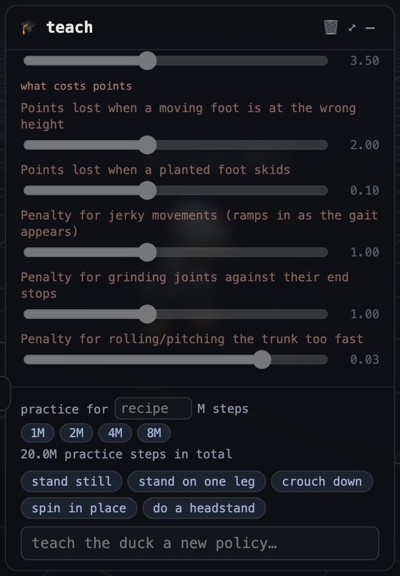{height=7in}

#### Start a lesson

1. Choose the practice budget in millions of steps, or leave the recipe default.
2. Select a suggestion such as `stand on one leg`, or type a supported behavior phrase.
3. Press `Enter` to submit it.
4. Read the behavior card before training starts.
5. Watch the trainee in the scene and the live score breakdown together.

Unknown requests return the behavior catalog instead of inventing a reward. Add a new `Behavior` in the Python package when the desired trick is not registered.

#### Read the scorecard

Green terms pay points for desired state. Red terms subtract points for costs such as foot skid, jerky action changes, joint-limit parking, or excessive trunk rotation. Each bar shows the configured weight, while the live contribution display shows what that term is producing now.

The score curve answers whether the policy is collecting more reward. It does not answer whether the learned motion is acceptable. Watch the trainee and later render a rollout contact sheet. A high score can hide leaning, one-sided motion, parking, or exploitation of a poorly gated term.

The header reports completed and total practice steps. Snapshot messages mean a newer policy was exported and hot-loaded onto the visible trainee. Training throughput reports environment steps per second across workers, not rendered frames per second.

#### Stop, retrain, and fine-tune

Use `stop` to end the current lesson while preserving its latest checkpoint. Reward sliders remain read-only during active training so the displayed recipe always matches the running process.

After training finishes:

* change sliders to revise reward weights
* choose the retrain button to start from an untrained policy
* choose the fine-tune button to continue from the learned checkpoint

Fine-tuning is appropriate for a small correction. Retraining is better when the old policy learned a strategy that the revised recipe should not preserve. For a staged curriculum, inspect each stage because budgets and weight overrides can be stage-specific.

### Animation and keyframe editor

Open the animate button to design a reference motion and turn it into an imitation-learning task.

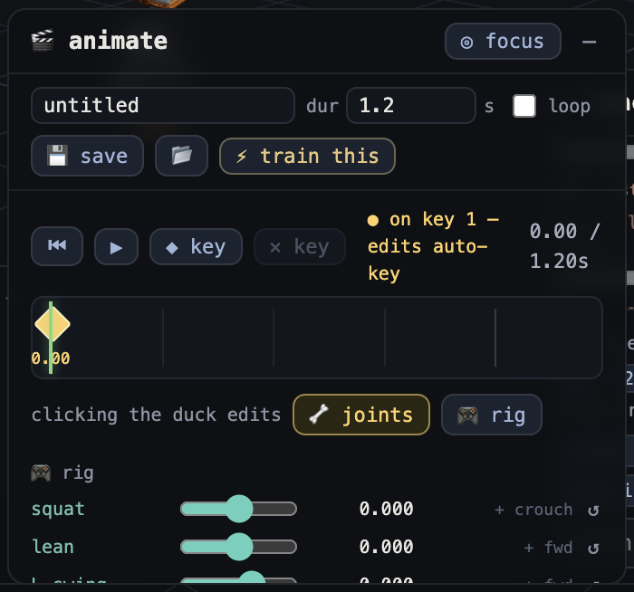

#### Create a clip

1. Give the clip a descriptive name.
2. Set the duration and move the playhead to the first key time.
3. Choose joint mode for individual servo control or rig mode for coordinated controls.
4. Pose the ghost duck by dragging a body part or moving sliders.
5. Add or update the keyframe with the add-keyframe button.
6. Move the playhead and create the next pose.
7. Use play, pause, stop, and loop to inspect interpolation.
8. Save the clip with the save button.
9. Select the train button when the reference motion is ready for imitation learning.

The editor stores unfinished work in browser storage. Reloading normally restores the clip, but saving to the lab creates a named JSON artifact that can be reviewed and versioned.

#### Joint and rig modes

Joint mode edits one physical servo at a time. It is useful for precise neck, hip, knee, or ankle work, but it can produce awkward poses if compensating joints are ignored.

Rig mode moves coordinated directions in joint space:

* `squat` folds both legs while keeping the motion balanced
* `lean` changes trunk inclination
* `swing L` and `swing R` move each leg through a stride
* `sway` shifts the body side to side
* `stance` adjusts the sit-to-stand posture
* `twist` rotates the hips for turning
* `toes` changes ankle plantarflexion
* `look` changes head pitch

The vertical on-scene handle follows the active rig control. Drag it vertically for a direct manipulation workflow. Rig directions are constructed to be independent, so changing squat should not silently change the displayed lean value.

#### Timeline behavior

Click or drag the timeline to scrub. The ghost duck samples the clip at the playhead. Playback uses linear interpolation in joint space, not animation curves. Key times must be ordered, poses are clamped to joint limits, and the clip duration cannot be shorter than its last keyframe.

A reference clip describes desired motion; it does not prove the simulated robot can generate the required forces. The imitation policy must still learn the movement under actuator and contact physics. Render the resulting policy rather than judging only the ghost preview.

### Screenshot and recording tools

The top capture bar always provides the shot button. Select a duck to reveal the record button.

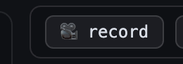

#### Save a screenshot

1. Arrange the camera and stage.
2. Optionally select a duck to use its name in the file.
3. Click the shot button once.
4. Find the PNG in the browser's download location.

The capture reads the WebGL canvas at full resolution. Panels, floating labels, and the selection ring are excluded, producing a clean scene image. The download is initiated inside the click so browser automatic-download protection does not discard it.

#### Record a duck

1. Click a duck or its roster row.
2. Click the record button.
3. Let the automatic camera glide finish.
4. Keep the browser tab visible while the take runs.
5. Click the stop button.
6. Download the generated MP4 or GIF when the links appear.

The camera chooses a three-quarter view based on the duck's heading and holds that composition during capture. Orbit controls pause while recording. The canvas is frame-pumped so each rendered frame is submitted to `MediaRecorder`; a throttled background tab can still starve rendering, so keep it visible.

Recordings stop automatically at 60 seconds. A take with no rendered frames is rejected rather than saved as an empty video. The browser uploads the recording to the local lab, where bundled `ffmpeg` writes H.264 MP4 and a smaller palette GIF under `microduck_local/captures/`.

### Settings and Hugging Face connection

Select the settings button in the status panel to open local integration settings.

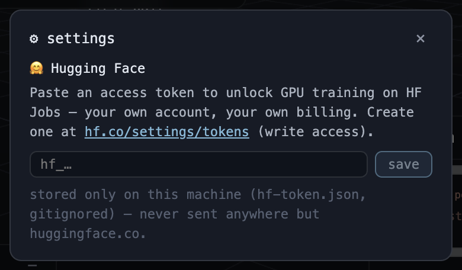

To connect Hugging Face:

1. Create a write-enabled access token at <https://hf.co/settings/tokens>.
2. Paste the token into the Hugging Face token field.
3. Select `save` or press `Enter`.
4. Wait for validation through `whoami()`.
5. Confirm that the dialog shows the account name and only a masked token.

The token is sent to the local lab for validation and stored in `microduck_local/hf-token.json` with restrictive permissions. The file is gitignored. The browser receives only the username and a masked form after setup. Never place the token in a screenshot, shell history, issue, or committed configuration file.

Use `disconnect` to delete the local token file. Connecting an account does not itself launch a GPU job. Account billing, job submission, and policy transfer are separate steps.

### Panel and state reference

The following state persists in browser storage:

* camera position and target
* panel open or closed state
* label visibility
* current animation mode, clip, pose, and unsaved keyframes
* recent teach conversation, within its history limit

The following state belongs to the backend or filesystem:

* active duck roster
* local runs and checkpoints
* active training process and snapshots
* saved motion clips
* captures
* Hugging Face token file

Clearing browser storage resets the layout and unsaved browser-side work, but it does not delete policies. Deleting a run in the policy panel affects the filesystem and cannot be undone by reloading the browser.

### Safe end-to-end UI workflow

1. Confirm the live badge and inspect CPU and memory.
2. Open policies and spawn or assign the policy to examine.
3. Select its duck and arrange the camera.
4. Use the teach or animate panel to define the next experiment.
5. Watch live motion while reading the scorecard.
6. Capture a screenshot or recording for the lab journal.
7. Export and render the resulting ONNX policy outside the viewer.
8. Record both metrics and visual failure modes before changing the recipe.

### Reflection questions

1. Why can the viewer load successfully while the status badge says offline?
2. What state changes during a policy hot swap, and what state remains?
3. Why should reward curves and live score bars be paired with visual inspection?
4. When is fine-tuning preferable to retraining from scratch?
5. Why is the animation ghost not evidence that the physical policy can execute the clip?
6. Which capture mode should be used for a clean still, and which files are produced by a recording?
7. Which UI actions change only browser state, and which can delete filesystem artifacts?

## Chapter 13: Laboratory Exercises

### Lab 1: Set up the workspace

Objective: install both tracked projects and verify that sibling model paths resolve.

From the workspace root:

```bash
git clone https://github.com/pollen-robotics/microduck
git clone https://github.com/pollen-robotics/microduck_rl
cd microduck_local
env -u VIRTUAL_ENV uv sync
cd ../duck-viewer
npm install
```

If the sibling clones already exist, do not clone them again. If `uv` warns that `VIRTUAL_ENV` points elsewhere, unsetting it as shown prevents an unrelated activated environment from overriding the project environment.

Expected outcomes:

* `microduck_local/.venv/` is created or updated.
* Python dependencies include MuJoCo, Gymnasium, SB3, PyTorch, ONNX Runtime, FastAPI, image tools, and Numba.
* `duck-viewer/node_modules/` is populated.
* [contract.py](../../microduck_local/src/microduck_local/contract.py) resolves both scene paths under the sibling `microduck_rl` checkout.

Troubleshooting:

* Confirm Python satisfies `>=3.12,<3.13`.
* Run `uv sync -v` when resolution fails and read the first dependency error.
* Confirm the external drive permits executable files and has free space.
* Use `MICRODUCK_RL_DIR` only for a non-standard checkout layout.

Reflection:

1. Which dependencies are training-only, and which support the lab?
2. Why does the local package pin PyTorch but allow compatible MuJoCo patch releases?

### Lab 2: Run executable contracts

Objective: verify the environment, export path, behavior library, lab, and viewer contracts before modification.

```bash
cd microduck_local
uv run --with pytest pytest tests/
```

This is a real validation, not a smoke training run. It may take time because some tests compile MuJoCo models, train tiny PPO instances, export ONNX, or convert video.

Expected outcomes:

* Contract dimensions and action semantics pass.
* Domain randomization does not accumulate.
* Penalties remain non-positive.
* Symmetry algebra agrees with physical MuJoCo checks.
* ONNX output agrees with PyTorch.
* Behavior, server, clip, capture, and vector-environment tests pass.
* The shipped-policy survival test passes when the sibling `microduck` policy exists, or skips when it does not.

Troubleshooting:

* Run one failing file with `pytest tests/test_env_contract.py -q`.
* Treat a skipped shipped-policy test as missing optional input, not success.
* Do not update golden values until the physical reason for a change is understood.

### Lab 3: Inspect an environment and observation

Objective: connect source constants to a live 61-vector.

```bash
cd microduck_local
uv run python - <<'PY'
from microduck_local import contract as C
from microduck_local.walk_env import MicroduckWalkEnv

env = MicroduckWalkEnv(
    obs_noise=False,
    domain_rand=False,
    action_delay=False,
    random_yaw=False,
    seed=0,
)
obs, _ = env.reset(seed=0)
print("shape:", obs.shape, "dtype:", obs.dtype)
for name, lo, hi in (
    ("gyro", 0, 3),
    ("gravity", 3, 6),
    ("joint_pos_rel", 6, 20),
    ("joint_vel_lagged", 20, 34),
    ("last_action", 34, 48),
    ("twist", 48, 51),
    ("head_cmd", 51, 55),
    ("body_cmd", 55, 61),
):
    print(f"{name:18s} [{lo:2d}:{hi:2d}]", obs[lo:hi])
print("control dt:", C.CTRL_DT, "seconds")
print("action shape:", env.action_space.shape)
PY
```

Expected outcomes:

* Shape is `(61,)` and dtype is float32.
* Projected gravity is near $(0,0,-1)$.
* Last action starts at zero.
* Action shape is `(14,)`.
* Control time is 0.02 seconds.

Exercise: step once with a 0.1 action vector and confirm `data.ctrl` equals `DEFAULT_POSE + 0.1` while the observation's last-action block equals the raw request.

### Lab 4: Train a walking smoke run

Objective: verify that workers, PPO, checkpoints, and final artifacts work.

```bash
cd microduck_local
uv run train-walk --envs 4 --steps 4096 --run-name student-walk-smoke
```

> [!WARNING]
> This is an intentionally short smoke test. It is not expected to learn stable walking.

The step budget equals four environments times 1024 transitions. It is enough to exercise rollout and update machinery but not enough for a useful locomotion policy.

Expected outcomes:

* A run directory appears under `runs/student-walk-smoke/`.
* `run.json`, `model.zip`, `vecnormalize.pkl`, and TensorBoard files are written.
* No penalty-sign callback failure occurs.

For a useful run, benchmark your machine and use the source default scale:

```bash
uv run bench-envs --envs 8,16,24,32 --repeats 3
uv run train-walk --envs 32 --steps 3_000_000 --run-name student-walk-useful
```

The second command is a *useful run*, not a guarantee of a deployable gait.

### Lab 5: Export ONNX

Objective: create the actual deterministic artifact.

```bash
cd microduck_local
uv run export-walk runs/student-walk-smoke
```

Expected outcomes:

* `runs/student-walk-smoke/policy.onnx` is created.
* The command reports `obs[1,61] -> actions[1,14]`.
* Internal random-input comparisons against PyTorch pass.

Reflection: Why would copying only `model.zip` into a runtime produce incorrect behavior?

### Lab 6: Evaluate a policy

Objective: compare a smoke artifact with a shipped baseline.

```bash
cd microduck_local
uv run eval-walk runs/student-walk-smoke/policy.onnx --episodes 3
uv run eval-walk ../microduck/policies/alpha_walking.onnx --episodes 3
```

The first command is a smoke evaluation of an untrained policy. The second is a baseline integration check.

Expected outcomes:

* Both commands report episode length, falls, and tracking errors.
* The smoke policy will usually fail quickly or behave poorly.
* The shipped baseline should survive if the local contract is intact.

Exercise: explain why comparing rewards across different behavior recipes is invalid even when episode lengths match.

### Lab 7: Render and inspect

Objective: replace metric-only judgment with visual evidence.

A behavior is required when it cannot be inferred from `behavior.json`. For the walking smoke run, choose a simple walking-compatible behavior only if the renderer requires it in your current checkout. For a behavior run:

```bash
cd microduck_local
uv run train-behavior stand --envs 4 --steps 100_000 \
  --run-name student-stand-smoke --snap-steps 50_000
uv run render-rollout \
  --policy runs/student-stand-smoke/policy.onnx \
  --behavior stand --episodes 2 --seconds 4 \
  --out /tmp/student-stand-render
uv run render-rollout \
  --policy limp --behavior stand --episodes 2 --seconds 4 \
  --out /tmp/student-stand-null
```

> [!WARNING]
> The 100,000-step behavior run is a smoke test. Use the behavior's declared default for a useful training experiment.

Expected outcomes:

* Each render directory contains MP4, contact-sheet, and summary artifacts.
* The captions expose trunk height, head height, tilt, and contacts.
* The null control gives a direct comparison for passive stability.

Inspection worksheet:

* Did the deterministic policy survive longer than limp?
* Did trunk height stay near the measured stand reference?
* Did any non-foot body touch the floor?
* Did the policy hold or cycle?
* Was the target behavior present from frame zero because of the spawn?

### Lab 8: Launch the lab and viewer

Objective: watch multiple policies and verify the real-time protocol.

In one terminal:

```bash
cd microduck_local
uv run duck-lab ../microduck/policies/alpha_stand.onnx \
  ../microduck/policies/alpha_walking.onnx
```

In another terminal:

```bash
cd duck-viewer
npm run dev
```

Open the printed local URL.

Expected outcomes:

* The backend listens on `127.0.0.1:8788`.
* The viewer uses port 63317 unless `PORT` overrides it.
* Geometry loads once and body poses animate continuously.
* The HUD indicates connectivity, policy labels, falls, speed, and process statistics.

Exercises:

1. Assign another policy to a duck.
2. Reset all ducks with `R` and compare synchronized episodes.
3. Select and remove a duck.
4. Confirm the camera controls do not send robot teleoperation commands.

### Lab 9: Use the teach workflow

Objective: launch watched training from natural-language behavior selection.

1. Open the teach panel.
2. Enter `stand on one leg`.
3. Inspect the matched behavior and reward terms.
4. Set a small budget for a smoke run, at least the server minimum of 100,000 steps.
5. Start training and watch the trainee snapshot updates.
6. Stop or let the run finish.
7. Change one weight and compare retraining with fine-tuning.

Expected outcomes:

* A trainee duck appears.
* Progress includes step counts, episode reward, length, term means, snapshots, elapsed time, and training rate.
* A completed run unlocks recipe editing.
* Fine-tuning inherits the selected run, while retraining starts fresh.

Reflection: Did the visual behavior improve when the scalar reward improved? Record at least one disagreement.

### Lab 10: Author and train a keyframe clip

Objective: connect browser authoring to phase-conditioned imitation learning.

1. Open the animate panel.
2. Name the clip `student-small-crouch`.
3. Keep the first key at the default pose and time zero.
4. Add a second key at 0.5 seconds with a shallow symmetric crouch.
5. Add a third key at 1.0 seconds returning to stand.
6. Enable loop only if the transition is continuous.
7. Save and select *train this*.
8. Watch the ghost reference and trainee separately.

Expected outcomes:

* A JSON clip appears in `microduck_local/clips/`.
* Joint values are clamped to model limits.
* Training uses the `imitate` behavior and disables symmetry by default.
* Body-command phase slots vary as sine and cosine.

Troubleshooting:

* A pose preview failure usually means the lab's `/joints` or `/pose` endpoint is unavailable.
* A clip with no time-zero key or non-ascending keys is invalid.
* A kinematically attractive motion may still be dynamically infeasible.

### Lab 11: Capture a result

Objective: produce shareable evidence from the viewer.

1. Select a duck.
2. Take a PNG snapshot.
3. Start video recording and keep the tab visible.
4. Stop after several seconds.
5. Download the MP4 and GIF links returned by the lab.

Expected outcomes:

* The selection ring and DOM panels are absent from the captured canvas.
* Captures appear under `microduck_local/captures/`.
* MP4 dimensions are even for H.264 compatibility.

### Lab 12: Add a simple behavior with tests

Objective: add a behavior without changing the policy contract.

Create a small behavior in the appropriate family module under [behaviors/](../../microduck_local/src/microduck_local/behaviors). A suitable beginner task is a symmetric `look_up` posture that rewards a reachable neck and head pitch while preserving balance. Do not add observations.

A simplified pattern is shown below. It is not a copy-paste replacement for reading the surrounding module and registration order.

```python
# Simplified example. Place it in the appropriate behavior family module.
def _look_up(env) -> float:
    q = env._joint_pos_rel()
    error2 = (q[5] - 0.25) ** 2 + (q[6] - 0.25) ** 2
    return float(np.exp(-error2 / 0.35**2))

_register(Behavior(
    id="look_up",
    emoji="duck",
    title="Look up",
    description="Raise the head while keeping a stable stance.",
    how_it_learns=(
        "The duck earns dense points for a reachable head target and for "
        "remaining upright. Smoothness penalties discourage twitching."
    ),
    keywords=("look up", "raise head"),
    terms=(
        RewardTerm("look_up", "Points for raising the head", 1.5, _look_up),
        _upright_term(),
        *_BASE_REGULARIZERS,
    ),
    default_steps=2_000_000,
    success_metric="head raised while standing without a fall",
    episode_s=8.0,
))
```

Before implementation, answer:

* Which indices expose the target?
* Is the task symmetric?
* Are all positive terms bounded?
* Are all penalties non-positive?
* Does the target have gradient from the default pose?
* Can the motion occur under the current actuator and episode settings?

Extend [tests/test_behaviors.py](../../microduck_local/tests/test_behaviors.py) to lock keyword matching, 61-dimensional observations, finite stepping, penalty signs, and a direct target-shape assertion. Run the full suite before and after.

Use this smoke command first:

```bash
uv run train-behavior look_up --envs 4 --steps 100_000 \
  --run-name student-look-up-smoke --snap-steps 50_000
```

Then use the declared 2,000,000-step budget for a useful experiment. Export, evaluate, render, and compare limp and zero controls.

> [!CAUTION]
> Do not add the exercise behavior to source unless you intend to maintain it. Complete the lab on a branch and preserve its tests with the change.

## Chapter 14: Capstone Project

### Objectives

After this chapter, you can:

* frame a behavior as a falsifiable learning problem
* build an evidence plan before training
* separate contract, reward, exploration, optimization, and visualization failures
* prepare a responsible handoff to official training

### Capstone brief

Design one behavior that extends the current library without changing the 61-observation or 14-action contract. Suitable projects include a controlled bow, a two-pose head gesture, a slow symmetric squat cycle, or a command-directed step pattern. Avoid airborne maneuvers for a first capstone.

### Required proposal

Write a one-page proposal containing:

* behavior statement and visible success criteria
* exact observation indices supporting each criterion
* initial state distribution and termination rules
* positive terms with bounds
* penalties with proof that each returns at most zero
* symmetry decision
* expected exploration path
* null controls
* planned smoke and useful step budgets
* sim2real limitations

### Required implementation

1. Add the behavior definition and friendly text.
2. Add tests for registration, matching, shape, finite rollout, term signs, and target geometry.
3. Run the full test suite.
4. Train a smoke run.
5. Export deterministic ONNX.
6. Evaluate at multiple seeds.
7. Render policy, limp, and zero controls.
8. If no rollout performs the skill, revise spawns or physics rather than reward weights.
9. If the skill appears but is malformed, revise bounded terms.
10. Train a useful run with a recorded seed and configuration.
11. Launch it in the viewer beside a baseline.
12. Capture a short demonstration and failure case.

### Evidence table

| Claim | Measurement | Visual check | Control | Pass rule |
|-------|-------------|--------------|---------|-----------|
| Contract preserved | Tests and ONNX shapes | Viewer loads policy | Shipped baseline still runs | All required tests pass |
| Skill occurs | Behavior-specific metric | Contact sheet shows motion | Limp and zero do not reproduce it | Threshold met on stated seeds |
| Skill is stable | Episode length and falls | Final frames hold target | Alternate seeds | Predetermined success fraction |
| No reward exploit | Per-term breakdown | Heights, contacts, and posture agree | Spawn and standing-start comparison | No hidden collapse or assist |
| Ready for porting | Source and environment diff | Representative render | BAM comparison | Design documented, no hardware claim |

### Final report

Your report should include commands, commit, hardware, runtime, seeds, environment count, actuator, step budget, reward terms, curriculum, artifact paths, metrics, contact sheets, controls, failures, and a porting plan for `microduck_rl`.

A strong negative result is acceptable. Demonstrating that a skill never appears, then identifying an exploration gap, is better science than presenting a reward curve as success.

## Chapter 15: Troubleshooting Guide

### Setup and dependency failures

`uv sync` fails:

* Confirm Python 3.12 is selected.
* Unset an unrelated `VIRTUAL_ENV`.
* Check network access and free disk space.
* Read verbose resolver output.
* Confirm [pyproject.toml](../../microduck_local/pyproject.toml) rather than installing packages ad hoc.

Scene file not found:

* Clone `microduck_rl` beside `microduck_local`.
* Check `MICRODUCK_RL_DIR` for stale values.
* Confirm both `scene_walk.xml` and `scene.xml` exist in the upstream robot model tree.

### Training hangs on macOS

* Check that no change imported PyTorch before `make_vec_env()` forks workers.
* Reproduce with `MICRODUCK_VEC_ENV=dummy` and one environment to isolate multiprocessing.
* Do not treat the dummy backend as a performance solution.
* Inspect worker processes and terminate orphaned trees after abnormal exits.

### Memory grows with environment count

* Confirm the `fork` backend is active.
* Check that model priming happens before fork.
* Avoid in-process BAM model sharing because BAM rewrites model dynamics each substep.
* Use `bench-envs` to find the quality-safe throughput region rather than maximizing workers.

### Reward rises but behavior looks wrong

* Export deterministic ONNX.
* Render and read the contact sheet.
* Compare stand-reference heights and non-foot contacts.
* Render null controls.
* Inspect individual term means.
* Look for a term that rewards an unobservable target or a parked intermediate state.

### No rollout attempts the skill

* Stop editing weights.
* Render several stochastic or checkpoint rollouts to confirm absence.
* Add physically plausible reverse or mid-motion spawns.
* Ladder actuator strength or strictness while keeping the objective sealed.
* Ensure spawned states carry matching momentum and progress state.

### Stochastic policy works but ONNX fails

* Inspect `log_std` and warm-start history.
* Confirm entropy annealing was active for behavior training.
* Confirm `LOG_STD_MAX` applied on load and after rollouts.
* Restart from scratch if inherited means are already saturated or poisoned.

### Evaluation results seem inconsistent

* Use `eval-run` for the run behavior.
* Match actuator, behavior, command, seed, and spawn settings.
* Remember that walking and behavior rewards are different objectives.
* Compare achieved speed rather than a speed-shaped reward alone.

### Viewer is offline or stalled

* Confirm `duck-lab` listens on port 8788.
* Confirm the viewer points to `127.0.0.1:8788` or the intended `?lab=host:port`.
* Restart the backend after editing long-lived behavior or server code.
* Distinguish socket connection from recent frame arrival.
* Check browser console output for WebGL context loss.

### ONNX export fails

* Confirm both `model.zip` and `vecnormalize.pkl` exist in the run directory.
* Do not mix normalization files across runs.
* Check that policy architecture remains compatible with `OnnxWalkPolicy`.
* Run [tests/test_export.py](../../microduck_local/tests/test_export.py).

### Rendering fails

* On macOS, allow MuJoCo to use its bundled CGL path.
* On Linux, configure EGL or OSMesa as appropriate.
* Confirm behavior ID and policy path.
* Keep output dimensions even for H.264.
* Use `limp` or `zero` to test the renderer without ONNX loading.

## Chapter 16: Invariants Checklist

Use this checklist before merging any training or behavior change.

### Contract

* Observation shape remains 61 float32 values.
* Block order and command tail remain unchanged.
* Action shape remains 14 in fixed joint order.
* Applied target remains `DEFAULT_POSE + clipped action`.
* Raw last action remains visible to observation and reward.
* Joint velocity remains one control step behind.

### Reward

* Every penalty function returns at most zero.
* Penalty weights cannot be negative.
* Positive shaping is bounded and dense.
* Each scored target has an observable handle.
* No world heading or position target is assigned to the memoryless policy.
* New terms have tests and learner-facing descriptions.

### Randomization and curricula

* Reset restores compile-time defaults before randomizing.
* Friction changes effective contact behavior.
* Curriculum stages change physics, spawns, episode depth, or strictness rather than hidden objectives.
* Spawned states include realistic momentum and matching progress memory.
* Final evaluation includes plain standing starts where relevant.

### Training

* Workers fork before PyTorch import on macOS.
* Performance claims use matched step counts and seeds.
* Throughput improvements are not assumed to improve learning.
* Warm starts do not silently restore stale batch size, symmetry, KL, or learning-rate settings.
* `log_std` remains bounded and deterministic snapshots are inspected.

### Artifacts and evidence

* Full tests pass before and after.
* ONNX includes the observation normalizer.
* Evaluation uses the correct behavior environment.
* Visual rollouts and contact sheets are inspected.
* Limp or zero controls are rendered.
* Claims identify actuator, seed, step budget, and limitations.
* Hardware readiness is not claimed from local training.

## Glossary

Action: A 14-element vector of joint-target offsets selected by the policy.

Actor: The neural network that produces the action distribution mean.

Advantage: An estimate of how much better an action was than the state's expected value.

BAM actuator: A local implementation of voltage, current limit, back electromotive force, gearbox friction, battery sag, and bus lag for XL330 servos.

Body frame: A coordinate frame attached to and rotating with the trunk.

Checkpoint: A saved training state at an intermediate number of steps.

Command: A desired velocity, head pose, body pose, or phase signal included in the observation.

Contact sheet: A grid of rendered frames with diagnostic text for systematic visual inspection.

Control decimation: Holding one policy action across multiple physics steps.

Critic: The neural network that estimates expected return.

Curriculum: A sequence of practice distributions or physical conditions that makes a skill progressively harder.

Deterministic policy: The actor mean without sampled Gaussian exploration noise.

Domain randomization: Sampling physical or sensor properties to reduce dependence on one simulator configuration.

Entropy: A measure of action-distribution uncertainty used to encourage exploration.

Equivariance: A property where transforming the input causes a corresponding transformation of the output.

GAE: Generalized Advantage Estimation, a weighted sum of temporal-difference residuals.

Heading frame: A frame aligned with horizontal facing direction while retaining world vertical.

Hot swap: Replacing one policy with another behind the same observation and action contract.

IMU: Inertial measurement unit, used here for angular velocity and orientation-derived gravity information.

Jackpot: A sparse or exploitable reward spike that can dominate intended behavior.

MDP: Markov decision process, the mathematical model of state, action, transition, reward, and discount.

MJCF: MuJoCo XML model format describing robot bodies, joints, actuators, contacts, and scenes.

`MjData`: Per-simulation dynamic state in MuJoCo.

`MjModel`: Compiled, mostly static MuJoCo model data.

Normalizer: Running mean and variance used to standardize observations.

Null control: A limp or zero-action comparison used to test whether the policy causes a behavior.

Observation: The 61-element float32 input presented to the policy.

ONNX: An interoperable neural-network graph format used for deterministic policy artifacts.

Partial observability: A setting where the actor observation omits parts of full simulator state.

Policy: A mapping from observations to a distribution over actions.

PPO: Proximal Policy Optimization, the clipped policy-gradient algorithm used here.

Projected gravity: World down expressed in the robot trunk frame.

Return: Discounted sum of future rewards.

Reward term: One named component of the scalar training objective.

Rollout: A sequence or batch of environment transitions collected by a policy.

Sim2real: Transfer from simulation-trained control to physical hardware.

Spawn family: A distribution of initial states, often used for reverse curricula.

Symmetry loss: A penalty for disagreement between mirrored policy inputs and outputs.

Temporal-difference residual: One-step reward plus discounted next value minus current value.

Termination: Episode end caused by task failure or success logic.

Truncation: Episode end caused by a time or step limit.

Twist command: Desired forward velocity, lateral velocity, and yaw rate.

Value function: Expected discounted return from an observation.

Vector environment: Multiple environments stepped as a batch for policy training.

World frame: The fixed simulator coordinate system.

## Further Reading in the Workspace

Start with repository-owned sources because they describe the exact implementation used by the labs.

* [Root README](../../README.md) for workspace setup and commands
* [Workspace AGENTS guide](../../AGENTS.md) for repository boundaries and command crib
* [Local trainer README](../../microduck_local/README.md) for measured performance history and feature details
* [Local training playbook](../../microduck_local/AGENTS.md) for invariants, reward lessons, verification discipline, and sim2real honesty
* [Deployment contract](../../microduck_local/src/microduck_local/contract.py) for dimensions, joint order, timing, command ranges, and noise
* [Walking environment](../../microduck_local/src/microduck_local/walk_env.py) for reset, step, observations, frames, randomization, and rewards
* [PPO hyperparameters](../../microduck_local/src/microduck_local/ppo_hparams.py) for current rollout and minibatch rules
* [Symmetry implementation](../../microduck_local/src/microduck_local/symmetry.py) for mirror algebra and PPO integration
* [Behavior core](../../microduck_local/src/microduck_local/behaviors/core.py) and [behavior environment](../../microduck_local/src/microduck_local/behaviors/env.py) for recipe and curriculum mechanisms
* [Motion clips](../../microduck_local/src/microduck_local/motion.py) for interpolation and phase signals
* [ONNX exporter](../../microduck_local/src/microduck_local/export_onnx.py), [evaluator](../../microduck_local/src/microduck_local/eval_onnx.py), and [renderer](../../microduck_local/src/microduck_local/render_rollout.py) for the evidence pipeline
* [Lab server](../../microduck_local/src/microduck_local/viz_server.py) for HTTP, WebSocket, teaching, persistence, and capture
* [Viewer README](../../duck-viewer/README.md) and [viewer source](../../duck-viewer/components/Viewer.tsx) for runtime presentation and browser controls
* [Contract tests](../../microduck_local/tests/test_env_contract.py), [behavior tests](../../microduck_local/tests/test_behaviors.py), [symmetry tests](../../microduck_local/tests/test_symmetry.py), and [export tests](../../microduck_local/tests/test_export.py) as executable specifications

## Closing Perspective

Microduck Lab is valuable because it shortens the scientific loop. You can change one idea, run executable contracts, collect a modest local rollout, export the deterministic policy, inspect metrics, look at frames, compare controls, and revise the correct layer of the system.

The discipline matters more than the optimizer. Keep the interface stable. Pay only for observable goals. Keep penalties non-positive. Restore randomization defaults. Preserve hardware-like sensor lag. Bake normalization into ONNX. Separate throughput from learning. Treat absent behavior as an exploration problem. Keep curricula honest. Challenge every success with deterministic visual evidence and null controls. Then carry the environment design, not an overstated local artifact, into the official sim2real stack.

## Chapter 17: File Relationships and Application Architecture

### Objectives

After this chapter, you can:

* locate the files that own contracts, simulation, training, artifacts, and visualization
* trace dependency direction from shared constants to applications
* map every local command to its Python entry point
* predict which files and tests a change can affect
* extend the system without breaking policy compatibility or overstating local results

This chapter is an end-of-book quick reference. Earlier chapters explain the algorithms and workflows in depth; this guide shows how their files connect.

### Local package and artifact map

The package source lives under `microduck_local/src/microduck_local/`. Dependencies generally point from application entry points toward shared contracts and environment components, not back from the contract into trainers or the viewer.

| File or directory | Architectural responsibility | Main relationships |
|-------------------|------------------------------|--------------------|
| [contract.py](../../microduck_local/src/microduck_local/contract.py) | Fixed dimensions, joint order, default pose, timing, command ranges, noise, and sibling MJCF paths | Imported by simulation, behaviors, symmetry, export, evaluation, rendering, and the lab |
| [walk_env.py](../../microduck_local/src/microduck_local/walk_env.py) | Gymnasium environment, observation assembly, action application, MuJoCo stepping, walking rewards, reset, randomization, and termination | Consumes `contract.py`; used by trainers, evaluators, renderers, behaviors, benchmarks, and the lab |
| [bam_actuator.py](../../microduck_local/src/microduck_local/bam_actuator.py) | Higher-fidelity XL330 actuator and bus dynamics | Selected by `walk_env.py` when BAM physics is requested |
| [vec_env.py](../../microduck_local/src/microduck_local/vec_env.py) | Parallel environment workers, shared arrays, process signaling, and SB3 adaptation | Builds many walking or behavior environments for training and benchmarks |
| [train.py](../../microduck_local/src/microduck_local/train.py) | Walking PPO entry point, run metadata, checkpoints, normalization, and penalty-sign guard | Combines `vec_env.py`, `walk_env.py`, `ppo_hparams.py`, and SB3 |
| [train_behavior.py](../../microduck_local/src/microduck_local/train_behavior.py) | Behavior PPO entry point, recipes, warm starts, snapshots, progress, entropy schedule, and deterministic final export | Combines behavior definitions, `vec_env.py`, `symmetry.py`, `ppo_hparams.py`, and export support |
| [ppo_hparams.py](../../microduck_local/src/microduck_local/ppo_hparams.py) | Shared rollout, minibatch, loss, device, and threading choices | Keeps walking and behavior trainers aligned |
| [symmetry.py](../../microduck_local/src/microduck_local/symmetry.py) | Observation and action mirror maps plus mirror-loss PPO integration | Used by behavior training when bilateral symmetry is a valid prior |
| [behaviors/core.py](../../microduck_local/src/microduck_local/behaviors/core.py) | `Behavior`, `RewardTerm`, `CurriculumStage`, reusable reward functions, and the term catalog | Supplies declarative recipes to the behavior environment, trainer, and teach UI |
| [behaviors/env.py](../../microduck_local/src/microduck_local/behaviors/env.py) | `BehaviorEnv`, recipe evaluation, weight overrides, clip phase, spawn families, and behavior-specific reset state | Extends `MicroduckWalkEnv` without changing its policy interface |
| [motion.py](../../microduck_local/src/microduck_local/motion.py) | Clip validation, loading, interpolation, and phase data | Connects authored clips to imitation behavior and viewer previews |
| [export_onnx.py](../../microduck_local/src/microduck_local/export_onnx.py) | Deterministic actor export with observation normalization embedded | Reads `model.zip` and `vecnormalize.pkl`; writes compatible ONNX |
| [eval_onnx.py](../../microduck_local/src/microduck_local/eval_onnx.py) | Headless deterministic policy evaluation | Loads ONNX into a walking or behavior environment and reports rollout metrics |
| [render_rollout.py](../../microduck_local/src/microduck_local/render_rollout.py) | Offscreen deterministic rollout, MP4, contact sheet, summary, and null controls | Loads ONNX or a null driver and steps the selected environment |
| [viz_server.py](../../microduck_local/src/microduck_local/viz_server.py) | FastAPI application, `/ws` frame stream, policy roster, hot swap, teaching, clips, poses, runs, and captures | Hosts live environments, launches `train_behavior.py`, watches artifacts, and serves `duck-viewer` |
| [pyproject.toml](../../microduck_local/pyproject.toml) | Python dependencies, package metadata, command entry points, and Ruff configuration | Defines the supported command surface |
| [AGENTS.md](../../microduck_local/AGENTS.md) | Non-negotiable contract, reward, curriculum, verification, performance, and sim2real rules | Governs changes across the package |
| [tests/](../../microduck_local/tests) | Executable locks for contracts, rewards, symmetry, export, vector environments, server routes, clips, captures, and regressions | Must change with intentional behavior and interface changes |
| [runs/](../../microduck_local/runs) | Generated ownership boundary for models, normalization, metadata, progress, checkpoints, and ONNX policies | Created and updated by trainers, exporter, and teach orchestration |
| [clips/](../../microduck_local/clips) | User-authored version 1 keyframe JSON | Owned by animation authoring and consumed by `motion.py` |
| `captures/` | Generated browser recordings converted to MP4 and GIF | Created on first capture unless relocated with `MICRODUCK_CAPTURES_DIR` |

The generated directories are runtime state, not package source. `runs/`, `clips/`, or `captures/` may be absent in a fresh checkout until the corresponding workflow creates them.

### Command-to-module map

All supported command names come from [pyproject.toml](../../microduck_local/pyproject.toml). `eval-run` deliberately shares an implementation with `eval-walk`; the command name selects a convenient run-oriented interface rather than a second evaluator module.

| Command | Module entry point | Role |
|---------|--------------------|------|
| `train-walk` | `microduck_local.train:main` | Train velocity-command walking and save SB3 plus normalization artifacts |
| `export-walk` | `microduck_local.export_onnx:main` | Export a deterministic normalized ONNX policy from a run |
| `eval-walk` | `microduck_local.eval_onnx:main` | Evaluate deterministic ONNX in the selected walking or behavior environment |
| `eval-run` | `microduck_local.eval_onnx:main` | Evaluate running through the same evaluator with run-oriented defaults |
| `bench-walk` | `microduck_local.bench:main` | Measure raw environment stepping performance |
| `bench-envs` | `microduck_local.bench_envs:main` | Compare complete PPO throughput across environment counts |
| `duck-lab` | `microduck_local.viz_server:main` | Start the FastAPI lab, live simulations, policy management, and teach service |
| `train-behavior` | `microduck_local.train_behavior:main` | Train a behavior recipe, stream progress, and publish snapshots |
| `render-rollout` | `microduck_local.render_rollout:main` | Render deterministic or null-control episodes with visual diagnostics |

### Dependency direction and contract boundary

The core dependency direction is:

1. [contract.py](../../microduck_local/src/microduck_local/contract.py) defines the shared policy and robot interface.
2. [walk_env.py](../../microduck_local/src/microduck_local/walk_env.py) and [bam_actuator.py](../../microduck_local/src/microduck_local/bam_actuator.py) implement simulation behind that interface.
3. [behaviors/core.py](../../microduck_local/src/microduck_local/behaviors/core.py), [behaviors/env.py](../../microduck_local/src/microduck_local/behaviors/env.py), and [motion.py](../../microduck_local/src/microduck_local/motion.py) specialize tasks while retaining the interface.
4. Trainers and benchmarks compose environments at scale through [vec_env.py](../../microduck_local/src/microduck_local/vec_env.py).
5. Export, evaluation, rendering, and the lab consume models and environments as applications.
6. `duck-viewer` consumes the lab protocol. It does not import Python package internals.

The fixed boundary is a float32 observation with 61 values and an action with 14 joint-target offsets. The observation order remains gyro, projected gravity, relative joint position, lagged joint velocity, previous raw action, twist command, head command, and body command. A task may zero-pad or repurpose declared command slots, such as clip phase, but it must not reorder, remove, or append fields.

This stability enables hot swapping. Walking, standing, and trick policies can share one runtime because every ONNX graph accepts `[1, 61]` and returns `[1, 14]`. A contract change is therefore not local to one reward. It affects environment assembly, normalization, training data, tests, ONNX signatures, viewer policy loading, and the robot runtime.

### Application system flow

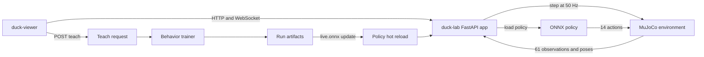

The viewer uses [duck-viewer/lib/lab.ts](../../duck-viewer/lib/lab.ts) as its browser-side protocol layer. It calls the FastAPI HTTP routes for scene geometry, policy metadata, behaviors, teaching, joints, poses, clips, captures, and run operations. It connects to `/ws` for changing poses, statistics, events, and training progress. The lab steps each live environment at 50 Hz and broadcasts frames every second control tick, about 25 Hz. The browser renders those frames; it does not run MuJoCo or PPO.

A teach request crosses the same boundary in the other direction. The lab matches a behavior, launches the behavior trainer as a subprocess, reads `progress.jsonl`, and watches the atomically replaced `live.onnx`. The trainee and helper ducks then receive the new deterministic snapshot without adding helper environments to PPO.

### Training and artifact sequence

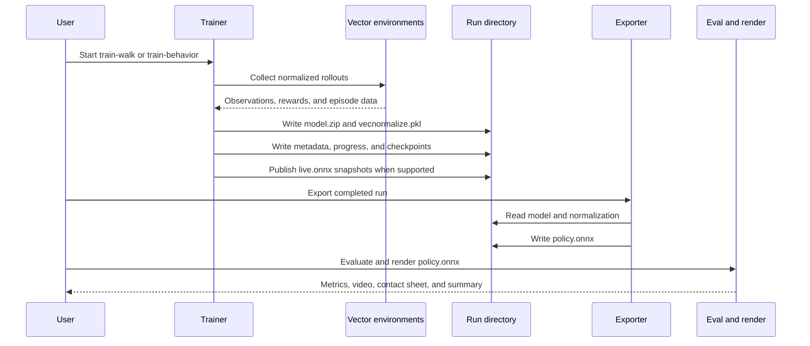

Walking training normally leaves export as an explicit next step. Behavior training also publishes deterministic snapshots and writes a final `policy.onnx`. In both paths, `model.zip` alone is incomplete because the actor was trained on normalized observations. [export_onnx.py](../../microduck_local/src/microduck_local/export_onnx.py) embeds the matching running mean, variance, epsilon, and clip operation.

The evidence path is directional: train, export, evaluate, render, inspect, then decide. Do not feed a favorable reward chart directly into a deployment claim. [eval_onnx.py](../../microduck_local/src/microduck_local/eval_onnx.py) tests deterministic behavior numerically, while [render_rollout.py](../../microduck_local/src/microduck_local/render_rollout.py) exposes collapse, spawn assistance, cycling, and contact failures. Hardware work requires a further port and retraining step in the official stack.

### Sibling checkout dependencies

The local package resolves MJCF scenes from the sibling `microduck_rl` checkout through paths in [contract.py](../../microduck_local/src/microduck_local/contract.py). Set `MICRODUCK_RL_DIR` only when that checkout is not beside this repository. The sibling owns the fuller mjlab and MuJoCo Warp sim2real recipe, CUDA-oriented training, and official export workflow.

The sibling `microduck` checkout owns robot software and may provide compatible reference policies under its policy directory. Treat `alpha_walking.onnx` as a historical or optional reference policy when available, not as a guaranteed asset on the current upstream main branch. Tests and examples that need it must tolerate its absence or state the prerequisite.

These sibling repositories are inputs and downstream destinations, not generated folders. Local environment ideas can be ported to `microduck_rl`, but local model weights are not a substitute for retraining under the official randomization and validation process.

### Directory and artifact ownership

| Location | Owner | Contents and lifecycle |
|----------|-------|------------------------|
| `src/microduck_local/` | Package source | Reviewed code that defines contracts, simulation, training, export, evaluation, rendering, and services |
| `tests/` | Contract verification | Reviewed tests that should fail when protected behavior drifts |
| `runs/<name>/` | One training run | Model, normalizer, metadata, logs, checkpoints, progress, snapshots, and exported policy as applicable |
| `clips/<name>.json` | Animation authoring | Reviewed or experimental keyframe intent, loaded by imitation workflows |
| `captures/` | Viewer recording workflow | Generated MP4 and GIF evidence, created when capture is first used |
| `duck-viewer/` | Browser application | Next.js user interface, Three.js presentation, panels, and lab protocol client |
| `microduck_rl/` | Upstream sibling | Robot MJCF source and official GPU sim2real training path |
| `microduck/` | Upstream sibling | Robot runtime and optional reference policy assets |

A run directory is the unit of provenance. Keep its model paired with its own normalizer and metadata. Do not combine a checkpoint from one run with normalization from another. Clips and captures can be relocated by server environment variables, so tools should use the configured directories rather than hardcoded assumptions.

### Change-impact quick reference

| Intended work | Inspect or change first | Verify next |
|---------------|-------------------------|-------------|
| Observation or action contract | [contract.py](../../microduck_local/src/microduck_local/contract.py), [walk_env.py](../../microduck_local/src/microduck_local/walk_env.py) | Contract, export, symmetry, evaluator, renderer, lab, and robot-runtime compatibility tests |
| Physics, reset, contact, or termination | [walk_env.py](../../microduck_local/src/microduck_local/walk_env.py) and sibling MJCF source | Environment contract tests, behavior tests, deterministic eval, and null-control renders |
| Actuator fidelity or delay | [bam_actuator.py](../../microduck_local/src/microduck_local/bam_actuator.py), [walk_env.py](../../microduck_local/src/microduck_local/walk_env.py) | BAM parity, performance, saturation behavior, and matched visual rollouts |
| New or revised behavior | Relevant behavior family plus [behaviors/core.py](../../microduck_local/src/microduck_local/behaviors/core.py) | Behavior registration, keyword, bound, sign, finite-step, and visual tests |
| Spawn or physics curriculum | Behavior recipe and [behaviors/env.py](../../microduck_local/src/microduck_local/behaviors/env.py) | Stage knob allowlist, spawn distribution, progress state, standing-start evaluation, and sealed terms |
| PPO or training schedule | [train.py](../../microduck_local/src/microduck_local/train.py), [train_behavior.py](../../microduck_local/src/microduck_local/train_behavior.py), [ppo_hparams.py](../../microduck_local/src/microduck_local/ppo_hparams.py), [symmetry.py](../../microduck_local/src/microduck_local/symmetry.py) | Seed-matched comparisons at equal steps plus deterministic snapshots |
| Web route or frame payload | [viz_server.py](../../microduck_local/src/microduck_local/viz_server.py), [duck-viewer/lib/lab.ts](../../duck-viewer/lib/lab.ts) | Server tests, browser type agreement, reconnect behavior, and a live viewer session |
| Clip format or interpolation | [motion.py](../../microduck_local/src/microduck_local/motion.py), [viz_server.py](../../microduck_local/src/microduck_local/viz_server.py) | Clip validation, pose preview, phase slots, imitation rollout, and backwards compatibility |
| ONNX export | [export_onnx.py](../../microduck_local/src/microduck_local/export_onnx.py) | Shape and numerical parity tests using the matching normalizer |
| Visual verification or diagnostics | [render_rollout.py](../../microduck_local/src/microduck_local/render_rollout.py) | MP4, contact sheet, summary, multiple seeds, standing starts, and limp or zero controls |

### Safe extension workflow

1. Read [AGENTS.md](../../microduck_local/AGENTS.md) and identify the invariant affected by the proposed change.
2. Trace dependencies from the shared contract outward before editing an entry point.
3. State the observable indices that support every new reward target.
4. Keep penalties non-positive and weights non-negative; use bounded dense shaping.
5. Add or update executable contract tests before spending a training budget.
6. Run the full test suite before and after the change.
7. Start with a smoke run that validates wiring, then use a declared useful budget for learning evidence.
8. If no rollout visits the target state, change spawns, physics, or practice depth rather than reward weights.
9. Export deterministic ONNX with its own normalizer, then evaluate and render it.
10. Compare identical seeds and environment settings against `limp` or `zero` control.
11. Inspect contact sheets before accepting metrics or reward curves.
12. For performance changes, compare matched seeds at equal step counts, not throughput alone.
13. Port successful environment design to `microduck_rl` and retrain before any hardware-readiness claim.

### Architecture checklist

* The observation remains 61 float32 values in the established order.
* The action remains 14 offsets in the fixed joint order.
* Unused command slots remain present and normalization remains active.
* Lagged joint velocity still matches the deployment sensor model.
* Environment randomization restores compile-time defaults before applying a new draw.
* A curriculum changes sampling conditions or strictness without hiding a new reward objective.
* New behavior terms live in the appropriate family, with reusable extras in the catalog.
* Training forks environment workers before importing PyTorch on macOS.
* A run's `model.zip` stays paired with its own `vecnormalize.pkl`.
* Exported ONNX contains normalization and exposes the fixed input and output shapes.
* Evaluation uses the environment that matches the trained behavior.
* Visual claims include deterministic rollouts, null controls, and standing starts where relevant.
* Local results are described as prototypes until the design is retrained in the official stack.

### Reflection questions

1. Why should `contract.py` remain independent of training and viewer entry points?
2. Which downstream components must be audited if an observation slice changes?
3. Why is a run directory, rather than `model.zip`, the useful unit of provenance?
4. How does `live.onnx` connect a training subprocess to a browser without moving PPO into the lab process?
5. When should a failed behavior lead to a reward change, and when should it lead to a curriculum change?
6. What evidence is required before a local result can become a candidate for official sim2real retraining?
