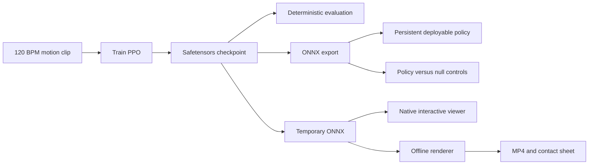

## Quick start

Run this smoke workflow from the RLX repository root on Apple Silicon:

```bash
cd /Volumes/ExternalSSD/geoagent/microduck-lab/rlx

dance_uv() { env -u VIRTUAL_ENV UV_PYTHON_PREFERENCE=only-system uv run --isolated --no-project --python /usr/local/bin/python3.12 --with-editable . --with-editable ../microduck_local "$@"; }

dance_uv python -c 'import mlx, microduck_local, onnx, onnxruntime, rlx, sys; print(sys.version); print("imports OK")'

dance_uv examples/ppo_microduck_dance.py train \
  --checkpoint runs/dance-smoke/dance.safetensors \
  --num-envs 2 \
  --num-steps 2 \
  --num-minibatches 1 \
  --update-epochs 1 \
  --total-timesteps 4 \
  --max-episode-s 1 \
  --no-domain-rand \
  --no-obs-noise \
  --no-action-delay \
  --no-random-yaw

dance_uv mjpython examples/ppo_microduck_dance.py view \
  --checkpoint runs/dance-smoke/dance.safetensors

dance_uv examples/ppo_microduck_dance.py eval \
  --checkpoint runs/dance-smoke/dance.safetensors \
  --num-envs 2 \
  --eval-steps 4 \
  --max-episode-s 1 \
  --no-domain-rand \
  --no-obs-noise \
  --no-action-delay \
  --no-random-yaw

dance_uv examples/ppo_microduck_dance.py export \
  --checkpoint runs/dance-smoke/dance.safetensors \
  --output runs/dance-smoke/dance.onnx

dance_uv examples/ppo_microduck_dance.py render \
  --checkpoint runs/dance-smoke/dance.safetensors \
  --output runs/dance-smoke/render \
  --episodes 1 \
  --max-episode-s 1
```

Expected files include:

```text
runs/dance-smoke/dance.safetensors
runs/dance-smoke/dance.safetensors.json
runs/dance-smoke/dance.onnx
runs/dance-smoke/render/ep0.mp4
runs/dance-smoke/render/ep0_sheet.png
```

The four-timestep policy will not have learned a dance. These commands verify environment setup, checkpoint serialization, native interactive viewing, evaluation, ONNX export, and offline rendering.

## Open the viewer with the launcher script

The [macOS viewer launcher](../scripts/view-microduck-dance.sh) is the shortest way to load the trained policy. It selects the framework-linked Python 3.12 interpreter, installs the two local editable packages in an isolated uv environment, validates the checkpoint and sidecar, and opens `mjpython`.

Run it from the RLX repository root:

```bash
cd /Volumes/ExternalSSD/geoagent/microduck-lab/rlx
scripts/view-microduck-dance.sh
```

The default checkpoint is `runs/dance/dance.safetensors`. Select another checkpoint with:

```bash
scripts/view-microduck-dance.sh \
  --checkpoint runs/dance-smoke/dance.safetensors \
  --seed 1
```

Check the environment without opening a window:

```bash
scripts/view-microduck-dance.sh --check
```

Display all launcher options:

```bash
scripts/view-microduck-dance.sh --help
```

Keep the terminal open while the viewer runs. Close the native MuJoCo window or press Ctrl+C in the terminal to stop.

## Understand the workflow

The [dance example](../examples/ppo_microduck_dance.py) provides six commands:

* `train` teaches an MLX PPO policy to imitate the `dance-120bpm` motion clip
* `eval` runs the saved deterministic policy and reports numerical results
* `export` creates a deterministic ONNX policy with observation normalization baked in
* `view` runs either an ONNX policy or a temporarily exported checkpoint in the native interactive MuJoCo viewer
* `render` converts a checkpoint temporarily to ONNX and writes a video and diagnostic contact sheet
* `demo` runs a disposable train, export, and evaluation smoke workflow with optional offline rendering

The workflow uses the fixed MicroDuck contract of 61 observations and 14 actions. It always selects the `imitate` behavior and the looping [120 BPM dance clip](../assets/clips/dance-120bpm.json).

Library integrations on Apple Silicon can opt into [PPO phase telemetry](../README.md#optional-ppo-phase-telemetry) with `algorithm.train(total_timesteps, callback, observer=phase_events.append)`. The dance CLI and its checkpoint metadata do not enable or persist these events automatically. An integration saving telemetry alongside run metadata should retain the per-event counts and wall times, or explicitly accumulate them; `mean_loss` is the actual minibatch weighted total objective, not a reward or evaluation score. The update interval includes GAE and deferred critic work, and the collection/update times do not measure pure CPU/GPU execution or transfer costs.



> [!IMPORTANT]
> A successful command or a high reward does not prove that the robot dances. Verify the exported deterministic policy visually and compare it with null controls.

## Meet the prerequisites

Run every command in this guide from the RLX repository root:

```bash
cd /Volumes/ExternalSSD/geoagent/microduck-lab/rlx
```

The local workflow expects:

* Apple Silicon for the MLX training path described by the [RLX README](../README.md)
* `uv`
* The sibling `../microduck_local` checkout
* The upstream `../microduck_rl` checkout or a valid `MICRODUCK_RL_DIR` for MuJoCo model assets
* FFmpeg support available to ImageIO for MP4 rendering
* The `mjpython` launcher installed with MuJoCo, which macOS requires for the native passive viewer

`microduck_local` requires Python 3.12 (`>=3.12,<3.13`), while the existing RLX project environment can use Python 3.13. Installing the sibling package into the project environment with `uv pip` is therefore unreliable. A later project-level `uv run` can also resynchronize the environment and remove an undeclared editable package.

Define this helper in each terminal that will run the workflow:

```bash
dance_uv() { env -u VIRTUAL_ENV UV_PYTHON_PREFERENCE=only-system uv run --isolated --no-project --python /usr/local/bin/python3.12 --with-editable . --with-editable ../microduck_local "$@"; }
```

The helper provides a repeatable overlay for every invocation:

* `env -u VIRTUAL_ENV` prevents an already activated environment from overriding the requested interpreter
* `UV_PYTHON_PREFERENCE=only-system` prevents uv from substituting its standalone Python, which cannot supply the framework library required by `mjpython`
* `--isolated --no-project` creates a separate environment, ignores the project environment, and leaves `rlx/.venv` untouched
* `--python /usr/local/bin/python3.12` selects the framework-linked system Python build required by the native viewer
* `--with-editable .` installs the current RLX checkout so the example can import `rlx` even when `mjpython` launches the script from its `examples` directory
* `--with-editable ../microduck_local` adds the sibling simulator package for that invocation

On macOS, dependency resolution can include the CPU or MPS Torch build declared by `microduck_local`. It does not install NVIDIA CUDA packages. PPO learning in this example uses MLX, not Torch.

The import check and native viewer were verified with the framework-linked Python at `/usr/local/bin/python3.12`. A uv-managed standalone Python can run the non-GUI commands but fails to load `mjpython` on this Mac because its relative `libpython` is unavailable inside the app bundle. If managed-network package downloads fail, use the workspace [Microsoft Python proxy guide](../../docs/microsoft-python-proxy-guide.md).

## Run the preflight checks

Confirm that the source, clip, simulator, and upstream model checkout are present:

```bash
test -f examples/ppo_microduck_dance.py
test -f assets/clips/dance-120bpm.json
test -x /usr/local/bin/python3.12
test -d ../microduck_local/src/microduck_local
test -d ../microduck_rl
dance_uv python -c 'import mlx, microduck_local, onnx, onnxruntime, rlx, sys; print(sys.version); print("imports OK")'
```

The final command should report Python 3.12 and print `imports OK`.

If the upstream model is elsewhere, set its absolute path before running the workflow:

```bash
export MICRODUCK_RL_DIR=/absolute/path/to/microduck_rl
```

Inspect the current command surface rather than relying on remembered flags:

```bash
dance_uv examples/ppo_microduck_dance.py --help
dance_uv examples/ppo_microduck_dance.py train --help
dance_uv examples/ppo_microduck_dance.py eval --help
dance_uv examples/ppo_microduck_dance.py export --help
dance_uv examples/ppo_microduck_dance.py view --help
dance_uv examples/ppo_microduck_dance.py render --help
```

## Verify the implementation before training

Run the focused tests in a Python 3.12 isolated overlay that includes the sibling simulator and pytest:

```bash
env -u VIRTUAL_ENV uv run --isolated --python 3.12 \
  --with-editable . \
  --with-editable ../microduck_local \
  --with pytest \
  pytest tests/test_microduck_dance.py -v
```

The regular suite should pass its unit, checkpoint, export, and validation tests. The opt-in end-to-end workflow should be reported as skipped unless its environment variable is enabled.

Run that integration smoke test explicitly:

```bash
RUN_MICRODUCK_INTEGRATION=1 \
  env -u VIRTUAL_ENV uv run --isolated --python 3.12 \
  --with-editable . \
  --with-editable ../microduck_local \
  --with pytest \
  pytest tests/test_microduck_dance.py::test_gated_end_to_end_dance_smoke -v
```

The integration test should pass rather than skip. It trains for only four timesteps with randomization disabled, then exports and evaluates the checkpoint. It proves that the pipeline is connected correctly. It does not prove that the policy learned to dance.

The [dance tests](../tests/test_microduck_dance.py) also verify the motion clip, lazy imports needed for fork safety, checkpoint round trips, ONNX parity, viewer and renderer argument validation, deterministic viewer environment assembly, cleanup, and temporary ONNX lifetime. Automated tests use viewer doubles and never open a window.

## Run a disposable pipeline smoke test

Use the [Quick start](#quick-start) workflow to confirm all four commands on the current machine. Remove `runs/dance-smoke` when those disposable artifacts are no longer needed.

## Train the full policy

Start a normal one-million-timestep run with the source defaults made explicit:

```bash
dance_uv examples/ppo_microduck_dance.py train \
  --checkpoint runs/dance/dance.safetensors \
  --total-timesteps 1000000 \
  --num-envs 16 \
  --num-steps 24 \
  --num-minibatches 4 \
  --update-epochs 5 \
  --gamma 0.99 \
  --learning-rate 0.001 \
  --seed 1
```

Domain randomization, observation noise, action delay, and random yaw are enabled by default. The command creates the checkpoint parent directory and writes:

* `runs/dance/dance.safetensors` with model weights and normalizer tensors
* `runs/dance/dance.safetensors.json` with format, dimensions, normalization settings, behavior, clip name, and completed step count

Training completion and file creation do not guarantee a good policy. Training time and learning quality depend on the machine and hyperparameters.

Inspect the non-secret sidecar metadata:

```bash
dance_uv python -m json.tool runs/dance/dance.safetensors.json
```

Confirm that its format is `rlx.microduck.actor_critic.v1`, its dimensions are 61 and 14, and its metadata identifies `imitate` and `dance-120bpm`.

## View the trained policy interactively

The launcher script described in [Open the viewer with the launcher script](#open-the-viewer-with-the-launcher-script) is recommended for routine use. The commands below expose the underlying `dance_uv` invocation for debugging and customization.

Open the checkpoint in MuJoCo immediately after training. Confirm that training created it before launching the viewer:

```bash
test -f runs/dance/dance.safetensors
dance_uv mjpython examples/ppo_microduck_dance.py view \
  --checkpoint runs/dance/dance.safetensors \
  --seed 1
```

If the `test` command fails, the full checkpoint does not exist yet. Train it first, or use the existing smoke checkpoint shown below.

Keep the launching terminal open. A separate native MuJoCo window appears and begins stepping the policy at 50 Hz. The command continues until you close that window or interrupt the terminal. It prints a final JSON result after a clean exit.

To view the disposable smoke checkpoint instead, change only the checkpoint path:

```bash
dance_uv mjpython examples/ppo_microduck_dance.py view \
  --checkpoint runs/dance-smoke/dance.safetensors \
  --seed 1
```

The smoke checkpoint confirms that the UI and inference loop work, but its four training timesteps are not enough to learn a dance.

On macOS, launch this command through `mjpython`. MuJoCo requires that launcher for its native passive viewer. Do not replace `mjpython` with `python` for the `view` command. The command exports the generated checkpoint to a temporary ONNX file, loads that policy with ONNX Runtime, and creates one `imitate` `BehaviorEnv` with the packaged `dance-120bpm` clip. It passes each observation from the environment directly to the policy and returns each action through the environment's existing `step` API, so the 61-observation contract and clip phase encoding remain owned by the simulator.

Use the native viewer's mouse controls:

* Drag with the left mouse button to orbit
* Drag with the right mouse button to pan
* Scroll to zoom
* Use the viewer panels and built-in shortcuts for MuJoCo visualization options

Close the viewer window or press Ctrl+C in the launching terminal to stop. The environment and temporary directory close in both cases, so the temporary ONNX file is removed.

Every episode uses the selected seed with domain randomization, observation noise, action delay, and random yaw disabled. When the policy falls or reaches the behavior's episode limit, the same deterministic environment resets and playback continues. These fixed conditions make repeated viewing comparable, but they do not test robustness.

The native viewer is interactive and does not write output files. Use `render` for offline MP4 files and diagnostic contact sheets that can be reviewed later or compared with null controls.

## Evaluate the deterministic checkpoint

Run evaluation with the default robustness settings:

```bash
dance_uv examples/ppo_microduck_dance.py eval \
  --checkpoint runs/dance/dance.safetensors \
  --eval-steps 500 \
  --num-envs 16 \
  --seed 1
```

The final output is a JSON object containing:

* `command`, which should be `eval`
* `steps`, the requested evaluation step count
* `num_envs`, the number of parallel environments
* `episodes`, the number of episode boundaries observed
* `mean_return`, the accumulated reward averaged across environments
* `finite`, which should be `true`

Treat `finite=true` as a numerical sanity check. No established `mean_return` pass threshold exists for this new dance workflow, and neither field proves that the motion looks like the clip.

For a deterministic wiring comparison with randomization disabled, repeat evaluation with:

```bash
dance_uv examples/ppo_microduck_dance.py eval \
  --checkpoint runs/dance/dance.safetensors \
  --eval-steps 500 \
  --num-envs 16 \
  --seed 1 \
  --no-domain-rand \
  --no-obs-noise \
  --no-action-delay \
  --no-random-yaw
```

## Export and validate the persistent ONNX policy

Export the deterministic actor:

```bash
dance_uv examples/ppo_microduck_dance.py export \
  --checkpoint runs/dance/dance.safetensors \
  --output runs/dance/dance.onnx
```

The exporter bakes observation normalization into the graph. It supports a dynamic batch dimension, accepts 61-element observations, and emits 14 actions.

Validate graph structure and one inference result:

```bash
dance_uv python - <<'PY'
from pathlib import Path

import numpy as np
import onnx
import onnxruntime as ort

path = Path("runs/dance/dance.onnx")
model = onnx.load(path)
onnx.checker.check_model(model)
session = ort.InferenceSession(str(path), providers=["CPUExecutionProvider"])
input_info = session.get_inputs()[0]
assert input_info.shape == ["batch", 61], input_info.shape
result = session.run(None, {input_info.name: np.zeros((1, 61), np.float32)})[0]
assert result.shape == (1, 14), result.shape
assert np.isfinite(result).all()
print("ONNX verified:", input_info.shape, "->", result.shape)
PY
```

This validates the file and contract. It does not validate dance quality.

## Render and inspect the trained behavior

Render directly from the checkpoint:

```bash
dance_uv examples/ppo_microduck_dance.py render \
  --checkpoint runs/dance/dance.safetensors \
  --output runs/dance/render \
  --episodes 2 \
  --max-episode-s 4
```

The command exports a temporary ONNX policy, keeps it until the renderer exits, and then removes it. Persistent outputs are:

```text
runs/dance/render/ep0.mp4
runs/dance/render/ep0_sheet.png
runs/dance/render/ep1.mp4
runs/dance/render/ep1_sheet.png
```

The underlying renderer disables domain randomization, observation noise, action delay, and random yaw so the visible behavior comes from the deterministic policy. The current wrapper forwards the episode count and maximum episode length. Although its parser exposes other common options, those options are not forwarded to the renderer, and the renderer currently uses its own default seed of zero.

Watch each MP4, then open each contact sheet. Read these diagnostics:

* Whether the episode completed or terminated from a fall
* Trunk and head height compared with the measured STAND references
* Left and right foot contact
* Any non-foot body touching the floor, which indicates dragging or collapse
* Height and pitch reversal counts, which distinguish sustained motion from uncontrolled cycling

For this dance, look for repeated motion that follows the one-second looping clip while the duck remains supported and avoids collapse. The renderer does not compute a dance-quality pass or fail result, so visual judgment remains necessary.

Follow the workspace [render-rollout procedure](../../.claude/skills/render-rollout/SKILL.md) and the [MicroDuck verification playbook](../../microduck_local/AGENTS.md) before making a quality claim.

## Compare the policy with null controls

Use the persistent ONNX file to render the policy and two controls under the same behavior and episode length:

```bash
dance_uv python -m microduck_local.render_rollout \
  --policy runs/dance/dance.onnx \
  --behavior imitate \
  --out runs/dance/compare-policy \
  --episodes 1 \
  --seconds 4 \
  --env "MICRODUCK_CLIPS_DIR=$PWD/assets/clips" \
  --env MICRODUCK_CLIP=dance-120bpm

dance_uv python -m microduck_local.render_rollout \
  --policy limp \
  --behavior imitate \
  --out runs/dance/compare-limp \
  --episodes 1 \
  --seconds 4 \
  --env "MICRODUCK_CLIPS_DIR=$PWD/assets/clips" \
  --env MICRODUCK_CLIP=dance-120bpm

dance_uv python -m microduck_local.render_rollout \
  --policy zero \
  --behavior imitate \
  --out runs/dance/compare-zero \
  --episodes 1 \
  --seconds 4 \
  --env "MICRODUCK_CLIPS_DIR=$PWD/assets/clips" \
  --env MICRODUCK_CLIP=dance-120bpm
```

`limp` removes restoring action, while `zero` holds the default target pose. If either null control shows the same apparent dance, the trained policy should not receive credit for that motion.

## Tune supported command options

Use `--help` as the authoritative list. Important training and evaluation controls include:

* `--num-envs` for parallel MuJoCo environments
* `--backend` for the vector environment backend, with `fork` as the default
* `--seed` for training and evaluation reproducibility
* `--max-episode-s` for episode duration
* `--domain-rand` or `--no-domain-rand`
* `--obs-noise` or `--no-obs-noise`
* `--action-delay` or `--no-action-delay`
* `--random-yaw` or `--no-random-yaw`
* `--total-timesteps`, `--num-steps`, `--num-minibatches`, `--update-epochs`, `--gamma`, and `--learning-rate` for training

`--weight-overrides` accepts a JSON object. Quote it so the shell passes valid JSON:

```bash
dance_uv examples/ppo_microduck_dance.py train \
  --checkpoint runs/dance/experiment.safetensors \
  --weight-overrides '{"VALID_TERM_NAME": 1.0}'
```

Replace the placeholder only with a term accepted by the current `imitate` behavior or shared reward catalog. Inspect those definitions before changing weights. Do not invent a key or tune rewards before looking at rollouts.

## Apply the verification checklist

A credible local result includes all of these checks:

* Focused unit and export tests pass
* The gated end-to-end smoke test passes
* Checkpoint and JSON sidecar both exist
* Sidecar format, behavior, clip, and dimensions are correct
* Evaluation returns `finite=true`
* Persistent ONNX passes graph, shape, and finite-output checks
* The native viewer runs the checkpoint policy and closes cleanly by window close or Ctrl+C
* MP4 and contact sheet exist for every requested episode
* Contact sheets show adequate height, foot support, and no non-foot dragging
* Policy motion differs meaningfully from both `limp` and `zero`
* The repeated motion resembles the intended one-second clip rather than a fall, frozen pose, or uncontrolled oscillation

## Troubleshoot failures

### uv cannot download dependencies

Confirm the managed package proxy setup described in the [Microsoft Python proxy guide](../../docs/microsoft-python-proxy-guide.md). Do not bypass Microsoft Defender or add an unapproved public fallback.

### RLX or microduck_local cannot be imported

Confirm that the helper exists in the current terminal and exposes both editable checkouts:

```bash
type dance_uv
dance_uv python -c 'import rlx, microduck_local; print(rlx.__file__); print(microduck_local.__file__)'
```

If `dance_uv` is missing, define it again from the [prerequisites](#meet-the-prerequisites). If the viewer reports `ModuleNotFoundError: No module named 'rlx'`, the helper is missing `--with-editable .`. If it reports that `microduck_local` is missing, check the sibling path and the `--with-editable ../microduck_local` option. Do not install `microduck_local` into a Python 3.13 RLX environment.

### The wrong Python version is selected

Verify the isolated interpreter:

```bash
dance_uv python -c 'import sys; print(sys.version); assert sys.version_info[:2] == (3, 12)'
```

If an activated environment still interferes, confirm that the helper begins with `env -u VIRTUAL_ENV` and includes `--python /usr/local/bin/python3.12`.

### MuJoCo model assets are missing

Keep `microduck_rl` beside `microduck_local`, or set `MICRODUCK_RL_DIR` to its absolute path. Verify that the selected checkout contains the model files expected by `microduck_local`.

### The checkpoint cannot be loaded

Keep the `.safetensors` file and its `.safetensors.json` sidecar together with matching names. A copied checkpoint without its sidecar cannot restore format and normalization metadata.

### Export fails because ONNX is missing

Rerun the import preflight through `dance_uv`. The isolated overlay resolves the declared simulator dependencies, including ONNX. ONNX Runtime is also required for parity and inference verification.

### The native viewer does not open on macOS

Run the `view` subcommand through `mjpython`, not the regular `python` launcher:

```bash
dance_uv mjpython examples/ppo_microduck_dance.py view \
  --checkpoint runs/dance/dance.safetensors
```

Confirm that MuJoCo and ONNX Runtime pass the import preflight. The viewer opens a desktop window, so run it from an interactive macOS login session rather than a headless shell.

If `mjpython` reports that `libpython3.12.dylib` is missing from a uv-managed Python directory, the current shell still has an older `dance_uv` definition. Replace it with the definition from the [prerequisites](#meet-the-prerequisites), which includes `UV_PYTHON_PREFERENCE=only-system` and `--no-project`, then retry. You can inspect the active definition with:

```bash
type dance_uv
```

If the command reports that the checkpoint does not exist, use `runs/dance-smoke/dance.safetensors` for UI verification or complete the full training step before using `runs/dance/dance.safetensors`.

### The policy produces non-finite actions

The viewer stops before sending NaN or infinite controls to MuJoCo. Validate the exported policy with `eval` and retrain if `finite` or `passed` is `false`:

```bash
dance_uv examples/ppo_microduck_dance.py eval \
  --policy runs/dance/dance.onnx \
  --num-envs 1 \
  --eval-steps 10 \
  --no-domain-rand \
  --no-obs-noise \
  --no-action-delay \
  --no-random-yaw
```

A smoke checkpoint can verify the UI path, but it does not demonstrate learned dance quality.

### Rendering fails

Confirm that `microduck_local`, MuJoCo, Pillow, ImageIO, ONNX Runtime, and the ImageIO FFmpeg backend are available. On macOS, do not force Linux-only `MUJOCO_GL` values. The renderer uses MuJoCo's bundled macOS offscreen path.

### Fork workers fail or the command stalls

Run from a normal terminal at the RLX repository root. Keep the default `fork` backend unless a tested alternative is required. The source delays MLX-related imports until after environment construction to preserve its fork-safety contract.

### Training exits but expected files are absent

Check the exact `--checkpoint` path and the final command exit status. The checkpoint writer creates parent directories only when it reaches the save step after training.

### The smoke policy does not dance

This is expected. Four timesteps verify wiring, not learning. Train a meaningful budget, evaluate the deterministic checkpoint, export it, and inspect the visual outputs before changing rewards.

## Keep deployment claims honest

RLX and `microduck_local` provide a fast local prototyping loop. A policy that looks correct here is not automatically ready for the physical robot. Port the proven environment design to the official `microduck_rl` GPU stack, retrain with its complete sim-to-real recipe, export through the supported deployment path, and validate safely before hardware use.
